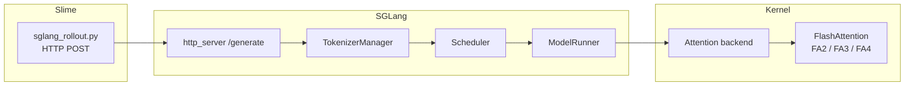

# 跨库专题对照

> Slime 用 SGLang 作 Rollout 推理引擎；SGLang 的模型 forward 会落到 attention backend；FlashAttention 是 attention kernel 的底层案例。本页按主题跳转。

---

## 架构对照

| 维度 | Slime | SGLang | FlashAttention |
|------|-------|--------|----------------|
| 主循环 | `generate → train → update_weights` | 请求 → batch → forward → 响应 | tile 扫描 K/V，online softmax |
| 运行时 | Ray + Megatron + SGLang | Tokenizer + Scheduler + Detokenizer | PyTorch custom op + CUDA/CuTe |
| 深度专精 | Rollout、PPO/GRPO、权重同步 | KV Cache、调度、模型执行 | Attention IO、FA2 kernel、KV cache kernel |
| 总入口 | [[Slime源码阅读指南]] | [[SGLang源码阅读指南]] | [[FlashAttention源码阅读指南]] |

---

## 专题对照表

| Slime 专题 | SGLang 专题 | FlashAttention 专题 | 原因 |
|------------|-------------|--------------------|------|
| [[12-SGLang-Rollout-00-MOC]] | [[04-OpenAI-API-00-MOC]] · [[06-TokenizerManager-00-MOC]] · [[07-Scheduler-00-MOC]] | — | HTTP generate 进入推理栈 |
| [[15-SGLang-Engine-00-MOC]] | [[02-启动链路-00-MOC]] · [[03-HTTP-Server-00-MOC]] | — | engine 启动与 server 生命周期 |
| [[09-EngineTopology-00-MOC]] · [[16-External-Engines-00-MOC]] | [[22-Disaggregation-00-MOC]] · [[23-Distributed-00-MOC]] | — | PD 拓扑与多节点 |
| [[24-WeightSync-Dist-00-MOC]] · [[25-WeightSync-Disk-00-MOC]] · [[26-Checkpoint-M2HF-00-MOC]] | [[12-ModelLoader-00-MOC]] · [[32-CheckpointEngine-00-MOC]] | — | 权重格式与热更新 |
| [[12-SGLang-Rollout-00-MOC]] | [[20-Sampling-00-MOC]] | — | sampling_params 透传 |
| — | [[15-RadixAttention-00-MOC]] · [[16-KV-Cache-00-MOC]] · [[17-Attention-00-MOC]] | [[FA05-KV-Cache-00-MOC]] | 推理 KV cache 与 decode attention |
| — | [[17-Attention-00-MOC]] | [[FA01-Attention-IO-00-MOC]] · [[FA02-Online-Softmax-00-MOC]] · [[FA04-FA2-Forward-00-MOC]] | Attention backend 的 kernel 原理 |
| — | [[04-内存与Attention-00-MOC]] | [[FA06-Hopper-CuTe-00-MOC]] | 新 GPU / kernel backend 演进 |

---

## 全链路对照

### Slime Rollout ↔ SGLang 推理 Hop

| Slime | SGLang | 文档 |
|-------|--------|------|
| `generate_and_rm_group` | `/generate` | [[12-SGLang-Rollout-02-源码走读]] · [[04-OpenAI-API-02-源码走读]] |
| sampling_params | `SamplingParams` | [[20-Sampling-01-核心概念]] |
| rollout_log_probs | forward logprob | [[20-Sampling-03-数据流与交互]] |
| PD 拓扑 | DisaggregationMode | [[22-Disaggregation-01-核心概念]] |

双全链路：[[全链路RL训练追踪]]（Hop 4 嵌入 [[全链路请求追踪]]）

---

## SGLang Attention ↔ FlashAttention

| SGLang 主题 | FlashAttention 主题 | 对照点 |
|-------------|--------------------|--------|
| [[17-Attention-01-核心概念]] | [[FA01-Attention-IO-01-核心概念]] | Attention 不只看 FLOPs，还要看 HBM traffic |
| [[16-KV-Cache-01-核心概念]] | [[FA05-KV-Cache-01-核心概念]] | runtime cache 管理与 kernel cache 读取 |
| [[15-RadixAttention-01-核心概念]] | [[FA05-KV-Cache-03-数据流与交互]] | 前缀复用最终仍落到 KV cache attention |
| [[17-Attention-02-源码走读]] | [[FA04-FA2-Forward-02-源码走读]] | 上层 attention backend 与底层 CUDA forward |
| [[90-总结复盘-03-生产排障速查]] | [[FA06-Hopper-CuTe-04-关键问题]] | backend 编译、首包延迟、架构兼容 |

---

## 参数透传

Slime `--sglang-*` → `sglang_parse_args()` → SGLang `ServerArgs`

→ [[04-Arguments-TrainRollout-02-源码走读]] · [[03-HTTP-Server-01-核心概念]]

---

## 权重同步

| Slime | SGLang |
|-------|--------|
| `update_weight_from_distributed` | CheckpointEngine / weight sync API |
| `megatron_to_hf` | `ModelLoader` HF 加载 |
| `--colocate` tensor 直传 | 同进程权重共享 |

→ [[24-WeightSync-Dist-01-核心概念]] · [[32-CheckpointEngine-01-核心概念]]

---

## 阅读顺序

**已有 SGLang 基础 → 读 Slime：** [[Slime-00-零基础先修]] → [[Slime-01-项目总览]] → [[全链路RL训练追踪]] → [[Slime-04-导读路径]]

**从零三层：** [[91_dashboard/dual-library-path|AI Infra 联合路径]]

---

## 基线 commit

| 库 | commit |
|----|--------|
| sglang | `70df09b` |
| slime | `22cdc6e1` |
| flash-attn | `002cce0` |
