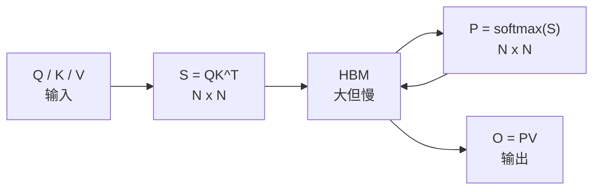
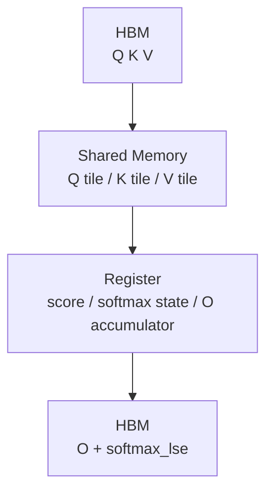

# FlashAttention 零基础先修

## 先修目标

如果你学习 AI infra，FlashAttention 至少要掌握三件事：

1. 标准 attention 的瓶颈不只是 `QK^T` 的计算量，而是中间矩阵对 HBM 的读写。
2. GPU kernel 设计要围绕 memory hierarchy：HBM 慢而大，SRAM/shared memory 快而小，register 更快但更稀缺。
3. FlashAttention 用分块与 online softmax 在不保存完整 attention matrix 的前提下得到精确结果。

## 标准 attention 的问题

标准 attention 可以写成：

```text
S = QK^T
P = softmax(S)
O = PV
```

当序列长度为 `N` 时，`S` 和 `P` 都是 `N x N`。对长上下文来说，真正昂贵的是把这些中间结果写入 HBM、再从 HBM 读回。



## FlashAttention 的直觉

FlashAttention 不把完整 `S`、`P` 落到 HBM。它把 Q/K/V 切成块，块内在 SRAM/register 中完成：

1. 读一块 Q 与一块 K
2. 计算局部 score
3. 用 online softmax 更新每一行的最大值与归一化分母
4. 立即乘 V 并累积到 O
5. 只把最终 O 与必要的 LSE 写回 HBM



## 为什么仍然精确

关键是 online softmax。softmax 每行需要全局最大值和全局归一化分母，但这两个量可以随着 block 流式更新。只要更新公式正确，分块计算与一次性计算得到同一个结果。

**Explain：** 源码里 `softmax_lse` 保存每行的 log-sum-exp。Forward 写出它，Backward 用它重算局部 attention scores，避免保存完整 `P`。

**Code：**

```cpp
// 来源：csrc/flash_attn/src/flash.h L62-L71
// The pointer to the softmax sum.
void * __restrict__ softmax_lse_ptr;
void * __restrict__ softmax_lseaccum_ptr;
void * __restrict__ oaccum_ptr;

float scale_softmax;
float scale_softmax_log2;
```

**Comment：**
- `softmax_lse_ptr` 是 forward/backward 之间的关键桥梁。
- `scale_softmax_log2` 说明内核里会用 log2/exp2 形式优化 softmax。

## 面向 AI infra 的理解方式

| 场景 | FlashAttention 影响 |
|------|---------------------|
| 训练 | 降低 activation memory，提升长序列训练吞吐 |
| 推理 prefill | 大块 prompt attention，接近训练 forward 形态 |
| 推理 decode | `seqlen_q` 常为 1 或很小，更关注 KV cache 读取与 splitKV |
| 长上下文 | 中间矩阵不能落 HBM，paged KV 与 splitKV 成为关键 |
| 多硬件 | A100/H100/B200 对应不同 kernel 策略 |

下一步读 [[FlashAttention-01-项目总览]]。

