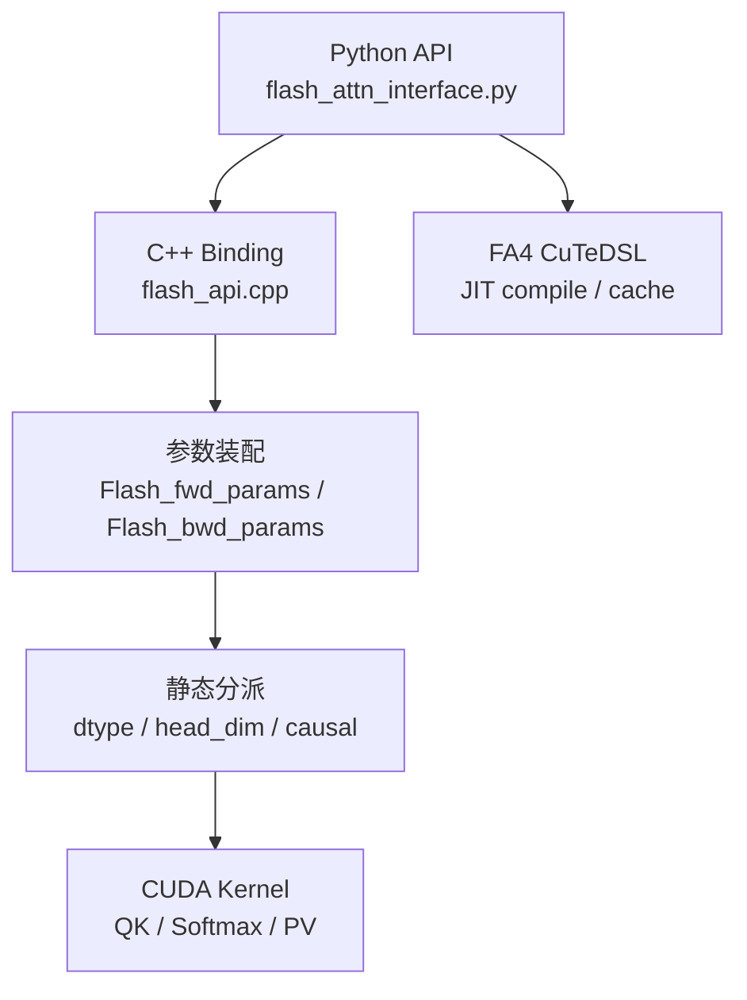

# FlashAttention 项目总览

> 源码基线：`flash-attn` commit `002cce0`

## FlashAttention 是什么

FlashAttention 是面向 Transformer attention 的高性能精确实现。它的核心不是改变 attention 数学定义，而是改变 **attention 在 GPU memory hierarchy 上的执行方式**。

| 版本线 | 目录 | 主要定位 |
|--------|------|----------|
| FA1 | 当前基线无独立主路径 | IO-aware exact attention 的算法原点；由原理章节承接，不在当前树里硬走一条 FA1 源码线 |
| FA2 | `flash_attn/` + `csrc/flash_attn/` | 当前主包 `flash-attn 2.x`，CUDA extension，支持训练与推理常见路径 |
| FA3 | `hopper/` | Hopper 优化路径，C++/CUDA + CUTLASS，含 TMA/GMMA 相关设计 |
| FA4 | `flash_attn/cute/` | CuTeDSL/JIT 路径，面向 Hopper 与 Blackwell |
| ROCm | `csrc/flash_attn_ck/` | AMD CK 后端与 Triton AMD 后端 |
| 模型生态 | `flash_attn/models/`, `modules/`, `ops/`, `training/` | GPT/BERT/Llama 示例、fused dense/layer norm、训练脚本 |

先读 [[FlashAttention-代际演进]]，再读本页，会更容易理解为什么当前仓库主线从 FA2 开始，而不是把 FA1 当作一个当前源码目录来找。

## 公开 API

**Explain：** 用户通常从 `flash_attn` 包直接 import 公开函数。对 AI infra 学习而言，这些函数对应上层框架最常接入的边界。

**Code：**

```python
# 来源：flash_attn/__init__.py L8-L16
from flash_attn.flash_attn_interface import (
    flash_attn_func,
    flash_attn_kvpacked_func,
    flash_attn_qkvpacked_func,
    flash_attn_varlen_func,
    flash_attn_varlen_kvpacked_func,
    flash_attn_varlen_qkvpacked_func,
    flash_attn_with_kvcache,
)
```

**Comment：**
- `flash_attn_func`：普通 Q/K/V 输入。
- `flash_attn_varlen_func`：变长序列，依赖 `cu_seqlens`。
- `flash_attn_with_kvcache`：推理 decode 与 KV cache 更新路径。

## 编译产物

**Explain：** FA2 的 CUDA/C++ 代码通过 PyTorch extension 编译成 `flash_attn_2_cuda`，Python 层再调用其中的 `fwd`、`bwd`、`varlen_fwd` 等函数。

**Code：**

```python
# 来源：setup.py L304-L309
ext_modules.append(
    CUDAExtension(
        name="flash_attn_2_cuda",
        sources=[
            "csrc/flash_attn/flash_api.cpp",
            "csrc/flash_attn/src/flash_fwd_hdim32_fp16_sm80.cu",
```

**Comment：**
- `flash_api.cpp` 是 pybind 入口。
- 大量 `flash_fwd_hdim*_*.cu` 是按 head_dim、dtype、causal 等组合预实例化的 kernel。

## 顶层阅读地图



## 本知识库怎么读

先读原理，再读源码：

1. [[FA01-Attention-IO-01-核心概念]]：为什么瓶颈在 IO。
2. [[FA02-Online-Softmax-01-核心概念]]：为什么分块仍然精确。
3. [[FlashAttention-代际演进]]：FA1 到 FA4 的演进边界。
4. [[FA03-Python-API-02-源码走读]]：API 如何进扩展。
5. [[FA04-FA2-Forward-02-源码走读]]：forward kernel 如何组织。
6. [[FA05-KV-Cache-01-核心概念]]：推理 decode 为什么是另一种形态。

