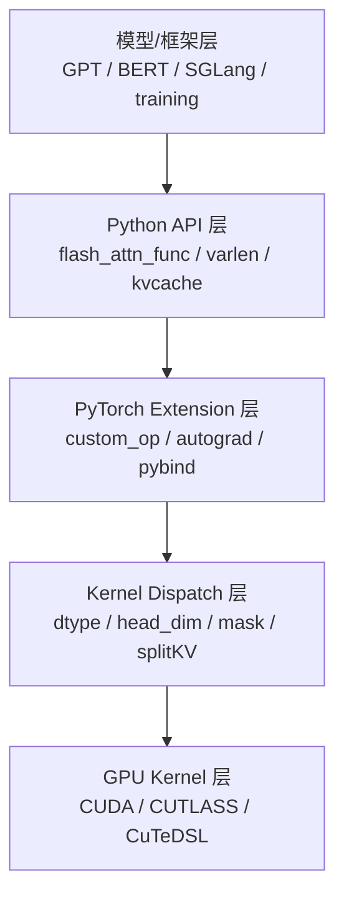

# FlashAttention 架构分层

## 五层模型



## 1. 模型/框架层

模型模块把普通 MHA、GQA、MQA、rotary、ALiBi 等上层语义转换成 FlashAttention API 参数。

**Code：**

```python
# 来源：flash_attn/modules/mha.py L448-L455
inner_attn_cls = (
    partial(FlashSelfAttention, alibi_slopes=alibi_slopes, window_size=window_size)
    if use_flash_attn
    else SelfAttention
)
inner_cross_attn_cls = (
    partial(FlashCrossAttention, alibi_slopes=alibi_slopes, window_size=window_size)
```

**Comment：** `use_flash_attn=True` 时，模型层切换到 FlashAttention 内部实现。

## 2. Python API 层

Python API 负责参数默认值、padding、autograd context、fake tensor shape 推导。

**Code：**

```python
# 来源：flash_attn/flash_attn_interface.py L147-L150
if torch.__version__ >= "2.4.0":
    _wrapped_flash_attn_forward = torch.ops.flash_attn._flash_attn_forward
else:
    _wrapped_flash_attn_forward = _flash_attn_forward
```

**Comment：** PyTorch 2.4+ 使用 `torch.library.custom_op` 路径支持 `torch.compile`。

## 3. PyTorch Extension 层

C++ 入口做 shape/dtype/device 检查、分配输出、填充参数结构。

**Code：**

```cpp
// 来源：csrc/flash_attn/flash_api.cpp L372-L381
auto q_dtype = q.dtype();
TORCH_CHECK(q_dtype == torch::kFloat16 || q_dtype == torch::kBFloat16,
            "FlashAttention only support fp16 and bf16 data type");
TORCH_CHECK(k.dtype() == q_dtype, "query and key must have the same dtype");
TORCH_CHECK(v.dtype() == q_dtype, "query and value must have the same dtype");

CHECK_DEVICE(q); CHECK_DEVICE(k); CHECK_DEVICE(v);

TORCH_CHECK(q.stride(-1) == 1, "Input tensor must have contiguous last dimension");
```

**Comment：** 这里体现 kernel 对输入布局的硬约束：last dimension 必须 contiguous。

## 4. Kernel Dispatch 层

Kernel dispatch 把运行时参数转成编译期模板组合。

**Code：**

```cpp
// 来源：csrc/flash_attn/src/flash_fwd_launch_template.h L68-L79
BOOL_SWITCH(is_even_MN, IsEvenMNConst, [&] {
    EVENK_SWITCH(is_even_K, IsEvenKConst, [&] {
        LOCAL_SWITCH((params.window_size_left >= 0 || params.window_size_right >= 0) && !Is_causal, Is_local, [&] {
            BOOL_SWITCH(return_softmax, ReturnSoftmaxConst, [&] {
                ALIBI_SWITCH(params.alibi_slopes_ptr != nullptr, Has_alibi, [&] {
                    SOFTCAP_SWITCH(params.softcap > 0.0, Is_softcap, [&] {
                        auto kernel = &flash_fwd_kernel<Kernel_traits, Is_dropout && !Is_softcap, Is_causal, Is_local && !Is_causal, Has_alibi, IsEvenMNConst && IsEvenKConst && !Is_local && !Has_alibi && !ReturnSoftmaxConst && Kernel_traits::kHeadDim <= 128, IsEvenKConst && !ReturnSoftmaxConst && !Has_alibi, Is_softcap, ReturnSoftmaxConst && Is_dropout && !Is_softcap>;
```

**Comment：** 这段解释了为什么源码里有大量 specialize kernel：许多 runtime 布尔值被提升为 template 常量。

## 5. GPU Kernel 层

GPU kernel 内部按 tile 流式完成 QK、mask、online softmax、dropout、PV、输出写回。

下一步读 [[FlashAttention-全链路Attention追踪]]。

