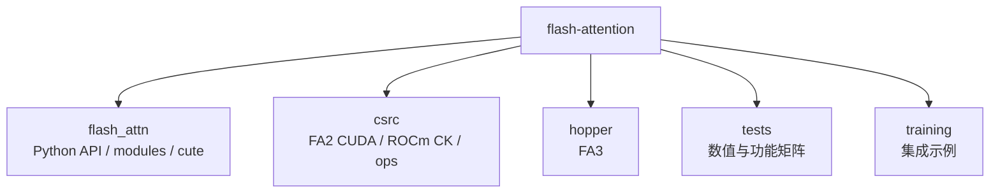

# FlashAttention 文件地图

## 主路径文件

| 文件/目录 | 职责 | 阅读入口 |
|-----------|------|----------|
| `flash_attn/__init__.py` | 包公开 API | [[FlashAttention-01-项目总览]] |
| `flash_attn/flash_attn_interface.py` | FA2 Python API、custom op、autograd | [[FA03-Python-API-00-MOC]] |
| `flash_attn/bert_padding.py` | unpad/pad 与 `cu_seqlens` | [[FA03-Python-API-03-数据流与交互]] |
| `flash_attn/modules/mha.py` | MHA 模块集成 | [[FA03-Python-API-01-核心概念]] |
| `csrc/flash_attn/flash_api.cpp` | pybind、参数检查、参数装配 | [[FA03-Python-API-02-源码走读]] |
| `csrc/flash_attn/src/flash.h` | `Flash_fwd_params` / `Flash_bwd_params` | [[FA04-FA2-Forward-01-核心概念]] |
| `csrc/flash_attn/src/flash_fwd_launch_template.h` | forward dispatch 与 kernel launch | [[FA04-FA2-Forward-02-源码走读]] |
| `csrc/flash_attn/src/flash_fwd_kernel.h` | FA2 forward kernel 主循环 | [[FA04-FA2-Forward-03-数据流与交互]] |
| `csrc/flash_attn/src/softmax.h` | online softmax 实现 | [[FA02-Online-Softmax-02-源码走读]] |
| `csrc/flash_attn/src/mask.h` | causal/local/ALiBi mask | [[FA04-FA2-Forward-04-关键问题]] |
| `hopper/flash_api.cpp` | FA3 Hopper C++ API 与 dispatch | [[FA06-Hopper-CuTe-01-核心概念]] |
| `flash_attn/cute/interface.py` | FA4 CuTeDSL API、JIT compile/cache | [[FA06-Hopper-CuTe-02-源码走读]] |
| `tests/test_flash_attn.py` | FA2 功能与数值测试矩阵 | [[FlashAttention-90-总结复盘-00-MOC]] |
| `tests/cute/` | FA4 CuTeDSL 测试矩阵 | [[FA06-Hopper-CuTe-05-checkpoint]] |

## 不建议首轮逐个读的文件

| 文件类型 | 原因 | 推荐方式 |
|----------|------|----------|
| `csrc/flash_attn/src/flash_fwd_hdim*.cu` | generated/specialized 实例多，结构重复 | 读 launch template 与实例命名规律 |
| `hopper/instantiations/*.cu` | 组合更多，主要承担显式实例化 | 用矩阵理解 dtype/head_dim/SM 组合 |
| `flash_attn/models/*.py` | 模型生态而非 attention kernel 主线 | 后置，按 GPT/BERT/Llama 需求查阅 |
| `training/` | 训练脚本示例，不是 kernel 原理主线 | 后置，理解集成方式即可 |

## 物理目录图

