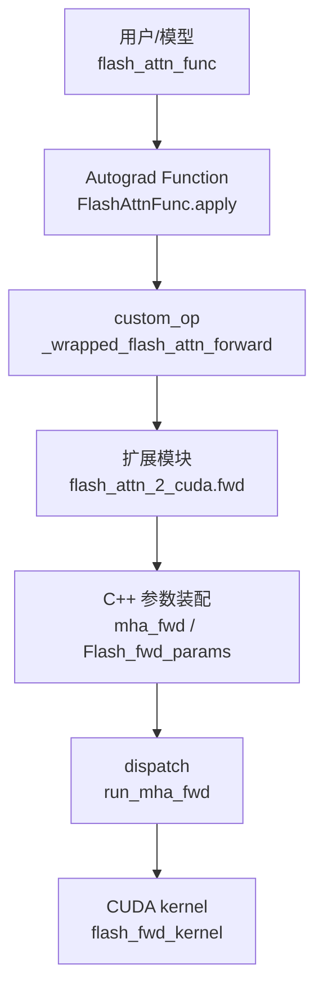

# FlashAttention 全链路 Attention 追踪

> 一次 `flash_attn_func(q, k, v)` 如何走到 CUDA kernel。

## 总览



## Hop 1 · 公开 API

**Explain：** `flash_attn_func` 是普通 Q/K/V 输入的用户入口。它只做参数转发，实际计算由 `FlashAttnFunc.apply` 进入 autograd Function。

**Code：**

```python
# 来源：flash_attn/flash_attn_interface.py L1217-L1222
return FlashAttnFunc.apply(
    q,
    k,
    v,
    dropout_p,
    softmax_scale,
```

**Comment：** 这一层保留 PyTorch autograd 语义，让上层模型像调用普通函数一样使用 FlashAttention。

## Hop 2 · custom op 调扩展

**Explain：** `_flash_attn_forward` 将 tensor 调整为 contiguous last dimension 后，调用 `flash_attn_gpu.fwd`。CUDA 环境下 `flash_attn_gpu` 通常是 `flash_attn_2_cuda`。

**Code：**

```python
# 来源：flash_attn/flash_attn_interface.py L98-L113
q, k, v = [maybe_contiguous(x) for x in (q, k, v)]
out, softmax_lse, S_dmask, rng_state = flash_attn_gpu.fwd(
    q,
    k,
    v,
    None,
    alibi_slopes,
    dropout_p,
    softmax_scale,
    causal,
    window_size_left,
    window_size_right,
    softcap,
    return_softmax,
    None,
)
```

**Comment：** `softmax_lse` 与 `rng_state` 会被保存给 backward；这解释了 forward 输出为什么不只是 `out`。

## Hop 3 · pybind 函数表

**Explain：** C++ extension 通过 pybind 暴露 `fwd`、`varlen_fwd`、`bwd`、`varlen_bwd`、`fwd_kvcache`。

**Code：**

```cpp
// 来源：csrc/flash_attn/flash_api.cpp L1481-L1488
PYBIND11_MODULE(TORCH_EXTENSION_NAME, m) {
    m.doc() = "FlashAttention";
    m.def("fwd", &FLASH_NAMESPACE::mha_fwd, "Forward pass");
    m.def("varlen_fwd", &FLASH_NAMESPACE::mha_varlen_fwd, "Forward pass (variable length)");
    m.def("bwd", &FLASH_NAMESPACE::mha_bwd, "Backward pass");
    m.def("varlen_bwd", &FLASH_NAMESPACE::mha_varlen_bwd, "Backward pass (variable length)");
    m.def("fwd_kvcache", &FLASH_NAMESPACE::mha_fwd_kvcache, "Forward pass, with KV-cache");
}
```

**Comment：** API 类型在这里收敛：普通、变长、反向、KV cache 都是同一个 extension 的导出函数。

## Hop 4 · C++ 参数检查与输出分配

**Explain：** `mha_fwd` 检查 dtype、device、shape、contiguous last dim，并分配 `out`、`softmax_lse`、可选 dropout mask。

**Code：**

```cpp
// 来源：csrc/flash_attn/flash_api.cpp L372-L394
auto q_dtype = q.dtype();
TORCH_CHECK(q_dtype == torch::kFloat16 || q_dtype == torch::kBFloat16,
            "FlashAttention only support fp16 and bf16 data type");
TORCH_CHECK(k.dtype() == q_dtype, "query and key must have the same dtype");
TORCH_CHECK(v.dtype() == q_dtype, "query and value must have the same dtype");

CHECK_DEVICE(q); CHECK_DEVICE(k); CHECK_DEVICE(v);

TORCH_CHECK(q.stride(-1) == 1, "Input tensor must have contiguous last dimension");
TORCH_CHECK(k.stride(-1) == 1, "Input tensor must have contiguous last dimension");
TORCH_CHECK(v.stride(-1) == 1, "Input tensor must have contiguous last dimension");

const int head_size = sizes[3];
TORCH_CHECK(head_size <= 256, "FlashAttention forward only supports head dimension at most 256");
TORCH_CHECK(head_size % 8 == 0, "query, key, value, and out_ must have a head_size that is a multiple of 8");
```

**Comment：** 这些约束不是 API 任性限制，而是 kernel vectorized load、tile shape、shared memory layout 的前置条件。

## Hop 5 · 参数结构

**Explain：** `set_params_fprop` 把 tensor pointer、stride、shape、mask、dropout、scale 等信息写入 `Flash_fwd_params`。

**Code：**

```cpp
// 来源：csrc/flash_attn/flash_api.cpp L452-L470
Flash_fwd_params params;
set_params_fprop(params,
                 batch_size,
                 seqlen_q, seqlen_k,
                 seqlen_q_rounded, seqlen_k_rounded,
                 num_heads, num_heads_k,
                 head_size, head_size_rounded,
                 q, k, v, out,
                 /*cu_seqlens_q_d=*/nullptr,
                 /*cu_seqlens_k_d=*/nullptr,
                 /*seqused_k=*/nullptr,
                 return_softmax ? p.data_ptr() : nullptr,
                 softmax_lse.data_ptr(),
                 p_dropout,
                 softmax_scale,
                 window_size_left,
                 window_size_right,
                 softcap
                 );
```

**Comment：** 普通 fixed-length 路径中 `cu_seqlens_*` 是 `nullptr`；varlen 路径会填入真实指针。

## Hop 6 · kernel dispatch

**Explain：** `run_mha_fwd` 根据 dtype、head_dim、causal、splitKV 等选择模板实例。大量 `.cu` 文件本质是这些组合的显式实例化。

**Code：**

```cpp
// 来源：csrc/flash_attn/flash_api.cpp L497-L499
if (seqlen_k > 0) {
    auto stream = at::cuda::getCurrentCUDAStream().stream();
    run_mha_fwd(params, stream);
```

**Comment：** 从这里进入 CUDA launch template。

## Hop 7 · forward kernel 主循环

**Explain：** kernel 中一轮 tile 完成局部 `QK^T`、mask、online softmax、dropout、`PV` 累积。完整 attention matrix 不写入 HBM。

**Code：**

```cpp
// 来源：csrc/flash_attn/src/flash_fwd_kernel.h L319-L367
FLASH_NAMESPACE::gemm</*A_in_regs=*/Kernel_traits::Is_Q_in_regs>(
    acc_s, tSrQ, tSrK, tSsQ, tSsK, tiled_mma, smem_tiled_copy_Q, smem_tiled_copy_K,
    smem_thr_copy_Q, smem_thr_copy_K
);
mask.template apply_mask<Is_causal, Is_even_MN>(
    acc_s, n_block * kBlockN, m_block * kBlockM + (tidx / 32) * 16 + (tidx % 32) / 4, kNWarps * 16
);
masking_step == 0
    ? softmax.template softmax_rescale_o</*Is_first=*/true,  /*Check_inf=*/Is_causal || Is_local>(acc_s, acc_o, params.scale_softmax_log2)
    : softmax.template softmax_rescale_o</*Is_first=*/false, /*Check_inf=*/Is_causal || Is_local>(acc_s, acc_o, params.scale_softmax_log2);
Tensor rP = FLASH_NAMESPACE::convert_type<Element>(acc_s);
FLASH_NAMESPACE::gemm_rs(acc_o, tOrP, tOrVt, tOsVt, tiled_mma, smem_tiled_copy_V, smem_thr_copy_V);
```

**Comment：** 这就是 FlashAttention 原理落到源码的核心位置。

## 下一步

如果你先想懂原理，读 [[FA01-Attention-IO-00-MOC]] 与 [[FA02-Online-Softmax-00-MOC]]。如果你想沿调用栈看源码，读 [[FA03-Python-API-00-MOC]] 与 [[FA04-FA2-Forward-00-MOC]]。

