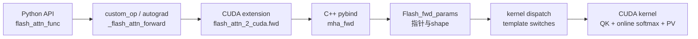

# FlashAttention 方法论

> 读 FlashAttention 不要从 generated kernel 文件数量开始，而要从 attention 的 IO 形态开始。

## 阅读主线

| 层次 | 要回答的问题 | 推荐入口 |
|------|--------------|----------|
| 原理 | 为什么标准 attention 会被 HBM traffic 卡住 | [[FA01-Attention-IO-00-MOC]] |
| 数值 | 分块后 softmax 为什么仍然精确 | [[FA02-Online-Softmax-00-MOC]] |
| 接口 | 上层框架如何表达普通、packed、varlen、KV cache | [[FA03-Python-API-00-MOC]] |
| 内核 | 参数如何变成 template specialization | [[FA04-FA2-Forward-00-MOC]] |
| 推理 | decode、SplitKV、paged KV 为什么特殊 | [[FA05-KV-Cache-00-MOC]] |
| 新架构 | Hopper/Blackwell 为什么引入新路径 | [[FA06-Hopper-CuTe-00-MOC]] |

## 三个固定问题

每读一个函数，都问三件事：

1. **它搬了什么数据？** `Q/K/V/O/LSE` 在 HBM、shared memory、register 之间如何流动。
2. **它保存了什么状态？** 是否保存完整 attention matrix，还是只保存 `softmax_lse`、随机数状态、cache metadata。
3. **它专门化了什么条件？** dtype、head_dim、causal、local、ALiBi、softcap、dropout、SplitKV、paged KV。

## 一条调用链



**Explain：** 这条链路不是“包装层很多”，而是把 PyTorch 张量语义、C++ 参数校验、CUDA template specialization 和 GPU 执行模型逐层分离。

**Code：**

```python
# 来源：flash_attn/__init__.py L8-L16
from flash_attn.flash_attn_interface import (
    flash_attn_func,
    flash_attn_kvpacked_func,
    flash_attn_qkvpacked_func,
    flash_attn_varlen_func,
    flash_attn_varlen_kvpacked_func,
    flash_attn_varlen_qkvpacked_func,
    flash_attn_with_kvcache,
)
```

**Comment：** 先把这些公开入口分清楚，再进入 `flash_attn_2_cuda` 和具体 kernel，否则很容易把 API 形态、训练形态、推理形态混在一起。

## AI infra 读法

| 场景 | 关注点 | 对应专题 |
|------|--------|----------|
| 训练 prefill | activation memory、dropout、backward 重算 | [[FA02-Online-Softmax-04-关键问题]] |
| serving prefill | 长 prompt 吞吐、head_dim、causal mask | [[FA04-FA2-Forward-03-数据流与交互]] |
| decode | `seqlen_q=1`、KV cache 读带宽、小 batch 利用率 | [[FA05-KV-Cache-01-核心概念]] |
| 长上下文 | SplitKV、paged KV、combine kernel | [[FA05-KV-Cache-02-源码走读]] |
| 新 GPU | TMA/GMMA、persistent scheduling、JIT cache | [[FA06-Hopper-CuTe-01-核心概念]] |

