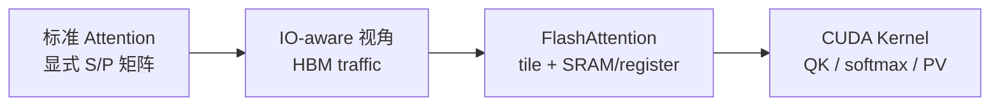

# Attention IO 原理

> 从 AI infra 视角理解 FlashAttention：瓶颈首先是 HBM traffic，而不是数学公式本身。

## 本专题位置



## 阅读顺序

| 顺序 | 文件 | 目标 |
|------|------|------|
| 01 | [[FA01-Attention-IO-01-核心概念]] | 建立 memory wall 与 IO-aware 直觉 |
| 02 | [[FA01-Attention-IO-02-源码走读]] | 从源码参数与 kernel 结构看 IO 优化 |
| 03 | [[FA01-Attention-IO-03-数据流与交互]] | 画出 HBM/shared memory/register 数据流 |
| 04 | [[FA01-Attention-IO-04-关键问题]] | 回答为什么不是单纯 CUDA 优化 |
| 05 | [[FA01-Attention-IO-05-checkpoint]] | 自测能否解释 memory wall |

## 源码范围

| 路径 | 作用 |
|------|------|
| `csrc/flash_attn/src/flash.h` | 参数结构，包含 Q/K/V/O/LSE 指针 |
| `csrc/flash_attn/src/kernel_traits.h` | tile shape、shared memory layout、copy 配置 |
| `csrc/flash_attn/src/flash_fwd_kernel.h` | forward 主循环，体现 tile 内计算 |
| `csrc/flash_attn/flash_api.cpp` | `softmax_lse` / optional `p` 的 C++ 分配边界 |

## 本专题验收标准

- 能从 `Flash_fwd_params` 说明常规 forward 为什么只长期保存 `O` 与 LSE。
- 能把 `mQ/gQ/sQ/tSrQ` 这类变量对应到 HBM、shared memory、register。
- 能沿 `acc_s → softmax_rescale_o → rP → gemm_rs → acc_o → O/LSE` 解释一个 K/V tile 的生命周期。
- 能说明 `return_softmax` 是可选测试/调试路径，不是 FlashAttention 的常规 IO 模式。

## 核心结论

**Explain：** 标准 attention 会把 `N x N` score/probability 矩阵写回 HBM。FlashAttention 的核心收益来自“不把完整 `S`/`P` 落 HBM”，而是在 tile 内完成局部 score、softmax 状态更新和 V 加权累积。

**Code：**

```cpp
// 来源：csrc/flash_attn/src/flash_fwd_kernel.h L319-L367
FLASH_NAMESPACE::gemm</*A_in_regs=*/Kernel_traits::Is_Q_in_regs>(
    acc_s, tSrQ, tSrK, tSsQ, tSsK, tiled_mma, smem_tiled_copy_Q, smem_tiled_copy_K,
    smem_thr_copy_Q, smem_thr_copy_K
);
mask.template apply_mask<Is_causal, Is_even_MN>(
    acc_s, n_block * kBlockN, m_block * kBlockM + (tidx / 32) * 16 + (tidx % 32) / 4, kNWarps * 16
);
masking_step == 0
    ? softmax.template softmax_rescale_o</*Is_first=*/true,  /*Check_inf=*/Is_causal || Is_local>(acc_s, acc_o, params.scale_softmax_log2)
    : softmax.template softmax_rescale_o</*Is_first=*/false, /*Check_inf=*/Is_causal || Is_local>(acc_s, acc_o, params.scale_softmax_log2);
Tensor rP = FLASH_NAMESPACE::convert_type<Element>(acc_s);
FLASH_NAMESPACE::gemm_rs(acc_o, tOrP, tOrVt, tOsVt, tiled_mma, smem_tiled_copy_V, smem_thr_copy_V);
```

**Comment：** 这段代码按顺序完成局部 `QK^T`、mask、online softmax、`PV`，中间概率块只在 kernel 内短暂存在。
