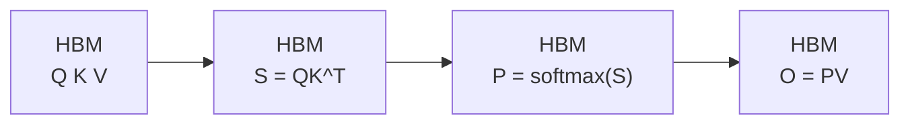
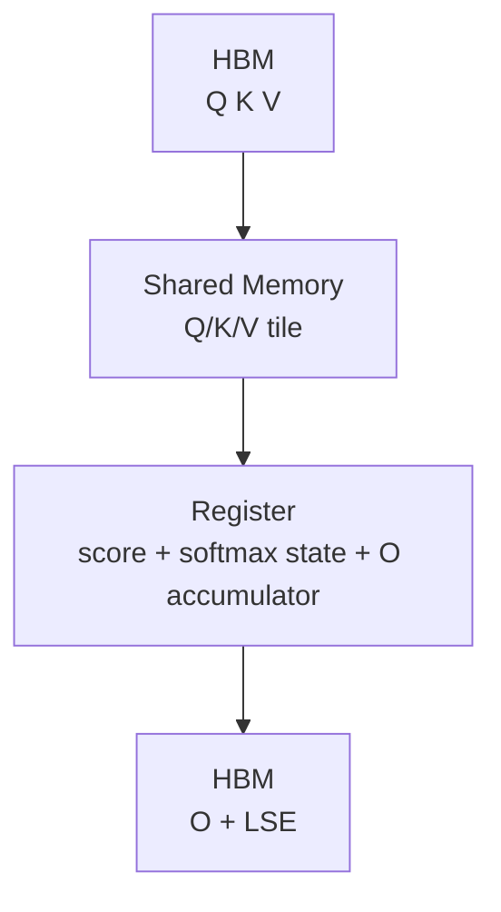

# Attention IO · 数据流与交互

## 1. 标准 attention 数据流



**Comment：** `S` 与 `P` 是 `N x N`，这是长序列下最危险的中间状态。

## 2. FlashAttention 数据流



## 3. 每个 tile 的生命周期

| 阶段 | 数据 | 存储位置 |
|------|------|----------|
| load | Q/K/V tile | HBM → shared memory |
| QK | score tile `acc_s` | register |
| mask/softmax | row max、row sum、probability tile | register |
| PV | output accumulator `acc_o` | register |
| store | O 与 LSE | HBM |

## 4. 与源码变量对应

| 概念 | 源码变量 |
|------|----------|
| score tile | `acc_s` |
| output accumulator | `acc_o` |
| output pointer | `o_ptr` |
| LSE pointer | `softmax_lse_ptr` |
| Q/K/V global memory tile | `tQgQ`, `tKgK`, `tVgV` |
| Q/K/V shared memory tile | `tSsQ`, `tSsK`, `tOsVt` |

## 5. HBM 到 shared memory 的源码路径

**Explain：** kernel 先从 `params.q_ptr/k_ptr/v_ptr` 构造 HBM 视图，再用 `local_tile` 取当前 block。`sQ/sK/sV` 则是 shared memory 中的 tile 缓冲。

**Code：**

```cpp
// 来源：csrc/flash_attn/src/flash_fwd_kernel.h L138-L177
Tensor mQ = make_tensor(make_gmem_ptr(reinterpret_cast<Element*>(params.q_ptr)
                                      + binfo.q_offset(params.q_batch_stride, params.q_row_stride, bidb)),
                        make_shape(binfo.actual_seqlen_q, params.h, params.d),
                        make_stride(params.q_row_stride, params.q_head_stride, _1{}));
Tensor gQ = local_tile(mQ(_, bidh, _), Shape<Int<kBlockM>, Int<kHeadDim>>{},
                       make_coord(m_block, 0));  // (kBlockM, kHeadDim)
Tensor mK = make_tensor(make_gmem_ptr(reinterpret_cast<Element*>(params.k_ptr)
                                      + binfo.k_offset(params.k_batch_stride, params.k_row_stride, bidb)),
                        make_shape(binfo.actual_seqlen_k, params.h_k, params.d),
                        make_stride(params.k_row_stride, params.k_head_stride, _1{}));
Tensor gK = local_tile(mK(_, bidh / params.h_h_k_ratio, _), Shape<Int<kBlockN>, Int<kHeadDim>>{},
                       make_coord(_, 0));  // (kBlockN, kHeadDim, nblocksN)
Tensor mV = make_tensor(make_gmem_ptr(reinterpret_cast<Element*>(params.v_ptr)
                                      + binfo.k_offset(params.v_batch_stride, params.v_row_stride, bidb)),
                        make_shape(binfo.actual_seqlen_k, params.h_k, params.d),
                        make_stride(params.v_row_stride, params.v_head_stride, _1{}));
Tensor gV = local_tile(mV(_, bidh / params.h_h_k_ratio, _), Shape<Int<kBlockN>, Int<kHeadDim>>{},
                       make_coord(_, 0));  // (kBlockN, kHeadDim, nblocksN)

Tensor sQ = make_tensor(make_smem_ptr(reinterpret_cast<Element *>(smem_)),
                        typename Kernel_traits::SmemLayoutQ{});
Tensor sK = make_tensor(sQ.data() + (Kernel_traits::Share_Q_K_smem ? 0 : size(sQ)),
                        typename Kernel_traits::SmemLayoutKV{});
Tensor sV = make_tensor(sK.data() + size(sK), typename Kernel_traits::SmemLayoutKV{});
```

**Comment：** `m*` 是全局视图，`g*` 是当前 tile，`s*` 是 shared memory。这个命名规律对读 FA2 kernel 很有帮助。

## 6. Register 内的 score 与输出累积

**Explain：** `acc_s` 是局部 score tile，`acc_o` 是输出累积。源码先对 `acc_s` 做 mask 与 online softmax，再把概率 tile 转为 `rP` 参与 `PV`。

**Code：**

```cpp
// 来源：csrc/flash_attn/src/flash_fwd_kernel.h L303-L367
Tensor acc_s = partition_fragment_C(tiled_mma, Shape<Int<kBlockM>, Int<kBlockN>>{});
clear(acc_s);

FLASH_NAMESPACE::gemm</*A_in_regs=*/Kernel_traits::Is_Q_in_regs>(
    acc_s, tSrQ, tSrK, tSsQ, tSsK, tiled_mma, smem_tiled_copy_Q, smem_tiled_copy_K,
    smem_thr_copy_Q, smem_thr_copy_K
);

mask.template apply_mask<Is_causal, Is_even_MN>(
    acc_s, n_block * kBlockN, m_block * kBlockM + (tidx / 32) * 16 + (tidx % 32) / 4, kNWarps * 16
);

masking_step == 0
    ? softmax.template softmax_rescale_o</*Is_first=*/true,  /*Check_inf=*/Is_causal || Is_local>(acc_s, acc_o, params.scale_softmax_log2)
    : softmax.template softmax_rescale_o</*Is_first=*/false, /*Check_inf=*/Is_causal || Is_local>(acc_s, acc_o, params.scale_softmax_log2);

Tensor rP = FLASH_NAMESPACE::convert_type<Element>(acc_s);
Tensor tOrP = make_tensor(rP.data(), FLASH_NAMESPACE::convert_layout_acc_Aregs<typename Kernel_traits::TiledMma>(rP.layout()));
FLASH_NAMESPACE::gemm_rs(acc_o, tOrP, tOrVt, tOsVt, tiled_mma, smem_tiled_copy_V, smem_thr_copy_V);
```

**Comment：** `acc_s` 被复用为概率 tile，不落 HBM；`acc_o` 跨 K/V blocks 保留在 register fragment 中。

## 7. Epilogue 的唯一长期输出

**Explain：** 最后阶段把 `acc_o` 归一化为 `O`，并写出每行 LSE。`gLSE(row) = lse(mi)` 是 backward 重算概率时的压缩状态来源。

**Code：**

```cpp
// 来源：csrc/flash_attn/src/flash_fwd_kernel.h L431-L493
Tensor lse = softmax.template normalize_softmax_lse<Is_dropout>(acc_o, params.scale_softmax, params.rp_dropout);

Tensor rO = FLASH_NAMESPACE::convert_type<Element>(acc_o);
Tensor sO = make_tensor(sQ.data(), typename Kernel_traits::SmemLayoutO{});
cute::copy(smem_tiled_copy_O, taccOrO, taccOsO);

Tensor gO = local_tile(mO(_, bidh, _), Shape<Int<kBlockM>, Int<kHeadDim>>{},
                       make_coord(m_block, 0));
Tensor gLSE = get_lse_tile<ElementAccum, Params, kBlockM, Is_even_MN>(params, bidb, bidh, m_block, binfo);

if (get<1>(taccOcO_row(0)) == 0) {
    #pragma unroll
    for (int mi = 0; mi < size(lse); ++mi) {
        const int row = get<0>(taccOcO_row(mi));
        if (row < binfo.actual_seqlen_q - m_block * kBlockM) { gLSE(row) = lse(mi); }
    }
}

FLASH_NAMESPACE::copy<Is_even_MN, Is_even_K, /*Clear_OOB_MN=*/false, /*Clear_OOB_K=*/false>(
    gmem_tiled_copy_O, tOrO, tOgO, tOcO, tOpO, binfo.actual_seqlen_q - m_block * kBlockM
);
```

**Comment：** 源码里的 `O + LSE` 正好对应本页第二张图的 `HBM_OUT`。
