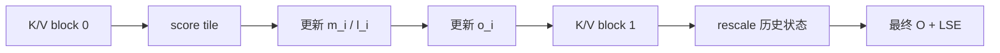

# Online Softmax · 数据流与交互

## 1. 状态流



## 2. Forward 到 Backward 的最小传递

| Forward 保存 | Backward 用途 |
|--------------|---------------|
| `out` | 计算梯度时需要输出 |
| `softmax_lse` | 重算 probability 的归一化状态 |
| `rng_state` | dropout backward 对齐随机模式 |
| `q/k/v` | 重算局部 scores |

## 3. 为什么不保存 `P`

完整 `P` 的大小是 `batch * heads * seqlen_q * seqlen_k`。LSE 的大小是 `batch * heads * seqlen_q`。这就是 FlashAttention backward 省显存的关键差异。

## 4. 状态更新的源码数据流

**Explain：** `softmax_rescale_o` 先把 `acc_s` reshape 成行列布局，然后对每一行更新 `row_max`、`row_sum`。后续 block 会缩放 `acc_o`，使历史输出与新最大值处在同一标尺。

**Code：**

```cpp
// 来源：csrc/flash_attn/src/softmax.h L136-L166
Tensor scores = make_tensor(acc_s.data(), FLASH_NAMESPACE::convert_layout_acc_rowcol(acc_s.layout()));
if (Is_first) {
    FLASH_NAMESPACE::template reduce_max</*zero_init=*/true>(scores, row_max);
    FLASH_NAMESPACE::scale_apply_exp2(scores, row_max, softmax_scale_log2);
    FLASH_NAMESPACE::reduce_sum</*zero_init=*/true>(scores, row_sum);
} else {
    Tensor scores_max_prev = make_fragment_like(row_max);
    cute::copy(row_max, scores_max_prev);
    FLASH_NAMESPACE::template reduce_max</*zero_init=*/false>(scores, row_max);
    Tensor acc_o_rowcol = make_tensor(acc_o.data(), FLASH_NAMESPACE::convert_layout_acc_rowcol(acc_o.layout()));
    #pragma unroll
    for (int mi = 0; mi < size(row_max); ++mi) {
        float scores_max_cur = !Check_inf
            ? row_max(mi)
            : (row_max(mi) == -INFINITY ? 0.0f : row_max(mi));
        float scores_scale = exp2f((scores_max_prev(mi) - scores_max_cur) * softmax_scale_log2);
        row_sum(mi) *= scores_scale;
        #pragma unroll
        for (int ni = 0; ni < size<1>(acc_o_rowcol); ++ni) { acc_o_rowcol(mi, ni) *= scores_scale; }
    }
    FLASH_NAMESPACE::scale_apply_exp2(scores, row_max, softmax_scale_log2);
    FLASH_NAMESPACE::reduce_sum</*zero_init=*/false>(scores, row_sum);
}
```

**Comment：** 这里的数据流是 `acc_s` 更新 `row_max/row_sum`，同时修正 `acc_o`。这就是图里 `M1["rescale 历史状态"]` 的源码实现。

## 5. Forward kernel 中的 block 级调用点

**Explain：** 在 forward 主循环里，mask 之后马上进入 softmax 更新，然后 `rP` 参与 `PV`。所以 `P` 的生命周期只存在于当前 block 的 register fragment。

**Code：**

```cpp
// 来源：csrc/flash_attn/src/flash_fwd_kernel.h L341-L367
masking_step == 0
    ? softmax.template softmax_rescale_o</*Is_first=*/true,  /*Check_inf=*/Is_causal || Is_local>(acc_s, acc_o, params.scale_softmax_log2)
    : softmax.template softmax_rescale_o</*Is_first=*/false, /*Check_inf=*/Is_causal || Is_local>(acc_s, acc_o, params.scale_softmax_log2);

Tensor rP = FLASH_NAMESPACE::convert_type<Element>(acc_s);
if (Is_dropout) {
    dropout.apply_dropout(rP, block_row_idx, block_col_idx, kNWarps);
}

Tensor tOrP = make_tensor(rP.data(), FLASH_NAMESPACE::convert_layout_acc_Aregs<typename Kernel_traits::TiledMma>(rP.layout()));
FLASH_NAMESPACE::gemm_rs(acc_o, tOrP, tOrVt, tOsVt, tiled_mma, smem_tiled_copy_V, smem_thr_copy_V);
```

**Comment：** `rP` 是局部概率块，它马上被 `gemm_rs` 消费，不作为完整矩阵保存。

## 6. LSE 写回和 backward 读取

**Explain：** CUDA forward 生成 LSE；Python autograd 保存 LSE；backward 把 LSE 传回 CUDA。三段合起来说明 LSE 是 forward/backward 的协议字段。

**Code：**

```python
# 来源：flash_attn/flash_attn_interface.py L485-L539
out_padded, softmax_lse, S_dmask, rng_state =  _wrapped_flash_attn_forward(
    q,
    k,
    v,
    dropout_p,
    softmax_scale,
    causal=causal,
    window_size_left=window_size[0],
    window_size_right=window_size[1],
    softcap=softcap,
    alibi_slopes=alibi_slopes,
    return_softmax=return_softmax and dropout_p > 0,
)
if is_grad:
    ctx.save_for_backward(q, k, v, out_padded, softmax_lse, rng_state)

q, k, v, out, softmax_lse, rng_state = ctx.saved_tensors
_wrapped_flash_attn_backward(
    dout_padded,
    q,
    k,
    v,
    out,
    softmax_lse,
    dqkv[:, :, 0],
```

**Comment：** `S_dmask` 可选返回用于测试/调试；backward 的核心协议是 `out + softmax_lse + rng_state`。
