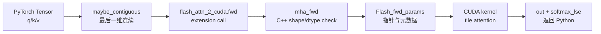

# Python API 与绑定 · 数据流与交互

## 1. Dense forward 的跨层数据流



**Explain：** Python 层传的是张量对象；C++ 层把它们检查并拆成指针、stride、shape、mask、dropout 状态；CUDA 层只消费 `Flash_fwd_params`。

**Code：**

```cpp
// 来源：csrc/flash_attn/flash_api.cpp L351-L394
mha_fwd(at::Tensor &q,
        const at::Tensor &k,
        const at::Tensor &v,
        std::optional<at::Tensor> &out_,
        std::optional<at::Tensor> &alibi_slopes_,
        const float p_dropout,
        const float softmax_scale,
        bool is_causal,
        int window_size_left,
        int window_size_right,
        const float softcap,
        const bool return_softmax,
        std::optional<at::Generator> gen_) {

    auto q_dtype = q.dtype();
    TORCH_CHECK(q_dtype == torch::kFloat16 || q_dtype == torch::kBFloat16,
                "FlashAttention only support fp16 and bf16 data type");
    TORCH_CHECK(k.dtype() == q_dtype, "query and key must have the same dtype");
    TORCH_CHECK(v.dtype() == q_dtype, "query and value must have the same dtype");

    TORCH_CHECK(q.stride(-1) == 1, "Input tensor must have contiguous last dimension");
```

**Comment：** 这些检查解释了许多使用侧限制：dtype 必须是 fp16/bf16，最后一维必须 contiguous，head_dim 后续还会被限制在支持范围内。

## 2. varlen 的数据结构

**Explain：** varlen 并不是让 kernel 处理 ragged tensor，而是把有效 token 拼成一维连续区间，用 `cu_seqlens` 表示每条序列的起止边界。

```text
batch padded:
  seq0: [t t t pad]
  seq1: [t t pad pad]

unpad 后:
  hidden_states: [seq0_t0 seq0_t1 seq0_t2 seq1_t0 seq1_t1]
  cu_seqlens:    [0, 3, 5]
```

**Code：**

```python
# 来源：flash_attn/bert_padding.py L114-L126
indices = torch.nonzero(all_masks.flatten(), as_tuple=False).flatten()
max_seqlen_in_batch = seqlens_in_batch.max().item()
cu_seqlens = F.pad(torch.cumsum(seqlens_in_batch, dim=0, dtype=torch.int32), (1, 0))
return (
    index_first_axis(rearrange(hidden_states, "b s ... -> (b s) ..."), indices),
    indices,
    cu_seqlens,
    max_seqlen_in_batch,
    used_seqlens_in_batch,
)
```

**Comment：** `indices` 用于把输出 scatter 回原始 padded batch；`cu_seqlens` 用于 kernel 找每条序列边界。

## 3. 返回值的工程含义

| 返回值 | 主要用途 | 是否常规保存完整 attention |
|--------|----------|----------------------------|
| `out` | 上层模型继续 forward | 是最终输出 |
| `softmax_lse` | backward 重算 scores 与 softmax | 不是完整矩阵 |
| `S_dmask` | dropout/testing 时返回概率或 mask 信息 | 非常规主路径 |
| `rng_state` | dropout backward 对齐随机状态 | 只保存 seed/offset |

**Explain：** FlashAttention 的训练内存节省来自“不保存 `N x N` attention matrix”。它保存的是足够 backward 重算的压缩状态。

## 4. 与 C++ 参数装配的关系

**Explain：** Python 传入的张量和标量最终会被放进 `Flash_fwd_params`。后续 [[FA04-FA2-Forward-01-核心概念]] 会沿着这个结构继续进入 CUDA kernel。

**Code：**

```cpp
// 来源：csrc/flash_attn/flash_api.cpp L452-L470
Flash_fwd_params params;
set_params_fprop(params,
                 batch_size,
                 seqlen_q, seqlen_k,
                 seqlen_q_rounded, seqlen_k_rounded,
                 num_heads, num_heads_k,
                 head_size, head_size_rounded,
                 q, k, v, out,
                 /*cu_seqlens_q_d=*/nullptr,
                 /*cu_seqlens_k_d=*/nullptr,
                 /*seqused_k=*/nullptr,
                 return_softmax ? p.data_ptr() : nullptr,
                 softmax_lse.data_ptr(),
                 p_dropout,
                 softmax_scale,
                 window_size_left,
                 window_size_right,
                 softcap);
```

**Comment：** `set_params_fprop` 是 Python API 语义下沉到 kernel 参数的关键转换点。

