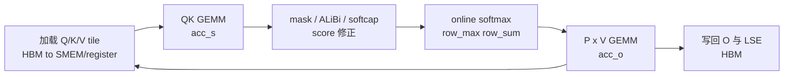

# FA2 CUDA Forward · 数据流与交互

## 1. Forward kernel 主循环



**Explain：** kernel 不生成完整 `S` 和 `P`。每次处理一个 K/V block：算局部 scores、更新 softmax 状态、把概率乘到 V 上并累积到 `acc_o`。

## 2. QK、mask、online softmax、PV 的源码顺序

**Code：**

```cpp
// 来源：csrc/flash_attn/src/flash_fwd_kernel.h L303-L367
FLASH_NAMESPACE::gemm</*A_in_regs=*/Kernel_traits::Is_Q_in_regs>(
    acc_s, tSrQ, tSrK, tSsQ, tSsK, tiled_mma, smem_tiled_copy_Q, smem_tiled_copy_K,
    smem_thr_copy_Q, smem_thr_copy_K
);
if constexpr (Is_softcap){
    FLASH_NAMESPACE::apply_softcap(acc_s, params.softcap);
}

mask.template apply_mask<Is_causal, Is_even_MN>(
    acc_s, n_block * kBlockN, m_block * kBlockM + (tidx / 32) * 16 + (tidx % 32) / 4, kNWarps * 16
);

masking_step == 0
    ? softmax.template softmax_rescale_o</*Is_first=*/true,  /*Check_inf=*/Is_causal || Is_local>(acc_s, acc_o, params.scale_softmax_log2)
    : softmax.template softmax_rescale_o</*Is_first=*/false, /*Check_inf=*/Is_causal || Is_local>(acc_s, acc_o, params.scale_softmax_log2);

Tensor rP = FLASH_NAMESPACE::convert_type<Element>(acc_s);
Tensor tOrP = make_tensor(rP.data(), FLASH_NAMESPACE::convert_layout_acc_Aregs<typename Kernel_traits::TiledMma>(rP.layout()));
FLASH_NAMESPACE::gemm_rs(acc_o, tOrP, tOrVt, tOsVt, tiled_mma, smem_tiled_copy_V, smem_thr_copy_V);
```

**Comment：** 这段代码正好对应数学公式：`S=QK^T`、`P=softmax(S)`、`O=PV`。差别是 `S/P` 只在 tile 级别短暂存在。

## 3. Epilogue 写回 `LSE` 与 `O`

**Explain：** 主循环结束后，kernel 把 `acc_o` 归一化并生成 LSE，再将输出转换成 fp16/bf16 写回。

**Code：**

```cpp
// 来源：csrc/flash_attn/src/flash_fwd_kernel.h L433-L438
Tensor lse = softmax.template normalize_softmax_lse<Is_dropout>(acc_o, params.scale_softmax, params.rp_dropout);

// Convert acc_o from fp32 to fp16/bf16
Tensor rO = FLASH_NAMESPACE::convert_type<Element>(acc_o);
Tensor sO = make_tensor(sQ.data(), typename Kernel_traits::SmemLayoutO{});
```

**Comment：** `acc_o` 通常在 fp32 累积，最终输出按输入 dtype 转回。`LSE` 保持 fp32，是 backward 稳定性的重要状态。

## 4. 内存层级视角

| 数据 | 生命周期 | 位置 |
|------|----------|------|
| `Q/K/V` 原始张量 | 整个调用期间 | HBM |
| `Q/K/V tile` | 当前 block | shared memory / register |
| `acc_s` | 当前 Q block 与 K block | register fragment |
| `row_max/row_sum` | 当前 Q block 扫描所有 K block | register |
| `acc_o` | 当前 Q block 输出累积 | register |
| `O/LSE` | 最终结果与 backward 状态 | HBM |

**Explain：** FlashAttention 的工程价值在于把 `N x N` 的中间态限制在寄存器片段里，而不是在 HBM 里来回读写。

## 5. 与上层 serving 的关系

**Explain：** SGLang/vLLM 这类 serving 系统最终会把 prefill 或 decode 的 attention 需求交给某个 backend。FA2 forward 解释了 backend 的核心约束：当 prompt 很长时，瓶颈经常不是“算不动 QK”，而是“怎么少搬 scores/probabilities”。

**Comment：** 读到这里应能把 [[FlashAttention-全链路Attention追踪]] 中的 Python 调用，和本页的 CUDA tile 主循环对应起来。

