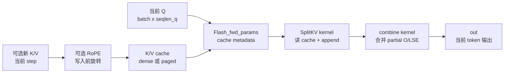

# KV Cache 与推理特性 · 数据流与交互

## 1. Decode cache 数据流



**Explain：** KV cache 路径把 cache update 和 attention 合并在一个算子族里。paged KV 时，kernel 通过 `block_table` 读物理 blocks；SplitKV 时还会写 partial `out_accum/lse_accum` 再 combine。

## 2. SplitKV 的 partial buffer

**Explain：** 当 `num_splits > 1`，每个 split 只处理一部分 K/V，需要单独保存 partial LSE 和 partial O。combine kernel 再用 online softmax 的合并逻辑还原最终输出。

**Code：**

```cpp
// 来源：csrc/flash_attn/flash_api.cpp L302-L325
params.num_splits = num_splits;
at::Tensor softmax_lse_accum;
at::Tensor out_accum;

if (p_dropout == 0.0f) {
    if (num_splits < 1) {
        params.num_splits = num_splits_heuristic(batch_size * num_heads * num_m_blocks, num_sm * 2, num_n_blocks, 128);
    }
    if (params.num_splits > 1) {
        softmax_lse_accum = torch::empty({params.num_splits, batch_size, num_heads, max_seqlen_q}, opts.dtype(at::kFloat));
        out_accum = torch::empty({params.num_splits, batch_size, num_heads, max_seqlen_q, head_size_rounded}, opts.dtype(at::kFloat));
        params.softmax_lseaccum_ptr = softmax_lse_accum.data_ptr();
        params.oaccum_ptr = out_accum.data_ptr();
    }
    TORCH_CHECK(params.num_splits <= 128, "num_splits > 128 not supported");
}
```

**Comment：** SplitKV 增加了中间 buffer，因此不是免费优化；它用更多中间写回换并行度。

## 3. split kernel 与 combine kernel

**Explain：** split forward kernel 负责每个 split 的局部 attention；当 split 数大于 1 时，combine kernel 把多个 partial 输出归并。

**Code：**

```cpp
// 来源：csrc/flash_attn/src/flash_fwd_launch_template.h L101-L150
dim3 grid(num_m_block, params.num_splits > 1 ? params.num_splits : params.b, params.num_splits > 1 ? params.b * params.h : params.h);
BOOL_SWITCH(params.num_splits > 1, Split, [&] {
    BOOL_SWITCH(params.knew_ptr != nullptr, Append_KV, [&] {
        ALIBI_SWITCH(params.alibi_slopes_ptr != nullptr, Has_alibi, [&] {
            SOFTCAP_SWITCH(params.softcap > 0.0, Is_softcap, [&] {
                auto kernel = &flash_fwd_splitkv_kernel<
                    Kernel_traits,
                    Is_causal,
                    Is_local && !Is_causal,
                    Has_alibi,
                    IsEvenMNConst && !Append_KV && IsEvenKConst && !Is_local && !Has_alibi && Kernel_traits::kHeadDim <= 128,
                    IsEvenKConst && !Has_alibi,
                    Is_softcap,
                    Split,
                    Append_KV>;
                kernel<<<grid, Kernel_traits::kNThreads, smem_size, stream>>>(params);
            });
        });
    });
});
if (params.num_splits > 1) {
    dim3 grid_combine((params.b * params.h * params.seqlen_q + kBlockM - 1) / kBlockM);
    flash_fwd_splitkv_combine_kernel<Kernel_traits, kBlockM, 1, IsEvenKConst><<<grid_combine, Kernel_traits::kNThreads, 0, stream>>>(params);
}
```

**Comment：** `Append_KV` 是新 K/V 写入 cache 的开关；`Split` 是是否需要 combine 的开关。

## 4. 测试矩阵体现功能边界

**Explain：** KV cache 测试覆盖了 batch index、leftpad、paged block size、RoPE、causal/local、ALiBi、MQA/GQA、num_splits、dtype。这些维度正是 serving runtime 可能组合出的情况。

**Code：**

```python
# 来源：tests/test_flash_attn.py L1907-L1936
def test_flash_attn_kvcache(
    seqlen_q,
    seqlen_k,
    d,
    has_batch_idx,
    has_leftpad,
    paged_kv_block_size,
    rotary_fraction,
    rotary_interleaved,
    seqlen_new_eq_seqlen_q,
    causal,
    local,
    alibi,
    new_kv,
    mha_type,
    num_splits,
    dtype,
):
```

**Comment：** 读测试能反推出生产风险：某些组合被跳过或禁止，说明 runtime 不能假设所有特性可自由叠加。

