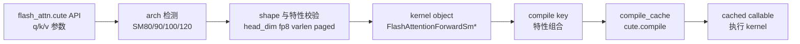

# FA3/FA4 Hopper 与 CuTe · 数据流与交互

## 1. FA4 编译与执行路径



**Explain：** FA4 把“选择哪个 kernel”和“这个组合是否已编译”变成运行时可见的 Python 流程。执行仍在 GPU kernel 中完成，但编译缓存成为新的性能因素。

## 2. tile 与 SplitKV 仍然存在

**Explain：** 即使进入 CuTeDSL，FlashAttention 的本质仍是 tile attention。FA4 仍然计算 `tile_m/tile_n`、`num_m_blocks`、`num_n_blocks`，并根据并行度 heuristic 选择 `num_splits`。

**Code：**

```python
# 来源：flash_attn/cute/interface.py L536-L586
if tile_mn is None:
    if arch // 10 == 12:
        if head_dim <= 64:
            fwd_cfg = FwdConfig(128, 128, True, True)
        else:
            fwd_cfg = FwdConfig(128, 64, True, True)
    elif arch // 10 == 8:
        fwd_cfg = FwdConfig(128, 64, True, True)
    elif arch // 10 == 9:
        sparse_q = get_sparse_q_block_size(block_sparse_tensors, seqlen_q)
        fwd_cfg = _tile_size_fwd_sm90(head_dim, head_dim_v, causal, local, sparse_block_size_q=sparse_q)
else:
    fwd_cfg = FwdConfig(tile_mn[0], tile_mn[1], fwd_cfg.mma_pv_is_rs, fwd_cfg.intra_wg_overlap)
tile_m, tile_n = fwd_cfg.m_block_size, fwd_cfg.n_block_size
```

**Comment：** DSL 不改变 FlashAttention 的算法核心，只改变 kernel 描述、选择、编译与维护方式。

## 3. FP8 是架构能力约束

**Explain：** FA4 明确把 FP8 限制在 SM100 forward-only。读这类源码时要区分“算法不支持”和“当前后端/架构组合不支持”。

**Code：**

```python
# 来源：flash_attn/cute/interface.py L510-L516
is_fp8 = v.dtype in (torch.float8_e4m3fn, torch.float8_e5m2)
requires_grad = any(t is not None and t.requires_grad for t in [q, k, v, qv])
if is_fp8 and requires_grad:
    raise NotImplementedError("FA4 CuTe FP8 backward is not supported yet (forward-only).")
out_torch_dtype = torch.bfloat16 if is_fp8 else q_dtype
```

**Comment：** AI infra 中的 mixed precision 不是只改 dtype；它会影响 descale tensors、kernel path、backward 可用性和输出 dtype。

## 4. cached callable 执行 kernel

**Explain：** cache 命中后，FA4 将真实张量传给已编译 callable。fake mode、FP8 view、descale tensors 等也在这一层处理。

**Code：**

```python
# 来源：flash_attn/cute/interface.py L1036-L1089
if not is_fake_mode():
    q_call, k_call, v_call, qv_call = [
        t.detach() if t is not None else None
        for t in (q, k, v, qv)
    ]
    if is_fp8:
        q_call, k_call, v_call, qv_call = [
            t.view(torch.uint8) if t is not None else None
            for t in (q_call, k_call, v_call, qv_call)
        ]
    _flash_attn_fwd.compile_cache[compile_key](
        q_call,
        k_call,
        v_call,
        out.detach(),
        lse,
        softmax_scale,
        cu_seqlens_q,
        cu_seqlens_k,
        seqused_q,
        seqused_k,
    )
```

**Comment：** 对线上系统来说，首次编译 latency 和 cache key 稳定性会变成新的性能维度。

## 5. 与 FA2 的对照

| 维度 | FA2 | FA4 CuTe |
|------|-----|----------|
| 入口 | `flash_attn_2_cuda` extension | `flash_attn.cute` Python API |
| dispatch | C++ 宏和 template switch | Python arch/config selection |
| 编译 | 预编译多个 `.cu` 实例 | `cute.compile` + cache |
| 调试 | 看 C++/CUDA 编译实例 | 看 compile key、arch、kernel object |
| 风险 | wheel 编译/ABI/模板数量 | 首次 JIT latency/cache miss |

**Comment：** 两条路径都服务同一算法目标：减少 attention 的 HBM traffic。差异主要是工程组织和新架构适配方式。

