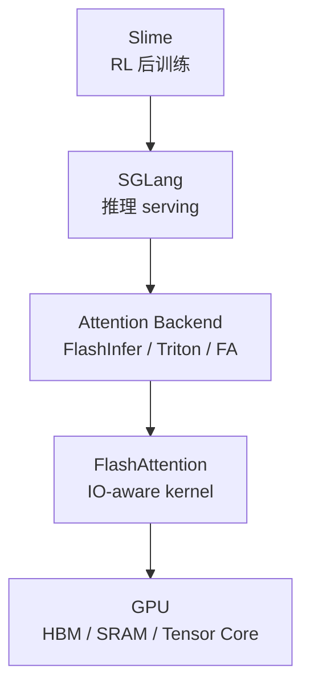

# FlashAttention 源码阅读指南

本目录是对 [FlashAttention](https://github.com/Dao-AILab/flash-attention) 源码的**原理驱动、自包含**中文讲解。  
**读者只读 `flash-attn_reading/` 即可；`flash-attn/` upstream 目录仅作为维护者对照。**

## 学习目标

FlashAttention 是 AI infra 中理解 **attention memory wall** 的核心案例。阅读重点不是把每个 `.cu` 文件看完，而是回答：

| 问题 | 对应能力 |
|------|----------|
| 标准 attention 为什么慢 | 识别 HBM 读写瓶颈，而不是只看 FLOPs |
| FlashAttention 为什么省显存 | 理解分块计算、online softmax、重算策略 |
| FA1 到 FA4 如何演进 | 区分算法原点、主包重写、Hopper 路径与 CuTeDSL/JIT |
| 为什么有大量 kernel specialization | 理解 dtype、head_dim、causal、dropout、splitKV 的组合爆炸 |
| 为什么 prefill 与 decode 不同 | 理解训练/推理 serving 的不同算子形态 |
| FA3/FA4 为什么重要 | 理解 Hopper/Blackwell 上 TMA、GMMA、CuTeDSL、JIT cache 的系统意义 |

## 核心原则

| 原则 | 说明 |
|------|------|
| **原理优先** | 先解释 IO-aware attention，再用源码验证 |
| **源码作证据** | 每篇关键结论配源码片段、路径与行号 |
| **AI infra 视角** | 关注训练、推理、KV cache、长上下文、kernel dispatch |
| **自包含** | 文档内嵌必要源码，读者无需跳转 upstream |

## 快速入口

| 用途 | 文档 |
|------|------|
| 零基础先修 | [[FlashAttention-00-零基础先修]] |
| 导读与总览 | [[FlashAttention-00-导读与总览-00-MOC]] → [[FlashAttention-01-项目总览]] |
| 代际演进 | [[FlashAttention-代际演进]] |
| 架构分层 | [[FlashAttention-02-架构分层]] |
| 16 步导读 | [[FlashAttention-04-导读路径]] |
| 文件地图 | [[FlashAttention-05-文件地图]] |
| 术语表 | [[FlashAttention-术语表]] |
| 全链路追踪 | [[FlashAttention-全链路Attention追踪]] |

## 按主题进入

| 主题 | 入口 |
|------|------|
| 导读与总览 | [[FlashAttention-00-导读与总览-00-MOC]] |
| 方法论 | [[FlashAttention-00-方法论-00-MOC]] |
| FA1 到 FA4 代际演进 | [[FlashAttention-代际演进]] |
| Attention IO 原理 | [[FA01-Attention-IO-00-MOC]] |
| Online Softmax | [[FA02-Online-Softmax-00-MOC]] |
| Python API 与绑定 | [[FA03-Python-API-00-MOC]] |
| FA2 CUDA Forward | [[FA04-FA2-Forward-00-MOC]] |
| KV Cache 与推理特性 | [[FA05-KV-Cache-00-MOC]] |
| FA3/FA4 Hopper/CuTe | [[FA06-Hopper-CuTe-00-MOC]] |
| 总结复盘 | [[FlashAttention-90-总结复盘-00-MOC]] |

## 与 SGLang / Slime 的关系

FlashAttention 位于 AI infra 栈的算子层：



**Explain：** Slime 不直接实现 attention kernel；它通过 SGLang 做 rollout。SGLang 的模型 forward 需要 attention backend，FlashAttention 是这一层的典型底层实现。  
**Code：**

```python
# 来源：flash_attn/__init__.py L8-L16
from flash_attn.flash_attn_interface import (
    flash_attn_func,
    flash_attn_kvpacked_func,
    flash_attn_qkvpacked_func,
    flash_attn_varlen_func,
    flash_attn_varlen_kvpacked_func,
    flash_attn_varlen_qkvpacked_func,
    flash_attn_with_kvcache,
)
```

**Comment：** 这些公开 API 是上层训练框架、模型模块和 serving 框架接入 FlashAttention 的边界。

## 基线版本

| 项目 | 基线 |
|------|------|
| flash-attn | `002cce0` |
| Python package | `2.8.4` |

推荐阅读顺序：[[FlashAttention-00-零基础先修]] → [[FlashAttention-代际演进]] → [[FlashAttention-01-项目总览]] → [[FlashAttention-全链路Attention追踪]] → [[FlashAttention-04-导读路径]] → 按需深入各专题 MOC。

