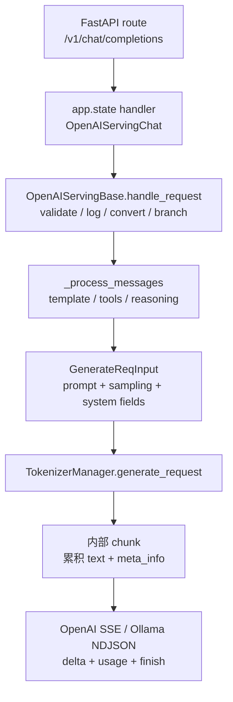

# OpenAI API · 源码走读

这篇不是把 `/v1/chat/completions` 看成一层薄 wrapper。SGLang 的 OpenAI API 层实际承担三类边界：

1. **协议边界**：FastAPI/Pydantic 接收 OpenAI/Ollama 形状的请求，handler 把它们转成 `GenerateReqInput`。
2. **系统边界**：routing header、LoRA、disaggregation bootstrap、metrics label、session、priority 等 SGLang 扩展在这里接入。
3. **流式边界**：TokenizerManager 输出的是内部累积文本与 `meta_info`，OpenAI SSE / Ollama NDJSON delta 都在 Serving 层组装。

读源码时抓住这条主线：**HTTP route 只分发；OpenAI handler 做协议转换；TokenizerManager 负责生成；Serving 再把内部 chunk 还原成外部协议 chunk。**

---

## 1. http_server.py：路由层为什么很薄

### 1.1 handler 在 lifespan 中一次性挂到 app.state

**问题与约束：** HTTP 路由函数不能在每个请求里重新构造 tokenizer、template、OpenAI/Ollama handler；这些对象持有模型配置、模板管理器、reasoning/tool parser 配置和 tokenizer manager 状态。

**设计选择：** 在 FastAPI lifespan 初始化阶段把各类 serving handler 挂到 `fast_api_app.state`，路由函数只取 handler 并调用。

**Explain：** `lifespan` 是 OpenAI/Ollama 协议层的装配点。它把同一个 `_global_state.tokenizer_manager` 和 `_global_state.template_manager` 注入 Completion、Chat、Embedding、Classify、Tokenize、Transcription、Ollama 等 handler。

**Code：**

```python
## 来源：python/sglang/srt/entrypoints/http_server.py L291-L323
    # Initialize OpenAI serving handlers
    fast_api_app.state.openai_serving_completion = OpenAIServingCompletion(
        _global_state.tokenizer_manager, _global_state.template_manager
    )
    fast_api_app.state.openai_serving_chat = (
        _global_state.tokenizer_manager.serving_chat_class(
            _global_state.tokenizer_manager, _global_state.template_manager
        )
    )
    fast_api_app.state.openai_serving_embedding = OpenAIServingEmbedding(
        _global_state.tokenizer_manager, _global_state.template_manager
    )
    fast_api_app.state.openai_serving_classify = OpenAIServingClassify(
        _global_state.tokenizer_manager, _global_state.template_manager
    )
    fast_api_app.state.openai_serving_score = OpenAIServingScore(
        _global_state.tokenizer_manager
    )
    fast_api_app.state.openai_serving_rerank = OpenAIServingRerank(
        _global_state.tokenizer_manager, _global_state.template_manager
    )
    fast_api_app.state.openai_serving_tokenize = OpenAIServingTokenize(
        _global_state.tokenizer_manager, _global_state.template_manager
    )
    fast_api_app.state.openai_serving_detokenize = OpenAIServingDetokenize(
        _global_state.tokenizer_manager
    )
    fast_api_app.state.openai_serving_transcription = OpenAIServingTranscription(
        _global_state.tokenizer_manager
    )

    # Initialize Ollama-compatible serving handler
    fast_api_app.state.ollama_serving = OllamaServing(_global_state.tokenizer_manager)
```

**代码逻辑：** Completion/Chat 等 handler 是长生命周期对象；Chat handler class 还通过 `tokenizer_manager.serving_chat_class` 间接选择，允许模型或后续扩展替换 chat serving 行为。

**为什么这样写：** 入口层把对象构造集中在生命周期初始化阶段，避免每个路由重复解析模板、模型配置和 parser，也让路由函数保持纯粹的协议入口。

**不变量与失败模式：** `app.state.openai_serving_chat` 必须在请求到来前存在；如果 lifespan 初始化失败，路由层没有 fallback。多 tokenizer 模式也必须先把全局 state 写好，否则 handler 会拿不到 tokenizer manager。

**Comment：** 读者应把 `http_server.py` 的 OpenAI 段看成“依赖注入 + 路由表”，而不是业务逻辑主体。

### 1.2 OpenAI 路由只做 request model 到 handler 的委托

**问题与约束：** OpenAI 兼容 API 有多个 endpoint，但都要共享验证、日志、错误包装和流式分支。如果路由函数里写转换逻辑，会让 Completion、Chat、Embedding 之间重复大量边界代码。

**设计选择：** FastAPI 负责 path、method、Pydantic request model 和 `validate_json_request`；路由函数只委托到对应 handler。

**Explain：** `/v1/completions` 和 `/v1/chat/completions` 都从 `raw_request.app.state` 取 handler，再调用 `handle_request`。这说明真正的协议转换不在路由函数里，而在 `OpenAIServingBase` 及其子类里。

**Code：**

```python
## 来源：python/sglang/srt/entrypoints/http_server.py L1598-L1613
@app.post("/v1/completions", dependencies=[Depends(validate_json_request)])
async def openai_v1_completions(request: CompletionRequest, raw_request: Request):
    """OpenAI-compatible text completion endpoint."""
    return await raw_request.app.state.openai_serving_completion.handle_request(
        request, raw_request
    )


@app.post("/v1/chat/completions", dependencies=[Depends(validate_json_request)])
async def openai_v1_chat_completions(
    request: ChatCompletionRequest, raw_request: Request
):
    """OpenAI-compatible chat completion endpoint."""
    return await raw_request.app.state.openai_serving_chat.handle_request(
        request, raw_request
    )
```

**代码逻辑：** `CompletionRequest` / `ChatCompletionRequest` 已经由 FastAPI 解析；`raw_request` 继续传入 handler，用于 header、request logger 和客户端断连检测。

**为什么这样写：** OpenAI route 的稳定性要求高，越薄越容易保证兼容性。新增协议特性应进 handler，而不是散落在 FastAPI route 中。

**不变量与失败模式：** `validate_json_request` 只允许 `application/json`，所以表单类的 audio transcription 走另一条路由。若客户端发错 content type，进入 handler 前就会失败。

**Comment：** 路由层的“薄”是一种设计取舍：把协议路径稳定下来，把变化集中到 handler。

### 1.3 Ollama 路由用环境变量保留兼容入口

**问题与约束：** Ollama 客户端通常固定访问 `/api/chat`、`/api/generate`、`/api/tags`、`/api/show`，但部署环境可能已经有反向代理或现有服务占用这些路径。

**设计选择：** route decorator 直接读取 `SGLANG_OLLAMA_*_ROUTE` 环境变量；默认保持 Ollama 习惯路径，必要时允许部署侧改路径。

**Explain：** Ollama 适配没有复用 `OpenAIServingBase`，而是有独立 `OllamaServing`，因为它的请求/响应协议、流式格式和默认 stream 语义都不同。

**Code：**

```python
## 来源：python/sglang/srt/entrypoints/http_server.py L1837-L1880
##### Ollama-compatible API endpoints #####

_ollama_root_route = os.environ.get("SGLANG_OLLAMA_ROOT_ROUTE")
if _ollama_root_route is not None:

    @app.get(_ollama_root_route)
    @app.head(_ollama_root_route)
    async def ollama_root():
        """Ollama-compatible root endpoint."""
        return "Ollama is running"

else:

    @app.get("/")
    @app.head("/")
    async def sglang_root():
        """Default root endpoint."""
        return "SGLang is running"


@app.post(os.environ.get("SGLANG_OLLAMA_CHAT_ROUTE", "/api/chat"))
async def ollama_chat(request: OllamaChatRequest, raw_request: Request):
    """Ollama-compatible chat endpoint."""
    return await raw_request.app.state.ollama_serving.handle_chat(request, raw_request)


@app.post(os.environ.get("SGLANG_OLLAMA_GENERATE_ROUTE", "/api/generate"))
async def ollama_generate(request: OllamaGenerateRequest, raw_request: Request):
    """Ollama-compatible generate endpoint."""
    return await raw_request.app.state.ollama_serving.handle_generate(
        request, raw_request
    )


@app.get(os.environ.get("SGLANG_OLLAMA_TAGS_ROUTE", "/api/tags"))
async def ollama_tags(raw_request: Request):
    """Ollama-compatible list models endpoint."""
    return raw_request.app.state.ollama_serving.get_tags()


@app.post(os.environ.get("SGLANG_OLLAMA_SHOW_ROUTE", "/api/show"))
async def ollama_show(request: OllamaShowRequest, raw_request: Request):
    """Ollama-compatible show model info endpoint."""
    return raw_request.app.state.ollama_serving.get_show(request.model)
```

**代码逻辑：** 根路径也可切换成 Ollama 风格返回；四个核心 endpoint 都委托给 `ollama_serving`。

**为什么这样写：** OpenAI 和 Ollama 是两套外部协议，不强行塞进同一基类，避免为了抽象一致性牺牲协议细节。

**不变量与失败模式：** 环境变量在 app 定义时读取；运行中修改环境变量不会改变 route。`/api/show` 只返回 SGLang 能推断出的模型元信息，不能伪造完整 Ollama model file。

**Comment：** 这一段说明 SGLang 的兼容层不是“只兼容 OpenAI”，而是把多种客户端协议收敛到同一个 tokenizer manager。

---

## 2. serving_base.py：OpenAI handler 的模板方法

### 2.1 `handle_request` 固定公共流程

**问题与约束：** Completion、Chat、Embedding 等 endpoint 的输入格式不同，但共有一组横切逻辑：校验、请求日志、转换成内部 request、记录 received_time、按 stream 分支、统一错误响应。

**设计选择：** `OpenAIServingBase.handle_request` 实现模板方法，子类只覆写 `_validate_request`、`_convert_to_internal_request`、`_handle_streaming_request`、`_handle_non_streaming_request`。

**Explain：** 这段代码定义了 OpenAI handler 的骨架。外部 request 必须先变成 `GenerateReqInput` 或 `EmbeddingReqInput`，然后才进入 tokenizer manager。

**Code：**

```python
## 来源：python/sglang/srt/entrypoints/openai/serving_base.py L73-L108
    async def handle_request(
        self, request: OpenAIServingRequest, raw_request: Request
    ) -> Union[Any, StreamingResponse, ErrorResponse]:
        """Handle the specific request type with common pattern
        If you want to override this method, you should be careful to record the validation time.
        """
        received_time = monotonic_time()

        try:
            # Validate request
            error_msg = self._validate_request(request)
            if error_msg:
                return self.create_error_response(error_msg)

            # Log the raw OpenAI request payload before conversion to tokenized form.
            request_logger = self.tokenizer_manager.request_logger
            if request_logger.log_requests and request_logger.log_requests_level >= 2:
                request_logger.log_openai_received_request(request, request=raw_request)

            # Convert to internal format
            adapted_request, processed_request = self._convert_to_internal_request(
                request, raw_request
            )

            if isinstance(adapted_request, (GenerateReqInput, EmbeddingReqInput)):
                # Only set timing fields if adapted_request supports them
                adapted_request.received_time = received_time

            # Note(Xinyuan): raw_request below is only used for detecting the connection of the client
            if hasattr(request, "stream") and request.stream:
                return await self._handle_streaming_request(
                    adapted_request, processed_request, raw_request
                )
            else:
                return await self._handle_non_streaming_request(
                    adapted_request, processed_request, raw_request
                )
```

**代码逻辑：** `received_time` 在转换后写入内部 request；流式与非流式的分支由原始 OpenAI request 的 `stream` 字段决定。

**为什么这样写：** 模板方法让“每个 endpoint 必须先转换再生成”成为不变量，同时给 Chat/Completion 保留足够自由度处理各自协议细节。

**不变量与失败模式：** 子类如果绕过 `handle_request`，容易漏掉 request logger、timing 和统一错误格式。`raw_request` 必须继续传到生成层，否则客户端断连检测和 header 路由都会丢失。

**Comment：** 这一段是 OpenAI API 层的主控流程，后面所有子类源码都在填它留下的抽象槽位。

### 2.2 LoRA model 字段解析集中在基类

**问题与约束：** OpenAI 客户端只认识 `model` 字段，但 SGLang 还要支持 `base:adapter` 形式指定 LoRA；同时 native request 里也可能有显式 `lora_path`。

**设计选择：** 基类解析 `model` 中的 adapter，并规定 model 字段里的 adapter 优先于显式 `lora_path`。

**Explain：** `base-model:adapter-name` 是协议兼容层给 LoRA 暴露的简短语法。解析放在基类，Completion 和 Chat 可以共享同一语义。

**Code：**

```python
## 来源：python/sglang/srt/entrypoints/openai/serving_base.py L40-L71
    def _parse_model_parameter(self, model: str) -> Tuple[str, Optional[str]]:
        """Parse 'base-model:adapter-name' syntax to extract LoRA adapter.

        Returns (base_model, adapter_name) or (model, None) if no colon present.
        """
        if ":" not in model:
            return model, None

        # Split on first colon only to handle model paths with multiple colons
        parts = model.split(":", 1)
        base_model = parts[0].strip()
        adapter_name = parts[1].strip() or None

        return base_model, adapter_name

    def _resolve_lora_path(
        self,
        request_model: str,
        explicit_lora_path: Optional[Union[str, List[Optional[str]]]],
    ) -> Optional[Union[str, List[Optional[str]]]]:
        """Resolve LoRA adapter with priority: model parameter > explicit lora_path.

        Returns adapter name or None. Supports both single values and lists (batches).
        """
        _, adapter_from_model = self._parse_model_parameter(request_model)

        # Model parameter adapter takes precedence
        if adapter_from_model is not None:
            return adapter_from_model

        # Fall back to explicit lora_path
        return explicit_lora_path
```

**代码逻辑：** 只按第一个冒号切分；adapter 空字符串会变成 `None`；若 `model` 没有 adapter，再使用 request 里的 `lora_path`。

**为什么这样写：** OpenAI SDK 一般只传 `model`，所以把 adapter 编码进 model 字段能降低接入门槛；同时保留 native 扩展字段，便于批处理或内部调用。

**不变量与失败模式：** 这段没有校验 adapter 是否存在，只解析名字；真正加载和校验要到 LoRA registry / 生成链路。冒号语法会和某些路径格式产生歧义，所以只能 split first colon。

**Comment：** LoRA 在这里体现的是“OpenAI 协议字段有限，SGLang 用兼容语法承载扩展能力”。

### 2.3 非流式错误和流式错误必须分开构造

**问题与约束：** 非流式请求还能返回 HTTP status + JSON body；但 SSE 一旦开始发送，就只能继续发送 `data:` 行，不能再改 HTTP status。

**设计选择：** 基类提供 `create_error_response` 和 `create_streaming_error_response` 两种格式。

**Explain：** 同样的错误对象，在非流式路径变成 `ORJSONResponse`，在流式路径变成 JSON 字符串，外层再包成 `data: ...\n\n`。

**Code：**

```python
## 来源：python/sglang/srt/entrypoints/openai/serving_base.py L209-L241
    def create_error_response(
        self,
        message: str,
        err_type: str = "BadRequestError",
        status_code: int = 400,
        param: Optional[str] = None,
    ) -> ORJSONResponse:
        """Create an error response"""
        # TODO: remove fastapi dependency in openai and move response handling to the entrypoint
        error = ErrorResponse(
            object="error",
            message=message,
            type=err_type,
            param=param,
            code=status_code,
        )
        return ORJSONResponse(content=error.model_dump(), status_code=status_code)

    def create_streaming_error_response(
        self,
        message: str,
        err_type: str = "BadRequestError",
        status_code: int = 400,
    ) -> str:
        """Create a streaming error response"""
        error = ErrorResponse(
            object="error",
            message=message,
            type=err_type,
            param=None,
            code=status_code,
        )
        return json.dumps({"error": error.model_dump()})
```

**代码逻辑：** 两个函数都构造 `ErrorResponse`；非流式直接返回 FastAPI response，流式返回可嵌入 SSE 的字符串。

**为什么这样写：** 流式协议天然有“HTTP 头已发送”的边界，必须在业务层显式区分错误通道。

**不变量与失败模式：** 流式 generator 在首 chunk 前抛 `ValueError` 时仍可返回 HTTP 400；首 chunk 后再抛错只能发 streaming error chunk。

**Comment：** 这也是后面 Completion/Chat 都要 kick-start generator 的原因。

### 2.4 Data Parallel rank header 优先于 body

**问题与约束：** 数据并行 serving 场景里，请求可能由上游网关决定路由 rank。让业务 body 决定 rank 不利于代理层集中调度。

**设计选择：** `X-Data-Parallel-Rank` header 优先级高于 body 中的 `routed_dp_rank`，并在 header 非整数时立即报 400。

**Explain：** 这里把“基础设施路由意图”放进 header，把“请求参数”放进 body。两者冲突时，基础设施层覆盖业务层。

**Code：**

```python
## 来源：python/sglang/srt/entrypoints/openai/serving_base.py L277-L306
    def extract_routed_dp_rank_from_header(
        self, raw_request: Request, body_routed_dp_rank: Optional[int] = None
    ) -> Optional[int]:
        """Extract routed_dp_rank from HTTP header, with higher priority than routed_dp_rank in body.

        Header name: X-Data-Parallel-Rank (case-insensitive in HTTP/1.1/2)
        """
        if raw_request is None:
            return body_routed_dp_rank

        header_value = raw_request.headers.get("x-data-parallel-rank")
        if header_value is not None:
            try:
                header_dp_rank = int(header_value)
                if (
                    body_routed_dp_rank is not None
                    and header_dp_rank != body_routed_dp_rank
                ):
                    logger.debug(
                        f"X-Data-Parallel-Rank header ({header_dp_rank}) overrides "
                        f"body routed_dp_rank ({body_routed_dp_rank})"
                    )
                return header_dp_rank
            except ValueError:
                raise HTTPException(
                    status_code=400,
                    detail=f"Invalid X-Data-Parallel-Rank header: must be an integer, got '{header_value}'",
                )

        return body_routed_dp_rank
```

**代码逻辑：** 没有 header 时返回 body 值；header 存在则尝试转 int；冲突时记录 debug 日志。

**为什么这样写：** header 更适合网关、负载均衡器和 sidecar 注入，不要求客户端知道 SGLang 的 DP rank 细节。

**不变量与失败模式：** header 非整数会抛 `HTTPException`，随后由 `handle_request` 统一包装成错误响应。body 中的 rank 不会覆盖 header。

**Comment：** OpenAI 兼容层不仅做字段映射，也承载生产部署里的路由控制。

---

## 3. serving_completions.py：Completion 请求怎样变成 GenerateReqInput

### 3.1 prompt、echo、logprobs 和内部 request 的边界

**问题与约束：** OpenAI Completion 支持字符串 prompt、字符串列表、token id、echo、logprobs、code completion template；这些都要压缩成 SGLang 内部统一的 `GenerateReqInput`。

**设计选择：** `_convert_to_internal_request` 先处理 prompt/template/logprob 边界，再把 text 或 input_ids 放入 `GenerateReqInput`，同时接入 LoRA、DP rank、routing key、custom labels 等系统字段。

**Explain：** Completion 的设计重点不是“文本补全”本身，而是把 OpenAI Completion 的松散输入形式变成调度器能理解的生成请求。

**Code：**

```python
## 来源：python/sglang/srt/entrypoints/openai/serving_completions.py L57-L127
    def _validate_request(self, request: CompletionRequest) -> Optional[str]:
        """Validate that the input is valid."""
        prompt = request.prompt
        if not prompt or (isinstance(prompt, list) and all(not p for p in prompt)):
            return "Prompt cannot be empty"

        return None

    def _convert_to_internal_request(
        self,
        request: CompletionRequest,
        raw_request: Request = None,
    ) -> tuple[GenerateReqInput, CompletionRequest]:
        """Convert OpenAI completion request to internal format"""
        # NOTE: with openai API, the prompt's logprobs are always not computed
        if request.echo and request.logprobs:
            logger.warning(
                "Echo is not compatible with logprobs. "
                "To compute logprobs of input prompt, please use the native /generate API."
            )
        # Process prompt
        prompt = request.prompt
        if self.template_manager.completion_template_name is not None:
            prompt = generate_completion_prompt_from_request(request)

        # Set logprob start length based on echo and logprobs
        if request.echo and request.logprobs:
            logprob_start_len = 0
        else:
            logprob_start_len = -1

        # Build sampling parameters
        sampling_params = self._build_sampling_params(request)

        # Determine prompt format
        if isinstance(prompt, str) or (
            isinstance(prompt, list) and isinstance(prompt[0], str)
        ):
            prompt_kwargs = {"text": prompt}
        else:
            prompt_kwargs = {"input_ids": prompt}

        # Extract custom labels from raw request headers
        custom_labels = self.extract_custom_labels(raw_request)

        # Extract routed_dp_rank from header (has higher priority than body)
        effective_routed_dp_rank = self.extract_routed_dp_rank_from_header(
            raw_request, request.routed_dp_rank
        )

        # Resolve LoRA adapter from model parameter or explicit lora_path
        lora_path = self._resolve_lora_path(request.model, request.lora_path)

        adapted_request = GenerateReqInput(
            **prompt_kwargs,
            sampling_params=sampling_params,
            return_logprob=request.logprobs is not None,
            top_logprobs_num=request.logprobs if request.logprobs is not None else 0,
            logprob_start_len=logprob_start_len,
            return_text_in_logprobs=True,
            stream=request.stream,
```

**代码逻辑：** `prompt` 类型决定走 `text` 还是 `input_ids`；`echo + logprobs` 会打开 `logprob_start_len=0`，否则默认不算 prompt logprob；系统扩展字段在构造 `GenerateReqInput` 前统一收集。

**为什么这样写：** 调度器不应该理解 OpenAI Completion 的所有兼容输入形状；兼容层先归一化，后端只处理内部 request。

**不变量与失败模式：** 空 prompt 被提前拒绝；`echo` 与 prompt logprobs 的兼容性有限，源码只 warning，不阻断；token id prompt 的 echo 解码还依赖 tokenizer。

**Comment：** Completion handler 是“OpenAI 字段到 SGLang 生成字段”的最直观样本。

### 3.2 Sampling 参数显式映射

**问题与约束：** OpenAI 字段名、SGLang 内部采样字段、结构化输出约束不是一一同名；隐式透传容易让字段失效或语义漂移。

**设计选择：** `_build_sampling_params` 显式列出字段映射，并把 `response_format` 转成 SGLang 内部的 `json_schema` 或 `structural_tag`。

**Explain：** 这里是 OpenAI Completion 请求进入 sampler 前的“协议翻译表”。

**Code：**

```python
## 来源：python/sglang/srt/entrypoints/openai/serving_completions.py L139-L185
    def _build_sampling_params(self, request: CompletionRequest) -> Dict[str, Any]:
        """Build sampling parameters for the request"""
        # Start with common parameters
        sampling_params = {
            "temperature": request.temperature,
            "max_new_tokens": request.max_tokens,
            "min_new_tokens": request.min_tokens,
            "stop": request.stop,
            "stop_token_ids": request.stop_token_ids,
            "stop_regex": request.stop_regex,
            "top_p": request.top_p,
            "top_k": request.top_k,
            "min_p": request.min_p,
            "presence_penalty": request.presence_penalty,
            "frequency_penalty": request.frequency_penalty,
            "repetition_penalty": request.repetition_penalty,
            "regex": request.regex,
            "json_schema": request.json_schema,
            "ebnf": request.ebnf,
            "n": request.n,
            "no_stop_trim": request.no_stop_trim,
            "ignore_eos": request.ignore_eos,
            "skip_special_tokens": request.skip_special_tokens,
            "logit_bias": request.logit_bias,
            "custom_params": request.custom_params,
            "sampling_seed": request.seed,
        }

        # Handle response_format constraints
        if request.response_format and request.response_format.type == "json_schema":
            json_schema = request.response_format.json_schema
            schema = getattr(json_schema, "schema_", None)
            if schema is None:
                raise ValueError(
                    "schema_ is required for json_schema response format request."
                )
            sampling_params["json_schema"] = convert_json_schema_to_str(schema)
        elif request.response_format and request.response_format.type == "json_object":
            sampling_params["json_schema"] = '{"type": "object"}'
        elif (
            request.response_format and request.response_format.type == "structural_tag"
        ):
            sampling_params["structural_tag"] = convert_json_schema_to_str(
                request.response_format.model_dump(by_alias=True)
            )

        return sampling_params
```

**代码逻辑：** `max_tokens` 映射成 `max_new_tokens`；`seed` 映射成 `sampling_seed`；`json_object` 被降成一个对象 schema。

**为什么这样写：** 显式映射牺牲一点重复代码，换来协议兼容的可审计性。读者能一眼确认每个外部字段最终去向。

**不变量与失败模式：** `json_schema` 类型必须带 schema；否则在转换阶段抛 `ValueError`，由基类包装成 400。

**Comment：** 结构化输出不是另一个 endpoint，而是采样参数的一部分。

### 3.3 流式请求先启动一次 generator

**问题与约束：** 流式 HTTP 响应一旦返回 200 并开始写 SSE，就无法再把超长上下文、schema 错误等 validation error 变成正常 HTTP 400。

**设计选择：** `_handle_streaming_request` 先 `await generator.__anext__()`，拿到第一个 chunk 后再创建 `StreamingResponse`。

**Explain：** 这个 kick-start 模式是 OpenAI stream 兼容层的重要防线。它把“可在请求阶段发现的错误”尽量留在 HTTP status 层。

**Code：**

```python
## 来源：python/sglang/srt/entrypoints/openai/serving_completions.py L187-L213
    async def _handle_streaming_request(
        self,
        adapted_request: GenerateReqInput,
        request: CompletionRequest,
        raw_request: Request,
    ) -> Union[StreamingResponse, ErrorResponse]:
        """Handle streaming completion request"""
        generator = self._generate_completion_stream(
            adapted_request, request, raw_request
        )

        # Kick-start the generator to trigger validation before HTTP 200 is sent.
        try:
            first_chunk = await generator.__anext__()
        except ValueError as e:
            return self.create_error_response(str(e))

        async def prepend_first_chunk():
            yield first_chunk
            async for chunk in generator:
                yield chunk

        return StreamingResponse(
            prepend_first_chunk(),
            media_type="text/event-stream",
            background=self.tokenizer_manager.create_abort_task(adapted_request),
        )
```

**代码逻辑：** 第一个 chunk 预取成功后用 `prepend_first_chunk` 放回 stream；background abort task 绑定到 adapted request。

**为什么这样写：** 它同时解决两个问题：HTTP status 语义正确、客户端断连能触发 abort。

**不变量与失败模式：** 只有 `ValueError` 在首 chunk 前被转成 error response；首 chunk 后的异常只能进入 streaming error chunk。

**Comment：** Chat stream 也采用同一模式，因为这是流式协议的共同约束。

### 3.4 TokenizerManager 累积文本转 OpenAI delta

**问题与约束：** TokenizerManager 返回的是每个 choice 的累积 `text` 和累积 logprob 信息；OpenAI stream 需要每次只发增量。

**设计选择：** Completion stream 维护 `stream_offsets` 和 `n_prev_tokens`，按 choice index 计算 text delta 和 logprobs delta。

**Explain：** `index` 是多 choice 的状态隔离键。每个 choice 有自己的 offset、token count、usage 统计。

**Code：**

```python
## 来源：python/sglang/srt/entrypoints/openai/serving_completions.py L244-L320
            async for content in self.tokenizer_manager.generate_request(
                adapted_request, raw_request
            ):
                index = content.get("index", 0)

                text = content["text"]
                prompt_tokens[index] = content["meta_info"].get("prompt_tokens", 0)
                completion_tokens[index] = content["meta_info"].get(
                    "completion_tokens", 0
                )
                reasoning_tokens[index] = content["meta_info"].get(
                    "reasoning_tokens", 0
                )
                cached_tokens[index] = content["meta_info"].get("cached_tokens", 0)
                hidden_states[index] = content["meta_info"].get("hidden_states", None)
                routed_experts[index] = content["meta_info"].get("routed_experts", None)
                cached_tokens_details[index] = content["meta_info"].get(
                    "cached_tokens_details", None
                )

                is_first_chunk = index not in stream_offsets
                offset = stream_offsets.get(index, 0)
                # Handle echo for first chunk
                if is_first_chunk:  # The first chunk
                    if request.echo:
                        echo_text = self._get_echo_text(request, index)
                        text = echo_text + text

                # Handle logprobs
                logprobs = None
                if request.logprobs is not None:
                    # The first chunk and echo is enabled.
                    if is_first_chunk and request.echo:
                        input_token_logprobs = content["meta_info"][
                            "input_token_logprobs"
                        ]
                        input_top_logprobs = content["meta_info"]["input_top_logprobs"]
                    else:
                        input_token_logprobs = None
                        input_top_logprobs = None

                    n_prev_token = n_prev_tokens.get(index, 0)
                    total_output_logprobs = content["meta_info"][
                        "output_token_logprobs_length"
                    ]
                    if (
                        n_prev_token < total_output_logprobs
                        or input_token_logprobs is not None
                    ):
                        output_token_logprobs = content["meta_info"][
                            "output_token_logprobs"
                        ]
                        output_top_logprobs = content["meta_info"].get(
                            "output_top_logprobs", []
                        )
                        if (
                            not self.tokenizer_manager.server_args.incremental_streaming_output
                        ):
                            output_token_logprobs = output_token_logprobs[
                                n_prev_token:total_output_logprobs
                            ]
                            output_top_logprobs = output_top_logprobs[
                                n_prev_token:total_output_logprobs
                            ]
                        logprobs = to_openai_style_logprobs(
                            input_token_logprobs=input_token_logprobs,
                            input_top_logprobs=input_top_logprobs,
                            output_token_logprobs=output_token_logprobs,
                            output_top_logprobs=output_top_logprobs,
                        )
                    n_prev_tokens[index] = total_output_logprobs

                # Generate delta
                delta = text[offset:]
                stream_offsets[index] = len(content["text"])
                finish_reason = content["meta_info"].get("finish_reason", None)
                finish_reason_type = finish_reason["type"] if finish_reason else None
```

**代码逻辑：** 首 chunk 可能拼入 echo prompt；logprobs 在非 incremental 模式下按 `n_prev_token` 切片；文本 delta 用 `text[offset:]`。

**为什么这样写：** 让 tokenizer manager 可以用内部最方便的累积语义输出，协议层再适配 OpenAI 的增量语义，二者解耦。

**不变量与失败模式：** `stream_offsets[index]` 必须按 choice 隔离；若误用全局 offset，`n>1` 会互相截断。`echo` 更新 offset 时用 `content["text"]` 长度，而不是拼 echo 后的长度，避免后续 chunk 错位。

**Comment：** 流式 delta 的核心不是 SSE，而是“内部累积态到外部增量态”的转换。

---

## 4. serving_chat.py：Chat 的复杂性来自模板、reasoning 和 tool calls

### 4.1 Chat 转内部 request 时先处理 streaming 禁用项

**问题与约束：** Chat 比 Completion 多了 messages、模板、多模态、tool calls、reasoning、session、bootstrap 和 hidden state。部分返回字段只能非流式返回。

**设计选择：** `_convert_to_internal_request` 在转模板前先拒绝 streaming 不支持的字段，再把 messages 处理结果、sampling params、系统扩展字段集中写入 `GenerateReqInput`。

**Explain：** Chat 的转换函数是协议兼容层最密集的地方，它把 OpenAI Chat 的语义压成调度器可以执行的请求。

**Code：**

```python
## 来源：python/sglang/srt/entrypoints/openai/serving_chat.py L521-L622
    def _convert_to_internal_request(
        self,
        request: ChatCompletionRequest,
        raw_request: Request = None,
    ) -> tuple[GenerateReqInput, ChatCompletionRequest]:
        reasoning_effort = (
            request.chat_template_kwargs.pop("reasoning_effort", None)
            if request.chat_template_kwargs
            else None
        )
        if self.is_gpt_oss and reasoning_effort == "none":
            raise ValueError(
                f"Harmony does not support reasoning effort {reasoning_effort}"
            )

        if reasoning_effort is not None:
            request.reasoning_effort = reasoning_effort

        if request.stream:
            if request.return_prompt_token_ids:
                raise ValueError(
                    "return_prompt_token_ids is not supported with streaming. "
                    "Please set stream=false when using return_prompt_token_ids=true."
                )
            if request.return_meta_info:
                raise ValueError(
                    "return_meta_info is not supported with streaming. "
                    "Please set stream=false when using return_meta_info=true."
                )

        is_multimodal = self.tokenizer_manager.model_config.is_multimodal

        # Process messages and apply chat template
        processed_messages = self._process_messages(request, is_multimodal)
        # Build sampling parameters
        sampling_params = request.to_sampling_params(
            stop=processed_messages.stop,
            model_generation_config=self.default_sampling_params,
            tool_call_constraint=processed_messages.tool_call_constraint,
        )
```

**代码逻辑：** `reasoning_effort` 可从 `chat_template_kwargs` 搬到 request；streaming 下拒绝 `return_prompt_token_ids` 和 `return_meta_info`；messages 先经 `_process_messages` 得到 prompt/token/multimodal/stop/tool constraints。

**为什么这样写：** Chat 模板会改变 stop、tool constraint、prompt ids 和 multimodal tensors，所以必须先完成消息处理，再构造 sampling params 和 `GenerateReqInput`。

**不变量与失败模式：** streaming 不能返回某些全量 meta 信息；GPT-OSS/Harmony 对 reasoning effort 有额外限制。多模态 request 必须带 `image_data` / `video_data` / `audio_data` 等字段进入内部请求。

**Comment：** Chat handler 把“OpenAI messages”变成“模型真正看到的 prompt”，这是读 Chat API 的核心。

### 4.2 `GenerateReqInput` 承载协议字段和 SGLang 扩展字段

**问题与约束：** Chat 请求进入后端时不只是 prompt，还要带 LoRA、PD bootstrap、DP rank、session、priority、routing key、custom labels、dynamic patch 等系统字段。

**设计选择：** `GenerateReqInput` 是协议层和调度层之间的统一契约，Chat handler 在这里一次性填齐。

**Explain：** 这段源码说明 OpenAI Chat endpoint 已经接入 SGLang 的 serving 特性，而不是只支持 OpenAI 原生字段。

**Code：**

```python
## 来源：python/sglang/srt/entrypoints/openai/serving_chat.py L587-L622
        adapted_request = GenerateReqInput(
            **prompt_kwargs,
            image_data=processed_messages.image_data,
            video_data=processed_messages.video_data,
            audio_data=processed_messages.audio_data,
            sampling_params=sampling_params,
            return_logprob=request.logprobs,
            logprob_start_len=-1,
            top_logprobs_num=request.top_logprobs or 0,
            stream=request.stream,
            return_text_in_logprobs=True,
            modalities=processed_messages.modalities,
            lora_path=lora_path,
            bootstrap_host=request.bootstrap_host,
            bootstrap_port=request.bootstrap_port,
            bootstrap_room=request.bootstrap_room,
            routed_dp_rank=effective_routed_dp_rank,
            disagg_prefill_dp_rank=request.disagg_prefill_dp_rank,
            return_hidden_states=request.return_hidden_states,
            return_routed_experts=request.return_routed_experts,
            routed_experts_start_len=request.routed_experts_start_len,
            rid=request.rid,
            session_id=request.session_id,
            extra_key=self._compute_extra_key(request),
            require_reasoning=require_reasoning,
            priority=request.priority,
            routing_key=self.extract_routing_key(raw_request),
            custom_labels=custom_labels,
            custom_logit_processor=request.custom_logit_processor,
            images_config=getattr(request, "images_config", None),
            image_max_dynamic_patch=img_max_dynamic_patch,
            video_max_dynamic_patch=vid_max_dynamic_patch,
            max_dynamic_patch=getattr(request, "max_dynamic_patch", None),
            use_audio_in_video=getattr(request, "use_audio_in_video", False),
            return_prompt_token_ids=request.return_prompt_token_ids,
        )
```

**代码逻辑：** prompt 相关字段通过 `prompt_kwargs` 展开；SGLang 扩展字段逐一显式传入；`require_reasoning` 来自 `_get_reasoning_from_request`。

**为什么这样写：** 显式列字段虽然长，但让协议扩展点可审计：任何字段是否真正进入调度层，都能在这里确认。

**不变量与失败模式：** `processed_messages` 必须已经决定 text/input_ids 和 modalities；否则 `GenerateReqInput` 会缺少模型执行所需的 prompt 形态。

**Comment：** 这段是排查“为什么 OpenAI 请求没触发某个 SGLang 特性”的第一入口。

### 4.3 `_process_messages` 同时处理模板和 tool constraint

**问题与约束：** Chat messages 要适配不同模型模板；tool choice 还可能要求结构化输出约束；reasoning parser 与 xgrammar/tool parser 的边界不能冲突。

**设计选择：** `_process_messages` 先处理 reasoning/tool 约束，再选择 input_ids、Jinja 模板或 conversation template 三条路径。

**Explain：** Chat 模板不是简单字符串拼接，而是把 messages、tools、stop、modalities 和 grammar constraint 组合成一个 `MessageProcessingResult`。

**Code：**

```python
## 来源：python/sglang/srt/entrypoints/openai/serving_chat.py L626-L695
    def _process_messages(
        self, request: ChatCompletionRequest, is_multimodal: bool
    ) -> MessageProcessingResult:
        """Process chat messages and apply chat template"""
        # GptOss model needs to keep special tokens for harmony parsing
        if self.is_gpt_oss or self.is_gemma4:
            request.skip_special_tokens = False

        self._patch_reasoning_skip_special_tokens(request)

        thinking_mode = self._get_reasoning_from_request(request)
        # SGLang's ReasonerGrammarBackend owns the reasoning prefix
        # when --reasoning-parser is configured, so builtin xgrammar
        # tags must describe only the post-reasoning tool-call suffix.
        xgrammar_reasoning = thinking_mode and (
            self.tokenizer_manager.server_args.reasoning_parser is None
        )
        tool_call_constraint = None

        # Apply chat template and its stop strings
        tools = None
        if request.tools and request.tool_choice != "none":
            request.skip_special_tokens = False
            if not isinstance(request.tool_choice, str):
                tools = [
                    item.model_dump()
                    for item in request.tools
                    if item.function.name == request.tool_choice.function.name
                ]
            else:
                tools = [item.model_dump() for item in request.tools]
            if self.tool_call_parser:
                parser = FunctionCallParser(request.tools, self.tool_call_parser)
                tool_call_constraint = parser.get_structure_constraint(
                    request.tool_choice,
                    parallel_tool_calls=request.parallel_tool_calls,
                    thinking_mode=xgrammar_reasoning,
                )
            # Fallback: use generic JSON schema for required/named tool choice
            # only when no parser-specific constraint was set
            if tool_call_constraint is None and (
                request.tool_choice == "required"
                or isinstance(request.tool_choice, ToolChoice)
            ):
                json_schema = get_json_schema_constraint(
                    request.tools,
                    request.tool_choice,
                    parallel_tool_calls=request.parallel_tool_calls,
                )
                tool_call_constraint = ("json_schema", json_schema)

        # When input_ids are provided, skip template tokenization entirely;
        # only stop tokens and tool_call_constraint are needed.
        if request.input_ids is not None:
            result = MessageProcessingResult(
                prompt="",
                prompt_ids=request.input_ids,
                image_data=None,
                audio_data=None,
                video_data=None,
                modalities=[],
                stop=request.stop or [],
            )
        elif self.template_manager.chat_template_name is None:
            result = self._apply_jinja_template(request, tools, is_multimodal)
        else:
            result = self._apply_conversation_template(request, is_multimodal)

        result.tool_call_constraint = tool_call_constraint
        return result
```

**代码逻辑：** tool choice 非 none 时构造 tools 列表；优先使用 parser 自带结构约束，否则 required/named tool choice 退回 JSON schema；input_ids 直接跳过模板。

**为什么这样写：** tool call 的约束必须在采样前决定，而模板渲染又会影响 stop 和 prompt，所以两者都放在 `_process_messages`。

**不变量与失败模式：** 若 request 已给 `input_ids`，不能再套 chat template；否则会重复 tokenization。tool parser 缺失时 required/named tool choice 只能走通用 JSON schema。

**Comment：** 这里体现了 Chat API 的核心复杂性：模板、工具和 reasoning 不是三个独立插件，而是共同决定“模型应该生成什么形状”的约束系统。

### 4.4 Jinja 路径先规范化历史 tool call arguments

**问题与约束：** OpenAI 历史消息里的 assistant tool call arguments 常是 JSON 字符串；很多模板期望的是结构化对象。如果直接传入，模板和模型看到的历史格式会不一致。

**设计选择：** Jinja 模板前把 messages 转成 dict，并对 assistant tool call arguments 做原地 JSON 解析。

**Explain：** 这一步是“历史消息规范化”，发生在真正 `_encode_messages` 或 tokenizer `apply_chat_template` 之前。

**Code：**

```python
## 来源：python/sglang/srt/entrypoints/openai/serving_chat.py L721-L727
        messages = [msg.model_dump() for msg in request.messages]
        for message in messages:
            normalize_assistant_tool_call_arguments(message)

        prompt_ids = self._encode_messages(
            copy.deepcopy(messages), request, thinking_mode
        )
```

**代码逻辑：** Pydantic message 先变成 dict；每条 message 都过 `normalize_assistant_tool_call_arguments`；custom encoder 得到 deep copy，避免修改后续模板路径的共享对象。

**为什么这样写：** 工具调用历史既要服务模型模板，又要保持 request 对象可继续用于响应构建；copy 能降低副作用。

**不变量与失败模式：** arguments 必须是合法 JSON object；否则 `parse_tool_call_arguments` 会抛错并返回 400。历史 tool call 不规范会在模板阶段暴露。

**Comment：** Chat 模板读的不是用户原始 JSON，而是 SGLang 规范化后的消息对象。

### 4.5 Chat 流式也先预取首 chunk

**问题与约束：** Chat stream 同样有上下文长度、template、tool schema、reasoning 配置等可能在生成前失败的校验。

**设计选择：** 与 Completion 一样，Chat stream 先预取首 chunk，再返回 `StreamingResponse`。

**Explain：** 这让 Chat 的流式错误语义和 Completion 保持一致：能在 HTTP 阶段报错的，不拖到 SSE 阶段。

**Code：**

```python
## 来源：python/sglang/srt/entrypoints/openai/serving_chat.py L975-L1001
    async def _handle_streaming_request(
        self,
        adapted_request: GenerateReqInput,
        request: ChatCompletionRequest,
        raw_request: Request,
    ) -> Union[StreamingResponse, ErrorResponse]:
        """Handle streaming chat completion request"""
        generator = self._generate_chat_stream(adapted_request, request, raw_request)

        # Kick-start the generator to trigger validation before HTTP 200 is sent.
        # If validation fails (e.g., context length exceeded), we can still return
        # a proper HTTP 400 error response instead of streaming it as SSE payload.
        try:
            first_chunk = await generator.__anext__()
        except ValueError as e:
            return self.create_error_response(str(e))

        async def prepend_first_chunk():
            yield first_chunk
            async for chunk in generator:
                yield chunk

        return StreamingResponse(
            prepend_first_chunk(),
            media_type="text/event-stream",
            background=self.tokenizer_manager.create_abort_task(adapted_request),
        )
```

**代码逻辑：** `first_chunk` 被重新 prepend；abort task 与 adapted request 绑定。

**为什么这样写：** Chat 比 Completion 更可能在首 chunk 前发现模板或约束错误，因此预取更重要。

**不变量与失败模式：** 如果 `_generate_chat_stream` 首 chunk 前抛 `ValueError` 以外异常，会走基类 500；首 chunk 后异常只能进 SSE。

**Comment：** OpenAI 兼容层宁愿多一层 generator 包装，也要保住 HTTP 错误语义。

### 4.6 `_generate_chat_stream` 维护 per-choice 状态并先发 role chunk

**问题与约束：** OpenAI Chat stream 第一条 delta 通常要带 `role="assistant"`；后续内容、reasoning、tool calls、usage、hidden states 都要按 choice index 分开维护。

**设计选择：** `_generate_chat_stream` 维护多个 dict 状态，并在每个 index 第一次出现时先发空 content 的 assistant role chunk。

**Explain：** 这段把 TokenizerManager 的内部 chunk 转成 OpenAI Chat stream 的外部骨架。真正内容生成委托给 `_generate_stream_content`。

**Code：**

```python
## 来源：python/sglang/srt/entrypoints/openai/serving_chat.py L1003-L1125
    async def _generate_chat_stream(
        self,
        adapted_request: GenerateReqInput,
        request: ChatCompletionRequest,
        raw_request: Request,
    ) -> AsyncGenerator[str, None]:
        """Generate streaming chat completion response"""
        # Parsers for tool calls and reasoning
        parser_dict = {}
        reasoning_parser_dict = {}

        # State tracking for streaming
        is_firsts = {}
        stream_offsets = {}
        n_prev_tokens = {}
        has_tool_calls = {}
        finish_reasons = {}

        # Usage tracking
        prompt_tokens = {}
        reasoning_tokens = {}
        completion_tokens = {}
        cached_tokens = {}
        hidden_states = {}
        routed_experts = {}
        cached_tokens_details = {}
        image_tokens = {}
        audio_tokens = {}
        video_tokens = {}

        stream_started = False
        try:
            include_usage, continuous_usage_stats = should_include_usage(
                request.stream_options,
                self.tokenizer_manager.server_args.stream_response_default_include_usage,
            )

            async for content in self.tokenizer_manager.generate_request(
                adapted_request, raw_request
            ):
                index = content.get("index", 0)

                prompt_tokens[index] = content["meta_info"].get("prompt_tokens", 0)
                completion_tokens[index] = content["meta_info"].get(
                    "completion_tokens", 0
                )
                reasoning_tokens[index] = content["meta_info"].get(
                    "reasoning_tokens", 0
                )
                cached_tokens[index] = content["meta_info"].get("cached_tokens", 0)
                hidden_states[index] = content["meta_info"].get("hidden_states", None)
                routed_experts[index] = content["meta_info"].get("routed_experts", None)
                cached_tokens_details[index] = content["meta_info"].get(
                    "cached_tokens_details", None
                )
                image_tokens[index] = content["meta_info"].get("image_tokens", 0)
                audio_tokens[index] = content["meta_info"].get("audio_tokens", 0)
                video_tokens[index] = content["meta_info"].get("video_tokens", 0)

                # First chunk with role
                if is_firsts.get(index, True):
                    is_firsts[index] = False
                    yield build_sse_content(
                        chunk_id=content["meta_info"]["id"],
                        created=int(time.time()),
                        model=request.model,
                        index=index,
                        role="assistant",
                        content="",
                    )
                    stream_started = True

                # Generate streaming content (override in subclass for custom behavior)
                async for chunk in self._generate_stream_content(
                    content=content,
                    index=index,
                    request=request,
                    stream_offsets=stream_offsets,
                    reasoning_parser_dict=reasoning_parser_dict,
                    parser_dict=parser_dict,
                    has_tool_calls=has_tool_calls,
                    choice_logprobs=choice_logprobs,
                    finish_reason_type=finish_reason_type,
                    continuous_usage_stats=continuous_usage_stats,
                    prompt_tokens=prompt_tokens,
                    reasoning_tokens=reasoning_tokens,
```

**代码逻辑：** 每个 index 的第一次 chunk 先发 role；随后进入 `_generate_stream_content`，由它处理 delta、reasoning 和 tool calls。

**为什么这样写：** OpenAI SDK 依赖 role delta 来初始化 message；把 role chunk 和内容 chunk 分开能避免 content/reasoning/tool-call 解析互相干扰。

**不变量与失败模式：** 所有状态 dict 都必须按 index keyed；否则多 choice stream 会串状态。`stream_started` 决定异常是否还能重新抛出给 HTTP 层。

**Comment：** Chat stream 的状态机比 Completion 多，因为 Chat 输出不仅是 text，还可能是 reasoning 和 tool call 结构。

### 4.7 reasoning stream 从普通 delta 中分离 reasoning_content

**问题与约束：** reasoning 模型可能把思考内容和最终回答混在同一文本流里；OpenAI-like API 又希望 `reasoning_content` 和 `content` 分开。

**设计选择：** `_process_reasoning_stream` 为每个 choice 懒初始化 `ReasoningParser`，再把当前 delta 解析成 reasoning_text 和剩余正文。

**Explain：** reasoning parser 是流式状态机，必须按 index 维护，否则不同 choice 的 `<think>` 边界会互相污染。

**Code：**

```python
## 来源：python/sglang/srt/entrypoints/openai/serving_chat.py L1570-L1616
    def _process_streaming_logprobs(
        self,
        content: Dict[str, Any],
        n_prev_token: int,
        total_output_logprobs: int,
    ) -> ChoiceLogprobs:
        """Process logprobs for streaming response"""
        output_token_logprobs = content["meta_info"]["output_token_logprobs"]
        output_top_logprobs = content["meta_info"].get("output_top_logprobs", [])
        if not self.tokenizer_manager.server_args.incremental_streaming_output:
            output_token_logprobs = output_token_logprobs[
                n_prev_token:total_output_logprobs
            ]
            output_top_logprobs = output_top_logprobs[
                n_prev_token:total_output_logprobs
            ]
        logprobs = to_openai_style_logprobs(
            output_token_logprobs=output_token_logprobs,
            output_top_logprobs=output_top_logprobs,
        )

        token_logprobs = self._process_logprobs_tokens(logprobs, use_token_index=False)
        return ChoiceLogprobs(content=token_logprobs)

    def _process_reasoning_stream(
        self,
        index: int,
        delta: str,
        reasoning_parser_dict: Dict[int, ReasoningParser],
        content: Dict[str, Any],
        request: ChatCompletionRequest,
    ) -> tuple[Optional[str], str]:
        """Process reasoning content in streaming response"""
        if index not in reasoning_parser_dict:
            is_force_reasoning = (
                self.template_manager.force_reasoning
                or self._get_reasoning_from_request(request)
            )
            reasoning_parser_dict[index] = ReasoningParser(
                self.reasoning_parser,
                request.stream_reasoning,
                is_force_reasoning,
                request,
            )
        reasoning_parser = reasoning_parser_dict[index]
        return reasoning_parser.parse_stream_chunk(delta)
```

**代码逻辑：** logprobs 同样按累计长度切片；reasoning parser 根据 template/request 判断是否 force reasoning；最终返回 `(reasoning_text, delta)`。

**为什么这样写：** 模型输出只有一条文本流，API 却要拆成 reasoning 与 answer 两条语义流；拆分只能在协议层完成。

**不变量与失败模式：** reasoning parser 不能跨 index 复用。若 `skip_special_tokens` 错误移除了 reasoning marker，parser 会失去边界；因此前文 `_patch_reasoning_skip_special_tokens` 会保护特定 parser。

**Comment：** reasoning 不是 sampler 参数而已，它直接影响模板、detokenization 和 stream chunk 组装。

### 4.8 tool call stream 在 parser 之间切换

**问题与约束：** 有些模型原生输出 tool call 格式，有些 required/named tool choice 只能用 JSON array schema 约束。流式输出还要把 function name 和 arguments 增量拆给 OpenAI 客户端。

**设计选择：** `_process_tool_call_stream` 首次看到 index 时选择 `FunctionCallParser` 或 `JsonArrayParser`，随后按 parser 增量产出 normal text 和 tool call chunks。

**Explain：** tool call stream 是另一套状态机。它不只是把 JSON 发出去，还要保证 tool call id、name、arguments delta 符合 OpenAI stream 格式。

**Code：**

```python
## 来源：python/sglang/srt/entrypoints/openai/serving_chat.py L1831-L1955
    async def _process_tool_call_stream(
        self,
        index: int,
        delta: str,
        parser_dict: Dict[int, FunctionCallParser],
        content: Dict[str, Any],
        request: ChatCompletionRequest,
        has_tool_calls: Dict[int, bool],
        continuous_usage_stats: bool = False,
    ):
        """Process tool calls in streaming response"""
        if index not in parser_dict:
            is_required = request.tool_choice == "required" or isinstance(
                request.tool_choice, ToolChoice
            )
            # For required/named tool choice: use JsonArrayParser when the
            # constrained output is plain JSON (detector doesn't support
            # structural_tag or no parser configured). Use FunctionCallParser
            # only when the detector supports structural_tag and will produce
            # native format output.
            if is_required:
                use_native_parser = False
                if self.tool_call_parser:
                    probe = FunctionCallParser(
                        tools=request.tools,
                        tool_call_parser=self.tool_call_parser,
                    )
                    use_native_parser = probe.detector.supports_structural_tag()
                if use_native_parser:
                    parser_dict[index] = probe
                else:
                    parser_dict[index] = JsonArrayParser()
            else:
                parser_dict[index] = FunctionCallParser(
                    tools=request.tools,
                    tool_call_parser=self.tool_call_parser,
                )

        parser = parser_dict[index]

        # Handle both FunctionCallParser and JsonArrayParser
        if isinstance(parser, JsonArrayParser):
            result = parser.parse_streaming_increment(delta, request.tools)
            normal_text, calls = result.normal_text, result.calls
        else:
            normal_text, calls = parser.parse_stream_chunk(delta)

        # Yield normal text
        if normal_text:
            choice_data = ChatCompletionResponseStreamChoice(
                index=index,
                delta=DeltaMessage(content=normal_text),
                finish_reason=None,
            )
            chunk = ChatCompletionStreamResponse(
                id=content["meta_info"]["id"],
                created=int(time.time()),
                choices=[choice_data],
                model=request.model,
            )

            # Add usage stats if continuous_usage_stats is enabled
            if continuous_usage_stats:
                prompt_tokens = content["meta_info"].get("prompt_tokens", 0)
                completion_tokens = content["meta_info"].get("completion_tokens", 0)
                reasoning_tokens = content["meta_info"].get("reasoning_tokens", 0)
                chunk.usage = UsageProcessor.calculate_token_usage(
                    prompt_tokens=prompt_tokens,
                    completion_tokens=completion_tokens,
                    reasoning_tokens=reasoning_tokens,
                )

            yield f"data: {chunk.model_dump_json()}\n\n"

        # Yield tool calls
        history_tool_calls_cnt = self._get_history_tool_calls_cnt(request)
        for call_item in calls:
            # Mark that this choice has tool calls
            has_tool_calls[index] = True

            # Tool call ID should be generated only once per tool call
            if call_item.name:
                # First chunk: include ID and function name
                tool_call_id = self._process_tool_call_id(
                    call_item, history_tool_calls_cnt
                )
                function_name = call_item.name
            else:
                # Subsequent chunks: null ID and name for argument deltas
                tool_call_id = None
                function_name = None
```

**代码逻辑：** required/named tool choice 优先判断 parser 是否支持 structural tag；normal text 和 tool calls 都能产生 SSE；tool call 首 chunk 带 id/name，后续 arguments delta 不重复 id/name。

**为什么这样写：** 不同模型 tool call 格式差异很大，协议层必须把“模型自然输出”和“OpenAI tool_calls delta”隔离开。

**不变量与失败模式：** parser 仍按 index 隔离。若模型最后一个 chunk 还有未发完的 arguments，后续 `_check_for_unstreamed_tool_args` 会补尾，否则客户端会收到不完整 tool arguments。

**Comment：** tool call stream 是 Chat handler 最能体现“兼容协议不是简单字段映射”的部分。

### 4.9 tool message content 只在安全条件下 flatten

**问题与约束：** OpenAI 客户端可能把 tool message content 发成 content parts 数组，但很多 chat template 只接受字符串；同时某些模板可能真的需要非 text parts。

**设计选择：** 只有 role 是 `tool` 且所有 parts 都是 text 或 string 时，才把数组拼成字符串；否则保持原样。

**Explain：** 这不是宽松转换，而是有保护条件的兼容修复。

**Code：**

```python
## 来源：python/sglang/srt/entrypoints/openai/serving_chat.py L79-L98
def normalize_tool_content(role: str, content):
    """Normalize tool message content from OpenAI array format to plain string.

    OpenAI clients may send tool content as a list of content parts
    (e.g. [{"type":"text","text":"..."}]) but most chat templates expect
    a plain string for tool messages. Only flatten when ALL items are
    pure OpenAI text parts; preserve lists containing non-text-type items
    that some templates intentionally iterate over.
    """
    if role != "tool" or not isinstance(content, list):
        return content
    parts = content
    is_openai_text_parts = all(
        (isinstance(p, dict) and p.get("type") == "text") or isinstance(p, str)
        for p in parts
    )
    if is_openai_text_parts:
        text_parts = [p.get("text", "") if isinstance(p, dict) else p for p in parts]
        return " ".join(text_parts)
    return content
```

**代码逻辑：** role 非 tool 或 content 非 list 直接返回；所有 part 是 text 才 join；混入非 text part 就保留 list。

**为什么这样写：** 兼容 OpenAI 客户端常见格式，同时不破坏需要遍历多模态/特殊 content parts 的模板。

**不变量与失败模式：** flatten 使用空格 join，意味着原 parts 的精确分隔不会保留；如果工具返回结构化 JSON，应作为字符串保留，而不是拆成非 text parts。

**Comment：** 小函数背后是模板生态的折中：默认让主流客户端可用，但不吞掉模板需要的结构。

---

## 5. sse_utils.py：为什么单独写 SSE 构造器

### 5.1 msgspec Struct 固定 stream chunk 形状

**问题与约束：** Chat stream 高频输出，若每个 chunk 都走 Pydantic dump，会增加 CPU 开销；同时 `reasoning_content` 即使是 null 也要稳定出现在 delta 上，避免客户端属性访问失败。

**设计选择：** 用 `msgspec.Struct` 定义 `StreamDelta`、`StreamChoice`、`StreamChunk`，并把 `reasoning_content` 设为必填字段。

**Explain：** 这段是 Chat SSE 的轻量序列化模型，不复用完整 Pydantic response model。

**Code：**

```python
## 来源：python/sglang/srt/entrypoints/openai/sse_utils.py L13-L46
class StreamDelta(msgspec.Struct, omit_defaults=True):
    """Delta content for streaming responses.

    OpenAI Python SDK's ChoiceDelta does not declare reasoning_content; it is
    surfaced via pydantic `extra`. With omit_defaults=True, defaulting to
    None would drop the key entirely from the SSE payload, making
    `data.reasoning_content` raise AttributeError on the client. Keep it
    required (no default) so it is always serialized as null or a string.
    """

    reasoning_content: Optional[str]
    role: Optional[str] = None
    content: Optional[str] = None


class StreamChoice(msgspec.Struct):
    """A single choice in a streaming response."""

    index: int
    delta: StreamDelta
    logprobs: Optional[dict] = None
    finish_reason: Optional[str] = None
    matched_stop: Union[None, int, str] = None


class StreamChunk(msgspec.Struct, omit_defaults=True):
    """A complete streaming chunk."""

    id: str
    object: str
    created: int
    model: str
    choices: List[StreamChoice]
    usage: Optional[dict] = None
```

**代码逻辑：** `omit_defaults=True` 会省略默认字段；`reasoning_content` 没有默认值，所以会保留为 null 或 string。

**为什么这样写：** OpenAI SDK 兼容性和性能都在这个 helper 里解决，避免每个 stream 分支重复处理。

**不变量与失败模式：** `reasoning_content` 调用时必须显式传入；否则 `StreamDelta` 构造失败。`matched_stop` 允许 int/string/null，是因为 stop 可能来自 token 或字符串。

**Comment：** SSE helper 是协议稳定层，Chat stream 只负责决定发什么，不负责手写 JSON。

### 5.2 `build_sse_content` 统一加 `data:` 前缀和双换行

**问题与约束：** SSE chunk 必须是 `data: <json>\n\n`，手写字符串容易漏换行或序列化字段。

**设计选择：** 预分配 bytes 前缀/后缀，用同一个 encoder 输出 JSON，再 decode 成字符串。

**Explain：** 这是 Chat stream 的标准出口。role/content/reasoning/tool 之外的普通 chunk 都可以走这里。

**Code：**

```python
## 来源：python/sglang/srt/entrypoints/openai/sse_utils.py L52-L99
def build_sse_content(
    chunk_id: str,
    created: int,
    model: str,
    index: int,
    role: Optional[str] = None,
    content: Optional[str] = None,
    reasoning_content: Optional[str] = None,
    finish_reason: Optional[str] = None,
    logprobs: Optional[dict] = None,
    matched_stop: Union[None, int, str] = None,
    usage: Optional[dict] = None,
) -> str:
    """Build an SSE chunk string for content/reasoning updates.

    Args:
        chunk_id: Request ID for this chunk
        created: Unix timestamp
        model: Model name
        index: Choice index
        role: Message role (usually "assistant")
        content: Text content delta
        reasoning_content: Reasoning/thinking content delta
        finish_reason: Finish reason if done
        logprobs: Log probabilities if requested
        matched_stop: Stop token/string that was matched
        usage: Token usage statistics

    Returns:
        SSE-formatted string "data: {...}\\n\\n"
    """
    delta = StreamDelta(role=role, content=content, reasoning_content=reasoning_content)
    choice = StreamChoice(
        index=index,
        delta=delta,
        logprobs=logprobs,
        finish_reason=finish_reason,
        matched_stop=matched_stop,
    )
    chunk = StreamChunk(
        id=chunk_id,
        object="chat.completion.chunk",
        created=created,
        model=model,
        choices=[choice],
        usage=usage,
    )
    return (_SSE_DATA_B + _stream_encoder.encode(chunk) + _SSE_NL_B).decode()
```

**代码逻辑：** helper 先构造 delta/choice/chunk 三层结构，再统一加 `_SSE_DATA_B` 和 `_SSE_NL_B`。

**为什么这样写：** 协议格式的重复细节越少，越不容易出现某条分支少 `[DONE]`、少换行或少字段的问题。

**不变量与失败模式：** 这个 helper 只构造普通 chunk，不负责最终 `data: [DONE]`；调用方仍要在 stream 结束时显式发送 done marker。

**Comment：** Completion stream 仍用 Pydantic response dump，Chat stream 高频字段更多，所以单独优化。

---

## 6. usage_processor.py：usage 为什么按 choice 去重 prompt tokens

### 6.1 非流式和流式 usage 共用同一个无状态 helper

**问题与约束：** `n_choices > 1` 时，同一个 prompt 会产生多个 choice；completion tokens 应按 choice 累加，prompt tokens 不能重复计费/统计。流式和非流式的数据结构又不同。

**设计选择：** `UsageProcessor` 作为无状态 helper，分别处理 response list 和 streaming dict，并用 `n_choices` 决定哪些 index 代表一个 prompt。

**Explain：** usage 不是简单 sum。prompt tokens 只按每组 choice 的第一个 index 统计；completion/reasoning tokens 则按所有 choice 累加。

**Code：**

```python
## 来源：python/sglang/srt/entrypoints/openai/usage_processor.py L18-L90
    def calculate_response_usage(
        responses: List[Dict[str, Any]],
        n_choices: int = 1,
        enable_cache_report: bool = False,
        image_tokens: int = 0,
        audio_tokens: int = 0,
        video_tokens: int = 0,
    ) -> UsageInfo:
        completion_tokens = sum(
            r["meta_info"].get("completion_tokens", 0) for r in responses
        )
        prompt_tokens = sum(
            responses[i]["meta_info"].get("prompt_tokens", 0)
            for i in range(0, len(responses), n_choices)
        )

        # some API don't have reasoning_tokens semantics
        reasoning_tokens = sum(
            r["meta_info"].get("reasoning_tokens", 0) for r in responses
        )

        cached_details = None
        if enable_cache_report:
            cached_total = sum(
                responses[i]["meta_info"].get("cached_tokens", 0)
                for i in range(0, len(responses), n_choices)
            )
            cached_details = UsageProcessor._details_if_cached(cached_total)

        return UsageProcessor.calculate_token_usage(
            prompt_tokens=prompt_tokens,
            reasoning_tokens=reasoning_tokens,
            completion_tokens=completion_tokens,
            cached_tokens=cached_details,
            image_tokens=image_tokens,
            audio_tokens=audio_tokens,
            video_tokens=video_tokens,
        )

    @staticmethod
    def calculate_streaming_usage(
        prompt_tokens: Mapping[int, int],
        reasoning_tokens: Mapping[int, int],
        completion_tokens: Mapping[int, int],
        cached_tokens: Mapping[int, int],
        n_choices: int,
        enable_cache_report: bool = False,
        image_tokens: int = 0,
        audio_tokens: int = 0,
        video_tokens: int = 0,
    ) -> UsageInfo:
        # index % n_choices == 0 marks the first choice of a prompt
        total_prompt_tokens = sum(
            tok for idx, tok in prompt_tokens.items() if idx % n_choices == 0
        )
        total_reasoning_tokens = sum(reasoning_tokens.values())
        total_completion_tokens = sum(completion_tokens.values())
```

**代码逻辑：** 非流式 list 用 `range(0, len(responses), n_choices)`；流式 dict 用 `idx % n_choices == 0`。

**为什么这样写：** choice 是输出分支，不是新的 prompt。prompt tokens 重复统计会让 usage 和计费类指标失真。

**不变量与失败模式：** response list 的排序必须保持每个 prompt 的 choices 连续排列；如果上游返回乱序，`range(..., n_choices)` 会误算 prompt tokens。

**Comment：** usage processor 体现了协议层对多 choice 语义的理解，不只是格式化字段。

---

## 7. ollama/serving.py：另一套协议如何复用同一生成核心

### 7.1 Ollama options 映射到 SGLang sampling params

**问题与约束：** Ollama 的采样字段名和 OpenAI 不同，例如 `num_predict` 对应 SGLang 的 `max_new_tokens`；Ollama 用户还期望默认生成更长。

**设计选择：** `_convert_options_to_sampling_params` 使用显式 mapping，并在缺省时设置 `max_new_tokens=2048`。

**Explain：** Ollama adapter 没有复用 OpenAI sampling builder，因为外部协议不同。

**Code：**

```python
## 来源：python/sglang/srt/entrypoints/ollama/serving.py L41-L66
    def _convert_options_to_sampling_params(self, options: dict = None) -> dict:
        """Convert Ollama options to SGLang sampling params."""
        sampling_params = {}

        if options:
            # Map Ollama options to SGLang params
            param_mapping = {
                "temperature": "temperature",
                "top_p": "top_p",
                "top_k": "top_k",
                "num_predict": "max_new_tokens",
                "stop": "stop",
                "presence_penalty": "presence_penalty",
                "frequency_penalty": "frequency_penalty",
                "seed": "seed",
            }
            for ollama_param, sglang_param in param_mapping.items():
                if ollama_param in options:
                    sampling_params[sglang_param] = options[ollama_param]

        # Set a reasonable default for max_new_tokens if not specified
        # Ollama users typically expect longer responses than SGLang's default (128)
        if "max_new_tokens" not in sampling_params:
            sampling_params["max_new_tokens"] = 2048

        return sampling_params
```

**代码逻辑：** 只映射已出现字段；缺省时补 `max_new_tokens`；其他 Ollama 字段当前不会透传。

**为什么这样写：** 保持 adapter 小而确定，避免把不支持或语义不明的 Ollama options 悄悄塞进 sampler。

**不变量与失败模式：** `seed` 在这里仍叫 `seed`，不同于 OpenAI Completion 的 `sampling_seed` 映射；如果内部 sampler 不识别，后续层会决定是否忽略。

**Comment：** Ollama 适配强调“符合客户端期待”，所以默认 token 数与 SGLang native 默认不同。

### 7.2 Ollama chat 直接用 tokenizer chat template 得到 input_ids

**问题与约束：** Ollama chat 消息格式比 OpenAI Chat 简化，不包含 SGLang 的 tool/reasoning 多种扩展；它仍需要生成模型可消费的 prompt。

**设计选择：** `handle_chat` 把 Ollama messages 转成 role/content dict，直接调用 tokenizer `apply_chat_template(..., tokenize=True)`，再构造 `GenerateReqInput(input_ids=...)`。

**Explain：** Ollama chat 不走 `OpenAIServingChat._process_messages`，因此也不会获得完整 OpenAI tool/reasoning 兼容逻辑。

**Code：**

```python
## 来源：python/sglang/srt/entrypoints/ollama/serving.py L68-L103
    async def handle_chat(
        self, request: OllamaChatRequest, raw_request: Request
    ) -> Union[OllamaChatResponse, StreamingResponse]:
        """Handle /api/chat endpoint."""
        model_name = self.tokenizer_manager.served_model_name

        # Convert messages to SGLang format
        messages = [
            {"role": msg.role, "content": msg.content} for msg in request.messages
        ]

        # Apply chat template using tokenizer
        prompt_ids = self.tokenizer_manager.tokenizer.apply_chat_template(
            messages,
            tokenize=True,
            add_generation_prompt=True,
        )

        # Convert options to sampling params
        sampling_params = self._convert_options_to_sampling_params(request.options)

        # Create SGLang request with input_ids
        gen_request = GenerateReqInput(
            input_ids=prompt_ids,
            sampling_params=sampling_params,
            stream=request.stream,
        )

        if request.stream:
            return await self._stream_chat_response(
                gen_request, raw_request, model_name
            )
        else:
            return await self._generate_chat_response(
                gen_request, raw_request, model_name
            )
```

**代码逻辑：** Ollama messages 只保留 role/content；模板直接输出 token ids；stream 字段决定 NDJSON stream 或非流式 response。

**为什么这样写：** Ollama adapter 目标是快速兼容 Ollama CLI/客户端，不复制 OpenAI Chat 的完整复杂状态机。

**不变量与失败模式：** 模型 tokenizer 必须有可用 chat template；否则这里没有 OpenAI Chat 那套 conversation template fallback。

**Comment：** 同样是 chat，OpenAI 和 Ollama 在 SGLang 中是两条协议适配路径。

### 7.3 Ollama NDJSON 流也从累积 text 计算 delta

**问题与约束：** Ollama stream 不是 SSE，而是每行一个 JSON；但 tokenizer manager 仍然输出累积 text。

**设计选择：** `previous_text` 记录上次发出的累计长度，当前 delta 作为 Ollama response/message content 输出；最终 chunk 用 `done=True` 且空内容。

**Explain：** OpenAI SSE 和 Ollama NDJSON 的外层协议不同，但 delta 计算思想相同。

**Code：**

```python
## 来源：python/sglang/srt/entrypoints/ollama/serving.py L137-L171
        async def generate_stream() -> AsyncIterator[bytes]:
            previous_text = ""
            async for chunk in self.tokenizer_manager.generate_request(
                gen_request, raw_request
            ):
                text = chunk.get("text", "")
                is_done = chunk.get("meta_info", {}).get("finish_reason") is not None

                # Calculate delta (new text since last chunk)
                delta = text[len(previous_text) :]
                previous_text = text

                if is_done:
                    # Final chunk
                    response = OllamaChatStreamResponse(
                        model=model_name,
                        created_at=self._get_timestamp(),
                        message=OllamaMessage(role="assistant", content=""),
                        done=True,
                        done_reason="stop",
                    )
                else:
                    response = OllamaChatStreamResponse(
                        model=model_name,
                        created_at=self._get_timestamp(),
                        message=OllamaMessage(role="assistant", content=delta),
                        done=False,
                    )

                yield orjson.dumps(response.model_dump()) + b"\n"

        return StreamingResponse(
            generate_stream(),
            media_type="application/x-ndjson",
        )
```

**代码逻辑：** 每个 chunk 以 `b"\n"` 结尾；media type 是 `application/x-ndjson`；done chunk 不携带增量文本。

**为什么这样写：** 保持 Ollama 客户端对流结束的预期，同时复用 tokenizer manager 的累积输出契约。

**不变量与失败模式：** 这段没有 per-index 状态，因此更适合单 choice Ollama 语义；如果后续支持多 choice，需要像 OpenAI stream 一样按 index 分开 offset。

**Comment：** Ollama adapter 是最小协议转换层，复杂度明显低于 OpenAI Chat。

### 7.4 Ollama generate 对空 prompt 做初始化探测兼容

**问题与约束：** Ollama CLI 可能发送空 prompt 作为初始化探测；如果直接送入模型，会造成无意义生成或错误。

**设计选择：** `handle_generate` 在构造 `GenerateReqInput` 前检查空 prompt，直接返回 `done=True` 空响应；有 `system` 时先拼到 prompt 前。

**Explain：** 这是兼容客户端行为的特殊分支，和模型推理无关。

**Code：**

```python
## 来源：python/sglang/srt/entrypoints/ollama/serving.py L173-L221
    async def handle_generate(
        self, request: OllamaGenerateRequest, raw_request: Request
    ) -> Union[OllamaGenerateResponse, StreamingResponse]:
        """Handle /api/generate endpoint."""
        model_name = self.tokenizer_manager.served_model_name

        # Build prompt
        prompt = request.prompt
        if request.system:
            prompt = f"{request.system}\n\n{prompt}"

        # Handle empty prompt - Ollama CLI sends empty requests on initialization
        if not prompt or not prompt.strip():
            empty_response = OllamaGenerateResponse(
                model=model_name,
                created_at=self._get_timestamp(),
                response="",
                done=True,
                done_reason="stop",
            )
            if request.stream:
                # Return streaming response with done=True
                async def empty_stream() -> AsyncIterator[bytes]:
                    yield orjson.dumps(empty_response.model_dump()) + b"\n"

                return StreamingResponse(
                    empty_stream(),
                    media_type="application/x-ndjson",
                )
            return empty_response

        # Convert options to sampling params
        sampling_params = self._convert_options_to_sampling_params(request.options)

        # Create SGLang request
        gen_request = GenerateReqInput(
            text=prompt,
            sampling_params=sampling_params,
            stream=request.stream,
        )
```

**代码逻辑：** system prompt 用双换行拼接；空 prompt 分 stream/non-stream 两种返回；非空才进入采样参数和内部 request 构造。

**为什么这样写：** 协议兼容层要吸收客户端探测请求，避免把控制流请求误当成模型任务。

**不变量与失败模式：** 这里没有使用 Ollama 的 template/context/raw 等字段；这些字段虽然在 protocol 中存在，但当前 serving 实现并未完整支持。

**Comment：** 读 Ollama 适配时要区分“protocol model 已声明字段”和“serving 已实现字段”。

### 7.5 Ollama protocol 默认 stream=True

**问题与约束：** Ollama API 的默认流式行为和 OpenAI Chat 不同。若 protocol model 默认值不对，客户端不传 stream 时行为会错。

**设计选择：** `OllamaChatRequest.stream` 默认 `True`，并保留 `format/options/keep_alive/think` 等兼容字段。

**Explain：** Pydantic protocol model 是外部 API 契约的第一层。即使 serving 暂未完整使用某些字段，也要先能接收。

**Code：**

```python
## 来源：python/sglang/srt/entrypoints/ollama/protocol.py L21-L30
class OllamaChatRequest(BaseModel):
    """Ollama /api/chat request format."""

    model: str
    messages: List[OllamaMessage]
    stream: bool = True
    format: Optional[Union[Literal["json"], Dict[str, Any]]] = None
    options: Optional[Dict[str, Any]] = None
    keep_alive: Optional[Union[float, str]] = None
    think: Optional[Union[bool, Literal["low", "medium", "high"]]] = None
```

**代码逻辑：** 请求必须有 model/messages；stream 缺省即流式；其他字段可选。

**为什么这样写：** 协议对象先保证客户端请求能被解析，再由 serving 层逐步实现字段语义。

**不变量与失败模式：** `think` 在 protocol 中存在，不代表当前 `OllamaServing` 已经把它映射到 reasoning 行为；不能只看 Pydantic 字段推断运行时能力。

**Comment：** 这正是源码阅读要避免的坑：protocol 定义是入口契约，serving 逻辑才是实际行为。

---

## 8. 全链路小结



**Comment：** SGLang 的 OpenAI API 层值得重点读的不是“路由怎么写”，而是它如何把外部协议的不稳定形状压缩成内部稳定契约，同时在输出侧把内部累积 chunk 还原成客户端期待的流式协议。

