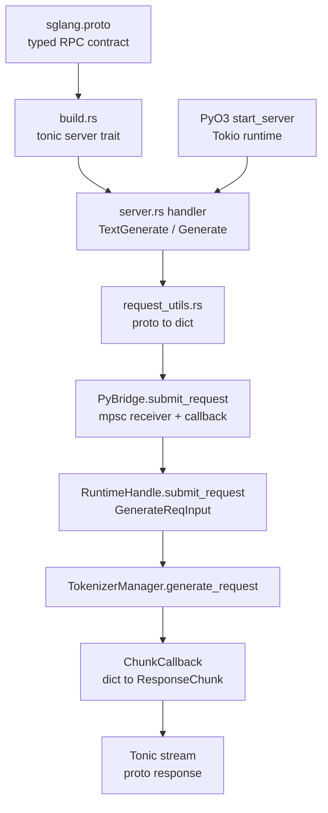

# gRPC/Proto · 源码走读

> 走读顺序：`sglang.proto` 定义契约 → `build.rs` 生成 Tonic server trait → PyO3 `start_server` 拉起 Rust Tonic → `server.rs` 把 proto RPC 转为 bridge 请求 → `request_utils.rs` 转 Python dict → `bridge.rs` 通过 callback/mpsc 跨 Rust/Python 边界 → `grpc_bridge.py` 投递到 TokenizerManager loop → legacy `grpc_server.py` 负责外部 servicer 与 HTTP sidecar。

---

## 1. Proto 契约

### 1.1 服务面被拆成 native、OpenAI pass-through 和 admin

**问题与约束：** gRPC 入口既要覆盖 SGLang native 的 typed RPC，又要支持 OpenAI 兼容 JSON pass-through，还要暴露 profiling、权重更新等运维接口。

**设计选择：** 在同一个 `SglangService` 里分组声明 native RPC、OpenAI-compatible RPC 和 Admin/Ops RPC；native generate/embed 使用 typed proto，OpenAI 路径用 JSON message 透传。

**Explain：** 这让 Rust Tonic server 可以用一套 service trait 管住所有 gRPC 方法，但每类方法在实现里走不同转换路径：typed RPC 走 request dict，OpenAI RPC 走 JSON bytes。

**Code：**

来源：sglang/proto/sglang/runtime/v1/sglang.proto L4-L35

```protobuf
service SglangService {
  rpc TextGenerate(TextGenerateRequest) returns (stream TextGenerateResponse);
  rpc Generate(GenerateRequest) returns (stream GenerateResponse);
  rpc TextEmbed(TextEmbedRequest) returns (TextEmbedResponse);
  rpc Embed(EmbedRequest) returns (EmbedResponse);
  rpc Classify(ClassifyRequest) returns (ClassifyResponse);
  rpc Tokenize(TokenizeRequest) returns (TokenizeResponse);
  rpc Detokenize(DetokenizeRequest) returns (DetokenizeResponse);
  rpc HealthCheck(HealthCheckRequest) returns (HealthCheckResponse);
  rpc GetModelInfo(GetModelInfoRequest) returns (GetModelInfoResponse);
  rpc GetServerInfo(GetServerInfoRequest) returns (GetServerInfoResponse);
  rpc ListModels(ListModelsRequest) returns (ListModelsResponse);
  rpc GetLoad(GetLoadRequest) returns (GetLoadResponse);
  rpc Abort(AbortRequest) returns (AbortResponse);
  rpc FlushCache(FlushCacheRequest) returns (FlushCacheResponse);
  rpc PauseGeneration(PauseGenerationRequest) returns (PauseGenerationResponse);
  rpc ContinueGeneration(ContinueGenerationRequest) returns (ContinueGenerationResponse);

  rpc ChatComplete(OpenAIRequest) returns (stream OpenAIStreamChunk);
  rpc Complete(OpenAIRequest) returns (stream OpenAIStreamChunk);
  rpc OpenAIEmbed(OpenAIRequest) returns (OpenAIResponse);
  rpc OpenAIClassify(OpenAIRequest) returns (OpenAIResponse);
  rpc Score(OpenAIRequest) returns (OpenAIResponse);
  rpc Rerank(OpenAIRequest) returns (OpenAIResponse);

  rpc StartProfile(StartProfileRequest) returns (StartProfileResponse);
  rpc StopProfile(StopProfileRequest) returns (StopProfileResponse);
  rpc UpdateWeightsFromDisk(UpdateWeightsRequest) returns (UpdateWeightsResponse);
}
```

**代码逻辑：** service 声明先列 native typed RPC，再列 OpenAI pass-through RPC，最后列 admin/ops RPC。

**为什么这样写：** typed native RPC 保留低开销字段结构；OpenAI 兼容接口变化快，用 JSON pass-through 降低 proto schema 追赶成本；admin RPC 独立分组便于运维调用和权限治理。

**不变量与失败模式：** proto 方法名和 Rust `impl SglangService` 方法必须同步；新增 RPC 如果只改 proto 不实现 Rust handler，生成的 trait 会导致编译失败。

**Comment：** 这份 proto 是 Rust、Python 和外部客户端之间的第一层稳定契约。

### 1.2 TextGenerate 与 Generate 的字段差异

**问题与约束：** 推理请求既可能以文本形式进入，也可能以 token ids 形式进入；两者要共享 sampling、trace、routing、LoRA 和 session 语义。

**设计选择：** `TextGenerateRequest` 用 `text`，`GenerateRequest` 用 `input_ids`；二者其余控制字段基本对齐，响应侧分别返回 `text` 或 `output_ids`。

**Explain：** Rust server 里两个 handler 都提交为 `req_type="generate"`，真正差异由 `build_text_generate_dict` 和 `build_generate_dict` 写入 Python dict 字段决定。

**Code：**

来源：sglang/proto/sglang/runtime/v1/sglang.proto L58-L101

```protobuf
message TextGenerateRequest {
  string text = 1;
  optional SamplingParams sampling_params = 2;
  optional bool stream = 3;
  optional bool return_logprob = 4;
  optional int32 top_logprobs_num = 5;
  optional int32 logprob_start_len = 6;
  optional bool return_text_in_logprobs = 7;
  optional string rid = 8;
  optional string lora_path = 9;
  optional string routing_key = 10;
  optional int32 routed_dp_rank = 11;
  map<string, string> trace_headers = 12;
  optional string session_id = 13;
}

message GenerateRequest {
  repeated int32 input_ids = 1;
  optional SamplingParams sampling_params = 2;
  optional bool stream = 3;
  optional bool return_logprob = 4;
  optional int32 top_logprobs_num = 5;
  optional int32 logprob_start_len = 6;
  optional string rid = 7;
  optional string lora_path = 8;
  optional string routing_key = 9;
  optional int32 routed_dp_rank = 10;
  map<string, string> trace_headers = 11;
  optional string session_id = 12;
}
```

**代码逻辑：** 两个请求都携带 sampling、stream、logprob、routing、trace 和 session；text path 额外有 `return_text_in_logprobs`，token path 输入输出都是 ids。

**为什么这样写：** 保持两条 generate path 的控制面一致，可以让 downstream `GenerateReqInput` 统一处理，避免为 tokenized path 复制一套 scheduler 逻辑。

**不变量与失败模式：** `rid` 可缺省但必须在 handler 侧补齐；`trace_headers` 要在 dict 转换中重命名为 Python 侧接受的 `external_trace_header`。

**Comment：** 读 proto 时不要把 TextGenerate/Generate 当成两个推理算法，它们是同一 generate 入口的两种输入/输出编码。

## 2. Rust 生成代码与 PyO3 启动

### 2.1 build.rs 只生成 server 侧代码

**问题与约束：** Rust crate 需要从 monorepo proto 生成 Tonic server trait，同时支持 proto3 optional 字段和反射 descriptor。

**设计选择：** `tonic_build` 设置 `build_server(true)`、`build_client(false)`，传 `--experimental_allow_proto3_optional`，并把 descriptor 写到 `OUT_DIR/sglang_descriptor.bin`。

**Explain：** 这个 crate 是嵌入 Python runtime 的 gRPC server，不承担 Rust client 角色，因此不生成 client stub。

**Code：**

来源：sglang/rust/sglang-grpc/build.rs L1-L16

```rust
fn main() -> Result<(), Box<dyn std::error::Error>> {
    let proto_path = "../../proto/sglang/runtime/v1/sglang.proto";

    tonic_build::configure()
        .build_server(true)
        .build_client(false)
        .protoc_arg("--experimental_allow_proto3_optional")
        .file_descriptor_set_path(
            std::path::PathBuf::from(std::env::var("OUT_DIR").unwrap())
                .join("sglang_descriptor.bin"),
        )
        .compile_protos(&[proto_path], &["../../proto"])?;

    println!("cargo:rerun-if-changed={}", proto_path);
    Ok(())
}
```

**代码逻辑：** build script 指向 proto 文件，配置 Tonic 生成 server 和 descriptor，并让 Cargo 在 proto 改变时重新构建。

**为什么这样写：** server trait 由 proto 驱动可避免手写 RPC glue；descriptor 为后续反射/工具链保留 schema 元数据。

**不变量与失败模式：** proto 相对路径依赖 crate 目录布局；移动 crate 或 proto 目录时，build script 会在编译期失败。

**Comment：** 这里生成的是 Rust 类型和 service trait，不直接启动任何 server。

### 2.2 lib.rs 暴露 proto 与模块边界

**问题与约束：** 生成的 proto 类型需要被 server、request utils 和 bridge 共享，同时 crate 还要通过 PyO3 暴露少量 Python 可见对象。

**设计选择：** crate 根导出 `bridge`、`server`、`tokenizers`，并在 `proto` 模块里用 `tonic::include_proto!("sglang.runtime.v1")` 引入生成代码。

**Explain：** `include_proto!` 的 package 名必须与 proto 的 `package sglang.runtime.v1` 对齐。

**Code：**

来源：sglang/rust/sglang-grpc/src/lib.rs L1-L8

```rust
pub mod bridge;
pub mod server;
pub mod tokenizers;
pub(crate) mod utils;

pub mod proto {
    tonic::include_proto!("sglang.runtime.v1");
}
```

**代码逻辑：** public 模块给外部 Rust/PyO3 glue 使用；utils 保持 crate 内部；proto 模块封装 Tonic 生成的 message 和 service server 类型。

**为什么这样写：** Rust server 实现需要强类型 proto，而 Python 侧只需要通过 PyO3 调 `start_server`，模块边界因此保持很窄。

**不变量与失败模式：** proto package 名变更时，这里的 `include_proto!` 也必须同步，否则编译找不到生成模块。

**Comment：** 这是 Rust gRPC crate 的静态结构入口。

### 2.3 start_server 建立独立 Tokio runtime

**问题与约束：** SGLang 主体运行在 Python/asyncio 生态，gRPC server 运行在 Rust/Tonic/Tokio；两者不能互相阻塞，也需要可由 Python 控制 shutdown。

**设计选择：** PyO3 `start_server` 解析地址并绑定 listener，提取 tokenizer 信息，创建 Rust tokenizer，构建独立 multi-thread Tokio runtime，再在名为 `sglang-grpc` 的 std thread 中 `block_on(run_grpc_server)`。

**Explain：** Python 持有返回的 `GrpcServerHandle`，其中 `shutdown` 用 `Notify` 通知 server 优雅退出，`join_handle` 用于等待 Rust 线程结束。

**Code：**

来源：sglang/rust/sglang-grpc/src/lib.rs L141-L257

```rust
#[pyfunction]
#[pyo3(signature = (host, port, runtime_handle, worker_threads=4, response_channel_capacity=64, response_timeout_secs=300))]
fn start_server(
    host: String,
    port: u16,
    runtime_handle: PyObject,
    worker_threads: usize,
    response_channel_capacity: usize,
    response_timeout_secs: u64,
) -> PyResult<GrpcServerHandle> {
    let addr: SocketAddr = format!("{}:{}", host, port).parse()?;
    let listener = TcpListener::bind(addr)?;
    listener.set_nonblocking(true)?;

    let tokenizer_info = extract_tokenizer_info(&runtime_handle)?;
    let rust_tokenizer = tokenizer_info.tokenizer_path.as_deref().and_then(|p| {
        RustTokenizer::from_tokenizer_path(p, tokenizer_info.tokenizer_mode.as_deref(), tokenizer_info.context_len)
    });

    let rt = tokio::runtime::Builder::new_multi_thread()
        .worker_threads(worker_threads)
        .enable_all()
        .thread_name("sglang-grpc-tokio")
        .build()?;
    let bridge = Arc::new(PyBridge::new(runtime_handle, rust_tokenizer, tokenizer_info.context_len, response_channel_capacity, rt.handle().clone()));

    let join_handle = std::thread::Builder::new()
        .name("sglang-grpc".to_string())
        .spawn(move || {
            if let Err(e) = rt.block_on(server::run_grpc_server(listener, bridge_clone, shutdown_clone, response_timeout)) {
                tracing::error!("gRPC server exited with error: {}", e);
            }
        })?;
    Ok(GrpcServerHandle { shutdown, join_handle: Some(join_handle) })
}
```

**代码逻辑：** 参数先被规整为合法 worker 数、channel 容量和 timeout；listener 在进入 Tokio 前绑定；bridge 保存 Python runtime handle 和可选 Rust tokenizer；后台线程独立运行 server。

**为什么这样写：** gRPC I/O 不应占用 Python asyncio loop；Rust tokenizer 可让 tokenize/detokenize 避开 GIL；Python handle 只在真正提交请求或 fallback 时短暂进入。

**不变量与失败模式：** `runtime_handle` 必须含 tokenizer manager 等属性；端口绑定失败或 Tokio runtime 创建失败会在 Python 调用 `start_server` 时同步报错。

**Comment：** 这是“Python 启动 Rust server”的跨语言边界。

## 3. Rust Bridge：请求提交与响应背压

### 3.1 ResponseChunk 统一承载 text、ids、embedding 与 JSON

**问题与约束：** gRPC RPC 有 streaming generate、unary embed/classify 和 OpenAI JSON pass-through，不同响应形态需要通过同一条 Rust/Python channel 回传。

**设计选择：** 定义 `ResponseChunk::{Data, Finished, Error}`，其中 `ResponseData` 用 optional 字段承载 text、output_ids、embedding、json_bytes 和 meta_info。

**Explain：** stream handler 可以逐个消费 `Data`，unary handler 期望 `Finished`，OpenAI pass-through 可以走 `json_bytes`。

**Code：**

来源：sglang/rust/sglang-grpc/src/bridge.rs L13-L33

```rust
#[derive(Debug, Clone)]
pub enum ResponseChunk {
    Data(ResponseData),
    Finished(ResponseData),
    Error(String),
}

#[derive(Debug, Clone)]
pub struct ResponseData {
    pub text: Option<String>,
    pub output_ids: Option<Vec<i32>>,
    pub embedding: Option<Vec<f32>>,
    pub json_bytes: Option<Vec<u8>>,
    pub meta_info: HashMap<String, String>,
}
```

**代码逻辑：** enum 区分流式中间块、终止块和错误；data struct 用 optional 字段支持多种 RPC 输出。

**为什么这样写：** Bridge 层不应该关心具体 RPC 类型，只需要把 Python callback 产生的 chunk 安全送回 Rust handler。

**不变量与失败模式：** handler 必须按 RPC 类型取正确字段；例如 `TextGenerateResponse` 取 `text`，`GenerateResponse` 取 `output_ids`。

**Comment：** 这是 gRPC streaming 与 Python generator 之间的最小公共响应格式。

### 3.2 PyBridge 状态和 channel 容量

**问题与约束：** 每个 gRPC 请求都需要独立响应 channel；同时要记录 pending send、ready callback 和 terminal error，才能处理背压、客户端断开和 abort。

**设计选择：** `PyBridge` 持有 Python `runtime_handle`、可选 Rust tokenizer、context_len、response channel 容量和 Tokio handle；共享 `BridgeState` 用 mutex 管理 per-rid channel 状态。

**Explain：** `ChunkSendStatus` 的 `Ready/Pending/Closed` 是 Python producer 理解 Rust channel 状态的协议。

**Code：**

来源：sglang/rust/sglang-grpc/src/bridge.rs L69-L113

```rust
#[pyclass(eq, eq_int)]
#[derive(Clone, Copy, Debug, PartialEq, Eq)]
pub enum ChunkSendStatus {
    Ready,
    Pending,
    Closed,
}

pub struct PyBridge {
    runtime_handle: PyObject,
    state: BridgeStateRef,
    rust_tokenizer: Option<RustTokenizer>,
    context_len: i32,
    response_channel_capacity: usize,
    tokio_handle: Handle,
}

impl PyBridge {
    pub fn new(runtime_handle: PyObject, rust_tokenizer: Option<RustTokenizer>, context_len: i32, response_channel_capacity: usize, tokio_handle: Handle) -> Self {
        Self {
            runtime_handle,
            state: Arc::new(Mutex::new(BridgeState::default())),
            rust_tokenizer,
            context_len,
            response_channel_capacity,
            tokio_handle,
        }
    }
}
```

**代码逻辑：** bridge 初始化时固定 response channel 容量，并保留 Tokio handle 用于异步 parked send 和 abort 辅助任务。

**为什么这样写：** Python callback 是同步 PyO3 调用，但 Rust channel 可能需要异步等待容量；保存 Tokio handle 才能把等待发送放回 Rust runtime。

**不变量与失败模式：** `response_channel_capacity` 必须大于 0；如果 Python 不尊重 `Pending`，第二个 parked chunk 会触发 channel full 关闭。

**Comment：** 这段是背压机制的状态基础。

### 3.3 submit_request 把 proto dict 交给 Python RuntimeHandle

**问题与约束：** Rust handler 已经把 proto message 转成 JSON-like map，但真正的推理入口在 Python `TokenizerManager`。

**设计选择：** `submit_request` 为 rid 创建 mpsc receiver，把 request dict 转成 PyDict，创建 `ChunkCallback`，再调用 Python `runtime_handle.submit_request(req_type, req_dict, chunk_callback)`。

**Explain：** Rust 持有 receiver，Python 只拿 callback；这样响应方向只能由 callback 写回，不需要 Python 直接操作 Rust stream。

**Code：**

来源：sglang/rust/sglang-grpc/src/bridge.rs L177-L207

```rust
pub fn submit_request(
    &self,
    rid: &str,
    req_type: &str,
    req_dict: HashMap<String, serde_json::Value>,
) -> PyResult<Receiver<ResponseChunk>> {
    let receiver = self.create_channel(rid)?;
    let rid_owned = rid.to_string();

    let result = Python::with_gil(|py| -> PyResult<()> {
        let py_req_dict = json_map_to_pydict(py, &req_dict)?;
        let callback = self.make_chunk_callback(py, rid_owned)?;

        let kwargs = PyDict::new(py);
        kwargs.set_item("req_type", req_type)?;
        kwargs.set_item("req_dict", py_req_dict)?;
        kwargs.set_item("chunk_callback", callback)?;

        self.runtime_handle.call_method(py, "submit_request", (), Some(&kwargs))?;
        Ok(())
    });

    match result {
        Ok(()) => Ok(receiver),
        Err(err) => {
            self.remove_channel(rid);
            Err(err)
        }
    }
}
```

**代码逻辑：** channel 先建好，再进入 GIL 调 Python；如果 Python submit 失败，立即移除 channel，避免状态泄漏。

**为什么这样写：** Rust handler 需要立即拿到 receiver 构造 response stream，而 Python 推理异步执行；callback 把两边解耦。

**不变量与失败模式：** `rid` 必须唯一；若重复 rid 创建 channel，旧请求可能被覆盖或创建失败，导致响应错路由。

**Comment：** 这是每个 native generate/embed/classify RPC 进入 Python runtime 的统一入口。

### 3.4 try_send_chunk 实现 bounded backpressure

**问题与约束：** Python producer 可能比 gRPC client 消费更快；如果 Rust 无限缓冲 response chunk，会放大内存占用并掩盖客户端断开。

**设计选择：** `try_send_chunk` 先 `sender.try_send`；成功返回 `Ready`，满时只允许登记一个 pending send 并在 Tokio task 中等待发送完成，返回 `Pending`；再次满或 channel closed 则关闭并 abort。

**Explain：** parked chunk 发送完成后，Rust 通过 on_ready callback 唤醒 Python 继续生产下一块；terminal chunk 发送后会清理 channel 状态。

**Code：**

来源：sglang/rust/sglang-grpc/src/bridge.rs L524-L607

```rust
fn try_send_chunk(
    py: Python<'_>,
    rid: &str,
    state: &BridgeStateRef,
    runtime_handle: &PyObject,
    tokio_handle: &Handle,
    sender: &Sender<ResponseChunk>,
    msg: ResponseChunk,
) -> PyResult<ChunkSendStatus> {
    let terminal = msg.is_terminal();
    match sender.try_send(msg) {
        Ok(()) => {
            if terminal {
                remove_channel_refs(rid, state);
            }
            Ok(ChunkSendStatus::Ready)
        }
        Err(TrySendError::Full(msg)) => {
            if !register_pending_send(rid, state) {
                close_channel_with_error(py, rid, state, runtime_handle, TerminalError::ChannelFull { rid: rid.into() });
                return Ok(ChunkSendStatus::Closed);
            }
            tokio_handle.spawn(async move {
                match sender.send(msg).await {
                    Ok(()) => {
                        if terminal {
                            remove_channel_refs(&rid_owned, &state);
                            return;
                        }
                        Python::with_gil(|py| {
                            if let Some(callback) = mark_send_ready(py, &rid_owned, &state) {
                                notify_ready(py, &rid_owned, callback);
                            }
                        });
                    }
                    Err(_) => { /* close as client disconnected */ }
                }
            });
            Ok(ChunkSendStatus::Pending)
        }
        Err(TrySendError::Closed(_)) => {
            close_channel_with_error(py, rid, state, runtime_handle, TerminalError::ClientDisconnected { rid: rid.into() });
            Ok(ChunkSendStatus::Closed)
        }
    }
}
```

**代码逻辑：** `Ready` 表示 Python 可以继续发；`Pending` 表示已有一个 chunk 在等待 channel 容量；`Closed` 表示 producer 应停止。

**为什么这样写：** 单个 parked chunk 是明确的内存上限；通过 on_ready 反向通知 Python，避免 busy wait 或无限队列。

**不变量与失败模式：** Python 必须在 stream 模式安装 on_ready 并尊重 `Pending`；否则第二个 pending 会被视为 producer 违约并关闭请求。

**Comment：** 这是 gRPC bridge 中最关键的稳定性保护。

### 3.5 ChunkCallback 把 Python dict 转成 ResponseChunk

**问题与约束：** Python TokenizerManager 产出的 chunk 是 dict；Rust handler 需要 typed `ResponseChunk` 才能生成 proto response。

**设计选择：** PyO3 `ChunkCallback.__call__` 从 dict 中提取 `text`、`output_ids`、`embedding` 和 `meta_info`；如果带 `error` 参数则发送 `ResponseChunk::Error`，否则按 `finished` 选择 `Data` 或 `Finished`。

**Explain：** callback 返回 `ChunkSendStatus` 给 Python，用于背压控制。

**Code：**

来源：sglang/rust/sglang-grpc/src/bridge.rs L630-L694

```rust
#[pyo3(signature = (chunk, finished=false, error=None))]
fn __call__(
    &self,
    chunk: &Bound<'_, PyDict>,
    finished: bool,
    error: Option<String>,
) -> PyResult<ChunkSendStatus> {
    let sender = match state.channels.get(&self.rid) {
        Some(s) => s.clone(),
        None => return Ok(ChunkSendStatus::Closed),
    };

    if let Some(err_msg) = error {
        return try_send_chunk(..., ResponseChunk::Error(err_msg));
    }

    let text: Option<String> = chunk.get_item("text")?.and_then(|v| v.extract::<String>().ok());
    let output_ids: Option<Vec<i32>> = chunk.get_item("output_ids")?.and_then(|v| v.extract::<Vec<i32>>().ok());
    let embedding: Option<Vec<f32>> = chunk.get_item("embedding")?.and_then(|v| v.extract::<Vec<f32>>().ok());
    let meta_info = extract_meta_info(chunk);

    let data = ResponseData { text, output_ids, embedding, json_bytes: None, meta_info };
    let msg = if finished { ResponseChunk::Finished(data) } else { ResponseChunk::Data(data) };
    try_send_chunk(..., msg)
}
```

**代码逻辑：** 先定位当前 rid 的 sender；错误路径直接发 Error；正常路径提取字段并委托 `try_send_chunk`。

**为什么这样写：** Python 不需要知道 Rust proto response 类型，只要按既有 TokenizerManager chunk dict 输出即可。

**不变量与失败模式：** chunk dict 的字段名必须和 bridge 提取逻辑一致；例如 tokenized generate 必须提供 `output_ids`，否则 Rust response 会给空 ids。

**Comment：** Python/Rust 的响应协议在这里落地。

## 4. Rust Tonic Handler

### 4.1 TextGenerate handler：text stream 与 abort guard

**问题与约束：** 流式 gRPC handler 需要把 Python generator chunk 转成 `TextGenerateResponse`，同时在客户端断开或超时时通知 Python abort。

**设计选择：** handler 生成 rid，构造 text request dict，提交到 bridge，随后用 `async_stream` 循环接收 `ResponseChunk`；`RequestAbortGuard` 默认 armed，正常 Finished 时 disarm，异常/断开时 abort。

**Explain：** `finished` proto 字段由 `ResponseChunk::Finished` 决定，而不是直接透传 Python chunk 的 finish_reason。

**Code：**

来源：sglang/rust/sglang-grpc/src/server.rs L222-L287

```rust
async fn text_generate(
    &self,
    request: Request<proto::TextGenerateRequest>,
) -> Result<Response<Self::TextGenerateStream>, Status> {
    let req = request.into_inner();
    let rid = req.rid.clone().unwrap_or_else(|| uuid::Uuid::new_v4().to_string());
    let req_dict = build_text_generate_dict(&rid, &req);

    let mut receiver = self
        .bridge
        .submit_request(&rid, "generate", req_dict)
        .map_err(|e| pyerr_to_status(e, "Failed to submit request"))?;

    let stream = async_stream::stream! {
        let mut abort_guard = RequestAbortGuard::new(bridge.clone(), rid_clone.clone());
        loop {
            match recv_chunk_with_timeout(&mut receiver, response_timeout, || "Stream chunk timed out".to_string()).await {
                Ok(Some(ResponseChunk::Data(data))) => {
                    yield Ok(proto::TextGenerateResponse { text: data.text.unwrap_or_default(), meta_info: data.meta_info, finished: false });
                }
                Ok(Some(ResponseChunk::Finished(data))) => {
                    abort_guard.disarm();
                    yield Ok(proto::TextGenerateResponse { text: data.text.unwrap_or_default(), meta_info: data.meta_info, finished: true });
                    break;
                }
                ...
            }
        }
    };
    Ok(Response::new(Box::pin(stream)))
}
```

**代码逻辑：** request 转 dict 后只提交一次；stream 循环按 chunk 类型 yield proto response、yield error 或终止。

**为什么这样写：** Rust handler 可以保持纯异步流式接口，Python 侧只负责产出 chunk；abort guard 把 gRPC 客户端生命周期反馈给 Python runtime。

**不变量与失败模式：** 如果 Python generator 关闭但没有发送 terminal chunk，Rust 会把 stream closed 视为异常并触发 abort。

**Comment：** TextGenerate 是最完整的流式路径样板。

### 4.2 Generate handler：token ids stream

**问题与约束：** tokenized generate 需要与 text generate 共享推理逻辑，但响应字段是 `output_ids` 而不是 `text`。

**设计选择：** handler 同样提交 `req_type="generate"`，但 request dict 由 `build_generate_dict` 生成；接收 chunk 时取 `data.output_ids` 构造 `GenerateResponse`。

**Explain：** 这证明 proto 层的 TextGenerate/Generate 分歧在 handler 边界就被重新合流到 Python `GenerateReqInput`。

**Code：**

来源：sglang/rust/sglang-grpc/src/server.rs L291-L355

```rust
async fn generate(
    &self,
    request: Request<proto::GenerateRequest>,
) -> Result<Response<Self::GenerateStream>, Status> {
    let req = request.into_inner();
    let rid = req.rid.clone().unwrap_or_else(|| uuid::Uuid::new_v4().to_string());
    let req_dict = build_generate_dict(&rid, &req);

    let mut receiver = self
        .bridge
        .submit_request(&rid, "generate", req_dict)
        .map_err(|e| pyerr_to_status(e, "Failed to submit request"))?;

    let stream = async_stream::stream! {
        let mut abort_guard = RequestAbortGuard::new(bridge.clone(), rid_clone.clone());
        loop {
            match recv_chunk_with_timeout(&mut receiver, response_timeout, || "Stream chunk timed out".to_string()).await {
                Ok(Some(ResponseChunk::Data(data))) => {
                    yield Ok(proto::GenerateResponse { output_ids: data.output_ids.unwrap_or_default(), meta_info: data.meta_info, finished: false });
                }
                Ok(Some(ResponseChunk::Finished(data))) => {
                    abort_guard.disarm();
                    yield Ok(proto::GenerateResponse { output_ids: data.output_ids.unwrap_or_default(), meta_info: data.meta_info, finished: true });
                    break;
                }
                ...
            }
        }
    };
    Ok(Response::new(Box::pin(stream)))
}
```

**代码逻辑：** 除字段映射外，与 text handler 的控制流一致：submit、recv、yield、abort guard。

**为什么这样写：** 复用 `req_type="generate"` 可以让 Python RuntimeHandle 只维护一个 `_run_generate`，降低两条输入路径的行为漂移。

**不变量与失败模式：** Python chunk 必须提供 token ids；如果 upstream 生成的是 text-only chunk，tokenized response 会变成空 `output_ids`。

**Comment：** 这段说明 tokenized generate 是接口形态差异，不是调度路径差异。

### 4.3 RequestAbortGuard 与 timeout

**问题与约束：** gRPC client 可能取消 stream、停止消费或遇到超时；如果 Python 侧继续推理，会浪费 GPU 和 scheduler 资源。

**设计选择：** `RequestAbortGuard` 在 Drop 时调用 `spawn_abort`，而正常 terminal response 调 `disarm`；接收 chunk 用 `recv_chunk_with_timeout` 包装 `receiver.recv()`。

**Explain：** abort 通过 `spawn_blocking` 调 bridge.abort，避免在 Tokio worker 上同步持 GIL 或阻塞 Python。

**Code：**

来源：sglang/rust/sglang-grpc/src/server.rs L78-L139

```rust
async fn recv_chunk_with_timeout(
    receiver: &mut Receiver<ResponseChunk>,
    response_timeout: Duration,
    timeout_message: impl FnOnce() -> String,
) -> Result<Option<ResponseChunk>, Status> {
    timeout(response_timeout, receiver.recv())
        .await
        .map_err(|_| Status::deadline_exceeded(timeout_message()))
}

struct RequestAbortGuard {
    bridge: Arc<PyBridge>,
    rid: String,
    armed: bool,
}

impl RequestAbortGuard {
    fn disarm(&mut self) {
        self.armed = false;
    }

    fn abort_now(&mut self) {
        if self.armed {
            self.armed = false;
            spawn_abort(self.bridge.clone(), self.rid.clone());
        }
    }
}

impl Drop for RequestAbortGuard {
    fn drop(&mut self) {
        if self.armed {
            spawn_abort(self.bridge.clone(), self.rid.clone());
        }
    }
}
```

**代码逻辑：** 超时转成 gRPC deadline exceeded；guard 的 armed 状态决定 drop 时是否向 Python 发 abort。

**为什么这样写：** Rust stream 生命周期能准确感知 client 行为；把它反向传播给 Python 可以减少悬挂请求。

**不变量与失败模式：** 正常 `Finished` 必须 disarm，否则 handler 结束也会误 abort 已完成请求。

**Comment：** 这段是请求生命周期治理，不是普通错误处理。

### 4.4 Tokenize 优先 Rust tokenizer，回退 Python

**问题与约束：** Tokenize/Detokenize 是高频轻量 RPC，不应该总是进 Python/GIL；但并非所有 tokenizer backend 都能被 Rust 原生加载。

**设计选择：** 如果 `PyBridge` 内有 Rust tokenizer，就直接 encode/decode；否则用 `tokio::task::spawn_blocking` 调 Python fallback。

**Explain：** `start_server` 提前从 Python runtime 提取 tokenizer path/mode/context_len，正是为了这里能走 Rust native fast path。

**Code：**

来源：sglang/rust/sglang-grpc/src/server.rs L474-L519

```rust
async fn tokenize(
    &self,
    request: Request<proto::TokenizeRequest>,
) -> Result<Response<proto::TokenizeResponse>, Status> {
    let req = request.into_inner();
    let add_special = req.add_special_tokens.unwrap_or(true);

    if let Some(tok) = self.bridge.rust_tokenizer() {
        let tokens = tok.encode(&req.text, add_special).map_err(Status::internal)?;
        let count = tokens.len() as i32;
        return Ok(Response::new(proto::TokenizeResponse {
            tokens: tokens.iter().map(|&t| t as i32).collect(),
            count,
            max_model_len: self.bridge.context_len(),
            input_text: req.text,
        }));
    }

    let json_str = tokio::task::spawn_blocking({
        let bridge = self.bridge.clone();
        let text = req.text.clone();
        move || bridge.tokenize_py(&text, add_special)
    })
    .await?
    .map_err(|e| pyerr_to_status(e, "Tokenize failed"))?;
    ...
}
```

**代码逻辑：** Rust tokenizer 可用时同步返回 proto response；不可用时把 Python tokenize 放到 blocking task，再解析 JSON 返回。

**为什么这样写：** 兼顾性能和兼容性：能 native 就无 GIL，不能 native 仍保持功能正确。

**不变量与失败模式：** Rust tokenizer 的 token id 是 `u32`，proto 返回 `int32`，需要保证 token id 不越界；Python fallback 返回值必须是可解析 JSON。

**Comment：** generate 路径必须走 Python scheduler，tokenize path 则可以尽量 Rust 本地化。

### 4.5 run_grpc_server 设置消息大小和优雅关闭

**问题与约束：** gRPC 请求可能包含多模态或 OpenAI JSON body，Tonic 默认 4 MiB 消息大小太小；server 还要支持 Python handle 发出的 shutdown。

**设计选择：** `resolve_max_message_size` 默认 64 MiB，也允许 `SGLANG_TONIC_PAYLOAD` 环境变量覆盖；Tonic server 用 `serve_with_incoming_shutdown` 等待 `Notify`。

**Explain：** 注释中明确当前 listener 未做 auth parity，因此暴露默认部署路径前需要补齐 HTTP 侧类似的 API-key/admin-key 检查。

**Code：**

来源：sglang/rust/sglang-grpc/src/server.rs L978-L1006

```rust
pub async fn run_grpc_server(
    listener: std::net::TcpListener,
    bridge: Arc<PyBridge>,
    shutdown: Arc<Notify>,
    response_timeout: Duration,
) -> Result<(), Box<dyn std::error::Error + Send + Sync>> {
    let addr = listener.local_addr()?;
    let listener = tokio::net::TcpListener::from_std(listener)?;
    let service = SglangServiceImpl { bridge, response_timeout };

    let max_message_size = resolve_max_message_size();
    let svc = proto::sglang_service_server::SglangServiceServer::new(service)
        .max_decoding_message_size(max_message_size)
        .max_encoding_message_size(max_message_size);

    tonic::transport::Server::builder()
        .add_service(svc)
        .serve_with_incoming_shutdown(TcpListenerStream::new(listener), async move {
            shutdown.notified().await;
            tracing::info!("gRPC server shutting down");
        })
        .await?;
    Ok(())
}
```

**代码逻辑：** std listener 转 Tokio listener；service 包入 generated server；设置 encode/decode cap；收到 shutdown notify 后优雅退出。

**为什么这样写：** 消息大小限制属于 transport 层；shutdown 信号来自 PyO3 handle，必须穿透到 Tonic server loop。

**不变量与失败模式：** 环境变量必须是正整数才生效；listener 当前不做认证，不能把它误当成与 HTTP 入口完全等价的安全边界。

**Comment：** 这是 Rust server 的最终运行壳。

## 5. Proto 到 Python dict 的字段映射

### 5.1 TextGenerateRequest 转 GenerateReqInput dict

**问题与约束：** Python `GenerateReqInput` 是既有 HTTP/内部调度结构，gRPC typed proto 字段必须转换成它认识的键。

**设计选择：** `build_text_generate_dict` 显式写入 `rid`、`text`、sampling params、stream/logprob 参数、LoRA、routing、session、trace header 和 `received_time`。

**Explain：** `trace_headers` 在 proto 中是 map，在 dict 中变成 `external_trace_header`，与 TokenizerManager 的追踪注入字段一致。

**Code：**

来源：sglang/rust/sglang-grpc/src/utils/request_utils.rs L90-L138

```rust
pub(crate) fn build_text_generate_dict(
    rid: &str,
    req: &proto::TextGenerateRequest,
) -> HashMap<String, serde_json::Value> {
    let mut d = HashMap::new();
    d.insert("rid".into(), serde_json::json!(rid));
    d.insert("text".into(), serde_json::json!(req.text));
    d.insert("sampling_params".into(), sampling_params_to_map(&req.sampling_params));
    d.insert("stream".into(), serde_json::json!(req.stream.unwrap_or(false)));
    d.insert("return_logprob".into(), serde_json::json!(req.return_logprob.unwrap_or(false)));
    d.insert("top_logprobs_num".into(), serde_json::json!(req.top_logprobs_num.unwrap_or(0)));
    d.insert("logprob_start_len".into(), serde_json::json!(req.logprob_start_len.unwrap_or(-1)));
    d.insert("return_text_in_logprobs".into(), serde_json::json!(req.return_text_in_logprobs.unwrap_or(false)));
    if let Some(ref lp) = req.lora_path {
        d.insert("lora_path".into(), serde_json::json!(lp));
    }
    if let Some(trace) = trace_headers_to_json(&req.trace_headers) {
        d.insert("external_trace_header".into(), trace);
    }
    d.insert("received_time".into(), serde_json::json!(now_timestamp()));
    d
}
```

**代码逻辑：** optional 字段有默认值时写默认值；真正可选的 LoRA/routing/session 只在存在时写入；最后补 `received_time`。

**为什么这样写：** Python 侧模型输入校验依赖 dict key；在 Rust 层一次性做默认值落地，可以减少 Python RuntimeHandle 的兼容分支。

**不变量与失败模式：** 默认值要与 HTTP/GenerateReqInput 语义一致；例如 `stream` 默认 false，`logprob_start_len` 默认 -1。

**Comment：** 这段是 gRPC typed request 融入现有 Python 数据结构的关键。

### 5.2 GenerateRequest 转 tokenized dict

**问题与约束：** tokenized generate 不携带 text，但需要保留 sampling/logprob/routing/session 等控制字段。

**设计选择：** `build_generate_dict` 与 text 版本基本同构，只把主输入键换成 `input_ids`，并且没有 `return_text_in_logprobs`。

**Explain：** 同构 dict 让 Python `GenerateReqInput` 可以同时接受 text 和 token ids 输入。

**Code：**

来源：sglang/rust/sglang-grpc/src/utils/request_utils.rs L141-L186

```rust
pub(crate) fn build_generate_dict(
    rid: &str,
    req: &proto::GenerateRequest,
) -> HashMap<String, serde_json::Value> {
    let mut d = HashMap::new();
    d.insert("rid".into(), serde_json::json!(rid));
    d.insert("input_ids".into(), serde_json::json!(req.input_ids));
    d.insert("sampling_params".into(), sampling_params_to_map(&req.sampling_params));
    d.insert("stream".into(), serde_json::json!(req.stream.unwrap_or(false)));
    d.insert("return_logprob".into(), serde_json::json!(req.return_logprob.unwrap_or(false)));
    d.insert("top_logprobs_num".into(), serde_json::json!(req.top_logprobs_num.unwrap_or(0)));
    d.insert("logprob_start_len".into(), serde_json::json!(req.logprob_start_len.unwrap_or(-1)));
    if let Some(ref lp) = req.lora_path {
        d.insert("lora_path".into(), serde_json::json!(lp));
    }
    if let Some(ref session_id) = req.session_id {
        d.insert("session_id".into(), serde_json::json!(session_id));
    }
    if let Some(trace) = trace_headers_to_json(&req.trace_headers) {
        d.insert("external_trace_header".into(), trace);
    }
    d.insert("received_time".into(), serde_json::json!(now_timestamp()));
    d
}
```

**代码逻辑：** 主输入变成 `input_ids`，其余控制字段按相同规则落地。

**为什么这样写：** tokenized path 应绕过 text tokenization，但不应绕过 sampling、routing、trace、LoRA 和 session 管理。

**不变量与失败模式：** `input_ids` 必须是非负 token id 序列；proto 使用 `int32`，Python 侧仍需按模型 tokenizer 语义校验。

**Comment：** 这段解释了为什么 Generate handler 可以复用 Python `_run_generate`。

## 6. Python RuntimeHandle

### 6.1 submit_request 分发到 GenerateReqInput / EmbeddingReqInput

**问题与约束：** Rust 通过 PyO3 调用的是同步 Python 方法，但实际推理要在 TokenizerManager 的 asyncio loop 上运行。

**设计选择：** `RuntimeHandle.submit_request` 根据 `req_type` 创建 `GenerateReqInput` 或 `EmbeddingReqInput`，再用 `_submit_on_tm_loop` 把 coroutine 投递到 TM loop。

**Explain：** `_GrpcRequest` 是 FastAPI Request shim，用于需要 `is_disconnected` 的路径；普通 native generate 可不传。

**Code：**

来源：sglang/python/sglang/srt/entrypoints/grpc_bridge.py L262-L291

```python
def submit_request(
    self,
    *,
    req_type: str,
    req_dict: dict,
    chunk_callback,
    is_disconnected_fn: Optional[Callable[[], bool]] = None,
):
    mock_request = (
        _GrpcRequest(is_disconnected_fn=is_disconnected_fn)
        if is_disconnected_fn is not None
        else None
    )
    if req_type == "generate":
        from sglang.srt.managers.io_struct import GenerateReqInput

        obj = GenerateReqInput(**req_dict)
        stream = req_dict.get("stream", False)
        self._submit_on_tm_loop(
            self._run_generate(obj, chunk_callback, stream, mock_request)
        )
    elif req_type == "embed":
        from sglang.srt.managers.io_struct import EmbeddingReqInput

        obj = EmbeddingReqInput(**req_dict)
        self._submit_on_tm_loop(self._run_embed(obj, chunk_callback, mock_request))
    else:
        raise ValueError(...)
```

**代码逻辑：** Python 对 dict 做 Pydantic/msgspec 输入结构构造；根据 `stream` 决定 `_run_generate` 的发送方式。

**为什么这样写：** Rust 线程只负责提交，不等待 GPU 推理；真正异步生命周期交给 TokenizerManager loop。

**不变量与失败模式：** `req_dict` 必须满足 `GenerateReqInput` 或 `EmbeddingReqInput` 构造约束；未知 `req_type` 直接报错，Rust 会转成 gRPC status。

**Comment：** 这是 Rust request dict 进入 Python 输入模型的地方。

### 6.2 _run_generate 与 Python 侧背压等待

**问题与约束：** Streaming generate 会不断产生 chunk；Rust callback 可能返回 `Pending` 或 `Closed`，Python 必须停住或终止，而不是继续向 Rust 塞数据。

**设计选择：** stream 模式安装 on_ready event；每个 chunk 调 `_send_with_backpressure`，当 `finish_reason` 出现或 callback 不再 keep going 时返回；非 stream 模式只取 `gen.__anext__()` 并标记 finished。

**Explain：** `_send_with_backpressure` 等待时间超出 300 秒会 abort 对应 rid，防止 backpressure 永久卡住。

**Code：**

来源：sglang/python/sglang/srt/entrypoints/grpc_bridge.py L115-L184

```python
async def _send_with_backpressure(
    self,
    chunk_callback,
    ready_event: Optional[asyncio.Event],
    payload,
    *,
    timeout_abort_rid=None,
    **kwargs,
) -> bool:
    status = self._safe_callback(chunk_callback, payload, **kwargs)
    if status is None or self._is_closed_status(status):
        return False
    if not self._is_pending_status(status):
        return True

    if kwargs.get("finished"):
        return True
    if ready_event is None:
        return True

    try:
        await asyncio.wait_for(ready_event.wait(), timeout=self._BACKPRESSURE_TIMEOUT_S)
    except asyncio.TimeoutError:
        if timeout_abort_rid is not None:
            self._abort_request_id(timeout_abort_rid)
        return False
    ready_event.clear()
    return True

def _submit_on_tm_loop(self, coro: Awaitable) -> None:
    future = asyncio.run_coroutine_threadsafe(coro, self._tm_loop)
    future.add_done_callback(self._log_unhandled_future_exception)
```

**代码逻辑：** callback 返回 Ready 则继续；返回 Pending 则等待 on_ready；返回 Closed 或异常则停止。

**为什么这样写：** 背压必须在 producer 侧生效；只在 Rust channel 上限流不够，Python generator 也要暂停消费。

**不变量与失败模式：** stream 模式必须安装 on_ready；否则 Pending 后无法知道何时继续，只能退化为不等待。

**Comment：** Python 和 Rust 背压机制是成对出现的：Rust 返回状态，Python 尊重状态。

### 6.3 _run_generate 消费 TokenizerManager generator

**问题与约束：** TokenizerManager 的 generate_request 是 async generator；gRPC streaming 要把每个 chunk 变成 callback 调用，并在异常时传回 native error。

**设计选择：** `_run_generate` stream 分支 async for generator，使用 `meta_info.finish_reason` 判断 terminal；非 stream 分支取第一条结果作为 finished；异常通过 `_send_native_error` 写回 callback。

**Explain：** 如果 generator 退出但没有 finish chunk，代码会防御性发送空 finished chunk。

**Code：**

来源：sglang/python/sglang/srt/entrypoints/grpc_bridge.py L293-L324

```python
async def _run_generate(self, obj, chunk_callback, stream: bool, request):
    ready_event = None
    try:
        ready_event = self._install_on_ready(chunk_callback) if stream else None
        gen = self.tokenizer_manager.generate_request(obj, request=request)
        if stream:
            async for chunk in gen:
                finished = (
                    chunk.get("meta_info", {}).get("finish_reason") is not None
                )
                keep_going = await self._send_with_backpressure(
                    chunk_callback,
                    ready_event,
                    chunk,
                    finished=finished,
                    timeout_abort_rid=obj.rid,
                )
                if finished or not keep_going:
                    return
            self._safe_callback(chunk_callback, {}, finished=True)
        else:
            result = await gen.__anext__()
            self._safe_callback(chunk_callback, result, finished=True)
    except StopAsyncIteration:
        self._safe_callback(chunk_callback, {}, finished=True)
    except Exception as e:
        logger.error("gRPC generate error for rid=%s: %s", obj.rid, e)
        self._send_native_error(chunk_callback, str(e))
    finally:
        if stream:
            self._uninstall_on_ready(chunk_callback)
```

**代码逻辑：** stream path 对每个 chunk 调 callback；finish_reason 或 backpressure stop 都结束 coroutine；finally 清理 on_ready。

**为什么这样写：** TokenizerManager 原有 generator 语义不需要为 gRPC 改造；bridge 只在边界上转换 finished/error/backpressure。

**不变量与失败模式：** finish 判断依赖 `meta_info.finish_reason`；如果上游 chunk schema 改变，Rust stream 可能等不到 terminal chunk。

**Comment：** 这是 Python 侧把内部异步生成器接到 Rust gRPC stream 的核心。

## 7. Legacy gRPC Server Wrapper 与 Sidecar

### 7.1 serve_grpc 委托 smg-grpc-servicer 并挂 HTTP sidecar

**问题与约束：** 旧 gRPC 入口依赖外部 `smg-grpc-servicer` 包，同时还希望沿用 HTTP 模式的 metrics/profile 运维端点。

**设计选择：** `serve_grpc` 动态导入外部 `_serve_grpc`，构造 aiohttp sidecar app；当 servicer 支持 `on_request_manager_ready` hook 时，注册回调添加 admin routes 并启动 sidecar。

**Explain：** 如果启用 metrics 但外部 servicer 版本太旧不支持 hook，就 fail loud；未启用 metrics 时只 warning 并禁用 sidecar。

**Code：**

来源：sglang/python/sglang/srt/entrypoints/grpc_server.py L156-L263

```python
async def serve_grpc(server_args, model_info=None):
    try:
        from smg_grpc_servicer.sglang.server import serve_grpc as _serve_grpc
    except ImportError as e:
        raise ImportError("gRPC mode requires the smg-grpc-servicer package. ...") from e

    sidecar_app = web.Application()
    sidecar_runner = None
    sidecar_port = (
        server_args.grpc_http_sidecar_port
        if server_args.grpc_http_sidecar_port is not None
        else server_args.port + 1
    )

    if server_args.enable_metrics:
        try:
            set_prometheus_multiproc_dir()
            enable_func_timer()
            _add_metrics_routes(sidecar_app)
        except Exception as e:
            logger.error("Failed to set up metrics: %s. Continuing without metrics.", e, exc_info=True)

    async def _on_request_manager_ready(request_manager, srv_args, sched_info):
        nonlocal sidecar_runner
        _add_admin_routes(sidecar_app, request_manager)
        sidecar_runner = await _start_sidecar_server(server_args.host, sidecar_port, sidecar_app)

    sidecar_supported = "on_request_manager_ready" in inspect.signature(_serve_grpc).parameters
    if sidecar_supported:
        serve_kwargs["on_request_manager_ready"] = _on_request_manager_ready
    elif server_args.enable_metrics:
        raise RuntimeError("--enable-metrics requires smg-grpc-servicer >= 0.5.3 ...")
    ...
    await _serve_grpc(server_args, model_info, **serve_kwargs)
```

**代码逻辑：** wrapper 先处理包导入和 sidecar 配置，再根据外部 servicer 签名决定是否传 hook，最后委托 `_serve_grpc`。

**为什么这样写：** 外部 servicer 版本存在兼容窗口；用签名探测比硬编码版本更直接，也能对 metrics 需求给出明确失败。

**不变量与失败模式：** sidecar 端口默认 `port+1`，可能与已有服务冲突；外部包缺失或版本过旧会在启动时暴露。

**Comment：** 这条 legacy 路径和 Rust PyO3 server 是两种入口形态，但都服务 gRPC 模式运维需求。

### 7.2 Profile 路由复用 HTTP 语义

**问题与约束：** gRPC 主端口不直接暴露 HTTP `/start_profile`，但运维仍需要与 HTTP 模式一致的 profiling 控制。

**设计选择：** sidecar 的 `/start_profile` handler 构造 `ProfileReq`，读取 body/env 控制 profiling 参数，并通过 `request_manager.send_communicator_req` 发给 `profile_communicator`。

**Explain：** `_check_communicator_results` 把 scheduler 返回失败转成 HTTP 500，让 sidecar 调用者看到明确错误。

**Code：**

来源：sglang/python/sglang/srt/entrypoints/grpc_server.py L107-L127

```python
req = ProfileReq(
    req_type=ProfileReqType.START_PROFILE,
    output_dir=body.get("output_dir"),
    start_step=body.get("start_step"),
    num_steps=body.get("num_steps"),
    activities=body.get("activities"),
    with_stack=with_stack,
    record_shapes=record_shapes,
    profile_by_stage=body.get("profile_by_stage", False),
    profile_id=str(time.time()),
    merge_profiles=body.get("merge_profiles", False),
    profile_prefix=body.get("profile_prefix"),
    profile_stages=body.get("profile_stages"),
)
results = await request_manager.send_communicator_req(
    req, "profile_communicator", timeout=600.0
)
err = _check_communicator_results(results, "Start Profile")
if err:
    return err
return web.Response(text="Start profiling.\n")
```

**代码逻辑：** HTTP body/env 被转成 `ProfileReq`；请求进入 scheduler communicator；失败检查通过后返回文本响应。

**为什么这样写：** profiling 是运维控制面，不需要通过 gRPC typed proto 主链路；sidecar 可以复用 HTTP 生态和现有 communicator。

**不变量与失败模式：** request_manager 必须已经 ready，否则 sidecar 不应启动；communicator timeout 设置为 600 秒，长时间无响应会转成错误。

**Comment：** gRPC 服务和 HTTP sidecar 是互补关系：主流量走 gRPC，运维兼容端点留在 sidecar。

---

## 8. 调用关系小结



| 阶段 | 关键文件 | 主要责任 |
|------|----------|----------|
| 契约 | `sglang.proto` | 定义 RPC 与 message |
| 生成 | `build.rs` / `lib.rs` | 生成并包含 Tonic proto 类型 |
| 启动 | `lib.rs` | 从 Python 启动 Rust Tokio server |
| handler | `server.rs` | proto request 转 stream/unary response |
| 字段映射 | `request_utils.rs` | proto message 转 Python `GenerateReqInput` dict |
| 跨语言 bridge | `bridge.rs` | mpsc channel、callback、背压、abort |
| Python runtime | `grpc_bridge.py` | 投递到 TokenizerManager loop |
| legacy/sidecar | `grpc_server.py` | 外部 servicer 与 HTTP 运维端点 |

核心不变量是：`rid` 贯穿 proto、dict、channel 和 abort；TextGenerate/Generate 在 Rust handler 处合流到 `req_type="generate"`；stream 必须以 terminal chunk 正常结束，否则 Rust 会将关闭或超时反馈为 abort。
