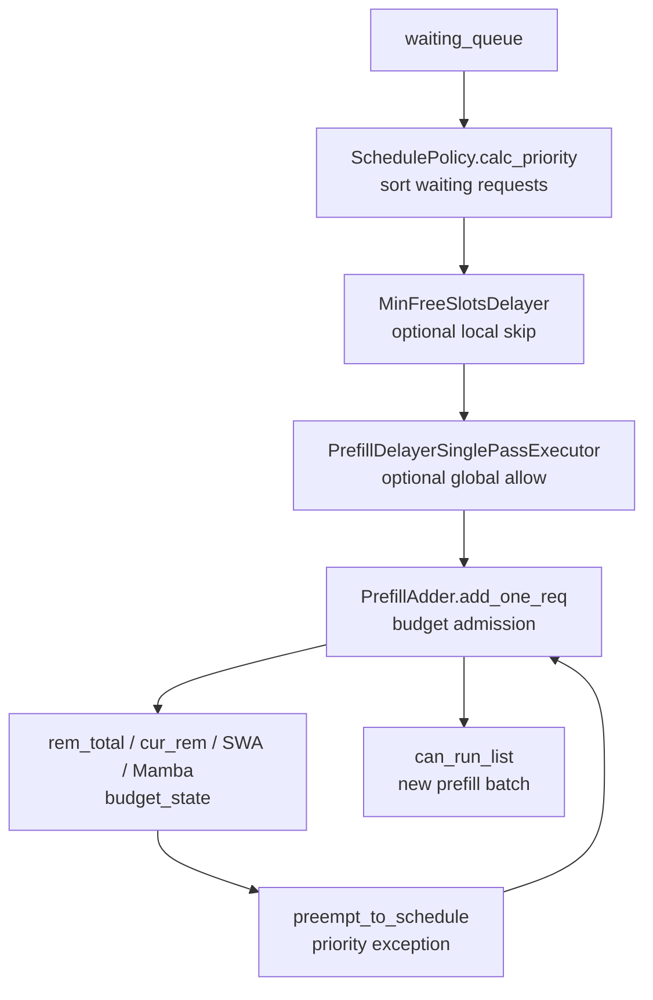

# 调度策略 · 源码走读

> 走读顺序：`SchedulePolicy` 先给 `waiting_queue` 排序，`PrefillAdder` 再按 token/page/cache 预算逐个准入，`PrefillDelayer` 负责跨 DP rank 延迟 prefill，`MinFreeSlotsDelayer` 负责本地 slot 粒度的延迟。

---

## 1. SchedulePolicy：等待队列排序

### 1.1 策略枚举与初始化状态

**问题与约束：** 调度策略既有 cache-aware 策略，也有不依赖 prefix cache 的策略；同一套对象还要支持请求 priority 和批内 prefix 检测。

**设计选择：** 用 `CacheAwarePolicy` 与 `CacheAgnosticPolicy` 分开表达策略族，`SchedulePolicy.__init__` 校验并调整策略，保存 priority 方向，并创建一个模拟 radix tree 用于 waiting queue 内部前缀匹配。

**Explain：** `waiting_queue_radix_tree` 不是真实 KV cache，只是用 request token key 发现同一批 waiting 请求之间的共享前缀。

**Code：**

来源：sglang/python/sglang/srt/managers/schedule_policy.py L140-L174

```python
class CacheAwarePolicy(Enum):
    LPM = "lpm"
    DFS_WEIGHT = "dfs-weight"

class CacheAgnosticPolicy(Enum):
    FCFS = "fcfs"
    LOF = "lof"
    RANDOM = "random"
    ROUTING_KEY = "routing-key"

class SchedulePolicy:
    def __init__(self, policy, tree_cache, enable_hierarchical_cache, enable_priority_scheduling, schedule_low_priority_values_first):
        self.policy = self._validate_and_adjust_policy(policy, tree_cache)
        self.tree_cache = tree_cache
        self.enable_hierarchical_cache = enable_hierarchical_cache
        self.enable_priority_scheduling = enable_priority_scheduling
        self.schedule_low_priority_values_first = schedule_low_priority_values_first
        self.priority_sign = 1 if schedule_low_priority_values_first else -1
        self.waiting_queue_radix_tree = RadixCache.create_simulated()
```

**代码逻辑：** 构造函数只保存调度元信息，不直接排序；priority 的升降序通过 `priority_sign` 统一转成 sort key。

**为什么这样写：** 调度排序每轮都要跑，但策略校验和模拟树初始化只需在 policy 对象构造时完成。

**不变量与失败模式：** `policy` 字符串必须落在两个 enum 之一；`schedule_low_priority_values_first` 改变 priority 数值语义，配置错误会整体反转优先级。

**Comment：** 这里把“策略选择”和“预算准入”分开，后者由 `PrefillAdder` 处理。

### 1.2 tree cache 禁用时降级

**问题与约束：** LPM/DFS_WEIGHT 依赖 radix tree 的 prefix match；如果 tree cache 被禁用，继续使用 cache-aware 策略没有语义基础。

**设计选择：** `_validate_and_adjust_policy` 先尝试解析为 `CacheAwarePolicy`，若 `tree_cache.disable` 为真，直接返回 FCFS；否则保留 cache-aware 策略。

**Explain：** 这是启动期的静态降级，与 `calc_priority` 中队列过长时 LPM 临时降级不同。

**Code：**

来源：sglang/python/sglang/srt/managers/schedule_policy.py L235-L251

```python
def _validate_and_adjust_policy(self, policy: str, tree_cache: BasePrefixCache) -> Policy:
    try:
        policy_enum = CacheAwarePolicy(policy)
        if getattr(tree_cache, "disable", True):
            return CacheAgnosticPolicy.FCFS
        return policy_enum
    except ValueError:
        try:
            return CacheAgnosticPolicy(policy)
        except ValueError:
            raise ValueError(f"Unknown schedule_policy: {policy=}")
```

**代码逻辑：** cache-aware enum 解析成功但 tree cache disabled 时改成 FCFS；cache-aware 解析失败后再尝试 cache-agnostic enum。

**为什么这样写：** 用户配置可以保持同一套默认值，运行环境禁用 tree cache 时自动退回安全行为。

**不变量与失败模式：** 降级只发生在 cache-aware 策略；未知字符串会显式报错而不是默默退回 FCFS。

**Comment：** “策略降级”是为了语义正确，不是性能优化。

### 1.3 calc_priority 主入口

**问题与约束：** 每轮调度都要对 waiting queue 原地排序；同时需要为 metrics/load snapshot 填充 prefix match 信息，并避免大队列下 LPM prefix matching 过重。

**设计选择：** `calc_priority` 先用 `_determine_active_policy` 决定实际策略；cache-agnostic 但支持 fast prefix match 时仍填 `num_matched_prefix_tokens`；然后按 FCFS/LPM/DFS/LOF/RANDOM/ROUTING_KEY 分派排序函数。

**Explain：** LPM 队列长度超过 128 会临时降级 FCFS，降低大队列 prefix matching 和排序成本。

**Code：**

来源：sglang/python/sglang/srt/managers/schedule_policy.py L176-L233

```python
def calc_priority(self, waiting_queue: List[Req], running_batch: Optional[ScheduleBatch] = None) -> None:
    policy = self._determine_active_policy(waiting_queue)

    if (
        not isinstance(policy, CacheAwarePolicy)
        and self.tree_cache.supports_fast_match_prefix()
        and get_global_server_args().disaggregation_mode != "decode"
    ):
        for r in waiting_queue:
            match_prefix_for_req(self.tree_cache, r, include_req=True)

    if self.policy == CacheAgnosticPolicy.FCFS:
        if self.enable_priority_scheduling:
            SchedulePolicy._sort_by_priority_and_fcfs(waiting_queue, self.priority_sign)
        return

    if isinstance(policy, CacheAwarePolicy):
        temporary_deprioritized = self._compute_prefix_matches(waiting_queue, policy)
        if policy == CacheAwarePolicy.LPM:
            SchedulePolicy._sort_by_longest_prefix(waiting_queue, temporary_deprioritized)
        elif policy == CacheAwarePolicy.DFS_WEIGHT:
            SchedulePolicy._sort_by_dfs_weight(waiting_queue, self.tree_cache)
    else:
        if policy == CacheAgnosticPolicy.LOF:
            SchedulePolicy._sort_by_longest_output(waiting_queue, self.enable_priority_scheduling, self.priority_sign)
        elif policy == CacheAgnosticPolicy.ROUTING_KEY and running_batch is not None:
            SchedulePolicy._sort_by_routing_key(waiting_queue, running_batch)

def _determine_active_policy(self, waiting_queue: List[Req]) -> Policy:
    if self.policy == CacheAwarePolicy.LPM and len(waiting_queue) > 128:
        return CacheAgnosticPolicy.FCFS
    return self.policy
```

**代码逻辑：** 先补 prefix match 统计，再对真实等待队列排序；cache-aware 策略会先计算 prefix match 和批内 deprioritize 集合。

**为什么这样写：** 调度排序和 metrics 所需 prefix 信息共享一次遍历；大队列临时降级避免调度器在 prefix 计算上花过多时间。

**不变量与失败模式：** `waiting_queue` 被原地修改；调用方不能假设排序前顺序还存在。

**Comment：** 这是 Scheduler 每轮 prefill 前最重要的排序入口。

### 1.4 批内 prefix caching deprioritize

**问题与约束：** 有些请求在全局 cache 中命中很短，但在同一 waiting queue 内互相共享长前缀；如果一次全调度，会错过先让一个请求填充 cache 再复用的机会。

**设计选择：** `_compute_prefix_matches` 先对真实 tree cache 做 match；当命中短于阈值时，再在模拟 waiting queue radix tree 里查批内 prefix，达到 deprioritize 阈值的请求暂时放到后面。

**Explain：** 插入模拟树时用 dummy `torch.bool` value，说明这里只关心 key 结构，不存 KV。

**Code：**

来源：sglang/python/sglang/srt/managers/schedule_policy.py L253-L301

```python
def _compute_prefix_matches(self, waiting_queue: List[Req], policy: CacheAwarePolicy) -> Set[int]:
    temporary_deprioritized: Set[int] = set()
    self.waiting_queue_radix_tree.reset()

    for r in waiting_queue:
        prefix_ids = r.origin_input_ids + r.output_ids
        extra_key = r.extra_key
        match_result = match_prefix_for_req(self.tree_cache, r, prefix_ids, include_req=True)

        if len(r.prefix_indices) <= IN_BATCH_PREFIX_CACHING_CHECK_THRESHOLD:
            match_result = self.waiting_queue_radix_tree.match_prefix(
                MatchPrefixParams(key=RadixKey(token_ids=prefix_ids, extra_key=extra_key))
            )
            if envs.SGLANG_RADIX_FORCE_MISS.get():
                match_result = zero_match_result(self.waiting_queue_radix_tree, match_result)
            in_batch_matching_prefixes = match_result.device_indices
            if len(in_batch_matching_prefixes) >= IN_BATCH_PREFIX_CACHING_DEPRIORITIZE_THRESHOLD:
                temporary_deprioritized.add(r.rid)
            else:
                self.waiting_queue_radix_tree.insert(
                    InsertParams(key=RadixKey(token_ids=prefix_ids, extra_key=extra_key), value=torch.empty(len(prefix_ids), dtype=torch.bool))
                )
    return temporary_deprioritized
```

**代码逻辑：** 每个请求先获得全局 prefix match；全局短命中请求再查批内模拟树；如果批内已有足够共享前缀，则记录 rid 到 deprioritize 集合。

**为什么这样写：** 先调度一个共享前缀请求可以让后续同前缀请求提高 cache hit，牺牲一点 FCFS 顺序换更好的 KV 复用。

**不变量与失败模式：** `rid` 必须可唯一标识请求；模拟树每轮 reset，不能跨轮保存状态。

**Comment：** 这段解释了为什么 LPM 排序不是单纯按已有 tree cache 命中长度排序。

### 1.5 LPM 与 DFS_WEIGHT 排序

**问题与约束：** cache-aware 调度有两种目标：LPM 希望优先跑已有 cache 命中长的请求；DFS_WEIGHT 希望按 radix tree 分支聚集请求以提高连续复用。

**设计选择：** LPM 对 `num_matched_prefix_tokens` 降序，deprioritized rid 的 key 设为 `inf`；DFS_WEIGHT 先按请求最后节点聚合，再自底向上计算节点权重，最后深度优先输出。

**Explain：** DFS_WEIGHT 不是逐请求排序，而是按 tree 分支权重重排 queue。

**Code：**

来源：sglang/python/sglang/srt/managers/schedule_policy.py L303-L336

```python
@staticmethod
def _sort_by_longest_prefix(waiting_queue: List[Req], temporary_deprioritized: Set[int]) -> None:
    waiting_queue.sort(
        key=lambda r: (
            -r.num_matched_prefix_tokens
            if r.rid not in temporary_deprioritized
            else float("inf")
        )
    )

@staticmethod
def _sort_by_dfs_weight(waiting_queue: List[Req], tree_cache: BasePrefixCache) -> None:
    last_node_to_reqs = defaultdict(list)
    for req in waiting_queue:
        last_node_to_reqs[req.last_node].append(req)

    node_to_weight = defaultdict(int)
    for node in last_node_to_reqs:
        node_to_weight[node] = len(last_node_to_reqs[node])
    SchedulePolicy._calc_weight(tree_cache.root_node, node_to_weight)

    waiting_queue.clear()
    SchedulePolicy._get_dfs_priority(tree_cache.root_node, node_to_weight, last_node_to_reqs, waiting_queue)
```

**代码逻辑：** LPM 保留 list sort；DFS 清空原队列后按 DFS traversal 重新 append 请求。

**为什么这样写：** LPM 是局部请求分数排序；DFS_WEIGHT 是结构排序，需要沿 tree 节点遍历才能把同分支请求聚到一起。

**不变量与失败模式：** DFS 依赖每个 req 的 `last_node` 已由 prefix match 设置；未先计算 prefix match 会让 DFS 权重失真。

**Comment：** LPM 优先“已有命中长”，DFS_WEIGHT 优先“同 cache 分支聚集”。

### 1.6 DFS 权重传播

**问题与约束：** DFS_WEIGHT 需要知道每个 radix 子树下有多少 waiting 请求，才能优先走更重的分支。

**设计选择：** `_calc_weight` 自底向上把子节点权重累加到父节点；`_get_dfs_priority` 对 children 按权重降序，然后递归输出请求。

**Explain：** 最后 `q.extend(last_node_to_reqs[cur_node])` 会把终止在当前节点的请求放入输出队列。

**Code：**

来源：sglang/python/sglang/srt/managers/schedule_policy.py L405-L424

```python
@staticmethod
def _calc_weight(cur_node: TreeNode, node_to_weight: Dict[TreeNode, int]) -> None:
    for child in cur_node.children.values():
        SchedulePolicy._calc_weight(child, node_to_weight)
        node_to_weight[cur_node] += node_to_weight[child]

@staticmethod
def _get_dfs_priority(cur_node: TreeNode, node_to_priority: Dict[TreeNode, int], last_node_to_reqs: Dict[TreeNode, List[Req]], q: List) -> None:
    children = [child for child in cur_node.children.values()]
    children.sort(key=lambda x: -node_to_priority[x])
    for child in children:
        SchedulePolicy._get_dfs_priority(child, node_to_priority, last_node_to_reqs, q)
    q.extend(last_node_to_reqs[cur_node])
```

**代码逻辑：** 第一遍计算权重，第二遍按权重排序 children 并深度优先展开。

**为什么这样写：** radix tree 的共享前缀天然是层级结构，按节点聚合比单独比较 token 数更能体现批内 cache locality。

**不变量与失败模式：** `TreeNode` 必须可作为 dict key；节点权重初始值来自 `last_node_to_reqs`，没有请求的子树权重为 0。

**Comment：** 这段是 DFS_WEIGHT 与 LPM 的实现分界。

### 1.7 priority+FCFS 与 ROUTING_KEY

**问题与约束：** 有些部署希望显式 priority 覆盖 FCFS；PD/DP 场景也可能希望 routing key 与 running batch 对齐，减少跨路由混杂。

**设计选择：** priority+FCFS 按 `(priority * priority_sign, wait_queue_entry_time)` 排序；ROUTING_KEY 统计 running batch 中 routing key 频次，waiting 中匹配 hot key 的请求排前。

**Explain：** ROUTING_KEY 没有 running key 时不改顺序；sort key 的第一项 tier 区分是否命中 running batch。

**Code：**

来源：sglang/python/sglang/srt/managers/schedule_policy.py L360-L399

```python
@staticmethod
def _sort_by_priority_and_fcfs(waiting_queue: List[Req], priority_sign: int) -> None:
    waiting_queue.sort(
        key=lambda x: (
            x.priority * priority_sign,
            x.time_stats.wait_queue_entry_time,
        )
    )

@staticmethod
def _sort_by_routing_key(waiting_queue: List[Req], running_batch: ScheduleBatch) -> None:
    routing_key_counts = Counter(r.routing_key for r in running_batch.reqs if r.routing_key)
    if not routing_key_counts:
        return

    def sort_key(req: Req):
        key = req.routing_key
        if key and key in routing_key_counts:
            count = routing_key_counts[key]
            return (0, -count, key)
        else:
            return (1, 0, key or "")

    waiting_queue.sort(key=sort_key)
```

**代码逻辑：** priority path 是稳定的二级排序； routing path 只在 running batch 有 routing key 计数时生效。

**为什么这样写：** priority 解决用户侧调度优先级；routing key 解决 locality 和绑定调度需求，两者属于 cache-agnostic 策略。

**不变量与失败模式：** ROUTING_KEY 需要传入 `running_batch`；如果 `running_batch` 为 `None`，主入口不会调用该排序。

**Comment：** cache-agnostic 不等于无策略，它只是“不看 prefix cache”。

## 2. PrefillAdder：预算准入

### 2.1 初始化预算快照

**问题与约束：** prefill 准入不能只看当前空闲 KV，还要为 running decode 的未来 token 预留空间，并兼容 SWA、Mamba、DLLM、chunked prefill 和 priority preemption。

**设计选择：** `PrefillAdder.__init__` 从 running batch 估算 `rem_total_token_offset`，记录 input/chunk token 预算，识别 allocator/cache 类型，并为 shared Mamba pool 单独维护 `rem_mamba_slots`。

**Explain：** `new_token_ratio` 用来保守估计 running decode 还会消耗多少 token；`num_mixed_decode_tokens` 先从本轮 prefill 输入预算里扣除。

**Code：**

来源：sglang/python/sglang/srt/managers/schedule_policy.py L433-L540

```python
class PrefillAdder:
    def __init__(self, page_size, tree_cache, token_to_kv_pool_allocator, running_batch, new_token_ratio, rem_input_tokens, rem_chunk_tokens, num_mixed_decode_tokens=0, priority_scheduling_preemption_threshold=0, max_prefill_bs=0, max_running_requests=None, prefill_max_requests=None, prefill_delayer_single_pass=None, dllm_config=None, waiting_queue_len=0):
        self.page_size = page_size
        self.tree_cache = tree_cache
        self.token_to_kv_pool_allocator = token_to_kv_pool_allocator
        self.running_batch = running_batch
        self.new_token_ratio = new_token_ratio
        self.rem_input_tokens = rem_input_tokens - num_mixed_decode_tokens
        self.rem_chunk_tokens = rem_chunk_tokens
        self.rem_total_token_offset = num_mixed_decode_tokens
        self.cur_rem_token_offset = num_mixed_decode_tokens
        self.can_run_list = []
        self.preempt_list = []
        self.new_chunked_req = None

        if running_batch is not None:
            self.rem_total_token_offset += sum([self._get_running_request_total_token_offset(r) for r in running_batch.reqs])

        self.is_hybrid_swa = isinstance(self.token_to_kv_pool_allocator, (SWATokenToKVPoolAllocator, DeepSeekV4HiSparseTokenToKVPoolAllocator))
        self.is_all_swa = isinstance(self.token_to_kv_pool_allocator, PureSWATokenToKVPoolAllocator)
        self.is_hybrid_ssm_cache = self.tree_cache.supports_mamba()
        ...
        self.prefill_delayer_single_pass = prefill_delayer_single_pass
        self.waiting_queue_len = waiting_queue_len
```

**代码逻辑：** 构造时建立本轮 prefill 的可运行列表、抢占列表、chunked req 状态和各种剩余预算 offset。

**为什么这样写：** 准入判断会多次调用 `add_one_req`，把预算快照封装到对象里可以逐个请求递减，而不改动 Scheduler 主体状态。

**不变量与失败模式：** running batch 的 decode 预留估算必须保守；低估会让 prefill 抢占 decode KV 空间，导致后续 OOM。

**Comment：** `PrefillAdder` 是“一轮组 batch”的临时预算账本。

### 2.2 rem_total_tokens 选择 allocator 预算口径

**问题与约束：** 不同 KV allocator 的可用空间口径不同：普通 KV、hybrid SWA、all SWA、Mamba/SSM cache 不能共用一个 `available_size + evictable_size` 公式。

**设计选择：** `rem_total_tokens` 根据 allocator/cache 类型选择 full/SWA/Mamba 对应 available 与 evictable 口径，再减去本轮累计 offset。

**Explain：** hybrid SWA 用 full token pool 作为总预算，all SWA 用 SWA pool，hybrid SSM 用 allocator available 加 full evictable。

**Code：**

来源：sglang/python/sglang/srt/managers/schedule_policy.py L557-L579

```python
@property
def rem_total_tokens(self):
    if self.is_all_swa:
        available_and_evictable = (
            self.token_to_kv_pool_allocator.swa_available_size()
            + self.tree_cache.swa_evictable_size()
        )
    elif self.is_hybrid_swa:
        available_and_evictable = (
            self.token_to_kv_pool_allocator.full_available_size()
            + self.tree_cache.full_evictable_size()
        )
    elif self.is_hybrid_ssm_cache:
        available_and_evictable = (
            self.token_to_kv_pool_allocator.available_size()
            + self.tree_cache.full_evictable_size()
        )
    else:
        available_and_evictable = (
            self.token_to_kv_pool_allocator.available_size()
            + self.tree_cache.evictable_size()
        )
    return available_and_evictable - self.rem_total_token_offset
```

**代码逻辑：** property 每次读取时重新查 allocator/tree cache 的当前 available/evictable，再扣掉本轮预留。

**为什么这样写：** 准入期间可能 lock radix node 或触发 load-back，实际可驱逐空间会变化；property 动态计算比一次性缓存更稳。

**不变量与失败模式：** allocator 类型判断必须和真实内存池语义一致；用错口径会过度保守或过度准入。

**Comment：** 这段是 PrefillAdder 的总 KV 预算入口。

### 2.3 当前 token、SWA 与 Mamba 附加预算

**问题与约束：** 除总生命周期预算外，当前 prefill 扩展还需要当前可分配页；SWA 需要滑窗预算，shared Mamba pool 需要为新 request state 保留 gap。

**设计选择：** `cur_rem_tokens` 单独计算当前剩余空间；`_swa_budget_for_req` 以 chunk 或 extend 长度加 page overhead 估算 SWA 占用；`_mamba_gap_budget_for_req` 只在 shared Mamba pool 且 req 尚无 state 时收费。

**Explain：** 这些 helper 是 `budget_state` 和 `add_one_req` 的前置账本，避免只看总 token 数而忽略 allocator 特有成本。

**Code：**

来源：sglang/python/sglang/srt/managers/schedule_policy.py L581-L649

```python
@property
def cur_rem_tokens(self):
    if self.is_all_swa:
        available_and_evictable = self.token_to_kv_pool_allocator.swa_available_size() + self.tree_cache.swa_evictable_size()
    elif self.is_hybrid_swa:
        available_and_evictable = self.token_to_kv_pool_allocator.full_available_size() + self.tree_cache.full_evictable_size()
    elif self.is_hybrid_ssm_cache:
        available_and_evictable = self.token_to_kv_pool_allocator.available_size() + self.tree_cache.full_evictable_size()
    else:
        available_and_evictable = self.token_to_kv_pool_allocator.available_size() + self.tree_cache.evictable_size()
    return available_and_evictable - self.cur_rem_token_offset

def _swa_budget_for_req(self, extend_input_len: int, swa_host_hit_length: int = 0) -> int:
    if self.rem_chunk_tokens is not None:
        alloc = min(extend_input_len, self.rem_chunk_tokens)
    else:
        alloc = extend_input_len
    budget = max(alloc, self.tree_cache.sliding_window_size) + self.page_size
    if swa_host_hit_length > 0:
        budget += self.ceil_paged_tokens(swa_host_hit_length)
    return budget

def _mamba_gap_budget_for_req(self, req: Req) -> int:
    if self._mamba_slot_cost and req.mamba_pool_idx is None:
        return self._mamba_slot_cost
    return 0
```

**代码逻辑：** 当前空间和总空间分别扣不同 offset；SWA 至少保留 sliding window；Mamba gap 只对新 state 收费。

**为什么这样写：** prefill admission 同时有“当前能不能 alloc_extend”和“生命周期能不能 cover decode”的约束，二者不能混在一个数字里。

**不变量与失败模式：** `swa_host_hit_length` 必须参与预算，否则 host load-back 的 SWA 部分可能被低估。

**Comment：** 这是为复杂 cache allocator 补上的安全层。

### 2.4 budget_state 返回本轮是否还能继续加请求

**问题与约束：** 每接纳一个请求后都要判断是否还可以继续向 prefill batch 加请求，停止原因可能是 token 不足，也可能是 input/chunk/DLLM 限制。

**设计选择：** `budget_state` 先检查总 token、当前 token、SWA、Mamba slot；token 不足返回 `NO_TOKEN`；再检查 `rem_input_tokens`、DLLM 或 `rem_chunk_tokens`，这些返回 `OTHER`；都通过才返回 `CONTINUE`。

**Explain：** `NO_TOKEN` 和 `OTHER` 区分很重要：前者可能触发抢占或等待资源，后者通常表示本轮 batch 达到策略限制。

**Code：**

来源：sglang/python/sglang/srt/managers/schedule_policy.py L654-L675

```python
def budget_state(self):
    no_token = self.rem_total_tokens <= 0 or self.cur_rem_tokens <= 0
    if not no_token and self.is_hybrid_swa:
        no_token = self.rem_swa_tokens <= 0
    if not no_token and self.rem_mamba_slots is not None:
        no_token = self.rem_mamba_slots <= 0
    if no_token:
        return AddReqResult.NO_TOKEN

    if self.rem_input_tokens <= 0:
        return AddReqResult.OTHER

    if self.dllm_config is not None:
        if self.rem_dllm_tokens <= 0:
            return AddReqResult.OTHER
    else:
        if self.rem_chunk_tokens is not None and self.rem_chunk_tokens <= 0:
            return AddReqResult.OTHER

    return AddReqResult.CONTINUE
```

**代码逻辑：** token 类硬资源先判，策略类输入/chunk 限制后判，最后返回继续。

**为什么这样写：** Scheduler 上层需要知道是资源耗尽还是本轮策略停下；统一 enum 比多个 bool 更清晰。

**不变量与失败模式：** `rem_mamba_slots` 为 None 表示非 shared Mamba pool，不应参与判断。

**Comment：** 这是 `add_one_req` 的收口返回。

### 2.5 _update_prefill_budget 递减账本

**问题与约束：** 接纳一个请求后，不只要扣 input tokens，还要扣 page overhead、future max_new_tokens、Mamba gap、SWA 预算和 metrics 计数。

**设计选择：** `_update_prefill_budget` 先把 extend length 按 page size 向上取整，再同时更新 `rem_total_token_offset`、`cur_rem_token_offset`、`rem_input_tokens`、chunk/DLLM/SWA/Mamba 和 log counters。

**Explain：** 对 chunked prefill，中间 chunk 的 `max_new_tokens` 会传 0，避免对同一请求的 decode 空间重复预留。

**Code：**

来源：sglang/python/sglang/srt/managers/schedule_policy.py L677-L720

```python
def _update_prefill_budget(self, prefix_len: int, extend_input_len: int, max_new_tokens: int, retracted_stain: bool, mamba_gap_reserve: int = 0):
    extend_input_len = self.ceil_paged_tokens(extend_input_len)
    page_overhead = self.page_size
    self.rem_total_token_offset += (
        extend_input_len + max_new_tokens + page_overhead + mamba_gap_reserve
    )
    self.cur_rem_token_offset += (
        extend_input_len + page_overhead + mamba_gap_reserve
    )
    if mamba_gap_reserve and self.rem_mamba_slots is not None:
        self.rem_mamba_slots -= 1
    self.rem_input_tokens -= extend_input_len

    if self.is_hybrid_swa:
        self.rem_swa_token_offset += self._swa_budget_for_req(extend_input_len)

    if self.dllm_config is not None:
        self.rem_dllm_tokens -= extend_input_len
    elif self.rem_chunk_tokens is not None:
        self.rem_chunk_tokens -= extend_input_len

    self.log_hit_tokens += prefix_len
    self.log_input_tokens += extend_input_len
    if retracted_stain:
        self.reprocessed_log_hit_tokens += prefix_len
        self.reprocessed_log_input_tokens += extend_input_len
```

**代码逻辑：** page-aligned extend length 是所有后续扣减的基础；总预算包含 max_new_tokens，当前预算不包含未来 decode token。

**为什么这样写：** prefill 只立即分配 input KV，但调度还必须为未来 decode 留空间；两类 offset 分开能表达这个差异。

**不变量与失败模式：** 所有接受请求都必须调用该方法；漏扣会让后续请求过度准入。

**Comment：** 这是本轮预算账本真正发生变化的地方。

### 2.6 _lock_node 防止准入期间 cache 节点被驱逐

**问题与约束：** add_one_req 在检查 prefix cache 和 host load-back 后才真正决定 extend range；准入过程中对应 radix node 不能被驱逐，否则 prefix_indices/last_node 会失效。

**设计选择：** `_lock_node` 作为 context manager，在进入时 `inc_lock_ref(last_node)`，退出时按 tree cache 返回的 dec params 或普通路径 `dec_lock_ref`。

**Explain：** hybrid SWA/Mamba 场景下 `inc_lock_ref` 可能返回特殊参数，释放时必须镜像使用。

**Code：**

来源：sglang/python/sglang/srt/managers/schedule_policy.py L837-L852

```python
@contextmanager
def _lock_node(self, last_node: TreeNode):
    dec_lock_params = None
    try:
        result = self.tree_cache.inc_lock_ref(last_node)
        if self.tree_cache.is_tree_cache():
            dec_lock_params = result.to_dec_params()
        yield None
    finally:
        if dec_lock_params is not None:
            self.tree_cache.dec_lock_ref(last_node, dec_lock_params)
        else:
            self.tree_cache.dec_lock_ref(last_node)
```

**代码逻辑：** 临时 lock 只覆盖准入判断和状态更新；真正接纳后还会通过 `_req_inc_lock_ref` 给请求持有锁引用。

**为什么这样写：** 准入判断需要看到稳定的 prefix cache 状态；context manager 可以保证失败路径也释放临时锁。

**不变量与失败模式：** 每次 inc 必须对应 dec；异常路径没有 finally 会造成 radix 节点锁泄漏。

**Comment：** 这是避免调度与 cache eviction 竞争的保护层。

### 2.7 ignore_eos 的保守内存模拟

**问题与约束：** `ignore_eos` 请求可能一直生成到 `max_new_tokens`，常规 decode 预留可能低估极端占用；尤其在 tree cache disabled 时需要额外保守。

**设计选择：** `add_one_req_ignore_eos` 为所有相关请求维护 `(tokens_left, tokens_occupied)` 状态，模拟未来释放和占用，确保 `min_free_tokens` 始终大于 reserve 阈值；通过后再按非 chunked 或 chunked path 接纳。

**Explain：** SWA 路径跳过这套 min-free-token 模拟，因为注释明确该机制会低估 SWA 内存。

**Code：**

来源：sglang/python/sglang/srt/managers/schedule_policy.py L854-L966

```python
def add_one_req_ignore_eos(self, req: Req):
    cand_extend_input_len = len(req.full_untruncated_fill_ids) - len(req.prefix_indices)
    paged_input = self.ceil_paged_tokens(cand_extend_input_len)
    paged_input += self._mamba_gap_budget_for_req(req)
    if paged_input > min(self.cur_rem_tokens, self.rem_total_tokens):
        return AddReqResult.NO_TOKEN

    def add_req_state(r, insert_sort=False):
        new_token_ratio = 1.0 if r.sampling_params.ignore_eos else self.new_token_ratio
        tokens_left = r.sampling_params.max_new_tokens * new_token_ratio - len(r.output_ids)
        tokens_occupied = len(r.origin_input_ids) + len(r.output_ids)
        ...

    if self.req_states is None:
        self.req_states = []
        add_req_state(req)
        if self.running_batch is not None:
            for r in self.running_batch.reqs:
                add_req_state(r)
        for r in self.can_run_list:
            add_req_state(r)
        self.req_states.sort(key=lambda x: x[0])
    else:
        add_req_state(req, insert_sort=True)

    if not self.is_hybrid_swa:
        cur_rem_tokens = self.cur_rem_tokens - self.ceil_paged_tokens(cand_extend_input_len)
        tokens_freed = 0
        for i, (tokens_left, tokens_occupied) in enumerate(self.req_states):
            bs = len(self.req_states) - i
            min_free_tokens = cur_rem_tokens + tokens_freed - tokens_left * bs
            if min_free_tokens <= IGNORE_EOS_RESERVE_TOKENS * bs:
                return AddReqResult.NO_TOKEN
            tokens_freed += tokens_occupied
```

**代码逻辑：** 先做当前页预算检查，再构建未来 token 状态排序，最后模拟不同请求完成释放后仍有足够 reserve。

**为什么这样写：** `ignore_eos` 会削弱“平均 new_token_ratio”估算的可靠性，必须用更坏情况保护 decode 阶段。

**不变量与失败模式：** 该分支只在 `req.sampling_params.ignore_eos` 且 tree cache disabled 时由主路径调用；错误套到普通请求会过度保守。

**Comment：** 这是特殊采样参数对调度预算的影响。

### 2.8 add_one_req 主准入路径

**问题与约束：** 单条请求准入要同时检查 delayer、context parallel 限制、prefill batch size、token 总预算、SWA/Mamba 预算、host load-back、chunked prefill 和 extend range 设置。

**设计选择：** `add_one_req` 先询问 `PrefillDelayerSinglePassExecutor`，再做全局限制和快速预算检查；进入 `_lock_node` 后重新检查预算，必要时执行 host load-back；最后按 DLLM、完整 prefill 或 chunked prefill 三种路径接纳。

**Explain：** 预算在 lock 前后各检查一次，因为 lock/host load-back 可能改变可驱逐与 prefix 状态。

**Code：**

来源：sglang/python/sglang/srt/managers/schedule_policy.py L968-L1141

```python
def add_one_req(self, req: Req, has_chunked_req: bool, truncation_align_size: Optional[int]):
    if (self.prefill_delayer_single_pass is not None) and (
        not self.prefill_delayer_single_pass.negotiate_should_allow_prefill(
            local_prefillable=True,
            running_batch=self.running_batch.batch_size(),
            max_prefill_bs=self.max_prefill_bs,
            max_running_requests=self.max_running_requests,
            waiting_queue_len=self.waiting_queue_len,
        )
    ):
        return AddReqResult.OTHER

    if (self.dsa_prefill_cp_in_seq_split) and len(self.can_run_list) >= 1:
        return AddReqResult.OTHER
    if (x := self.prefill_max_requests) is not None and len(self.can_run_list) >= x:
        return AddReqResult.OTHER
    if req.sampling_params.ignore_eos and getattr(self.tree_cache, "disable", True):
        return self.add_one_req_ignore_eos(req)

    max_new = min(max(req.sampling_params.max_new_tokens - len(req.output_ids), 0), CLIP_MAX_NEW_TOKENS)
    cand_extend_input_len = len(req.full_untruncated_fill_ids) - len(req.prefix_indices)
    total_tokens = cand_extend_input_len + max_new + self.page_size
    total_tokens += self._mamba_gap_budget_for_req(req)
    ...
    with self._lock_node(req.last_node):
        if req.needs_host_load_back():
            new_indices, req.last_node = self.tree_cache.init_load_back(...)
            req.prefix_indices = torch.cat([req.prefix_indices, new_indices])
            prefix_len = len(req.prefix_indices)
            req.cache_protected_len = prefix_len
        input_tokens = self.ceil_paged_tokens(len(req.full_untruncated_fill_ids) - len(req.prefix_indices))
        ...
        if self.rem_chunk_tokens is None or input_tokens <= self.rem_chunk_tokens:
            req.set_extend_range(len(req.prefix_indices), len(req.full_untruncated_fill_ids))
            self.can_run_list.append(req)
            self._req_inc_lock_ref(req)
            self._update_prefill_budget(prefix_len, input_tokens, min(req.sampling_params.max_new_tokens, CLIP_MAX_NEW_TOKENS), req.retracted_stain, mamba_gap_reserve=self._mamba_gap_budget_for_req(req))
        else:
            trunc_len = self.rem_chunk_tokens // self.page_size * self.page_size
            ...
            req.set_extend_range(len(req.prefix_indices), len(req.prefix_indices) + trunc_len)
            self.can_run_list.append(req)
            self.new_chunked_req = req
            self._req_inc_lock_ref(req)
            self._update_prefill_budget(prefix_len, trunc_len, 0, req.retracted_stain, mamba_gap_reserve=self._mamba_gap_budget_for_req(req))
    return self.budget_state()
```

**代码逻辑：** 接纳完整请求时预留 max_new_tokens；接纳 chunked 请求时只推进当前 chunk，`new_chunked_req` 标记给 Scheduler 后续处理。

**为什么这样写：** prefill batch 组装是一个短事务：检查预算、保护 cache、设置 extend range、扣预算必须按顺序发生。

**不变量与失败模式：** chunked prefill 的 `trunc_len` 必须按 page size 和可选 align size 对齐；否则 allocator 或 deterministic inference 会出错。

**Comment：** 这是调度策略从“排序”进入“真正能不能跑”的核心函数。

### 2.9 priority preemption

**问题与约束：** 高优先级请求可能在 batch 满时仍应被调度，但抢占 running request 会释放 KV，需要避免 double-free 已 finished 但尚未 filter 的请求。

**设计选择：** `preempt_to_schedule` 先按反向 priority 找可抢占 running 请求，只有 priority 差超过阈值才纳入；累计释放 token 足够后，调用 `running_batch.release_req` 并 `filter_batch`，再把请求加入 `preempt_list`。

**Explain：** `min_tokens_to_remove` 是新请求所需 tokens 减去当前剩余 tokens；只有抢占集合能补足缺口才 commit。

**Code：**

来源：sglang/python/sglang/srt/managers/schedule_policy.py L1143-L1213

```python
def preempt_to_schedule(self, req: Req, server_args: ServerArgs) -> bool:
    priority_sign = 1 if server_args.schedule_low_priority_values_first else -1

    valid_running_reqs = (
        r
        for r in self.running_batch.reqs
        if r not in self.preempt_list and not r.finished()
    )

    sorted_valid_running_reqs = sorted(
        valid_running_reqs,
        key=lambda x: (
            x.priority * (-priority_sign),
            -x.time_stats.wait_queue_entry_time,
        ),
    )

    preemptible_reqs = []
    min_tokens_to_remove = (
        len(req.full_untruncated_fill_ids)
        - len(req.prefix_indices)
        + min(req.sampling_params.max_new_tokens, CLIP_MAX_NEW_TOKENS)
        - self.rem_total_tokens
    )
    for running_req in sorted_valid_running_reqs:
        priority_diff = (req.priority - running_req.priority) * (-priority_sign)
        if priority_diff > self.priority_scheduling_preemption_threshold:
            preemptible_reqs.append(running_req)
            min_tokens_to_remove -= self._get_running_request_total_token_offset(running_req)
            if min_tokens_to_remove <= 0:
                break
        else:
            break
    if len(preemptible_reqs) == 0 or min_tokens_to_remove > 0:
        return False
    ...
    self.running_batch.filter_batch(keep_indices=keep_indices)
    self.preempt_list.extend(preemptible_reqs)
    return True
```

**代码逻辑：** 先模拟能否释放足够预算，满足后才真正 release/filter running batch。

**为什么这样写：** 抢占是有副作用的操作，必须在确定足够释放后一次性提交，避免半抢占造成 batch 状态不一致。

**不变量与失败模式：** 必须跳过 `finished()` 请求；这些请求的 KV 可能已经释放，只是尚未从 running batch 列表移除。

**Comment：** priority preemption 是资源不足时的例外通道，不是常规排序的一部分。

## 3. PrefillDelayer：跨 rank 延迟协商

### 3.1 初始化全局协商缓冲

**问题与约束：** DP/TP 多 rank 下，某些 rank 可 prefill、某些不可 prefill 时，直接各自行动会造成 batch 节奏不一致；协商还需要在 CPU/Gloo 与 NCCL device group 间切换。

**设计选择：** `PrefillDelayer` 保存 delay 次数、token low watermark、queue trigger 参数和 max delay ms，并为每个 DP/TP rank 准备 5 字段 all-gather buffer。

**Explain：** buffer 第三维字段依次是 `prefillable`、`token_watermark_force_allow`、`running_batch`、`max_prefill_bs`、`waiting_queue_len`。

**Code：**

来源：sglang/python/sglang/srt/managers/prefill_delayer.py L43-L113

```python
class PrefillDelayer:
    def __init__(self, dp_size, attn_tp_size, cpu_group, server_args, max_delay_passes, token_usage_low_watermark, metrics_collector=None, device="cpu", device_group=None):
        self._max_delay_passes = max_delay_passes
        self._token_usage_low_watermark = token_usage_low_watermark
        self._queue_min_ratio = server_args.prefill_delayer_queue_min_ratio
        self._max_delay_ms = server_args.prefill_delayer_max_delay_ms
        if self._max_delay_ms is None:
            self._max_delay_ms = 5000.0
        self._queue_trigger_enabled = self._queue_min_ratio is not None
        self.dp_size = dp_size
        self.enable_dp_attention = server_args.enable_dp_attention
        dp_size_dim = dp_size if self.enable_dp_attention else 1
        use_nccl = (
            server_args.disable_overlap_schedule
            or envs.SGLANG_NCCL_ALL_GATHER_IN_OVERLAP_SCHEDULER_SYNC_BATCH.get()
        )
        self._gather_group = device_group if use_nccl else cpu_group
        self._gather_device = device if use_nccl else "cpu"
        self._global_info_buffer = torch.empty((dp_size_dim, attn_tp_size, 5), dtype=torch.int64, device=self._gather_device)
        self._curr_state = None
        self.skip_first_delayer = True
        assert not server_args.disable_overlap_schedule
```

**代码逻辑：** 初始化时决定 all-gather 走 NCCL 还是 CPU group，并创建固定形状的全局信息 buffer。

**为什么这样写：** prefill delay 是多 rank 决策，不能只看本地可用性；但通信字段固定为 5 个 int，开销可控。

**不变量与失败模式：** 使用 NCCL 路径时必须提供 device_group；同时断言 overlap schedule 未禁用。

**Comment：** Delayer 解决的是“什么时候暂缓 prefill”，不是单请求预算。

### 3.2 三态协商：all / none / mixed

**问题与约束：** 所有 rank 都可 prefill、都不可 prefill、部分可 prefill 三种状态需要不同处理；GPU token 使用率低时应强制放行，避免空转。

**设计选择：** `_negotiate_should_allow_prefill_pure` all-gather 本地状态后计算 `prefillable_status`，再按 token watermark、slot condition、queue condition、max delay passes 输出 allow/delay。

**Explain：** `all` 状态可能因为 slot 或 queue 条件 delay；`mixed` 状态会延迟到 `max_delay_passes`；`none` 状态直接 allow，因为没有本地 prefill 可以执行。

**Code：**

来源：sglang/python/sglang/srt/managers/prefill_delayer.py L136-L299

```python
def _negotiate_should_allow_prefill_pure(self, prev_state, local_prefillable, token_usage, running_batch=0, max_prefill_bs=0, max_running_requests=0, waiting_queue_len=0) -> _NegotiateOutput:
    local_token_watermark_force_allow = (
        local_prefillable
        and ((x := self._token_usage_low_watermark) is not None)
        and (token_usage < x)
    )
    tp0_info = self._gather_info(
        local_prefillable=local_prefillable,
        local_token_watermark_force_allow=local_token_watermark_force_allow,
        running_batch=running_batch,
        max_prefill_bs=max_prefill_bs,
        waiting_queue_len=waiting_queue_len,
    )
    global_prefillable = tp0_info[:, 0]
    global_token_watermark_force_allow = tp0_info[:, 1]
    global_running_batch = tp0_info[:, 2]
    global_max_prefill_bs = tp0_info[:, 3]
    global_waiting_queue_len = tp0_info[:, 4]

    if global_prefillable.min().item() > 0:
        prefillable_status = "all"
    elif global_prefillable.max().item() == 0:
        prefillable_status = "none"
    else:
        prefillable_status = "mixed"
    ...
    if prefillable_status == "all":
        if global_exists_token_watermark_force_allow:
            return _NegotiateOutput(next_state=None, output_allow=True, output_reason="token_watermark", **debug_info, **wait_info)
        ...
        if slot_condition or queue_condition:
            if self.skip_first_delayer:
                self.skip_first_delayer = False
            else:
                next_state = prev_state or _State()
                next_state = next_state.bump_delayed_count()
                return _NegotiateOutput(next_state=next_state, output_allow=False, output_reason="delay", **debug_info)
        return _NegotiateOutput(next_state=None, output_allow=True, output_reason="wait_success" if exist_previous_wait else "no_wait", **debug_info, **wait_info)
    elif prefillable_status == "mixed":
        ...
```

**代码逻辑：** 本地状态先 gather 成 DP 视图，再推导状态和 delay 条件；输出包含 next_state、allow、reason 和 metrics 信息。

**为什么这样写：** prefill delay 是为了让 decode batch 更饱满或等待更多队列积累，但低 token usage 和超时必须能打破 delay，避免 TTFT 无界增长。

**不变量与失败模式：** `_gather_info` 的字段顺序必须和读取顺序一致；顺序错会导致 slot/queue 条件错误。

**Comment：** 这是跨 rank prefill 节奏控制的核心。

### 3.3 SinglePassExecutor 保证每轮只协商一次

**问题与约束：** 一轮 prefill 可能尝试多个 waiting 请求；如果每个请求都发起一次 all-gather，调度开销会放大且多个请求可能看到不同决策。

**设计选择：** `PrefillDelayerSinglePassExecutor` 缓存第一次协商结果，后续 `negotiate_should_allow_prefill` 直接复用；`finalize` 在没有调用时补一次 false prefillable，并记录 metrics。

**Explain：** 这让 Delayer 的决策粒度变成“一轮 prefill pass”，不是“每条请求”。

**Code：**

来源：sglang/python/sglang/srt/managers/prefill_delayer.py L331-L368

```python
class PrefillDelayerSinglePassExecutor:
    def __init__(self, prefill_delayer: PrefillDelayer, token_usage: float):
        self._prefill_delayer = prefill_delayer
        self._token_usage = token_usage
        self._result: Optional[_NegotiateOutput] = None

    @property
    def _called(self) -> bool:
        return self._result is not None

    def finalize(self, *, actual_prefill: bool):
        if not self._called:
            self.negotiate_should_allow_prefill(local_prefillable=False)
        _record_single_pass_result(actual_execution=actual_prefill, output=self._result, metrics_collector=self._prefill_delayer._metrics_collector)

    def negotiate_should_allow_prefill(self, local_prefillable: bool, running_batch: int = 0, max_prefill_bs: int = 0, max_running_requests: int = 0, waiting_queue_len: int = 0) -> bool:
        if not self._called:
            self._result = self._prefill_delayer._negotiate_should_allow_prefill(...)
        return self._result.output_allow
```

**代码逻辑：** `_result` 从 None 变成协商输出后不会在同一 pass 内更新；finalize 负责补齐 metrics。

**为什么这样写：** 一轮 prefill 内，所有请求应共享同一个 allow/delay 决策，避免前几个请求被拒、后几个请求被放行的不可解释行为。

**不变量与失败模式：** 每个 prefill pass 必须创建新的 executor；跨 pass 复用会让旧协商结果污染新一轮。

**Comment：** Scheduler 侧传入 executor，PrefillAdder 只消费布尔结果。

## 4. MinFreeSlotsDelayer：本地 slot 延迟

### 4.1 resolve_min_free_slots 与 should_delay

**问题与约束：** 某些 workload 每次 fresh prefill 代价高，希望等多个 running slot 空出来再一起接纳；但冷启动或小 max_running_requests 时不能过度延迟。

**设计选择：** `resolve_min_free_slots` 对用户阈值做 DFlash 公式上限和最小 batch size gate；`MinFreeSlotsDelayer.should_delay` 只在已有 running 请求且可分配 slot 少于阈值时返回 true。

**Explain：** 这是 per-rank local delayer，不需要跨 DP rank 协商。

**Code：**

来源：sglang/python/sglang/srt/managers/min_free_slots_delayer.py L4-L41

```python
def resolve_min_free_slots(user_value: Optional[int], max_running_requests: int, is_dflash: bool = False) -> Optional[int]:
    max_running_requests = max(0, int(max_running_requests))
    formula = min(4, max(2, (max_running_requests + 5) // 6))
    if user_value is None:
        user_value = formula if is_dflash else None

    if user_value is None or user_value <= 1:
        return None
    if max_running_requests < 8:
        return None
    return min(user_value, formula)

class MinFreeSlotsDelayer:
    def __init__(self, min_free_slots: int):
        self._min_free_slots = min_free_slots

    def should_delay(self, *, running_bs: int, num_allocatable_reqs: int) -> bool:
        return running_bs > 0 and num_allocatable_reqs < self._min_free_slots
```

**代码逻辑：** 解析阶段可能返回 None 禁用 delayer；运行阶段只看本 rank running batch 和可分配请求槽数。

**为什么这样写：** slot 延迟用于把零散 prefill 合并成更有效的 batch，但不能影响无 running 请求的冷启动，也不能在小容量配置下过度等待。

**不变量与失败模式：** `num_allocatable_reqs` 必须来自真实可用 slot 与 req pool 的共同限制；只看一个资源会误判是否该 delay。

**Comment：** 它和 `PrefillDelayer` 正交：一个是本地 slot 阈值，一个是跨 rank prefill 协商。

---

## 5. 调用关系小结



| 阶段 | 关键函数 | 主要责任 |
|------|----------|----------|
| 排序 | `SchedulePolicy.calc_priority` | 按 prefix、priority、routing key 或随机策略重排 waiting queue |
| 本地延迟 | `MinFreeSlotsDelayer.should_delay` | slot 太少时跳过 fresh prefill |
| 跨 rank 延迟 | `PrefillDelayerSinglePassExecutor` | 一轮 prefill 只协商一次 allow/delay |
| 预算账本 | `PrefillAdder.__init__` / `budget_state` | 维护 token、SWA、Mamba、chunk、DLLM 剩余预算 |
| 单请求准入 | `PrefillAdder.add_one_req` | 设置 extend range、lock cache、扣预算 |
| 抢占 | `PrefillAdder.preempt_to_schedule` | 高优先级请求在资源不足时释放低优先级 running 请求 |

核心不变量是：排序只改变 waiting queue 顺序，不承诺可运行；真正的可运行性由 PrefillAdder 在持有 cache lock、完成 host load-back 和扣减预算后决定；delayer 只控制本轮是否接纳 prefill，不直接修改请求内容。
