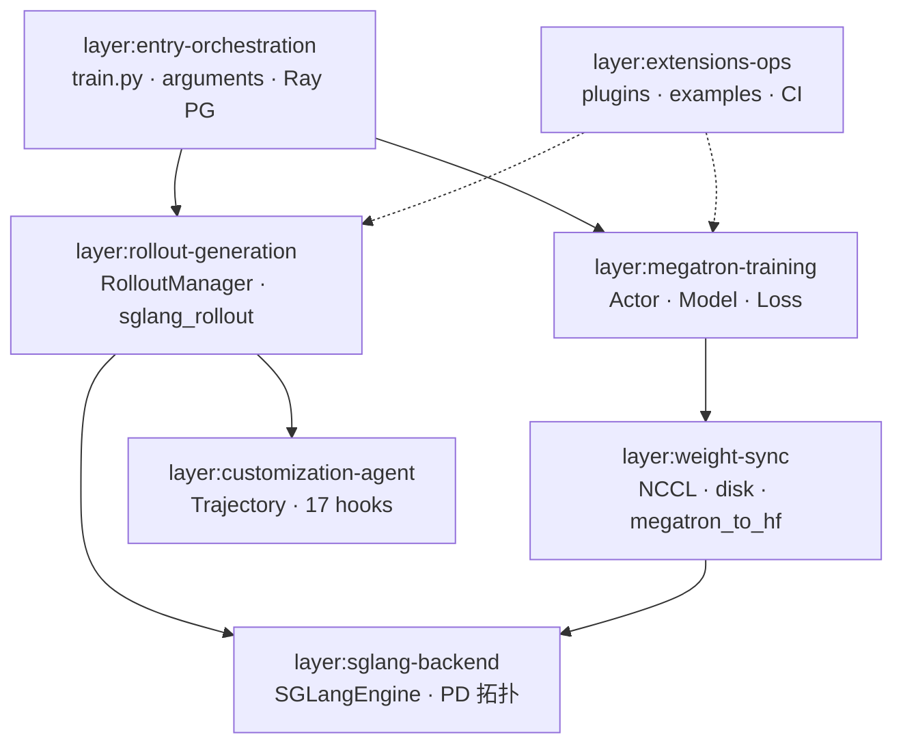
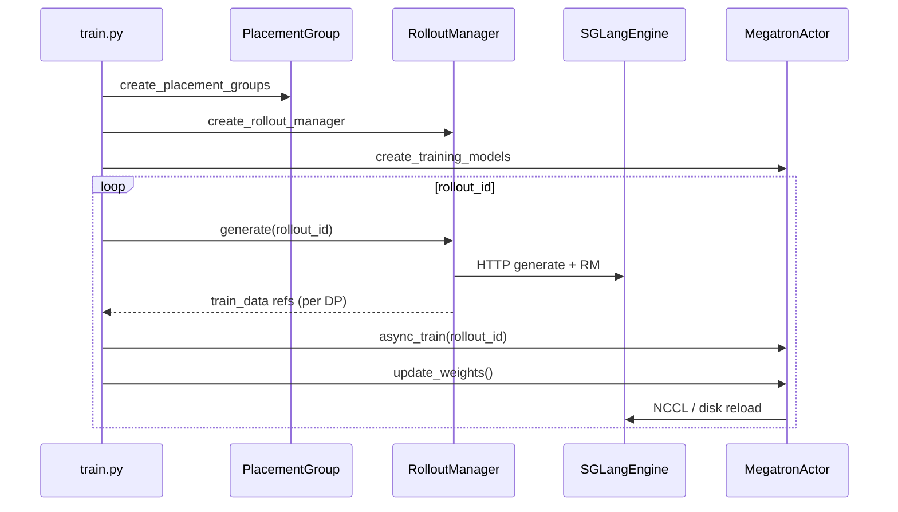

# 02 · 架构分层

> 7 层架构 · 与 [[Slime-04-导读路径]] guided tour 分层一致

---

## 分层总览



---

## Layer 1 · 入口与编排

**职责：** CLI 参数解析、Ray GPU 分配、训练主循环节拍。

| 代表文件 | 阅读批 |
|----------|--------|
| `train.py`, `train_async.py` | 02 |
| `slime/utils/arguments.py` | 03–04 |
| `slime/ray/placement_group.py` | 06 |
| `slime/ray/actor_group.py` | 07 |

**Code：**

```python
## 来源：slime/utils/arguments.py L1546-L1561
def parse_args(add_custom_arguments=None):
    # Users may call `parse_args` very early, thus we ensure logger is configured here
    configure_logger()

    add_slime_arguments = get_slime_extra_args_provider(add_custom_arguments)

    pre = _pre_parse_mode()
    skip_sglang = pre.debug_train_only or pre.load_debug_rollout_data is not None

    # Phase 1: Parse sglang args independently (separate parser, parse_known_args).
    # Skipped when sglang servers are not needed.
    sglang_ns = None
    if not skip_sglang:
        sglang_ns = sglang_parse_args()

    # Phase 2: Parse megatron + slime args.
```

**Comment：** 三阶段 parse（sglang → megatron+slime → validate）保证 `--sglang-*` 与 Megatron 参数原生透传。

```python
## 来源：slime/ray/placement_group.py L42-L48
def _create_placement_group(num_gpus):
    """Create a placement group with the specified number of GPUs."""
    if num_gpus == 0:
        return None, [], []

    bundles = [{"GPU": 1, "CPU": 1} for _ in range(num_gpus)]
    pg = placement_group(bundles, strategy="PACK")
```

---

## Layer 2 · Rollout 生成

**职责：** 样本生成、RM 打分、过滤、Sample→train_data 转换。

| 代表文件 | 阅读批 |
|----------|--------|
| `slime/ray/rollout.py` | 08–09 |
| `slime/rollout/sglang_rollout.py` | 12 |
| `slime/rollout/data_source.py` | 11 |
| `slime/utils/types.py` | 10 |

**Code：**

```python
## 来源：slime/ray/rollout.py L546-L559
    def generate(self, rollout_id):
        start_time = time.time()
        self.rollout_id = rollout_id
        self.health_monitoring_resume()
        if self.args.ci_test and self.args.use_fault_tolerance and rollout_id >= 2:
            self._try_ci_fault_injection()
        data, metrics = self._get_rollout_data(rollout_id=rollout_id)
        self._save_debug_rollout_data(data, rollout_id=rollout_id, evaluation=False)
        _log_rollout_data(rollout_id, self.args, data, metrics, time.time() - start_time)
        if self.args.debug_rollout_only:
            return
        data = self._convert_samples_to_train_data(data)
        return self._split_train_data_by_dp(data)
```

**Comment：** `generate` 是 Rollout 层对外唯一 Ray remote 入口；输出按 DP rank 拆成 `ObjectRef` 列表供 Actor 消费。

---

## Layer 3 · SGLang 后端

**职责：** 推理引擎生命周期、PD 拓扑、权重 reload、外部引擎发现。

| 代表文件 | 阅读批 |
|----------|--------|
| `slime/backends/sglang_utils/sglang_engine.py` | 15 |
| `slime/backends/sglang_utils/sglang_config.py` | 09 |
| `slime/backends/sglang_utils/external.py` | 16 |

**Explain：** SGLangEngine 封装 `launch_server_process` 与 `update_weights*`；RolloutManager 通过 ServerGroup 管理多 engine + router。PD 分离见 [[09-EngineTopology-01-核心概念]]。

---

## Layer 4 · Megatron 训练

**职责：** Actor/Critic 初始化、train step、advantage/loss 计算、数据迭代。

| 代表文件 | 阅读批 |
|----------|--------|
| `slime/backends/megatron_utils/actor.py` | 17–19 |
| `slime/backends/megatron_utils/model.py` | 18–19 |
| `slime/backends/megatron_utils/loss.py` | 21–22 |
| `slime/backends/megatron_utils/data.py` | 20 |

**Code：**

```python
## 来源：slime/backends/megatron_utils/actor.py L380-L400
    def train(self, rollout_id: int, rollout_data_ref: Box, external_data=None):
        if self.args.debug_rollout_only:
            return None

        if self.args.offload_train:
            self.wake_up()

        with timer("data_preprocess"):
            rollout_data = self._get_rollout_data(rollout_data_ref)

        if self.role == "critic":
            result = self.train_critic(rollout_id, rollout_data)
        else:
            self.train_actor(rollout_id, rollout_data, external_data=external_data)
            result = None

        if self.args.offload_train:
            del rollout_data
            self.sleep()

        return result
```

---

## Layer 5 · 权重同步

**职责：** Train→Rollout 权重桥：NCCL broadcast、disk delta、Megatron→HF 转换。

| 代表文件 | 阅读批 |
|----------|--------|
| `update_weight/update_weight_from_distributed.py` | 24 |
| `update_weight/update_weight_from_disk_delta.py` | 25 |
| `megatron_to_hf/__init__.py` | 26 |
| `checkpoint.py` | 26 |

**Code：**

```python
## 来源：slime/backends/megatron_utils/actor.py L583-L606
    def update_weights(self) -> None:
        if self.args.debug_train_only or self.args.debug_rollout_only:
            return

        if self.args.use_fault_tolerance:
            if dist.get_rank() == 0:
                ray.get(self.rollout_manager.recover_updatable_engines.remote())
            dist.barrier(group=get_gloo_group())

        (
            rollout_engines,
            rollout_engine_lock,
            num_new_engines,
            engine_gpu_counts,
            engine_gpu_offsets,
            all_engine_actors,
        ) = ray.get(self.rollout_manager.get_updatable_engines_and_lock.remote())
```

**Comment：** rank 0 先 recover engine，再获取 updatable engine 列表与分布式锁，防止并发 reload 冲突。

---

## Layer 6 · 定制与 Agent

**职责：** 17 类 customization hook、多轮 Agent trajectory→Sample 转换。

| 代表文件 | 阅读批 |
|----------|--------|
| `docs/en/get_started/customization.md` | 28 |
| `slime/agent/trajectory.py` | 27 |
| `slime/agent/adapters/*` | 27 |

详见 [[28-Customization-00-MOC]]、[[27-Agent-Trajectory-00-MOC]]。

---

## Layer 7 · 扩展与运维

**职责：** plugins、examples、tools、CI、trace/profile。

| 代表文件 | 阅读批 |
|----------|--------|
| `slime_plugins/rollout_buffer/buffer.py` | 29 |
| `examples/search-r1/` | 29 |
| `docs/en/developer_guide/ci.md` | 07-可观测与CI |
| `slime/utils/trace_utils.py` | 07-可观测与CI |

---

## 层间数据流（一图）



---

## 导航

- [[Slime-05-文件地图]] — 按层文件索引
- [[Slime-模块依赖图]] — import 关系
- [[Slime-业务域流程]] — 6 条 flow
