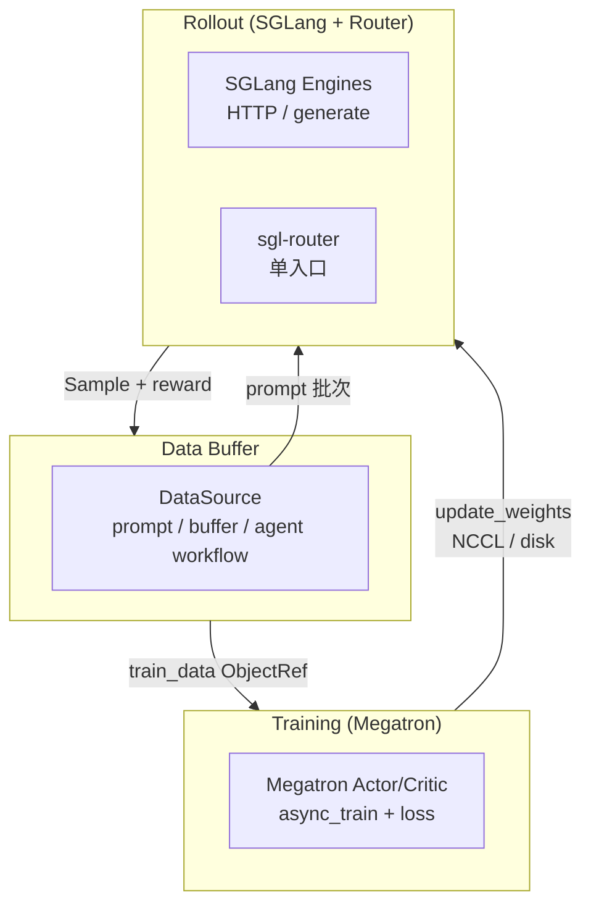
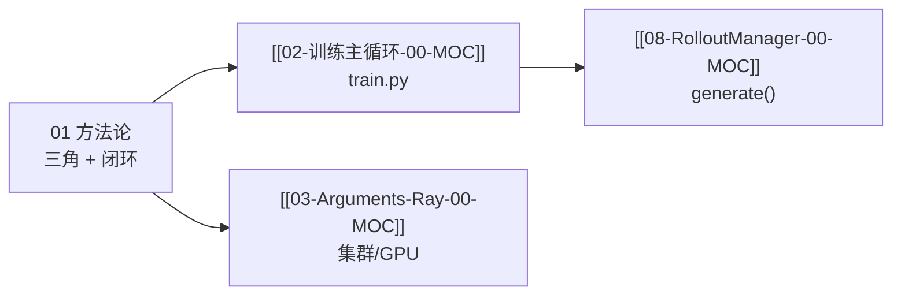

# 方法论 · 批次概述

> **批次 01** | 阶段 0 地基 | 基线 commit `22cdc6e1`  
> 源码范围：项目自述文档 + 安装元数据（非运行时模块）

---

## 本批目标

读完本批六件套后，读者应能：

1. 用一句话说明 Slime 解决什么问题（RL scaling 下的 LLM post-training）
2. 画出 **Training / Rollout / Data Buffer** 三角，并口述 `generate → train → update_weights` 闭环
3. 解释 Slime 与 veRL / OpenRLHF 的设计差异（原生透传 vs 抽象层）
4. 知道 `slime_reading` 六件套与 ETC 三段式怎么读

---

## 文档导航

| 文档 | 内容 |
|------|------|
| [[Slime-00-方法论-01-核心概念]] | Slime 三角、闭环术语、阅读体系 |
| [[Slime-00-方法论-02-源码走读]] | README / 博文 / setup 走读 |
| [[Slime-00-方法论-03-数据流与交互]] | 三角架构与参数透传总览 |
| [[Slime-00-方法论-04-关键问题]] | 阅读顺序、SGLang 前置、框架对比 |
| [[Slime-00-方法论-05-checkpoint]] | 验收清单 |

---

## 源码范围

| 优先级 | 文件 | 本批覆盖 |
|--------|------|---------|
| P0 | `README.md` / `README_zh.md` | 架构总览、参数三类、生态 |
| P0 | `docs/en/blogs/introducing_slime.md` | 愿景、customizability、native 设计 |
| P1 | `setup.py` | 包名、版本、依赖入口 |
| P1 | `requirements.txt` | 运行时依赖清单 |
| 引用 | `imgs/arch.png` | 用文字复述三角图（见 03） |

---

## 架构图文字复述（arch.png）

**Explain：** 官方架构图描述三条并行能力线，全部汇入同一 RL 数据通路，而非独立 microservice。



**Comment：**

- **Data Buffer** 不是独立进程名，而是 RolloutManager + DataSource + rollout 函数共同实现的逻辑层
- 训练前 Megatron 权重总会推到 SGLang（见 [[02-训练主循环-02-源码走读]]）
- 详细 generate 链见 [[08-RolloutManager-00-MOC]]

---

## 入口：三类参数从哪来

**Explain：** README 明确参数分 Megatron / SGLang / slime 三类；本批只建立概念，实现见批次 03–04。

**Code：**

```python
# 来源：README_zh.md L160-L166（结构等价于 arguments 设计）
# 1. Megatron 参数：直接 --tensor-model-parallel-size 等
# 2. SGLang 参数：--sglang- 前缀透传，如 --sglang-mem-fraction-static
# 3. slime 自身参数：slime/utils/arguments.py
```

**Comment：**

- 「原生透传」是 Slime 与 veRL 类框架的核心差异之一（见 [[Slime-00-方法论-04-关键问题]]）
- `parse_args()` 三阶段合并见 [[03-Arguments-Ray-02-源码走读]]

---

## 衔接关系



---

## 阶段验收点

- [ ] 能口述 Slime 两大能力：Megatron 训练 + SGLang Rollout / 自定义数据生成
- [ ] 能画出三角并标出 `generate → train → update_weights` 方向
- [ ] 能说明为何选择单一 SGLang backend 而非多推理框架抽象
- [ ] 知道后续批次阅读顺序：02 → 03 → 04 → 06 → 08 …

---

## 相关测试 / 文档

- 无专属单测；概念验收靠 [[Slime-00-方法论-05-checkpoint]] 自测
- 官方文档：https://thudm.github.io/slime/
- SGLang 前置：[[SGLang源码阅读指南]]
