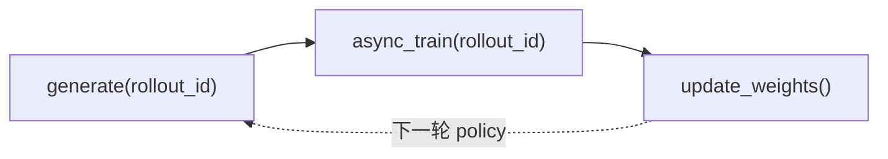

# 方法论 · 核心概念

---

## 1. Slime 解决什么问题？

**Explain：** Slime 是面向 **RL scaling** 的 LLM post-training 框架。它把 Megatron 训练与 SGLang 推理接到同一条 RL 数据通路上，避免 trainer / rollout service / agent framework 三套系统各自为政。

**Code：**

```python
## 来源：README_zh.md L9-L16
# slime 是为 RL scaling 设计的 LLM post‑training 框架，提供两大核心能力：
# 1. 高性能训练：通过连接 Megatron 与 SGLang，支持各种模式的高效训练；
# 2. 灵活的数据生成：通过自定义数据生成接口以及 server-based engine，
#    实现任意训练数据生成流程。
```

**Comment：**

- 「完整闭环验证」指 GLM-4.5–5.2 等发布级模型训练，而非孤立 example
- 正确性优先：支持 rollout-only / train-only 分离调试（`--debug-rollout-only` / `--debug-train-only`）

---

## 2. Slime 三角（Training / Rollout / Data Buffer）

| 角 | 运行时主体 | 职责 |
|----|-----------|------|
| **Training** | Megatron Actor（+ 可选 Critic） | 从 buffer 读 rollout 数据，`async_train` 算 loss / 梯度 |
| **Rollout** | SGLang Engine + sgl-router | 在线采样、RM/verifier、多轮 agent |
| **Data Buffer** | DataSource + RolloutManager | 管理 prompt、buffer、sample→train_data 转换 |

**Explain：** 三角不是三个独立仓库，而是 **同一 Ray 作业内的角色划分**。数据始终走 `generate → train → update_weights`。



---

## 3. generate → train → update_weights 是什么？

**Explain：** 这是 Slime **同步训练**（`train.py`）每个 `rollout_id` 的三步节拍；异步版（`train_async.py`）会 prefetch generate，但语义不变。

**Code：**

```python
## 来源：train.py L62-L89
    for rollout_id in range(args.start_rollout_id, args.num_rollout):
        rollout_data_ref = ray.get(rollout_manager.generate.remote(rollout_id))
        # ... offload_rollout 省略 ...
        ray.get(actor_model.async_train(rollout_id, rollout_data_ref))
        # ... save / eval 省略 ...
        actor_model.update_weights()
```

**Comment：**

| 步骤 | 输入 | 输出 |
|------|------|------|
| **generate** | `rollout_id`、当前 SGLang 权重 | 每 DP rank 一份 `rollout_data`（Ray ObjectRef） |
| **train** | `rollout_data_ref` | Megatron 权重更新（GPU 上） |
| **update_weights** | Actor 新权重 | SGLang 引擎参数同步（NCCL 或 disk） |

- Bootstrap 阶段还有一次 **初始** `update_weights()`（训练循环开始前）
- 详述见 [[02-训练主循环-01-核心概念]]

---

## 4. 原生 Engine 透传

**Explain：** Slime 不包一层「统一推理 API」，而是把 Megatron CLI 与 SGLang `ServerArgs` 几乎原样暴露给脚本。

**Code：**

```python
## 来源：docs/en/blogs/introducing_slime.md L55-L59
# - slime internally launches SGLang servers in a server-based mode.
# - slime implements seamless pass-through for all SGLang parameters
#   (with a `--sglang` prefix)
# - slime provides an SGLang-only debug mode (`--debug-rollout-only`)
```

**Code：**

```python
## 来源：docs/en/blogs/introducing_slime.md L63-L67
# For training, slime integrates Megatron-LM:
# - seamless pass-through for all Megatron parameters
# - all Megatron parallelisms (TP, PP, EP, CP)
# - Megatron-only debug mode (`--debug-train-only`)
```

**Comment：**

- SGLang 新优化随 `--sglang-*` 直接可用，无需等 Slime 发版适配
- Megatron 组织内 fork 也可通过同样方式接入

---

## 5. 与 veRL / OpenRLHF 的差异（概念层）

| 维度 | Slime | veRL 类框架（典型） |
|------|-------|---------------------|
| 训练后端 | Megatron **原生** CLI | 常包 FSDP / 自有 Actor 抽象 |
| Rollout | **仅** SGLang deep integration | 多 backend 或 vLLM 并列 |
| 定制 | `*-path` 动态 import | 常需改 trainer 子类 |
| 主循环 | 暴露 `train.py` 裸循环 | Trainer class 封装 |
| Agent | 走 customization 接口 | 有时独立 agent framework |

**Explain：** 博文强调「不要 fork 框架做 dataloader 式定制」——Slime 把复杂度推到 **用户 pipeline** 与 **SGLang/Megatron**，自身保持轻量。

**Code：**

```python
## 来源：docs/en/blogs/introducing_slime.md L33-L37
# A prevailing misconception ... separate frameworks for different tasks ...
# no one forks PyTorch just for a new dataloader.
# slime views the data sampling in RL differently ...
# allowing users to inject custom logic and freely interact with SGLang servers.
```

---

## 6. slime_reading 六件套怎么读

| 文件后缀 | 读法 |
|----------|------|
| `00-MOC` | 本专题地图：目标、源码范围、验收 |
| `01-核心概念` | 术语与设计动机（先读） |
| `02-源码走读` | **主文档**：按调用顺序贴源码 |
| `03-数据流与交互` | 时序图 / 模块边界 |
| `04-关键问题` | FAQ、易错点 |
| `05-checkpoint` | 自测勾选 |

**ETC 三段式：** 每节 **Explain → Code → Comment**；Code 块首行 `# 来源：path Lx-Ly`。

---

## 7. 包结构与依赖（setup / requirements）

**Explain：** `setup.py` 声明包名 `slime`、版本 `0.3.0`，依赖来自 `requirements.txt`。

**Code：**

```python
## 来源：setup.py L31-L38
setup(
    author="slime Team",
    name="slime",
    version="0.3.0",
    packages=find_packages(include=["slime*", "slime_plugins*"]),
    install_requires=_fetch_requirements("requirements.txt"),
    python_requires=">=3.10",
)
```

**Code：**

```python
## 来源：requirements.txt L18-L22（RL 闭环关键依赖摘录）
ray[default]
sglang-router>=0.2.3
transformers
wandb
```

**Comment：**

- `ray[default]` → Placement Group、RolloutManager Actor
- `sglang-router` → 单 HTTP 入口（博文 customizability 一节）
- 完整 Megatron / SGLang 通常在 Docker 镜像中预装，见 `docker/`

---

## 8. Colocate / Async（预告）

**Explain：** 博文指出 Ray + `--colocate` 可在同 GPU 上跑 train+rollout（需 offload）；异步只需移动 `ray.get` 位置。

**Code：**

```python
## 来源：docs/en/blogs/introducing_slime.md L43-L45
# slime uses Ray ... colocated (same GPUs) or decoupled (separate GPUs)
# with a single flag (`--colocate`).
# Changing synchronization behavior is as simple as moving the `ray.get` operation.
```

**Comment：** 参数语义见 [[03-Arguments-Ray-01-核心概念]]；`train_async.py` 见 [[02-训练主循环-03-数据流与交互]]。

---

## 下一批

→ [[02-训练主循环-00-MOC]]：从 `parse_args()` 进入 `train()` 主循环
