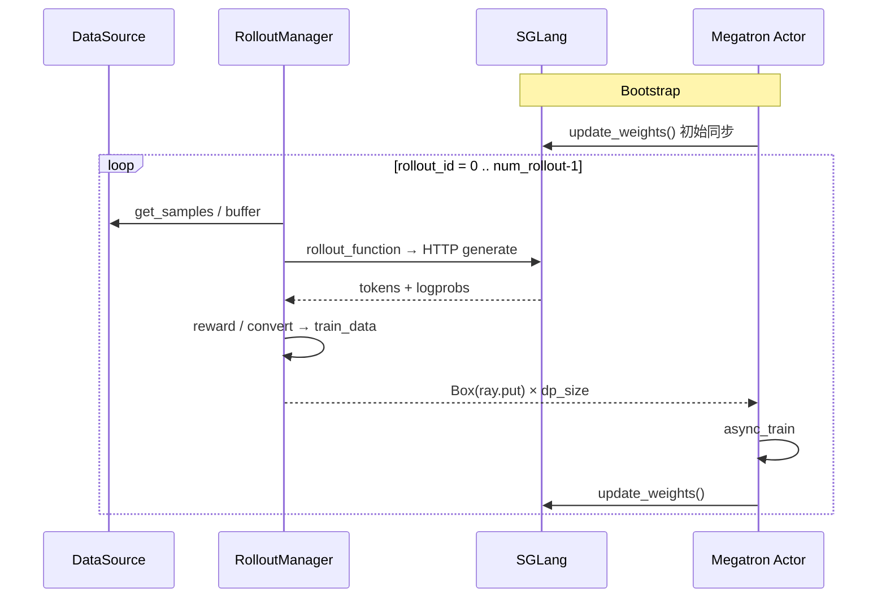
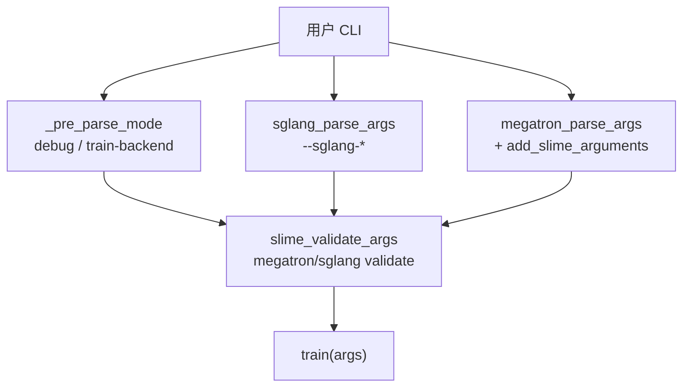
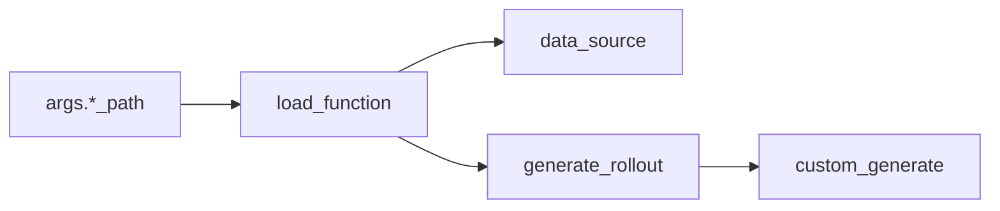
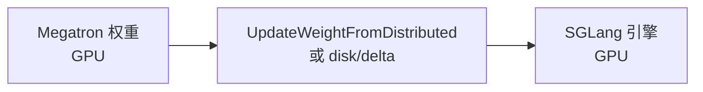

# 方法论 · 数据流与交互

---

## 1. 端到端 RL 闭环（逻辑层）

**Explain：** 从用户视角，一次 post-training 作业是「采样 → 训练 → 推权重 → 再采样」的循环；三角模块是这条环上的三个职能分区。



**Comment：**

- Data Buffer 逻辑上包含 DataSource + sample 聚合；物理上主要在 RolloutManager Ray Actor
- Critic（PPO）在 train 步与 Actor 交错，见 [[02-训练主循环-03-数据流与交互]]

---

## 2. 参数与控制面数据流

**Explain：** CLI 三类参数在 `parse_args()` 合并为一个 `args` namespace，下游模块只读 `args`。



**Code：**

```python
## 来源：slime/utils/arguments.py L1546-L1589
def parse_args(add_custom_arguments=None):
    configure_logger()
    add_slime_arguments = get_slime_extra_args_provider(add_custom_arguments)
    pre = _pre_parse_mode()
    skip_sglang = pre.debug_train_only or pre.load_debug_rollout_data is not None
    sglang_ns = None
    if not skip_sglang:
        sglang_ns = sglang_parse_args()
    args = megatron_parse_args(extra_args_provider=add_slime_arguments, ...)
    for key, value in vars(pre).items():
        setattr(args, key, value)
    if sglang_ns is not None:
        for key, value in vars(sglang_ns).items():
            setattr(args, key, value)
    slime_validate_args(args)
    ...
    return args
```

**Comment：**

- Megatron 参数 **不** 加前缀；SGLang 参数 dest 常为 `sglang_*`
- `debug_train_only` 跳过 SGLang 解析，只跑训练 replay

---

## 3. Customization 挂载点（数据生成侧）

**Explain：** 用户逻辑通过 `load_function(path)` 注入，不改变主循环形状。



**Code：**

```python
## 来源：slime/utils/misc.py L37-L45
def load_function(path):
    module_path, _, attr = path.rpartition(".")
    module = importlib.import_module(module_path)
    return getattr(module, attr)
```

**Comment：**

- 默认 `rollout_function_path = slime.rollout.sglang_rollout.generate_rollout`
- 接口全集见 [[04-Arguments-TrainRollout-03-数据流与交互]]

---

## 4. 权重同步在闭环中的位置

**Explain：** `update_weights` 是 Training → Rollout 的边界；carrier 由 `--update-weight-transport` 决定。



**Code：**

```python
## 来源：slime/utils/arguments.py L145-L155
# --update-weight-mode: full | delta
# --update-weight-transport: nccl | disk
# full + nccl: broadcast chunks
# delta: disk only, XOR/overwrite encoding
```

**Comment：** colocate 下 delta mode 被禁止（IPC 路径不需要 snapshot diff），见 [[03-Arguments-Ray-04-关键问题]]

---

## 5. 与外部生态的边界

**Explain：** Miles / vime / Relax 等复用 Slime kernel，替换或扩展 rollout / 编排层，但不改 `generate → train → update_weights` 语义。

| 项目 | 相对 Slime 的变化 |
|------|------------------|
| vime | rollout → vLLM |
| Relax | 完全解耦 Actor/Rollout 集群 + DCS |
| OpenClaw-RL | 异步 RL + API serving 并存 |

**Code：**

```python
## 来源：README_zh.md L124-L125
# vime ... 主要特点是将 rollout 后端替换为 vLLM
# 在现有 slime 启动脚本基础上仅调整 rollout 相关参数
```

---

## 6. 调试路径分叉

| 模式 | 参数 | 数据流 |
|------|------|--------|
| 只测 rollout | `--debug-rollout-only` | 无 Megatron train；可 colocate 改 decoupled |
| 只测 train | `--debug-train-only` | 无 SGLang；`load_debug_rollout_data` |
| 正常 RL | 默认 | 完整闭环 |

**Code：**

```python
## 来源：slime/utils/arguments.py L1844-L1849
    if args.load_debug_rollout_data is not None:
        logger.info("... will not instantiate sglang servers ...")
        args.debug_train_only = True
```

---

## 衔接

- 主循环时序细节 → [[02-训练主循环-03-数据流与交互]]
- Ray GPU 分配 → [[03-Arguments-Ray-03-数据流与交互]]
- generate 内部 → [[08-RolloutManager-03-数据流与交互]]
