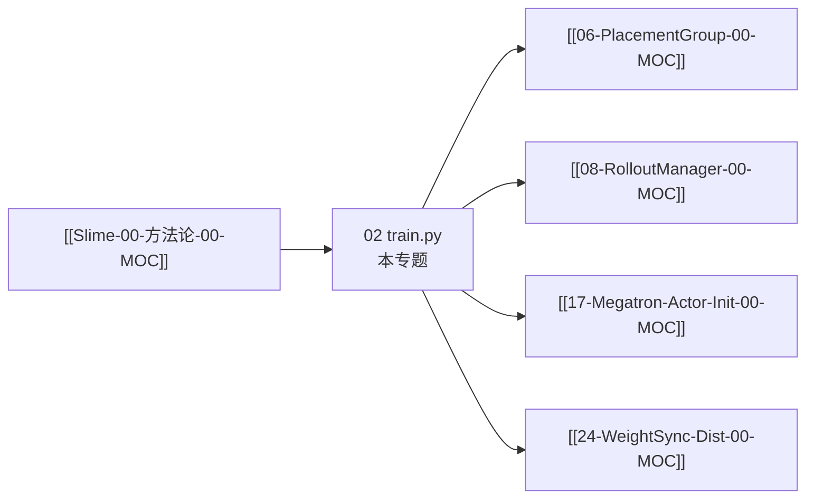

---
type: module-moc
module: 02-训练主循环
batch: "02"
doc_type: moc
title: "训练主循环 · 专题概述"
tags:
  - slime/batch/02
  - slime/module/train-loop
  - slime/doc/moc
updated: 2026-07-02
---

# 训练主循环 · 专题概述

> 源码主文件：`train.py`、`train_async.py`、`slime/utils/misc.py`

---

## 本专题目标

1. 口述 `train()` 的 bootstrap 顺序：PG → RolloutManager → Actor/Critic → 首次 `update_weights`
2. 逐步讲解 sync 主循环：`generate → offload? → async_train → save? → update_weights`
3. 说明 `train_async.py` 与 sync 的差异（prefetch、无 colocate、`update_weights_interval`）
4. 理解 `should_run_periodic_action` 如何触发 save/eval
5. 知道 eval-only（`num_rollout == 0`）与 critic-only steps 分支

---

## 文档导航

| 文档 | 内容 |
|------|------|
| [[02-训练主循环-01-核心概念]] | 入口、术语、sync vs async |
| [[02-训练主循环-02-源码走读]] | **主文档**：train.py / train_async 全文精读 |
| [[02-训练主循环-03-数据流与交互]] | 时序图 sync vs async |
| [[02-训练主循环-04-关键问题]] | colocate offload、eval-only、测试指针 |
| [[02-训练主循环-05-checkpoint]] | 验收清单 |

---

## 源码范围

| 符号 | 文件 | 行号（约） | 覆盖 |
|------|------|-----------|------|
| `train()` | `train.py` | L9–98 | ✅ 全文 |
| `train()` async | `train_async.py` | L10–75 | ✅ 全文 |
| `should_run_periodic_action` | `misc.py` | L105–126 | ✅ |
| `parse_args` | `train.py` `__main__` | L101–103 | 引用 |
| `create_*` | `placement_group.py` | — | [[06-PlacementGroup-00-MOC]]–[[07-RayTrainGroup-00-MOC]] |

---

## 入口一览

**Explain：** 两个入口脚本结构相同：`parse_args()` → `train(args)`；差异在 `train()` 实现。

**Code：**

```python
## 来源：train.py L101-L103
if __name__ == "__main__":
    args = parse_args()
    train(args)
```

**Code：**

```python
## 来源：train_async.py L78-L80
if __name__ == "__main__":
    args = parse_args()
    train(args)
```

**Comment：** 启动脚本通常 `python train.py ...` 或 `python train_async.py ...`；参数解析见 [[03-Arguments-Ray-00-MOC]]。

---

## 衔接



---

## 阶段验收点

- [ ] 能不看代码画出 sync 主循环 7 步（含 bootstrap）
- [ ] 能说明 async 为何 `assert not args.colocate`
- [ ] 能解释 `num_critic_only_steps` 时 Actor 是否训练

---

## 相关测试

- `tests/test_qwen2.5_0.5B_async_short.py` — async 短跑断言
- `tests/test_qwen2.5_0.5B_short.py` — sync 短跑
