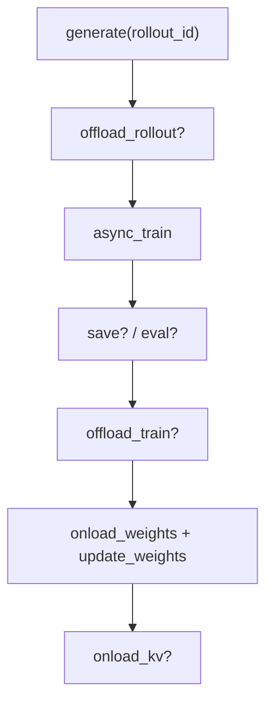

# 训练主循环 · 核心概念

---

## 1. 训练入口是什么？

Slime **不** 使用深层 `Trainer` 类；`train.py` 的 `train(args)` 就是 RL 编排的全部同步逻辑（约 90 行）。`train_async.py` 提供 **rollout prefetch** 变体。

**Code：**

```python
## 来源：train.py L1-L6
import ray
from slime.ray.placement_group import create_placement_groups, create_rollout_manager, create_training_models
from slime.utils.arguments import parse_args
from slime.utils.logging_utils import configure_logger, finish_tracking, init_tracking
from slime.utils.misc import should_run_periodic_action
```

---

## 2. Bootstrap 四步

| 步骤 | 调用 | 作用 |
|------|------|------|
| 1 | `create_placement_groups(args)` | Ray PG 分配 train/rollout GPU |
| 2 | `create_rollout_manager(...)` | RolloutManager + 计算 `num_rollout_per_epoch` |
| 3 | `create_training_models(...)` | Megatron Actor / Critic Ray 组 |
| 4 | `actor_model.update_weights()` | 初始权重推到 SGLang |

**Explain：** RolloutManager **必须先** 创建，因其初始化会推导 epoch 内 rollout 步数。

**Code：**

```python
## 来源：train.py L9-L26
def train(args):
    configure_logger()
    pgs = create_placement_groups(args)
    init_tracking(args)
    rollout_manager, num_rollout_per_epoch = create_rollout_manager(args, pgs["rollout"])
    actor_model, critic_model = create_training_models(args, pgs, rollout_manager)
    if args.offload_rollout:
        ray.get(rollout_manager.onload_weights.remote())
    actor_model.update_weights()
```

**Comment：**

- `offload_rollout` 时 bootstrap 需先 `onload_weights` 再 sync，再 `onload_kv`（L22–32）
- `check_weight_update_equal` 可选一致性校验

---

## 3. Sync 主循环一步（rollout_id）



**Code：**

```python
## 来源：train.py L63-L95
    for rollout_id in range(args.start_rollout_id, args.num_rollout):
        if args.eval_interval is not None and rollout_id == 0 and not args.skip_eval_before_train:
            ray.get(rollout_manager.eval.remote(rollout_id))
        rollout_data_ref = ray.get(rollout_manager.generate.remote(rollout_id))
        if args.offload_rollout:
            ray.get(rollout_manager.offload.remote())
        actor_trains_this_step = (not args.use_critic) or rollout_id >= args.num_critic_only_steps
        ...
        ray.get(actor_model.async_train(rollout_id, rollout_data_ref))
        ...
        actor_model.update_weights()
```

---

## 4. Critic-only steps（PPO）

**Explain：** `use_critic` 当且仅当 `advantage_estimator == "ppo"`（在 `slime_validate_args` 设置）。前 `num_critic_only_steps` 步只训 Critic。

**Code：**

```python
## 来源：train.py L72-L79
        actor_trains_this_step = (not args.use_critic) or rollout_id >= args.num_critic_only_steps
        if args.use_critic:
            value_refs = critic_model.async_train(rollout_id, rollout_data_ref)
            if actor_trains_this_step:
                ray.get(actor_model.async_train(rollout_id, rollout_data_ref, external_data=value_refs))
            else:
                ray.get(value_refs)
```

**Comment：** Actor 训练需 Critic 的 value 作为 `external_data`；仅 value 步时只 `ray.get(value_refs)`。

---

## 5. Async 主循环差异

| 维度 | sync (`train.py`) | async (`train_async.py`) |
|------|-------------------|--------------------------|
| colocate | 支持（+ offload） | **禁止** `assert not args.colocate` |
| generate | 逐步 `ray.get` | 预取 `rollout_id+1` |
| offload rollout | 有 | **无** |
| update_weights | 每步 | 每 `update_weights_interval` 步 |
| save | `save()` 辅助函数 | 内联 |

**Code：**

```python
## 来源：train_async.py L10-L11
def train(args):
    assert not args.colocate, "Colocation is not supported for async training."
```

**Code：**

```python
## 来源：train_async.py L31-L39
    rollout_data_next_future = rollout_manager.generate.remote(args.start_rollout_id)
    for rollout_id in range(args.start_rollout_id, args.num_rollout):
        if rollout_data_next_future is not None:
            rollout_data_curr_ref = ray.get(rollout_data_next_future)
        if rollout_id + 1 < args.num_rollout:
            rollout_data_next_future = rollout_manager.generate.remote(rollout_id + 1)
```

---

## 6. should_run_periodic_action

**Explain：** 统一 save / eval 触发：interval 命中、epoch 边界、或 **最后一步**。

**Code：**

```python
## 来源：slime/utils/misc.py L105-L126
def should_run_periodic_action(
    rollout_id: int,
    interval: int | None,
    num_rollout_per_epoch: int | None = None,
    num_rollout: int | None = None,
) -> bool:
    if interval is None:
        return False
    if num_rollout is not None and rollout_id == num_rollout - 1:
        return True
    step = rollout_id + 1
    return (step % interval == 0) or (num_rollout_per_epoch is not None and step % num_rollout_per_epoch == 0)
```

**Comment：** save 调用传 `num_rollout`；eval 不传，故最后一步 eval 需 interval 或 epoch 边界触发。

---

## 7. eval-only 模式

**Code：**

```python
## 来源：train.py L34-L36
    if args.num_rollout == 0 and args.eval_interval is not None:
        ray.get(rollout_manager.eval.remote(rollout_id=0))
```

**Comment：** 无训练步时仍可跑 eval；主循环 `range(...)` 为空，直接 dispose。

---

## 下一批

→ [[03-Arguments-Ray-00-MOC]]：`colocate` / `offload` 参数如何影响本循环
