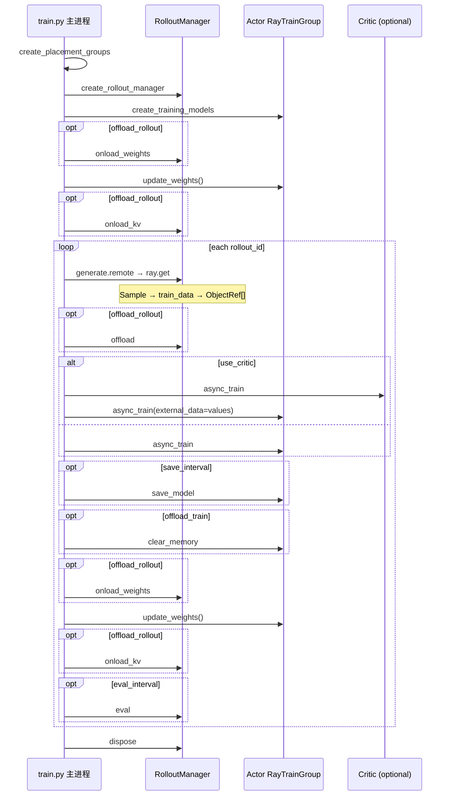
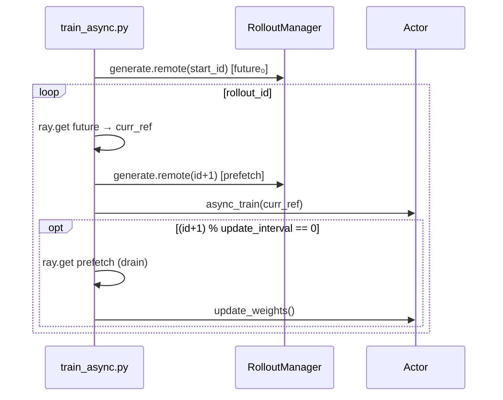
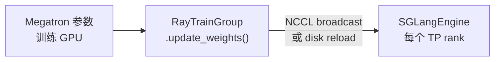
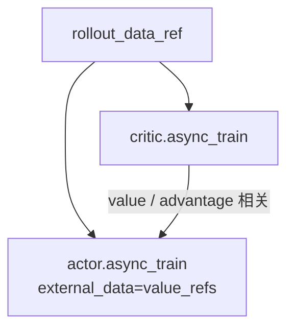

# 训练主循环 · 数据流与交互

---

## 1. Sync 全流程时序（含 colocate offload）



**Comment：** colocate 下 generate 前后 rollout 权重在 CPU/GPU 间迁移，train 侧 Megatron 也可能 offload（`offload_train`）。

---

## 2. Async 流水线时序



**Code：**

```python
## 来源：train_async.py L65-L69
        if (rollout_id + 1) % args.update_weights_interval == 0:
            rollout_data_curr_ref = ray.get(x) if (x := rollout_data_next_future) is not None else None
            rollout_data_next_future = None
            actor_model.update_weights()
```

**Comment：** prefetch 使 **train(step k)** 与 **generate(step k+1)** 重叠；update 前必须 drain 避免半完成 generate。

---

## 3. rollout_data_ref 形态

**Explain：** `generate` 返回每 DP rank 一个包装对象；Actor 按 rank 取本地 partition。

**Code：**

```python
## 来源：train.py L67
        rollout_data_ref = ray.get(rollout_manager.generate.remote(rollout_id))
```

**Comment：** 详述 [[08-RolloutManager-03-数据流与交互]]；transport 可选 nixl（`--rollout-data-transport`）。

---

## 4. update_weights 数据流



**Comment：** 实现见 [[24-WeightSync-Dist-02-源码走读]]；主循环只调用 `actor_model.update_weights()` 门面。

---

## 5. PPO 双模型交互



**Code：**

```python
## 来源：train.py L74-L77
            value_refs = critic_model.async_train(rollout_id, rollout_data_ref)
            if actor_trains_this_step:
                ray.get(actor_model.async_train(rollout_id, rollout_data_ref, external_data=value_refs))
```

---

## 6. periodic action 与 epoch

**Explain：** `num_rollout_per_epoch` 来自 RolloutManager 初始化；与 `save_interval` / `eval_interval` 取 OR 触发。

**Code：**

```python
## 来源：train.py L83-L84
        if should_run_periodic_action(rollout_id, args.save_interval, num_rollout_per_epoch, args.num_rollout):
            save(rollout_id)
```

**Code：**

```python
## 来源：slime/utils/misc.py L125-L126
    step = rollout_id + 1
    return (step % interval == 0) or (num_rollout_per_epoch is not None and step % num_rollout_per_epoch == 0)
```

---

## 7. 与 parse_args 的交互

**Code：**

```python
## 来源：train.py L101-L103
if __name__ == "__main__":
    args = parse_args()
    train(args)
```

**Comment：** `args.start_rollout_id`、`args.num_rollout`、`args.colocate` 等均在进入 `train()` 前已 validate。

---

## 对比表：sync vs async

| 项目 | train.py | train_async.py |
|------|----------|----------------|
| generate/train 重叠 | 否 | 是 |
| rollout offload | 是 | 否 |
| 每步 update_weights | 是 | 可间隔 |
| colocate | 是 | 否 |

---

## 衔接

- generate 内部 → [[08-RolloutManager-03-数据流与交互]]
- PG 创建 → [[06-PlacementGroup-03-数据流与交互]]
- async 测试 → [[02-训练主循环-04-关键问题]]
