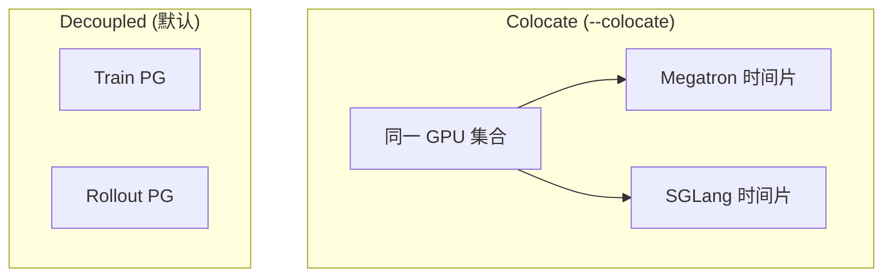

# Arguments-Ray · 核心概念

---

## 1. Ray 段参数解决什么问题？

Slime 用 Ray **Placement Group** 把训练 GPU 与 Rollout GPU （或 colocate 下的时间片）编排进同一作业。Cluster 段 CLI 定义：

- 训练规模：`actor_num_nodes × actor_num_gpus_per_node`
- 推理规模：`rollout_num_gpus`（可 decoupled 独立集群）
- 是否同卡：`colocate` + `offload_*`

---

## 2. 核心术语

| 术语 | CLI | 含义 |
|------|-----|------|
| **Actor 集群** | `--actor-num-nodes`, `--actor-num-gpus-per-node` | Megatron 训练占用的节点/GPU |
| **Rollout GPU** | `--rollout-num-gpus` | 本地 SGLang 引擎总 GPU 数 |
| **TP per engine** | `--rollout-num-gpus-per-engine` | 每个 SGLang 实例 GPU 数（类似 tp_size） |
| **GPUs per node** | `--num-gpus-per-node` | colocate 下每节点 GPU 数（可 <8） |
| **Colocate** | `--colocate` | 训练与推理共享 GPU，强制 offload |
| **Offload train** | `--offload-train` | 训练步把 Megatron 权重 offload CPU |
| **Offload rollout** | `--offload-rollout` | 训练步把 SGLang offload CPU |

---

## 3. Colocate vs Decoupled



**Code：**

```python
# 来源：slime/utils/arguments.py L70-L77
            parser.add_argument(
                "--colocate",
                action="store_true",
                default=False,
                help=(
                    "Whether to colocate the inference engines and the actor. "
                    "Turning this on will also set --offload to true."
                ),
            )
```

**Comment：** decoupled 时 train/rollout PG 独立；async train 要求 decoupled（[[02-训练主循环-04-关键问题]]）。

---

## 4. `--offload` 三元关系

**Code：**

```python
# 来源：slime/utils/arguments.py L79-L100
            parser.add_argument(
                "--offload",
                action="store_true",
                default=False,
                help=("Equivalent to --offload-train + --offload-rollout. "),
            )
            parser.add_argument(
                "--offload-train",
                action=argparse.BooleanOptionalAction,
                help=(
                    "Whether to offload the training actor to CPU during training. "
                    "This will always be true when --colocate is set."
                ),
            )
            parser.add_argument(
                "--offload-rollout",
                action=argparse.BooleanOptionalAction,
                help=(
                    "Whether to offload the rollout generator to CPU during training. "
                    "This will always be true when --colocate is set."
                ),
            )
```

**Code：**

```python
# 来源：slime/utils/arguments.py L1861-L1864
    if args.offload:
        args.offload_train = True
        args.offload_rollout = True
    del args.offload
```

---

## 5. rollout_num_gpus 默认值逻辑

**Explain：** decoupled 时默认与 actor 总 GPU 相等；colocate 时未显式设置则 `actor_num_gpus_per_node * actor_num_nodes`。

**Code：**

```python
# 来源：slime/utils/arguments.py L44-L53
            parser.add_argument(
                "--rollout-num-gpus",
                type=int,
                default=None,
                help=(
                    "Number of GPUs for inference. Note that when using --colocate, "
                    "i.e. the training and the inference engines are on the same gpus, this param will be set as "
                    "actor_num_gpus_per_node * actor_num_nodes unless it is explicitly set. "
                    "Set it to 0 to launch routers without local SGLang engines."
                ),
            )
```

**Code：**

```python
# 来源：slime/utils/arguments.py L1886-L1894
    if args.colocate:
        if args.offload_train is None:
            args.offload_train = True
        if args.offload_rollout is None:
            args.offload_rollout = True
        if args.rollout_num_gpus is None:
            args.rollout_num_gpus = args.actor_num_gpus_per_node * args.actor_num_nodes
        elif args.rollout_num_gpus == 0:
            logger.info("rollout_num_gpus is 0 under colocate; no local SGLang engines will be launched.")
```

---

## 6. rollout_num_gpus = 0

**Explain：** 不在本地起 SGLang engine，仅 router + **external** 引擎地址（需 `--rollout-external-engine-addrs`）。

**Comment：** debug_rollout_only 下设为 0 会把 actor 节点数也置 0（只测 rollout 集群），见 [[03-Arguments-Ray-04-关键问题]]。

---

## 7. parse_args 与 Ray 的关系

**Explain：** Ray 参数本身不启动 Ray；`train()` 里 `create_placement_groups(args)` 读取这些字段分配 bundle。

**Code：**

```python
# 来源：slime/backends/megatron_utils/arguments.py L196-L198
    args.rank = 0
    args.world_size = args.actor_num_nodes * args.actor_num_gpus_per_node
    args = _set_default_megatron_args(args)
```

**Comment：** `world_size` 仅训练侧；rollout GPU 不参与 Megatron DP world。

---

## 8. Placement（预告）

**Explain：** PG 物理布局在 `placement_group.py`，本批只建立 **args 语义**；读 [[06-PlacementGroup-01-核心概念]] 时对照本表。

---

## 下一批

→ [[03-Arguments-Ray-02-源码走读]] 逐段贴 cluster 源码
