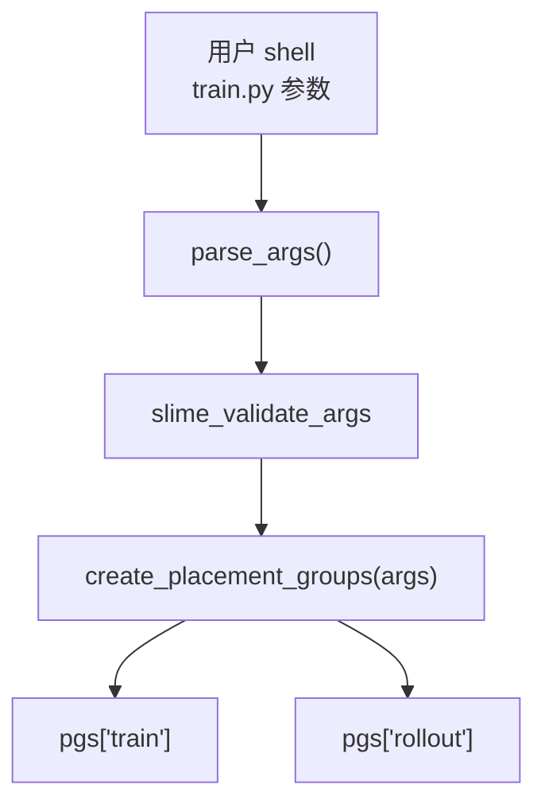
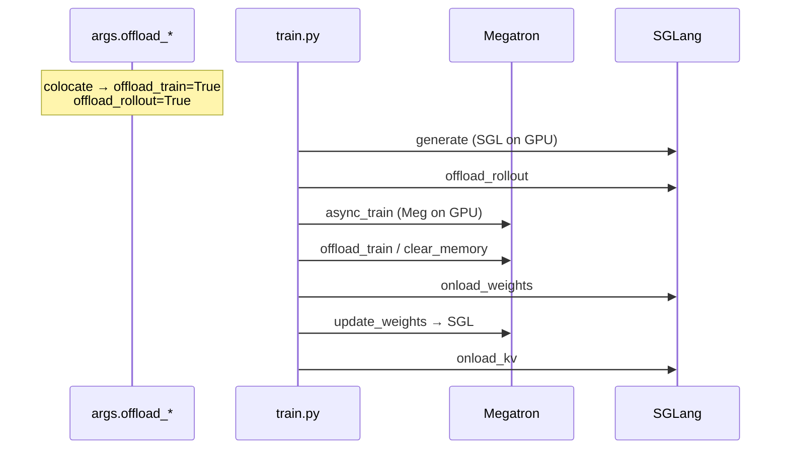
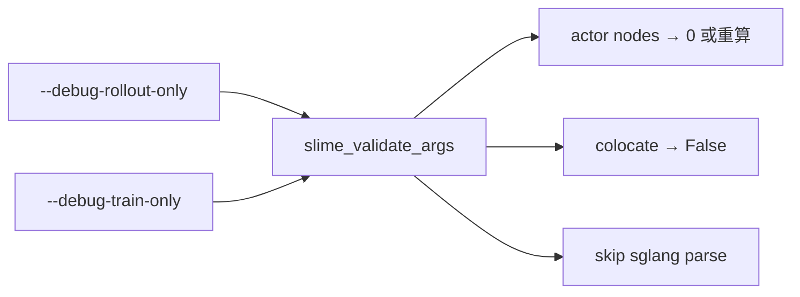
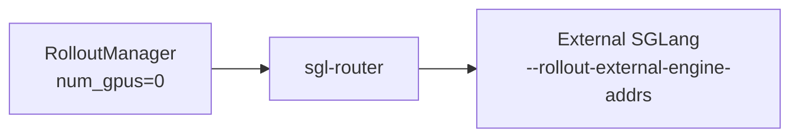

# Arguments-Ray · 数据流与交互

---

## 1. CLI → args → Placement Group



**Code：**

```python
## 来源：train.py L11-L17
    pgs = create_placement_groups(args)
    rollout_manager, num_rollout_per_epoch = create_rollout_manager(args, pgs["rollout"])
    actor_model, critic_model = create_training_models(args, pgs, rollout_manager)
```

**Comment：** `args.actor_num_*` 决定 train PG；`args.rollout_num_gpus` + colocate 标志决定 rollout bundle 是否与 train 重叠。

---

## 2. Colocate 时间线（args 驱动的运行时行为）



**Code：**

```python
## 来源：slime/utils/arguments.py L1885-L1890
    if args.colocate:
        if args.offload_train is None:
            args.offload_train = True
        if args.offload_rollout is None:
            args.offload_rollout = True
```

---

## 3. Decoupled GPU 分配示意

**Explain：** 默认 `--actor-num-nodes 1 --actor-num-gpus-per-node 8` 且 `rollout_num_gpus` 未设 → 8 train + 8 rollout = 16 GPU 需求。

**Code：**

```python
## 来源：slime/utils/arguments.py L39-L42
            parser.add_argument("--actor-num-nodes", type=int, default=1, ...)
            parser.add_argument(
                "--actor-num-gpus-per-node", type=int, default=8, ...
            )
```

**Code：**

```python
## 来源：slime/utils/arguments.py L44-L53
            parser.add_argument(
                "--rollout-num-gpus",
                type=int,
                default=None,
                help=(... "Set it to 0 to launch routers without local SGLang engines."),
            )
```

| 配置 | train GPU | rollout GPU | 总 GPU |
|------|-----------|-------------|--------|
| 1×8 decoupled, rollout default | 8 | 8 | 16 |
| colocate 1×8 | 8（共享） | 8（同集合） | 8 |
| rollout_num_gpus=4 | 8 | 4 | 12 |

---

## 4. rollout_num_gpus_per_engine 与引擎个数

**Explain：** 引擎数 ≈ `rollout_num_gpus / rollout_num_gpus_per_engine`（再受 PP/EP 影响）。

**Code：**

```python
## 来源：slime/utils/arguments.py L55-L59
            parser.add_argument(
                "--rollout-num-gpus-per-engine",
                type=int,
                default=1,
                help="Number of GPUs per inference engine, just like the tp_size in sglang.",
            )
```

**Code：**

```python
## 来源：slime/backends/sglang_utils/arguments.py L188-L196
    temp_parser.add_argument("--rollout-num-gpus-per-engine", type=int, default=1)
    temp_parser.add_argument("--sglang-pp-size", type=int, default=1)
    ...
    sglang_tp_size = temp_args.rollout_num_gpus_per_engine // pp_size
    parser.set_defaults(sglang_tensor_parallel_size=sglang_tp_size)
```

---

## 5. debug 模式 args 重写



**Code：**

```python
## 来源：slime/utils/arguments.py L1866-L1876
    if args.debug_rollout_only:
        if args.colocate and args.rollout_num_gpus is None:
            args.rollout_num_gpus = args.actor_num_gpus_per_node * args.actor_num_nodes
        elif args.rollout_num_gpus == 0:
            args.actor_num_gpus_per_node = 0
            args.actor_num_nodes = 0
        else:
            args.actor_num_gpus_per_node = min(8, args.rollout_num_gpus)
            args.actor_num_nodes = args.rollout_num_gpus // args.actor_num_gpus_per_node
        args.colocate = False
        args.offload_train = args.offload_rollout = False
```

**Code：**

```python
## 来源：slime/utils/arguments.py L1552-L1553
    skip_sglang = pre.debug_train_only or pre.load_debug_rollout_data is not None
```

---

## 6. distributed 超时与 NCCL

**Code：**

```python
## 来源：slime/utils/arguments.py L102-L103
            reset_arg(parser, "--distributed-backend", type=str, default="nccl")
            reset_arg(parser, "--distributed-timeout-minutes", type=int, default=10)
```

**Comment：** 训练 PG 内 Megatron 进程组；权重 sync 到 SGLang 另建 NCCL group（[[24-WeightSync-Dist-03-数据流与交互]]）。

---

## 7. num_gpus_per_node 在 colocate 的意义

**Code：**

```python
## 来源：slime/utils/arguments.py L61-L68
            parser.add_argument(
                "--num-gpus-per-node",
                type=int,
                default=8,
                help=(
                    "Number of gpus per node for rollout."
                    "Notice: If you are going to use less than 8 gpus per node under colocate mode, you should set this number."
                ),
            )
```

**Comment：** PG 打包 bundle 时按物理节点 GPU 数切分；单节点 4 卡实验需显式改此值与 actor 配置一致。

---

## 8. critic 与 train 同 PG

**Code：**

```python
## 来源：slime/utils/arguments.py L1857-L1859
    args.critic_num_gpus_per_node = args.actor_num_gpus_per_node
    args.critic_num_nodes = args.actor_num_nodes
```

**Code：**

```python
## 来源：slime/utils/arguments.py L1901-L1902
    if args.use_critic:
        args.offload_train = True
```

---

## 9. parse_args 与 train_async 约束

**Code：**

```python
## 来源：train_async.py L11
    assert not args.colocate, "Colocation is not supported for async training."
```

**Comment：** 参数层未禁止 colocate+async 组合，运行时 assert；应在脚本层避免 `--colocate` 与 `train_async.py` 同用。

---

## 10. external + rollout_num_gpus=0 数据流



**Code：**

```python
## 来源：slime/utils/arguments.py L1851
    args.rollout_external = args.rollout_external_engine_addrs is not None
```

---

## 衔接

- PG 实现 → [[06-PlacementGroup-02-源码走读]]
- Train/Rollout 参数 → [[04-Arguments-TrainRollout-03-数据流与交互]]
