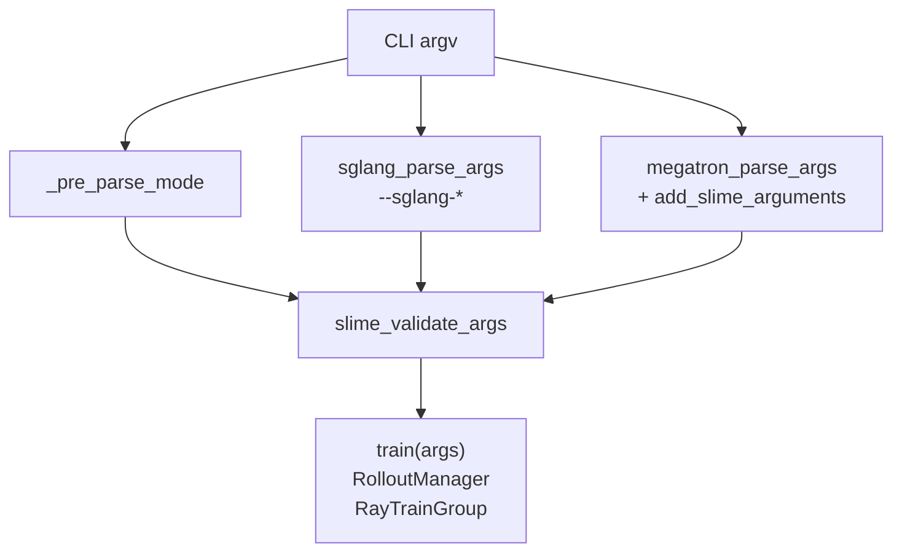
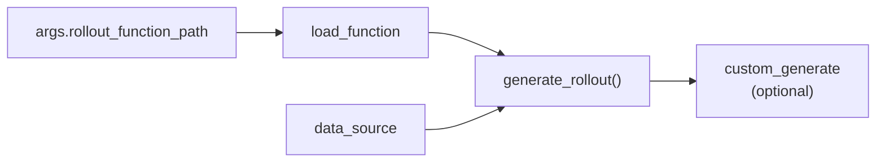
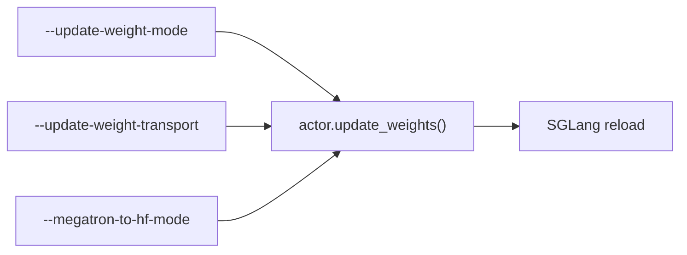
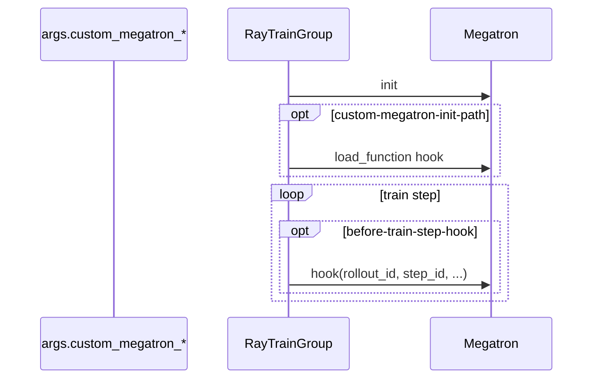

# Arguments-TrainRollout · 数据流与交互

---

## 1. 参数合并总览



**Code：**

```python
## 来源：slime/utils/arguments.py L1576-L1579
    if sglang_ns is not None:
        for key, value in vars(sglang_ns).items():
            setattr(args, key, value)
```

---

## 2. `*-path` 挂载数据流



**Code：**

```python
## 来源：slime/utils/misc.py L37-L45
def load_function(path):
    module_path, _, attr = path.rpartition(".")
    module = importlib.import_module(module_path)
    return getattr(module, attr)
```

**Code：**

```python
## 来源：slime/ray/rollout.py L437-L439
        data_source_cls = load_function(self.args.data_source_path)
        self.data_source = data_source_cls(args)
        self.generate_rollout = load_function(self.args.rollout_function_path)
```

---

## 3. Rollout 采样参数 → SGLang

**Explain：** `--rollout-temperature` 等由 rollout 函数读 `args`，组装 `sampling_params` 发 HTTP；SGLang server 侧另有 `--sglang-*` 静态配置。

**Code：**

```python
## 来源：slime/utils/arguments.py L341-L351
            parser.add_argument(
                "--rollout-temperature",
                type=float,
                default=1.0,
                help="the temperature for the inference engine during rollout.",
            )
            parser.add_argument(
                "--rollout-top-p", type=float, default=1.0, help="the top-p for the inference engine during rollout."
            )
            parser.add_argument(
                "--rollout-top-k", type=int, default=-1, help="the top-k for the inference engine during rollout."
            )
```

**Code：**

```python
## 来源：slime/backends/sglang_utils/arguments.py L176-L199
def sglang_parse_args():
    parser = argparse.ArgumentParser(add_help=False)
    add_sglang_arguments(parser)
    temp_parser = argparse.ArgumentParser(add_help=False)
    temp_parser.add_argument("--rollout-num-gpus-per-engine", type=int, default=1)
    ...
    args, _ = parser.parse_known_args()
    return args
```

---

## 4. Train 权重 → SGLang 参数链



**Code：**

```python
## 来源：slime/utils/arguments.py L128-L133
            parser.add_argument(
                "--megatron-to-hf-mode",
                choices=["raw", "bridge"],
                default="raw",
                help="The method to convert megatron weights to hugging face weights for SGLang.",
            )
```

---

## 5. Data jsonl → DataSource → Sample

**Code：**

```python
## 来源：slime/utils/arguments.py L631-L647
            parser.add_argument(
                "--prompt-data",
                type=str,
                default=None,
                help=(
                    "The path to the prompt data. "
                    "Currently we only support jsonl format, and each line should contains --input-key and --label-key ..."
                ),
            )
            parser.add_argument("--apply-chat-template", action="store_true", default=False)
            parser.add_argument("--input-key", type=str, default="input", help="JSON dataset key")
            parser.add_argument("--label-key", type=str, default=None, help="JSON dataset key")
```

**Comment：** `RolloutDataSourceWithBuffer` 默认实现见 [[11-DataSource-02-源码走读]]。

---

## 6. Algo 参数 → use_critic 副作用

**Code：**

```python
## 来源：slime/utils/arguments.py L1856
    args.use_critic = args.advantage_estimator == "ppo"
```

**Code：**

```python
## 来源：slime/utils/arguments.py L1921-L1923
    if args.n_samples_per_prompt == 1:
        args.grpo_std_normalization = False
        logger.info("n_samples_per_prompt is set to 1, grpo_std_normalization will be set to False.")
```

---

## 7. custom_generate 返回 list[Sample]

**Code：**

```python
## 来源：docs/en/get_started/customization.md L99-L114
async def custom_generate(args, sample: Sample, sampling_params: dict) -> list[Sample]:
    segments = await run_agent_and_split_segments(args, sample, sampling_params)
    rollout_id = sample.rollout_id if sample.rollout_id is not None else sample.index
    samples: list[Sample] = []
    for segment in segments:
        s = copy.copy(sample)
        ...
        s.rollout_id = rollout_id
        samples.append(s)
    return samples
```

**Comment：** 兄弟 sample 共享 `rollout_id`，供 loss reducer 按 rollout 聚合。

---

## 8. Megatron hook 路径训练侧流



---

## 9. SGLang router 参数流

**Code：**

```python
## 来源：slime/backends/sglang_utils/arguments.py L9-L31
def add_sglang_router_arguments(parser):
    parser.add_argument(
        "--sglang-router-ip",
        type=str,
        default=None,
        help="IP address of the SGLang router",
    )
    parser.add_argument(
        "--sglang-router-port",
        type=int,
        default=None,
        help="Port of the SGLang router",
    )
    parser.add_argument(
        "--sglang-router-request-timeout-secs",
        type=int,
        default=14400,
        help="Timeout for requests to the SGLang router in seconds",
    )
    RouterArgs.add_cli_args(parser, use_router_prefix=True, exclude_host_port=True)
```

---

## 10. global_batch_size 推导

**Code：**

```python
## 来源：slime/utils/arguments.py L1911-L1919
    if args.num_steps_per_rollout is not None:
        global_batch_size = args.rollout_batch_size * args.n_samples_per_prompt // args.num_steps_per_rollout
        if args.global_batch_size is not None:
            assert args.global_batch_size == global_batch_size, (...)
        args.global_batch_size = global_batch_size
```

---

## 11. plugin_contracts 与 CLI 等价

**Explain：** 测试用同样 path 字符串解析；可用 env `SLIME_CONTRACT_*` 或 CLI 覆盖。

**Code：**

```python
## 来源：docs/en/get_started/customization.md L487-L492
# python tests/plugin_contracts/test_plugin_rollout_contracts.py \
#   --rollout-function-path my_project.custom_rollout.generate_rollout
```

---

## 12. custom_config_path YAML 覆盖

**Code：**

```python
## 来源：slime/utils/arguments.py L1953-L1959
    if args.custom_config_path:
        with open(args.custom_config_path) as f:
            data = yaml.safe_load(f) or {}
        for k, v in data.items():
            if hasattr(args, k):
                logger.info(f"Warning: Argument {k} is already set to {getattr(args, k)}, will override with {v}.")
            setattr(args, k, v)
```

---

## 衔接

- 主循环消费 args → [[02-训练主循环-03-数据流与交互]]
- RM 运行时 → [[13-RM-FilterHub-00-MOC]]
- Loss 分支 → [[21-Loss-Advantages-00-MOC]]
