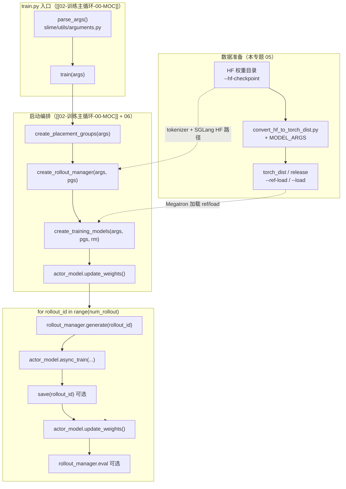

---
type: module-moc
module: 05-Tools-DataPrep
batch: "05"
doc_type: moc
title: "Tools-DataPrep · 专题概述"
tags:
  - slime/batch/05
  - slime/module/tools-dataprep
  - slime/doc/moc
updated: 2026-07-02
---

# Tools-DataPrep · 专题概述

> **源码基线：** slime commit `22cdc6e1`  
> **前置专题：** [[04-Arguments-TrainRollout-00-MOC]]  
> **后续专题：** [[06-PlacementGroup-00-MOC]]

## 本专题目标

读者**不打开 `slime/`**，仅读本专题六件套，应能：

1. 说明 Slime 训练前为何需要 **HF ↔ Megatron `torch_dist`** 双向转换
2. 走通 `convert_hf_to_torch_dist.py` 与 `convert_torch_dist_to_hf.py` 的主流程
3. 理解 `scripts/models/qwen3-4B.sh` 等 **MODEL_ARGS** 与 Megatron 无法从 checkpoint 读架构的关系
4. 将转换产物与训练脚本中的 `--ref-load` / `--load` / `--hf-checkpoint` 对应起来

## 源码范围

| 文件 | 职责 |
|------|------|
| `tools/convert_hf_to_torch_dist.py` | HF 权重 → Megatron `torch_dist`（训练入口权重） |
| `tools/convert_torch_dist_to_hf.py` | Megatron checkpoint → HF safetensors（导出 / SGLang 回灌） |
| `scripts/models/qwen3-4B.sh` | 代表模型 Megatron 超参数组 |
| `docs/en/get_started/quick_start.md` § Model Weight Conversion | 官方操作步骤与注意事项 |

## 六件套导航

| 文档 | 内容 |
|------|------|
| [[05-Tools-DataPrep-01-核心概念]] | HF / torch_dist、AutoBridge、CKPT 路径语义 |
| [[05-Tools-DataPrep-02-源码走读]] | 两个转换脚本按调用顺序精读（**主文档**） |
| [[05-Tools-DataPrep-03-数据流与交互]] | 权重在训练闭环中的位置与 IO |
| [[05-Tools-DataPrep-04-关键问题]] | embedding padding、多卡 PP、ROCm 等 FAQ |
| [[05-Tools-DataPrep-05-checkpoint]] | 读者自测清单 |

## 阶段 I 验收：parse_args → 主循环调用栈

本专题是阶段 I（[[02-训练主循环-00-MOC]]–[[05-Tools-DataPrep-00-MOC]]）的**阶段收官专题**。完成本专题后，应能画出从 CLI 到 RL 主循环的完整栈——数据准备专题负责栈**左侧**的权重形态，训练专题负责**右侧**的运行时编排。



**Explain：** 阶段 I 验收要求把「参数解析 → 资源分配 → 模型创建 → generate → train → update_weights」串成一条线。本专题补齐**训练前**一步：`MODEL_ARGS` + `convert_hf_to_torch_dist.py` 产出 `--ref-load` 指向的 Megatron 权重；`--hf-checkpoint` 仍保留给 tokenizer 与 SGLang 侧 HF 元数据。

**Code：**

```python
## 来源：train.py L101-L103
# 提交版本：22cdc6e1
if __name__ == "__main__":
    args = parse_args()
    train(args)
```

**Comment：**

- `parse_args()` 聚合 Slime + Megatron + SGLang 三组 CLI；其中 `--ref-load` / `--load` / `--hf-checkpoint` 的语义见 [[05-Tools-DataPrep-03-数据流与交互]]
- `train()` 内 bootstrap 与主循环见 [[02-训练主循环-00-MOC]]；本专题 MOC 图与之衔接
- 训练中途保存的 Megatron checkpoint 可用 `convert_torch_dist_to_hf.py` 导出，供 Hugging Face 生态或 `--update-weight-from-disk` 路径使用（[[25-WeightSync-Disk-00-MOC]] 详述）

## 本专题最关键入口

**Explain：** HF→Megatron 转换的入口是 `convert_hf_to_torch_dist.py` 的 `main()`：初始化分布式 → 解析 Megatron 参数 → 用 mbridge 灌权重 → `save_checkpoint` 并 rename 为 `release`。

**Code：**

```python
## 来源：tools/convert_hf_to_torch_dist.py L87-L137
# 提交版本：22cdc6e1
def main():
    configure_logger()
    # ... dist.init_process_group ...
    args = get_args()
    init(args)
    model = get_model(get_model_provider_func(args), ModelType.encoder_or_decoder, wrap_with_ddp=False)
    hf_model_path = args.hf_checkpoint
    bridge = AutoBridge.from_pretrained(hf_model_path, trust_remote_code=True)
    bridge.load_weights(model, hf_model_path, memory_efficient=True)
    save_checkpoint(1, model, None, None, 0)
    if dist.get_rank() == 0:
        tracker_filename = get_checkpoint_tracker_filename(args.save)
        with open(tracker_filename, "w") as f:
            f.write("release")
        source_dir = get_checkpoint_name(args.save, 1, False, return_base_dir=True)
        target_dir = get_checkpoint_name(args.save, -1, True, return_base_dir=True)
        shutil.move(source_dir, target_dir)
```

**Comment：**

- `get_args()` 复用 Megatron 的 `parse_args`，并注入 Slime 默认（见 [[05-Tools-DataPrep-02-源码走读]] §1）
- rank 0 将 iter_0000001 目录 **move** 为 `release/`，与 Megatron 训练 resume 约定一致
- 多卡大模型需 `torchrun` 启动；脚本会自动推导 pipeline parallel size（见 [[05-Tools-DataPrep-04-关键问题]]）
