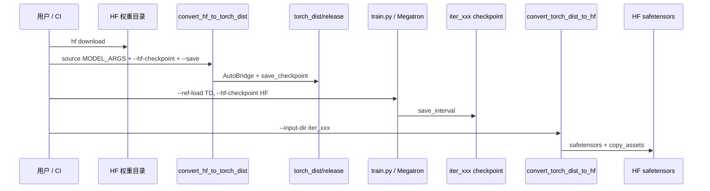

# Tools-DataPrep · 数据流与交互

## 端到端数据流



## 训练侧 checkpoint 参数流

**Explain：** Slime 训练启动时，三条路径各司其职：`hf-checkpoint` 走 HF 生态，`ref-load`/`load` 走 Megatron dist ckpt。

**Code：**

```python
# 来源：train.py L9-L26（bootstrap 摘录）
# 提交版本：22cdc6e1
def train(args):
    configure_logger()
    pgs = create_placement_groups(args)
    init_tracking(args)
    rollout_manager, num_rollout_per_epoch = create_rollout_manager(args, pgs["rollout"])
    actor_model, critic_model = create_training_models(args, pgs, rollout_manager)
    actor_model.update_weights()
```

**Comment：**

- `create_training_models` 内部 Megatron Actor 读 `--load` 或 fallback `--ref-load`（批次 17）
- `create_rollout_manager` 用 `--hf-checkpoint` 初始化 SGLang / tokenizer（批次 08、15）
- 首次 `update_weights()` 把 Megatron 权重推到 Rollout；依赖本批准备好的 torch_dist

## HF→torch_dist 目录布局

**Explain：** `--save` 指定根目录；转换完成后 tracker 指向 `release`，其下为 dist shard + `.metadata` + `common.pt`（Megatron 标准布局）。

**Code：**

```python
# 来源：tools/convert_hf_to_torch_dist.py L139-L146
# 提交版本：22cdc6e1
tracker_filename = get_checkpoint_tracker_filename(args.save)
with open(tracker_filename, "w") as f:
    f.write("release")
source_dir = get_checkpoint_name(args.save, 1, False, return_base_dir=True)
target_dir = get_checkpoint_name(args.save, -1, True, return_base_dir=True)
shutil.move(source_dir, target_dir)
```

**Comment：**

- 典型路径：`/root/Qwen3-4B_torch_dist/release/`
- `--ref-load` 指向 `_torch_dist` 根或 `release` 父级，由 Megatron loader 解析 tracker
- 与训练 `--save` 写出的 iter 目录结构相同，便于 resume

## torch_dist→HF 输出布局

**Explain：** `save_tensors` 写分片 safetensors + index；`copy_assets` 从 origin HF 复制非权重文件。

**Code：**

```python
# 来源：tools/convert_torch_dist_to_hf.py L146-L175
# 提交版本：22cdc6e1
metadata = {"metadata": {"total_size": total_size}, "weight_map": {}}
for i, tensors in enumerate(modeltensors):
    filename = f"model-{i:05d}-of-{num_files:05d}.safetensors"
    for key in tensors.keys():
        metadata["weight_map"][key] = filename
index_filepath = os.path.join(output_dir, "model.safetensors.index.json")
json.dump(metadata, open(index_filepath, "w"), indent=2)

def copy_assets(origin_hf_dir, output_dir):
    for filename in os.listdir(origin_hf_dir):
        if filename == "model.safetensors.index.json" or filename.endswith(".safetensors"):
            continue
        shutil.copy(os.path.join(origin_hf_dir, filename), os.path.join(output_dir, filename))
```

**Comment：**

- 必须提供 `--origin-hf-dir` 才能复制 tokenizer、generation_config 等
- 导出目录可直接 `hf upload` 或给 SGLang `--model-path`（纯推理场景）
- RL 训练内权重同步通常**不**走此离线脚本，而走 `update_weights`（批次 24–25）

## convert_to_hf 模型分发

**Explain：** 反向转换按 Hugging Face config 类名（小写）路由到各架构 converter。

**Code：**

```python
# 来源：slime/backends/megatron_utils/megatron_to_hf/__init__.py L25-L50
# 提交版本：22cdc6e1
def convert_to_hf(args, model_name, name, param, quantization_config=None):
    param = remove_padding(name, param, args.vocab_size)
    converted_named_tensors = _convert_to_hf_core(args, model_name, name, param)
    return quantize_params(args, name, converted_named_tensors, quantization_config)

def _convert_to_hf_core(args, model_name, name, param):
    if "qwen3moe" in model_name:
        converted_named_tensors = convert_qwen3moe_to_hf(args, name, param)
    elif "glm4" in model_name:
        converted_named_tensors = convert_glm4_to_hf(args, name, param)
    elif "qwen2" in model_name or "qwen3" in model_name:
        converted_named_tensors = convert_qwen2_to_hf(args, name, param)
    # ... 更多架构 ...
```

**Comment：**

- Qwen3-4B dense 通常走 `qwen2` / `qwen3` 分支（视 AutoConfig 类名）
- 新模型需在 `megatron_to_hf/` 增加 processor（与 plugins 配合）
- 在线 `update_weights` 复用同一套 naming 逻辑（批次 26）

## 与主循环的交互边界

| 阶段 | 是否经过本批工具 | 说明 |
|------|-----------------|------|
| 训练冷启动 | ✅ 前置 | `--ref-load` 来自 convert_hf |
| rollout generate | ❌ | 用 SGLang + 内存权重 |
| async_train | ❌ | Megatron 读已有 torch_dist |
| save_model | ⚠️ 间接 | 产出 iter_xxx，**可**用 convert_torch_dist_to_hf 导出 |
| update_weights | ❌ 热路径 | Megatron→SGLang 在线同步，非本脚本 |

**Explain：** 主循环每轮 `generate → train → update_weights` 不调用 tools/；本批脚本只在 **训练前** 与 **训练后导出** 两个时间点介入。

**Code：**

```python
# 来源：train.py L63-L89（主循环摘录）
# 提交版本：22cdc6e1
for rollout_id in range(args.start_rollout_id, args.num_rollout):
    rollout_data_ref = ray.get(rollout_manager.generate.remote(rollout_id))
    ray.get(actor_model.async_train(rollout_id, rollout_data_ref))
    if should_run_periodic_action(rollout_id, args.save_interval, ...):
        save(rollout_id)
    actor_model.update_weights()
```

**Comment：**

- `save(rollout_id)` 写 Megatron dist ckpt 到 `--save`；与 `--ref-load` 格式一致
- 若需 Hugging Face 发布，对 `save` 下某 `iter_xxx` 跑 `convert_torch_dist_to_hf.py`
- 阶段 I 验收栈图见 [[05-Tools-DataPrep-00-MOC#阶段 I 验收：parse_args → 主循环调用栈]]

## Prompt 数据集（边界说明）

quick_start 的 **dataset download**（`dapo-math-17k` 等）属于 Rollout 数据准备，经 `--prompt-data` 进入 `data_source`，**不是**本批权重工具范畴。本批仅覆盖 **模型权重** HF↔Megatron；prompt JSONL 见批次 11 DataSource。

## 上下游模块索引

| 方向 | 模块 | 批次 |
|------|------|------|
| 上游 | Hugging Face Hub / 本地下载 | quick_start § Model and Dataset Download |
| 下游 | Megatron Actor 加载 | 17-Megatron-Actor-Init |
| 下游 | update_weights / megatron_to_hf | 24–26 |
| 平行 | SGLang `--hf-checkpoint` | 15-SGLang-Engine |
