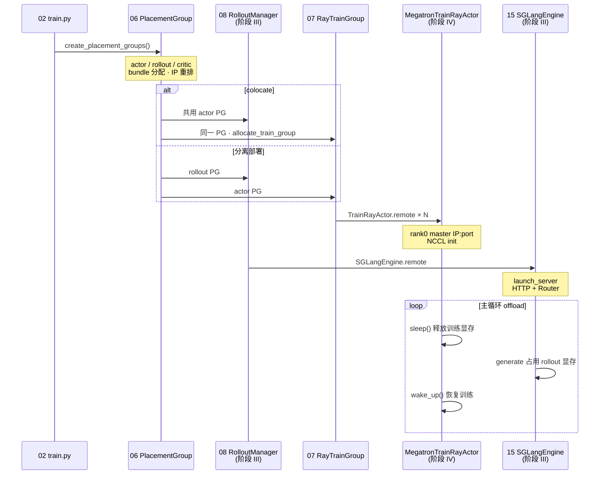

# 阶段 II · Ray 编排（PlacementGroup → RayTrainGroup）

> **你只需阅读本目录，不必打开 `slime/` 源码。**
> 内嵌代码对应 slime Git commit `22cdc6e1`。

---

## 本阶段解决什么问题

阶段 I 讲清了「启动链上谁被创建」。阶段 II 回答：**Slime 如何通过 Ray Placement Group 锁定 GPU bundle，并在 `--colocate` / `--offload-rollout` / `--offload-train` 组合下让 actor 与 rollout 分时复用同一张卡？**

两个专题覆盖 Ray 资源编排全链路：

| 模块 | 角色 | 一句话 |
|------|------|--------|
| [[06-PlacementGroup-00-MOC|06 PlacementGroup]] | GPU 预订 | `create_placement_groups()`、bundle 重排、colocate 共用 PG |
| [[07-RayTrainGroup-00-MOC|07 RayTrainGroup]] | 训练进程组 | TrainRayActor × world_size、NCCL init、`async_train` / `update_weights` |

---

## 端到端时序（阶段 II 验收图）

满足阶段 II 验收：「`--colocate` / `--offload-*` 下 PG + RayTrainGroup 如何分时复用 GPU」。

**Explain：** PG 是 **一次性 GPU 锁定**；colocate 模式下 actor 与 rollout **共享 bundle**，靠 `sleep` / `wake_up` 与 engine pause 分时复用显存，而非两张卡各跑一半。

---

## 零基础一句话

**像「订会议室 + 排座位号」：** 06 一次性锁定 N 块 GPU 并重排 bundle 顺序；07 按 rank 创建 TrainRayActor 并广播 NCCL；colocate 时 actor 与 rollout 共用同一间「会议室」，靠 offload 轮流上台。

---

## 推荐阅读顺序

严格按专题顺序 06 → 07。若时间紧，最低闭环：**06 → 07/01-核心概念**。

| 顺序 | 文档 | 必读理由 |
|------|------|----------|
| 1 | [[06-PlacementGroup-01-核心概念|06/01-核心概念]] | bundle、colocate、IP 重排术语 |
| 2 | [[06-PlacementGroup-02-源码走读|06/02-源码走读]] | `create_placement_groups` 主路径 |
| 3 | [[07-RayTrainGroup-01-核心概念|07/01-核心概念]] | TrainRayActor、ObjectRef 聚合 |
| 4 | [[07-RayTrainGroup-02-源码走读|07/02-源码走读]] | `async_init` / `async_train` API |
| 5 | [[06-PlacementGroup-04-关键问题|06/04-关键问题]] | colocate 强制 offload 分支 |

---

## 阶段衔接

| 方向 | 模块 | 衔接点 |
|------|------|--------|
| ← 上一阶段 | 01 启动与入口 | `train()` 调用 `create_placement_groups()` |
| → 下一阶段 | 08–16 Rollout 生成 | PG bundle → `start_rollout_servers` / SGLangEngine |
| → 训练侧 | 17 Megatron Actor | `allocate_train_group` → RayTrainGroup |
| → 权重同步 | 24–25 | `update_weights` 经 RayTrainGroup 广播到 engine |
| → SGLang 对照 | [[07-Scheduler-00-MOC]] | engine 内 SGLang 调度（推理侧） |

---

## 验证建议（零基础可试）

1. **colocate 组合：** 对照 [[03-Arguments-Ray-04-关键问题]]，列出 `--colocate` 开启时 `--offload-rollout` / `--offload-train` 的强制关系。
2. **bundle 拓扑：** 在 [[06-PlacementGroup-03-数据流与交互]] 的 mermaid 上，口述 actor PG 与 rollout PG 在分离模式下的差异。
3. **Ray 进程：** 启动小规模训练后，用 Ray Dashboard 确认 TrainRayActor 数量 = `--actor-num-gpus-per-node × --actor-num-nodes`。

---

## 模块导航

| 模块 | 目录 | 状态 |
|------|------|------|
| 06 | [[06-PlacementGroup-00-MOC|PlacementGroup]] | ✅ |
| 07 | [[07-RayTrainGroup-00-MOC|RayTrainGroup]] | ✅ |

← [[Slime-01-启动与入口-00-MOC|启动与入口]] · → [[03-Rollout生成-00-MOC|阶段 III：Rollout 生成]]
