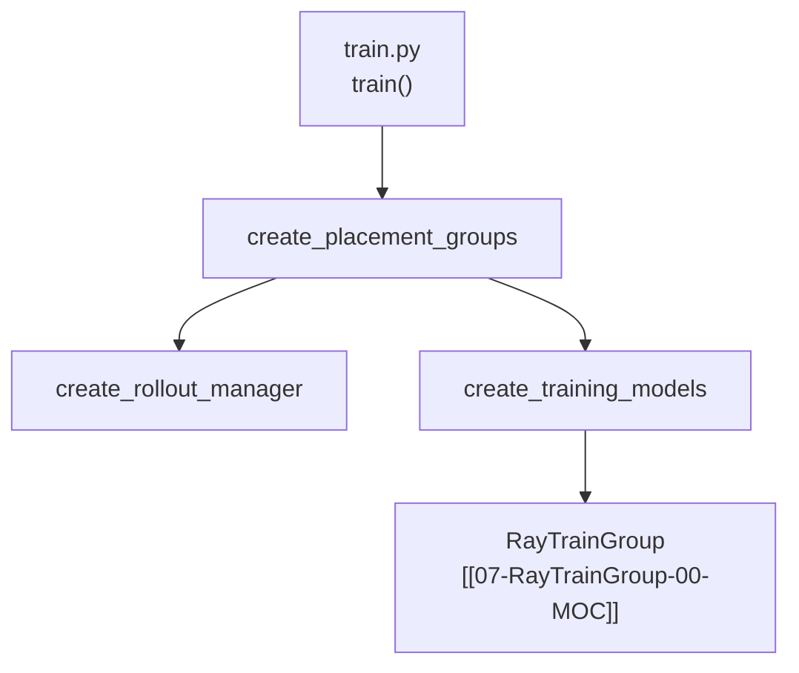

---
type: module-moc
module: 06-PlacementGroup
batch: "06"
doc_type: moc
title: "Placement Group · 专题概述"
tags:
  - slime/batch/06
  - slime/module/placement-group
  - slime/doc/moc
updated: 2026-07-02
---

# Placement Group 与 GPU 资源分配

> **源码范围：** `slime/ray/placement_group.py`（PG 创建/拆分/colocate）、`slime/ray/utils.py`（Ray 环境变量、Lock）

---

## 本模块在架构中的位置

`create_placement_groups()` 是 Slime 训练启动链上 **第一个 GPU 资源决策点**：在 `train.py` 里先于 RolloutManager 与 Megatron Actor 执行，决定 actor / rollout / critic 各子系统占用哪些 GPU bundle，以及 colocate 模式下是否共用同一张 PG。



---

## 零基础一句话

**像「订会议室 + 排座位号」**：Ray Placement Group 一次性锁定 N 块 GPU；Slime 再按 IP+GPU ID 重排 bundle 顺序，保证 Megatron rank 0 与 SGLang engine 0 的拓扑可预测；`--colocate` 时 actor 与 rollout **共用同一 PG**，靠 offload 分时复用显存。

---

## 六件套阅读顺序

| 顺序 | 文件 | 一句话说明 |
|------|------|------------|
| 01 | [[06-PlacementGroup-01-核心概念]] | PG、bundle、colocate、rollout_offset 术语 |
| 02 | [[06-PlacementGroup-02-源码走读]] | `_create_placement_group` → `create_training_models` 逐步精读 |
| 03 | [[06-PlacementGroup-03-数据流与交互]] | actor/rollout/critic 三套 PG 视图如何拆分 |
| 04 | [[06-PlacementGroup-04-关键问题]] | debug 模式、external rollout、autoscaler 等待 |
| ✓ | [[06-PlacementGroup-05-checkpoint]] | 验收：能否画 PG 分配图 |

---

## 核心源码锚点

**Explain：** `train()` 入口先创建 PG，再分别装配 Rollout 与 Training 侧 Actor；PG 字典同时携带 **重排后的 bundle index** 与 **物理 GPU ID**，供下游 `RayTrainGroup` 绑定 rank。

**Code：**

```python
## 来源：slime/ray/placement_group.py L120-L137
# 提交版本：22cdc6e1
def create_placement_groups(args):
    """Create placement groups for actor, critic, and rollout engines."""

    num_gpus, rollout_offset = _get_placement_group_layout(args)

    logger.info(f"Creating placement group with {num_gpus} GPUs...")
    pg, actor_pg_reordered_bundle_indices, actor_pg_reordered_gpu_ids = _create_placement_group(num_gpus)
    rollout_pg_reordered_bundle_indices = actor_pg_reordered_bundle_indices[rollout_offset:]
    rollout_pg_reordered_gpu_ids = actor_pg_reordered_gpu_ids[rollout_offset:]

    result = {
        "actor": (pg, actor_pg_reordered_bundle_indices, actor_pg_reordered_gpu_ids),
        "rollout": (pg, rollout_pg_reordered_bundle_indices, rollout_pg_reordered_gpu_ids),
    }

    result["critic"] = result["actor"] if args.use_critic else None

    return result
```

**Comment：**

- `rollout_offset` 非 0 时 actor 与 rollout **物理分离**（非 colocate）
- colocate 时 `rollout_offset=0`，actor 与 rollout 视图指向 **同一 PG 同一套 bundle**
- critic 默认复用 actor PG（同 Megatron 训练拓扑）

---

## 衔接专题

| 方向 | 专题 | 关系 |
|------|------|------|
| 上游 | [[05-Tools-DataPrep-00-MOC]] | 训练前 HF→torch_dist；PG 与 convert 无关 |
| 下游 | [[07-RayTrainGroup-00-MOC]] | `allocate_train_group` 消费 `pgs["actor"]` |
| 下游 | [[08-RolloutManager-00-MOC]] | `create_rollout_manager(args, pg)` 绑定 rollout bundle |
| 下游 | [[17-Megatron-Actor-Init-00-MOC]] | `create_training_models` → `async_init` |

---

## 验收标准

- 能画出 colocate / 非 colocate / debug 三种模式下的 PG 分配图
- 能解释 `rollout_offset` 与 `max(actor, rollout)` 的含义
- 能说明 `InfoActor` + `sort_key` 为何需要重排 bundle
