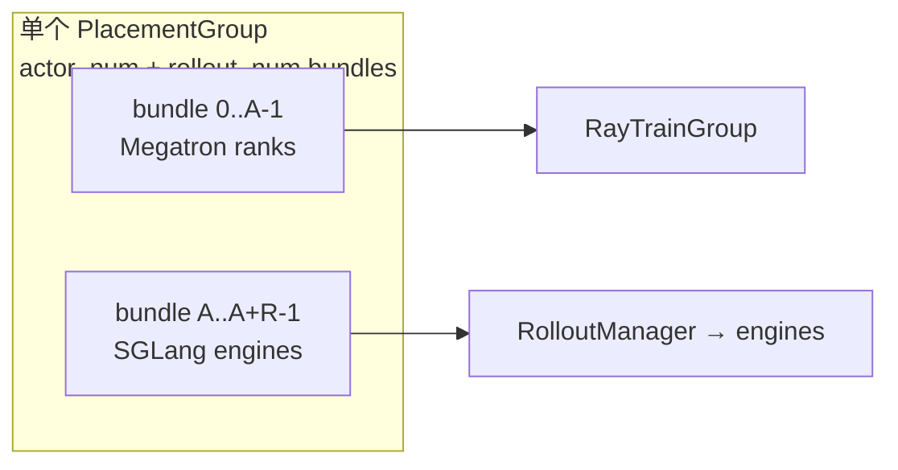
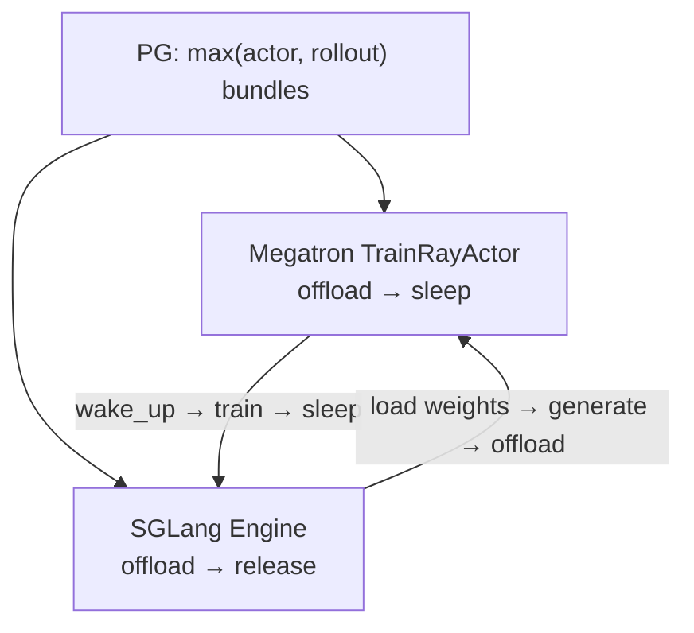

# Placement Group · 数据流与交互

> 聚焦 **PG 字典如何在 train / rollout / critic 之间流转**，以及 colocate 下的 GPU 分时复用。

---

## 1. train.py 启动链

**Explain：** PG 创建是 `train()` 内第二步（logger 之后），输出 `pgs` 字典贯穿后续所有 Ray 组件。

**Code：**

```python
## 来源：slime/train.py（调用链，placement_group 为入口）
# 提交版本：22cdc6e1
# configure_logger()
# pgs = create_placement_groups(args)
# rollout_manager, num_rollout_per_epoch = create_rollout_manager(args, pgs["rollout"])
# actor_model, critic_model = create_training_models(args, pgs, rollout_manager)
```

**Comment：**

- RolloutManager **先于** Training models 创建（需 `num_rollout_per_epoch`）
- `create_training_models` 需要 `rollout_manager` 引用做 `set_rollout_manager`

---

## 2. PG 字典结构（非 colocate）

**Explain：** 分离模式下，单个 PG 包含 `actor_num + rollout_num` 个 bundle；actor 占 `[0, actor_num)`，rollout 占 `[actor_num, total)`。



**Code：**

```python
## 来源：slime/ray/placement_group.py L127-L133
# 提交版本：22cdc6e1
rollout_pg_reordered_bundle_indices = actor_pg_reordered_bundle_indices[rollout_offset:]
rollout_pg_reordered_gpu_ids = actor_pg_reordered_gpu_ids[rollout_offset:]

result = {
    "actor": (pg, actor_pg_reordered_bundle_indices, actor_pg_reordered_gpu_ids),
    "rollout": (pg, rollout_pg_reordered_bundle_indices, rollout_pg_reordered_gpu_ids),
}
```

**Comment：**

- 两个视图共享 **同一个** `pg` 对象，仅 bundle index 列表不同
- `rollout_offset = actor_num_gpus`（非 colocate）

---

## 3. colocate 模式数据流

**Explain：** colocate 时 `rollout_offset=0`，actor 与 rollout 视图 **完全相同**；训练与推理靠 `--offload-train` / `--offload-rollout` 在时间上互斥占用 GPU。



**Code：**

```python
## 来源：slime/ray/placement_group.py L114-L115
# 提交版本：22cdc6e1
if args.colocate:
    return max(actor_num_gpus, args.rollout_num_gpus), 0
```

**Comment：**

- 若 `rollout_num_gpus > actor_num_gpus`，多出的 bundle 仅 rollout 使用（actor world_size 较小）
- 反之 actor 占满 PG，rollout engine 数 ≤ actor bundle 数

---

## 4. critic 与 actor PG 复用

**Explain：** critic TrainGroup 使用 `pgs["critic"]`，在 `use_critic=True` 时等于 `pgs["actor"]`——两套 Megatron 进程 **共享 GPU 拓扑**。

**Code：**

```python
## 来源：slime/ray/placement_group.py L135, L182-L188
# 提交版本：22cdc6e1
result["critic"] = result["actor"] if args.use_critic else None
# ...
critic_model = allocate_train_group(
    args=critic_args,
    num_nodes=args.critic_num_nodes,
    num_gpus_per_node=args.critic_num_gpus_per_node,
    pg=pgs["critic"],
    role="critic",
)
```

**Comment：**

- critic 可与 actor 不同 `num_nodes` / `num_gpus_per_node`，但 **PG bundle 集合相同**
- world_size 不等时会占用 PG 的前 `critic_world_size` 个 bundle（与 actor 重叠）

---

## 5. RolloutManager 接收的 PG 参数

**Explain：** `RolloutManager.__init__` 接收 rollout 三元组，内部 SGLang engine 按 `reordered_bundle_indices[i]` 绑定 GPU。

**Code：**

```python
## 来源：slime/ray/placement_group.py L230
# 提交版本：22cdc6e1
rollout_manager = RolloutManager.options(**rollout_manager_options).remote(args, pg)
```

**Comment：**

- 此处 `pg` = `pgs["rollout"]`，详见 [[08-RolloutManager-03-数据流与交互]]
- external rollout 模式下 PG 可能为空，RolloutManager 走 HTTP 外部引擎

---

## 6. 权重检查与 snapshot（可选路径）

**Explain：** `check_weight_update_equal` 时在启动链上 snapshot SGLang 权重，供 CI 验证 update_weights 一致性。

**Code：**

```python
## 来源：slime/ray/placement_group.py L239-L241
# 提交版本：22cdc6e1
if args.check_weight_update_equal:
    ray.get(rollout_manager.check_weights.remote(action="snapshot"))
    ray.get(rollout_manager.check_weights.remote(action="reset_tensors"))
```

**Comment：**

- 发生在 first `update_weights` 之前
- 与 [[24-WeightSync-Dist-00-MOC]] 的 NCCL broadcast 验证配合

---

## 7. 与 RayTrainGroup 的 bundle 绑定

**Explain：** TrainGroup 解包 PG 三元组，用 `PlacementGroupSchedulingStrategy` 把 rank `i` 钉在 `reordered_bundle_indices[i]`。

**Code：**

```python
## 来源：slime/ray/actor_group.py L48-L53, L108-L115
# 提交版本：22cdc6e1
def _allocate_gpus_for_actor(self, pg, num_gpus_per_actor):
    world_size = self._num_nodes * self._num_gpus_per_node
    assert pg is not None
    pg, reordered_bundle_indices, _reordered_gpu_ids = pg
    # ...
    actor = TrainRayActor.options(
        scheduling_strategy=PlacementGroupSchedulingStrategy(
            placement_group=pg,
            placement_group_bundle_index=reordered_bundle_indices[rank],
        ),
    ).remote(world_size, rank, master_addr, master_port)
```

**Comment：**

- PG 模块 **只负责** 产生 `reordered_bundle_indices`
- TrainGroup 负责 NCCL env、Actor 类选型，见 [[07-RayTrainGroup-02-源码走读]]
