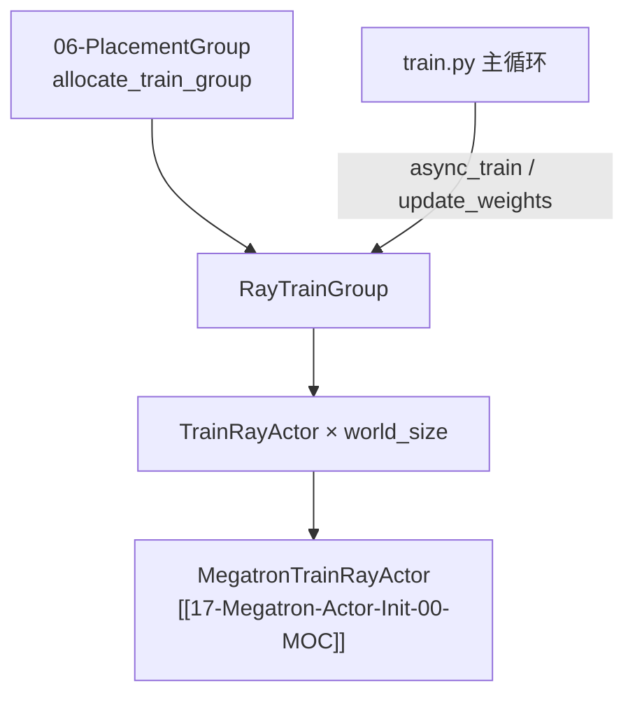

---
type: module-moc
module: 07-RayTrainGroup
batch: "07"
doc_type: moc
title: "RayTrainGroup · 专题概述"
tags:
  - slime/batch/07
  - slime/module/ray-train-group
  - slime/doc/moc
updated: 2026-07-02
---

# RayTrainGroup 与 TrainRayActor

> **源码范围：** `actor_group.py`（RayTrainGroup API）、`train_actor.py`（分布式 init）、`ray_actor.py`（master 地址）

---

## 本模块在架构中的位置

`RayTrainGroup` 是 Slime 训练侧的 **Ray 进程组 façade**：封装 world_size 个 TrainRayActor，对外提供 `async_init` / `async_train` / `update_weights` 等 **返回 ObjectRef 列表** 的 API；driver 侧 `ray.get` 聚合结果。



---

## 零基础一句话

**像「班主任 + 一排学生」**：Placement Group 订好座位后，RayTrainGroup 按 rank 创建 TrainRayActor 进程；rank 0 先报 master IP:port，其余 rank 加入 NCCL；之后 driver 用 `.remote()` 广播 init/train/update 指令。

---

## 六件套阅读顺序

| 顺序 | 文件 | 一句话说明 |
|------|------|------------|
| 01 | [[07-RayTrainGroup-01-核心概念]] | ObjectRef 列表、fractional GPU、runtime_env |
| 02 | [[07-RayTrainGroup-02-源码走读]] | `_allocate_gpus_for_actor` 与全套 `.remote()` API |
| 03 | [[07-RayTrainGroup-03-数据流与交互]] | driver ↔ actor 消息流与 train 闭环 |
| 04 | [[07-RayTrainGroup-04-关键问题]] | master 发现、NUMA、offload env |
| ✓ | [[07-RayTrainGroup-05-checkpoint]] | 验收：能否说明 RayTrainGroup API |

---

## 核心源码锚点

**Explain：** `async_*` 方法 **不** `ray.get`，只返回 ref 列表，让 driver 自行并行等待——这是 Slime 与 OpenRLHF 风格 Ray 训练框架的约定。

**Code：**

```python
## 来源：slime/ray/actor_group.py L121-L129
# 提交版本：22cdc6e1
def async_init(self, args, role, with_ref=False, with_opd_teacher=False):
    """
    Allocate GPU resourced and initialize model, optimzier, local ckpt, etc.
    """
    self.args = args
    return [
        actor.init.remote(args, role, with_ref=with_ref, with_opd_teacher=with_opd_teacher)
        for actor in self._actor_handlers
    ]
```

**Comment：**

- `create_training_models` 里 `ray.get(actor_model.async_init(...))` 等待全部 rank
- 对比 `update_weights()` 在 Group 内部已 `ray.get`

---

## 衔接专题

| 方向 | 专题 | 关系 |
|------|------|------|
| 上游 | [[06-PlacementGroup-00-MOC]] | PG 三元组传入 `RayTrainGroup.__init__` |
| 下游 | [[17-Megatron-Actor-Init-00-MOC]] | 默认 `MegatronTrainRayActor` 实现 init/train |
| 下游 | [[19-Train-Step-00-MOC]] | `async_train` → `MegatronTrainRayActor.train` |
| 下游 | [[24-WeightSync-Dist-00-MOC]] | `update_weights` → 各 rank broadcast |
