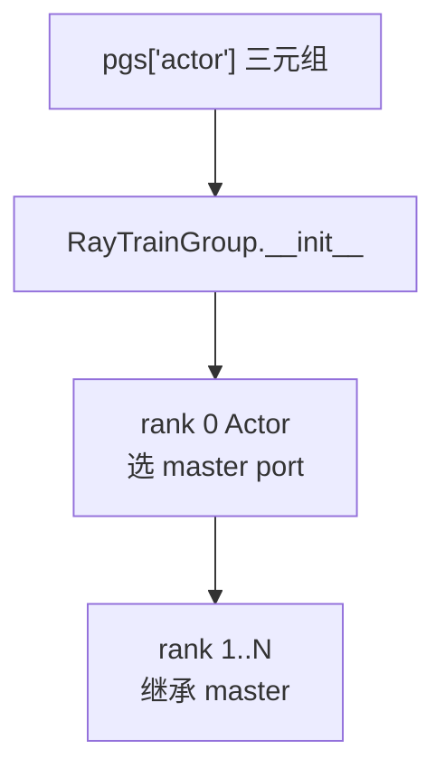
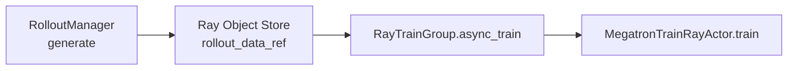
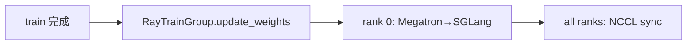

# RayTrainGroup · 数据流与交互

---

## 1. 启动阶段：PG → Actor 进程



**Explain：** PG 只参与 **调度**；NCCL 拓扑由 TrainRayActor 自行 bootstrap。

**Code：**

```python
## 来源：slime/ray/actor_group.py L117-L118
# 提交版本：22cdc6e1
if rank == 0:
    master_addr, master_port = ray.get(actor.get_master_addr_and_port.remote())
```

---

## 2. init 阶段数据流

**Explain：** driver `ray.get(async_init(...))` → 各 rank 加载 Megatron → 返回 start_rollout_id → Group 尚未持有 rollout_manager。

**Code：**

```python
## 来源：slime/ray/placement_group.py L191-L210
# 提交版本：22cdc6e1
actor_start_rollout_ids = ray.get(
    actor_model.async_init(actor_args, role="actor", ...)
)
actor_model.set_rollout_manager(rollout_manager)
```

**Comment：**

- init 与 set_rollout_manager **分两阶段**，因 init 耗时长且不需 RolloutManager
- 见 [[06-PlacementGroup-02-源码走读]] §5

---

## 3. 训练闭环中的 async_train



**Explain：** `rollout_data_ref` 是 **单个** ObjectRef，Megatron 各 rank 从 object store 拉取同一份 rollout batch dict（内部再按 DP 切分）。

**Code：**

```python
## 来源：slime/ray/actor_group.py L146-L148
# 提交版本：22cdc6e1
return [
    actor.train.remote(rollout_id, rollout_data_ref, external_data=external_data)
    for actor in self._actor_handlers
]
```

**Comment：**

- 大数据路径可用 nixl tensor transport（绕过 object store）
- 详见 [[20-Train-Data-00-MOC]]

---

## 4. update_weights 闭环

**Explain：** train 完成后 driver 调用 `actor_model.update_weights()`；Group 内同步等待全部 rank，rank 0 负责推 SGLang。



**Code：**

```python
## 来源：slime/ray/actor_group.py L155-L157
# 提交版本：22cdc6e1
return ray.get([actor.update_weights.remote() for actor in self._actor_handlers])
```

**Comment：**

- 与 `async_train` 不同：**必须同步** 才能开始下一轮 generate
- 见 [[24-WeightSync-Dist-00-MOC]]

---

## 5. colocate offload 时序

**Explain：** Group 的 `offload`/`onload` 映射到 Actor `sleep`/`wake_up`，与 RolloutManager offload 交替。

**Code：**

```python
## 来源：slime/ray/actor_group.py L159-L163
# 提交版本：22cdc6e1
def onload(self):
    return ray.get([actor.wake_up.remote() for actor in self._actor_handlers])

def offload(self):
    return ray.get([actor.sleep.remote() for actor in self._actor_handlers])
```

**Comment：**

- train.py 在 generate 前 offload train / onload rollout（标志位控制）
- Megatron sleep 释放显存给 SGLang（[[17-Megatron-Actor-Init-00-MOC]]）

---

## 6. parallel config 上报 RolloutManager

**Explain：** rank 0 在 set_rollout_manager 时将 DP/CP/VPP 信息推给 Rollout，用于 batch 构造。

**Code：**

```python
## 来源：slime/ray/train_actor.py L125-L128
# 提交版本：22cdc6e1
if not self.args.debug_rollout_only and self.args.rank == 0:
    ray.get(self.rollout_manager.set_train_parallel_config.remote(self.train_parallel_config))
```

**Comment：**

- 只需 rank 0 上报一次
- RolloutManager 缓存 config 供 [[10-Sample-Contracts-00-MOC]] 的 batch 对齐

---

## 7. clear_memory 辅助路径

**Explain：** Group 提供 `clear_memory` 统一触发各 rank Python GC + CUDA cache clear。

**Code：**

```python
## 来源：slime/ray/actor_group.py L165-L166
# 提交版本：22cdc6e1
def clear_memory(self):
    return ray.get([actor.clear_memory.remote() for actor in self._actor_handlers])
```

**Comment：**

- `TrainRayActor.clear_memory` 在 debug_rollout_only 时 no-op
- OOM 恢复或 CI 路径可能调用
