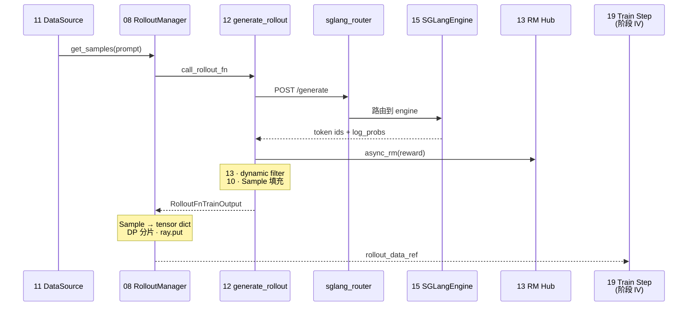

# 阶段 III · Rollout 生成（prompt → Sample → rollout_data）

> **你只需阅读本目录，不必打开 `slime/` 源码。**
> 内嵌代码对应 slime Git commit `22cdc6e1`。
> SGLang 推理侧建议前置阅读 [[03-HTTP-Server-00-MOC]]、[[07-Scheduler-00-MOC]]。

---

## 本阶段解决什么问题

阶段 II 讲清了「GPU 如何分给 Rollout 子系统」。阶段 III 回答：**prompt 如何经 SGLang Router 生成 response、计算 reward、封装为 `Sample`，再 tensor 化为 `rollout_data_ref` 交给训练侧？**

九个专题覆盖 Rollout 子系统全链路：

| 模块 | 角色 | 一句话 |
|------|------|--------|
| [[08-RolloutManager-00-MOC|08 RolloutManager]] | 编排中枢 | `generate(rollout_id)`、DP 分片、`ray.put` |
| [[09-EngineTopology-00-MOC|09 EngineTopology]] | 引擎拓扑 | SglangConfig、ServerGroup、Router 启动 |
| [[10-Sample-Contracts-00-MOC|10 Sample-Contracts]] | 数据契约 | `Sample` / `RolloutBatch` 字段语义 |
| [[11-DataSource-00-MOC|11 DataSource]] | 数据源 | prompt 加载、buffer 优先策略 |
| [[12-SGLang-Rollout-00-MOC|12 SGLang-Rollout]] | 默认 rollout | `generate_rollout` 异步批量生成 |
| [[13-RM-FilterHub-00-MOC|13 RM-FilterHub]] | 奖励与过滤 | custom RM、dynamic filter、rm_type 分支 |
| [[14-Alt-Rollout-00-MOC|14 Alt-Rollout]] | 替代路径 | fully-async / streaming / SFT / OPD 等 |
| [[15-SGLang-Engine-00-MOC|15 SGLang-Engine]] | 引擎封装 | Ray Actor 薄封装、HTTP generate、权重更新接口 |
| [[16-External-Engines-00-MOC|16 External-Engines]] | 外部引擎 | 独立部署 SGLang、HTTP 发现与 Router 注册 |

---

## 端到端时序（阶段 III 验收图）

满足阶段 III 验收：「prompt → SGLangEngine.generate → Sample → rollout_data tensor 化」。

**Explain：** Rollout 侧是 **三角架构** 的一角：DataSource 供 prompt，RolloutManager orchestrate，SGLangEngine 执行推理；`Sample` 是 Rollout 与 Train 之间的 **唯一数据载体**。

---

## 零基础一句话

**像「工厂采样线」：** 11 是原料仓，09/15/16 是产线布局，12 是默认流水线，13 是质检打分，10 是包装规格，08 是车间主任把成品按 DP 装箱发给训练车间。

---

## 推荐阅读顺序

严格按专题顺序 08 → 09 → 10 → 11 → 12 → 13 → 15 → 14 → 16。若时间紧，最低闭环：**08 → 10 → 12 → 15**。

| 顺序 | 文档 | 必读理由 |
|------|------|----------|
| 1 | [[08-RolloutManager-01-核心概念|08/01-核心概念]] | 三角架构、Ray Actor 角色 |
| 2 | [[10-Sample-Contracts-01-核心概念|10/01-核心概念]] | Sample 字段与 RolloutBatch |
| 3 | [[12-SGLang-Rollout-02-源码走读|12/02-源码走读]] | 默认 `generate_rollout` 主路径 |
| 4 | [[15-SGLang-Engine-02-源码走读|15/02-源码走读]] | HTTP generate 与权重更新接口 |
| 5 | [[09-EngineTopology-03-数据流与交互|09/03-数据流与交互]] | 多模型 × ServerGroup 拓扑 |
| 6 | [[13-RM-FilterHub-04-关键问题|13/04-关键问题]] | custom RM / dynamic filter 挂载 |

---

## 阶段衔接

| 方向 | 模块 | 衔接点 |
|------|------|--------|
| ← 上一阶段 | 06–07 Ray 编排 | PG bundle → `start_rollout_servers` |
| → 下一阶段 | 17–23 训练后端 | `rollout_data_ref` → `async_train` |
| → 权重同步 | 24–25 | `update_weights` → SGLangEngine NCCL/disk |
| → SGLang 对照 | [[06-TokenizerManager-00-MOC]] | engine 内 tokenize → schedule → decode |
| → 高级 | 27–28 | Agent trajectory、custom generate |

---

## 验证建议（零基础可试）

1. **Sample 字段：** 对照 [[10-Sample-Contracts-01-核心概念]]，手写一个最小 `Sample` dict 并说明哪些字段参与 loss。
2. **Rollout 路径：** 在 [[12-SGLang-Rollout-03-数据流与交互]] 时序图上，追踪一次 HTTP `/generate` 往返。
3. **替代 rollout：** 对比 [[14-Alt-Rollout-01-核心概念]] 中 `fully_async_rollout` 与默认 `generate_rollout` 的适用场景。

---

## 模块导航

| 模块 | 目录 | 状态 |
|------|------|------|
| 08 | [[08-RolloutManager-00-MOC|RolloutManager]] | ✅ |
| 09 | [[09-EngineTopology-00-MOC|EngineTopology]] | ✅ |
| 10 | [[10-Sample-Contracts-00-MOC|Sample-Contracts]] | ✅ |
| 11 | [[11-DataSource-00-MOC|DataSource]] | ✅ |
| 12 | [[12-SGLang-Rollout-00-MOC|SGLang-Rollout]] | ✅ |
| 13 | [[13-RM-FilterHub-00-MOC|RM-FilterHub]] | ✅ |
| 14 | [[14-Alt-Rollout-00-MOC|Alt-Rollout]] | ✅ |
| 15 | [[15-SGLang-Engine-00-MOC|SGLang-Engine]] | ✅ |
| 16 | [[16-External-Engines-00-MOC|External-Engines]] | ✅ |

← [[02-Ray编排-00-MOC|Ray 编排]] · → [[04-训练后端-00-MOC|阶段 IV：训练后端]]
