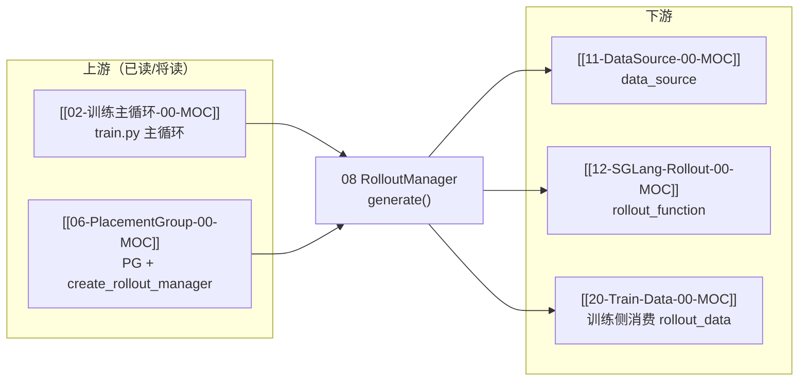

# RolloutManager · 批次概述

> **批次 08** | 阶段 III Rollout 生成 | 基线 commit `22cdc6e1`  
> 源码主文件：`slime/slime/ray/rollout.py`（`RolloutManager` 类 + 辅助函数）

---

## 本批目标

读完本批六件套后，读者应能：

1. 说明 `RolloutManager` 在 Slime **三角架构**（Training ↔ Rollout ↔ Data Buffer）中的职责
2. 追踪一次 `generate(rollout_id)` 的完整调用链：采样 → 转训练 dict → DP 分片 → `ray.put`
3. 解释 `get_updatable_engines_and_lock()` 如何区分「可更新权重」与「冻结模型」引擎
4. 理解 `Sample list → tensor dict → Ray ObjectRef per DP` 的数据形态变化

---

## 文档导航

| 文档 | 内容 |
|------|------|
| [[08-RolloutManager-01-核心概念]] | 术语、三角位置、Ray Actor 角色 |
| [[08-RolloutManager-02-源码走读]] | **主文档**：按调用顺序精读关键函数 |
| [[08-RolloutManager-03-数据流与交互]] | Sample → train_data → ObjectRef 全链路 |
| [[08-RolloutManager-04-关键问题]] | FAQ、易错点、debug 路径 |
| [[08-RolloutManager-05-checkpoint]] | 验收清单 |

---

## 源码范围

| 优先级 | 符号 | 行号（约） | 本批覆盖 |
|--------|------|-----------|---------|
| P0 | `RolloutManager.__init__` | L424–471 | ✅ |
| P0 | `generate(rollout_id)` | L546–559 | ✅ |
| P0 | `_get_rollout_data` | L635–665 | ✅ |
| P0 | `_convert_samples_to_train_data` | L713–824 | ✅ |
| P0 | `_split_train_data_by_dp` | L829–895 | ✅ |
| P0 | `_tensorize_rollout_data_for_training` | L80–102 | ✅ |
| P0 | `get_updatable_engines_and_lock` | L527–540 | ✅ |
| P1 | `_post_process_rewards` | L686–711 | 02 走读 |
| P1 | `_validate_rollout_id_annotated` | L898–927 | 04 FAQ |
| 延后 | `ServerGroup` / `RolloutServer` / `start_rollout_servers` | L105+ | [[09-EngineTopology-00-MOC]] |

---

## 入口代码：训练主循环如何调用 generate

**Explain：** `train.py` 在每个 `rollout_id` 上先 `generate` 拿到 `rollout_data_ref`（每 DP rank 一个 `Box(ray.put(...))`），再传给 `actor_model.async_train`。RolloutManager 是 **Ray remote Actor**，不占 GPU。

**Code：**

```python
# 来源：train.py L15-L17, L62-L81
    rollout_manager, num_rollout_per_epoch = create_rollout_manager(args, pgs["rollout"])
    actor_model, critic_model = create_training_models(args, pgs, rollout_manager)
    # ...
    for rollout_id in range(args.start_rollout_id, args.num_rollout):
        rollout_data_ref = ray.get(rollout_manager.generate.remote(rollout_id))
        # ...
        ray.get(actor_model.async_train(rollout_id, rollout_data_ref))
        actor_model.update_weights()
```

**Comment：**

- `create_rollout_manager` 在 `placement_group.py` 中以 `RolloutManager.options(...).remote(args, pg)` 实例化；若 `rollout_data_transport=nixl` 则开启 tensor transport
- `generate` 返回值是 **list[Box]**，长度 = `dp_size`；训练侧按 rank 取各自 partition
- 引擎拓扑（SGLangEngine、Router、PD 分离）本批只引用，详述见批次 09

---

## 衔接关系



---

## 阶段验收点

- [ ] 能口述 `generate()` 四步：`_get_rollout_data` → debug save → `_convert_samples_to_train_data` → `_split_train_data_by_dp`
- [ ] 能画出 `list[Sample]` 到 `list[Box(ray.put)]` 的形态变化
- [ ] 能说明 `rollout_engine_lock` 在权重更新中的作用（与 [[24-WeightSync-Dist-00-MOC]] 衔接）

---

## 相关测试

- `tests/test_rollout_validation.py` — GPU 索引校验（`ServerGroup.start_engines` 路径）
- `tests/test_dp_schedule.py` — `build_dp_schedule` 纯 Python 单测（`_split_train_data_by_dp` 依赖）
