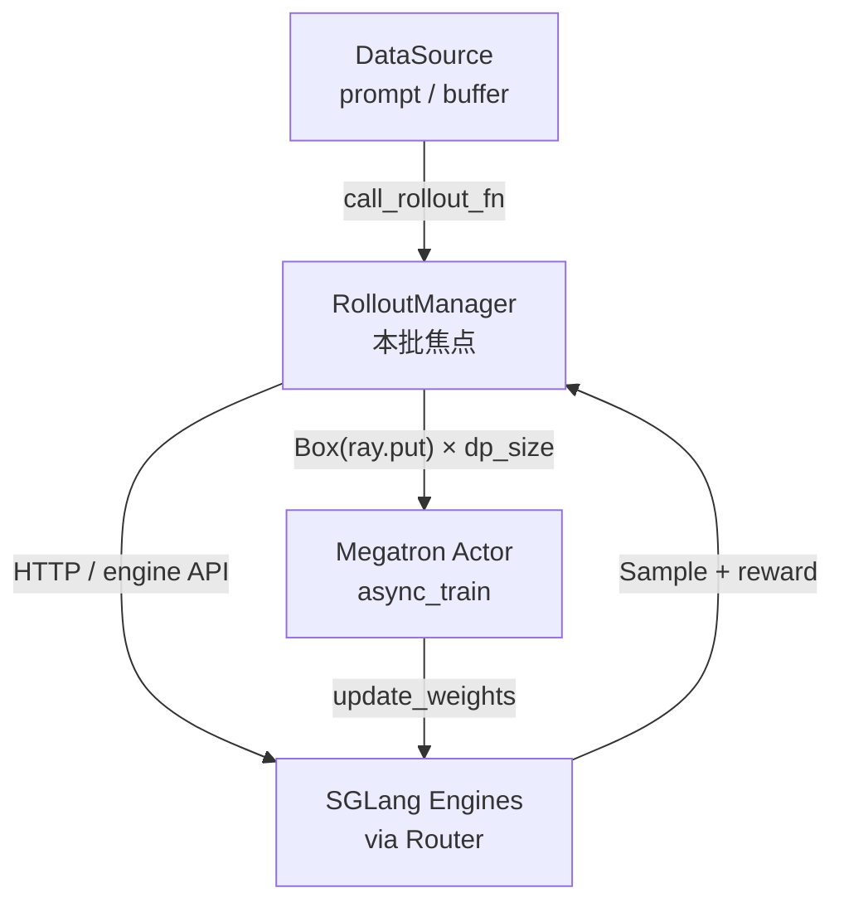
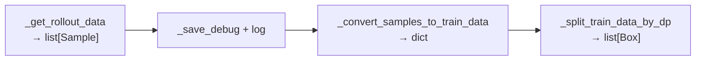

# RolloutManager · 核心概念

---

## 1. RolloutManager 是什么

**RolloutManager** 是 Slime RL 闭环中 **Rollout 侧的 Ray 协调 Actor**（`@ray.remote class RolloutManager`）。它：

- 持有 SGLang 推理引擎集群（`self.servers`）与 HTTP 客户端
- 加载 **数据源**（`data_source`）和 **rollout 函数**（`generate_rollout`）
- 在每个训练 step 执行 `generate(rollout_id)`：调用 rollout 函数采样 → 转成训练 tensor dict → 按 DP rank 分片并 `ray.put` 到 Object Store

它不跑 Megatron 前向，也不直接算 loss；它是 **generate → train 边界上的数据枢纽**。

---

## 2. 在三角架构中的位置



| 角色 | 输入 | 输出 |
|------|------|------|
| DataSource | `rollout_id` | prompt 批次、epoch 状态 |
| Rollout 函数 | prompt + engines | `list[Sample]`（可嵌套 list） |
| RolloutManager | Sample list | 每 DP rank 一份 `rollout_data` ObjectRef |
| Megatron Actor | `rollout_data_ref` | 梯度、权重更新 |

---

## 3. 核心术语

| 术语 | 含义 |
|------|------|
| **Sample** | 单条训练样本 dataclass：tokens、response_length、reward、loss_mask、rollout_log_probs 等（详述见 [[10-Sample-Contracts-00-MOC]]） |
| **train_data** | `dict[str, list]`，由 `_convert_samples_to_train_data` 从 Sample 列表聚合 |
| **partition** | DP rank `r` 拥有的 sample 全局下标列表 |
| **micro_batch_indices** | rank 内 micro-batch 如何切分 sample 下标 |
| **rollout_id（Sample 字段）** | 逻辑 rollout 分组 id；compact/subagent 模式下多条 Sample 共享同一 id，供 loss reducer 按 rollout 聚合 |
| **rollout_engine_lock** | Ray `Lock` Actor；权重更新时串行化对 SGLang 引擎的访问 |
| **updatable server** | `RolloutServer.update_weights=True` 的模型；policy 模型接收训练权重，reference/reward 模型通常冻结 |
| **Box** | 薄包装 `ray.put` 返回值，便于类型标注与 nixl transport |

---

## 4. Ray Actor 与资源模型

**Explain：** RolloutManager 本身 `num_gpus=0, num_cpus=1`；真正的 GPU 在 `SGLangEngine` Ray Actor 上。Manager 负责编排，不占训练/推理算力。

**Code：**

```python
# 来源：slime/ray/placement_group.py L220-L230
def create_rollout_manager(args, pg):
    from .rollout import RolloutManager

    rollout_manager_options = {
        "num_cpus": 1,
        "num_gpus": 0,
        "runtime_env": {"env_vars": add_default_ray_env_vars()},
    }
    if getattr(args, "rollout_data_transport", "object-store") == "nixl":
        rollout_manager_options["enable_tensor_transport"] = True
    rollout_manager = RolloutManager.options(**rollout_manager_options).remote(args, pg)
```

**Comment：**

- `pg` 是 rollout 专用 Placement Group bundle，传给 `start_rollout_servers` 创建 SGLangEngine
- `debug_train_only=True` 时跳过引擎启动，仅保留 data_source / rollout fn 加载路径

---

## 5. 初始化加载的三类插件

**Explain：** `__init__` 通过 `load_function(args.xxx_path)` 动态 import，是 Slime customization 的核心挂载点之一。

**Code：**

```python
# 来源：slime/ray/rollout.py L437-L451
        data_source_cls = load_function(self.args.data_source_path)
        self.data_source = data_source_cls(args)

        self.generate_rollout = load_function(self.args.rollout_function_path)
        self.eval_generate_rollout = load_function(self.args.eval_function_path)
        self.custom_reward_post_process_func = None
        if self.args.custom_reward_post_process_path is not None:
            self.custom_reward_post_process_func = load_function(self.args.custom_reward_post_process_path)
        self.custom_convert_samples_to_train_data_func = None
        if self.args.custom_convert_samples_to_train_data_path is not None:
            self.custom_convert_samples_to_train_data_func = load_function(
                self.args.custom_convert_samples_to_train_data_path
            )
```

**Comment：**

| 参数路径 | 默认职责 |
|----------|---------|
| `data_source_path` | 提供 prompt / buffer 数据 |
| `rollout_function_path` | 调用 SGLang 生成 + RM 打分 |
| `eval_function_path` | eval 专用 rollout |
| `custom_reward_post_process_path` | 覆盖 GRPO 等 group norm |
| `custom_convert_samples_to_train_data_path` | 完全自定义 train_data 结构 |

---

## 6. generate() 四阶段概览



| 阶段 | 输入形态 | 输出形态 |
|------|---------|---------|
| 1 | `rollout_id` | `list[Sample]` + metrics |
| 2 | Sample list | （可选）torch.save debug |
| 3 | Sample list | `dict` of parallel lists |
| 4 | train_data dict | `dp_size` 个 `Box(ray.put(...))` |

`debug_rollout_only=True` 时在阶段 2 后提前 return，不做 tensor 化与 DP 切分。

---

## 7. 权重更新接口：engines + lock

**Explain：** Megatron Actor 在 `update_weights` 前调用 `get_updatable_engines_and_lock`，只拿到 **policy 模型** 的 node-0 引擎列表，以及全局 `rollout_engine_lock`。

**Code：**

```python
# 来源：slime/ray/rollout.py L511-L540
    def _get_updatable_server(self) -> Any | None:
        for srv in self.servers.values():
            if srv.update_weights:
                return srv
        return None

    def get_updatable_engines_and_lock(self):
        srv = self._get_updatable_server()
        engines = srv.engines if srv else []
        gpu_counts = srv.engine_gpu_counts if srv else []
        gpu_offsets = srv.engine_gpu_offsets if srv else []
        num_new = srv.num_new_engines if srv else 0
        all_engine_actors = srv.all_engines if srv else []
        return engines, self.rollout_engine_lock, num_new, gpu_counts, gpu_offsets, all_engine_actors
```

**Comment：**

- 多模型场景（reference + policy）下，reference 的 `update_weights=False`，不会进入返回列表
- `num_new_engines` 用于 fault tolerance：新恢复的引擎需重新 sync 权重
- 完整权重同步路径见 [[24-WeightSync-Dist-00-MOC]]

---

## 8. 与 SGLang 阅读的关系

RolloutManager **编排** SGLang，不实现 attention/KV。若需理解引擎内部调度，参见 [[SGLang源码阅读指南]] 批次 06–07（TokenizerManager / Scheduler）。本批只需知道：rollout 函数通过 Router HTTP 把 prompt 发给 SGLangEngine，响应写回 `Sample`。
