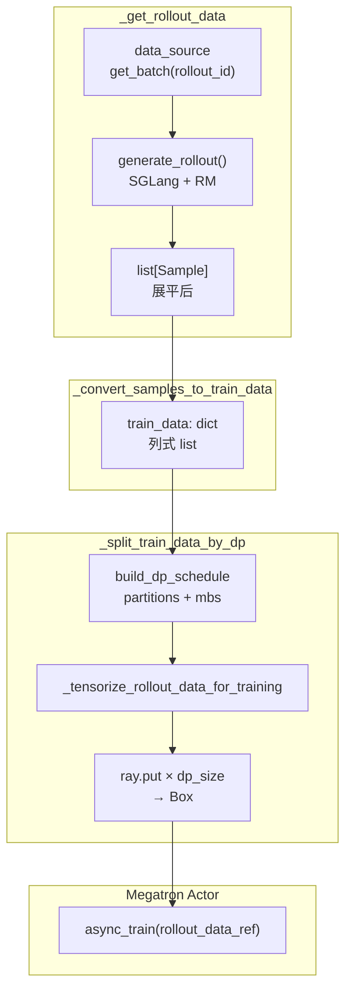
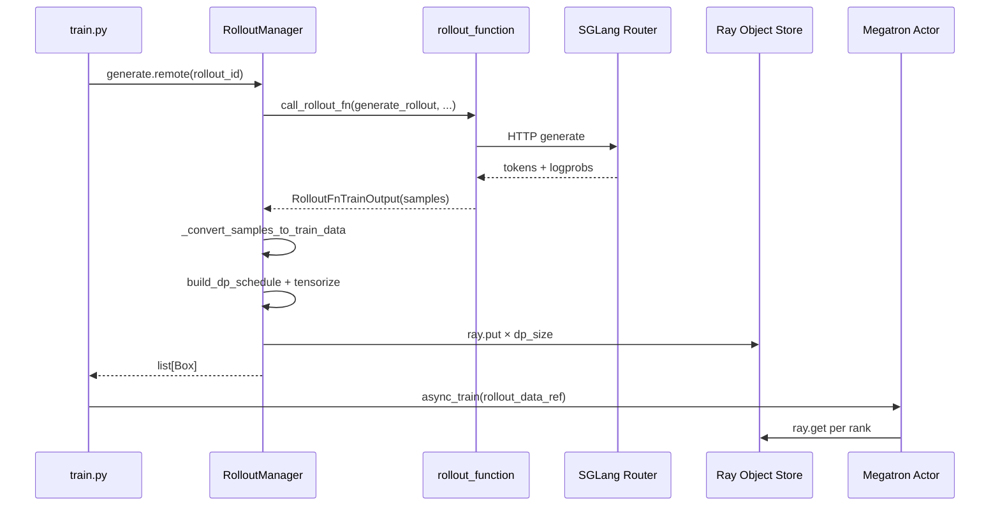

# RolloutManager · 数据流与交互

> 本专题核心数据流：**Sample list → tensor dict → Ray ObjectRef per DP**

---

## 1. 端到端总览



---

## 2. 阶段一：Sample list

### 2.1 Sample 关键字段（训练相关）

**Explain：** Rollout 函数填充 Sample；RolloutManager 只读取下列字段构建 train_data。

**Code：**

```python
## 来源：slime/utils/types.py L93-L128（节选）
@dataclass
class Sample:
    group_index: int | None = None
    index: int | None = None
    rollout_id: int | None = None
    prompt: str | list[dict[str, str]] = ""
    tokens: list[int] = field(default_factory=list)
    response_length: int = 0
    reward: float | dict[str, Any] | None = None
    loss_mask: list[int] | None = None
    rollout_log_probs: list[float] | None = None
    rollout_top_p_token_ids: list[int] | torch.Tensor | None = None
    rollout_top_p_token_offsets: list[int] | torch.Tensor | None = None
    rollout_routed_experts: list[list[int]] | torch.Tensor | None = None
    teacher_log_probs: list[float] | None = None
    remove_sample: bool = False
    status: Status = Status.PENDING
```

### 2.2 嵌套 list 展平规则

| rollout 输出形状 | 含义 | 展平后 |
|-----------------|------|--------|
| `list[Sample]` | 已展平 | 不变 |
| `list[list[Sample]]` | prompt × n_samples（默认） | `chain.from_iterable` 一次 |
| `list[list[list[Sample]]]` | compact / subagent | 展平 + 强制 `rollout_id` |

**Code：**

```python
## 来源：slime/ray/rollout.py L660-L663
            _validate_rollout_id_annotated(data)
            while isinstance(data[0], list):
                data = list(itertools.chain.from_iterable(data))
```

---

## 3. 阶段二：train_data dict（列式）

### 3.1 字段映射表

| train_data key | 来源 Sample 字段 | 切分方式（DP） |
|----------------|-----------------|---------------|
| `tokens` | `sample.tokens` | 按 partition 子集 |
| `response_lengths` | `sample.response_length` | 按 partition |
| `rewards` | 后处理 reward | 按 partition |
| `raw_reward` | 原始 reward | **全局保留** |
| `loss_masks` | `sample.loss_mask` | 按 partition |
| `rollout_ids` | `sample.rollout_id`（可自动补） | 按 partition |
| `rollout_mask_sums` | 由 rollout_ids + masks 聚合 | 按 partition |
| `truncated` | `sample.status == TRUNCATED` | 按 partition |
| `sample_indices` | `sample.index` | 按 partition |
| `rollout_log_probs` | 可选 | 按 partition |
| `total_lengths` | `len(tokens)` 派生 | **全局保留** |

### 3.2 dict 结构示例（概念）

```
train_data = {
    "tokens":           [ [1,2,3,...], [4,5,...], ... ],   # N 条
    "response_lengths": [ 128, 64, ... ],
    "rewards":          [ 0.5, -0.2, ... ],
    "loss_masks":       [ [0,0,1,1,...], ... ],
    "rollout_ids":      [ 0, 0, 1, 1, ... ],               # 两条 sample 同属 rollout 0
    "rollout_mask_sums":[ 256, 256, 128, 128, ... ],        # 同 rollout 共享总和
    "total_lengths":    [ 512, 384, ... ],                  # 后续 split 时写入
}
```

---

## 4. 阶段三：DP 分片 + schedule 元数据

### 4.1 build_dp_schedule 输入/输出

**Explain：** 调度按 **rollout 数**（非 sample 数）切 training step；同一 `rollout_id` 的所有 sample 必须在同一步内。

**Code：**

```python
## 来源：slime/utils/dp_schedule.py L1-L23（模块 docstring 节选）
"""The scheduling philosophy is **pack first, distribute second**:

  1. Group samples by rollout id (``rollout_indices[i]``) and split rollouts
     into steps of ``global_batch_size`` rollouts each.
  2. For each step, pack its samples into ``K`` micro-batches ...
  3. Adjust ``K`` to a multiple of ``dp_size * (mb_group if vpp>1 else 1)`` ...
  4. Distribute the ``K`` mbs across ``dp_size`` ranks ...
"""
```

**中文释义：** DP 调度的原则是“先打包，再分发”：先按 rollout 分组并切成训练 step，再把每个 step 的样本打包成 K 个 micro-batch，最后把这些 micro-batch 分给各个 DP rank。

**输出结构：**

| 变量 | 形状 / 类型 | 含义 |
|------|------------|------|
| `partitions[r]` | `list[int]` | rank `r` 拥有的 **全局 sample 下标** |
| `micro_batch_indices[r]` | `list[list[int]]` | rank `r` 每个 mbs 内的 **局部下标** |
| `num_microbatches` | `list[int]` | 每个 training step 的 mbs 数（各 rank 相同） |
| `global_batch_sizes` | `list[int]` | 每 step 的 rollout 数 |

### 4.2 每 rank 的 rollout_data 包

**Code：**

```python
## 来源：slime/ray/rollout.py L855-L886（概念重组）
        for r in range(dp_size):
            partition = partitions[r]
            rollout_data = {"partition": partition}
            # 列字段：按 partition 索引切片
            rollout_data["tokens"] = [data["tokens"][j] for j in partition]
            # 全局字段：不切分
            rollout_data["raw_reward"] = data["raw_reward"]
            rollout_data["total_lengths"] = data["total_lengths"]
            # schedule 元数据：各 rank 相同 num_microbatches，不同 micro_batch_indices
            rollout_data["global_batch_sizes"] = global_batch_sizes
            rollout_data["num_microbatches"] = num_microbatches
            rollout_data["micro_batch_indices"] = micro_batch_indices[r]
```

---

## 5. 阶段四：tensor 化 + ray.put

### 5.1 tensor 化前后对比

| 字段 | tensor 化前 | tensor 化后 |
|------|------------|------------|
| `tokens[i]` | `list[int]` | `torch.LongTensor` CPU |
| `loss_masks[i]` | `list[int]` | `torch.IntTensor` CPU |
| `rollout_log_probs[i]` | `list[float]` | `torch.FloatTensor` CPU |
| `rewards` | `list[float]` | **保持 list** |
| `rollout_mask_sums` | `list[float]` | 单个 `torch.FloatTensor`（整列） |

**Code：**

```python
## 来源：slime/ray/rollout.py L887-L894
            _tensorize_rollout_data_for_training(rollout_data)
            transport = getattr(self.args, "rollout_data_transport", "object-store")
            if transport == "nixl":
                rollout_data_refs.append(Box(ray.put(rollout_data, _tensor_transport="nixl")))
            elif transport == "object-store":
                rollout_data_refs.append(Box(ray.put(rollout_data)))
```

### 5.2 Box 包装

**Explain：** `Box` 包装 `ray.put` 返回的 ObjectRef；训练侧通过 `.inner` 属性取 ref。

**Code：**

```python
## 来源：slime/utils/misc.py L129-L135
class Box:
    def __init__(self, inner):
        self._inner = inner

    @property
    def inner(self):
        return self._inner
```

---

## 6. 跨模块消息流



---

## 7. 与权重更新的交互

| 时机 | RolloutManager 方法 | 对数据流影响 |
|------|-------------------|-------------|
| 训练前 offload | `offload()` | 释放 KV/weights，不影响已 put 的 ObjectRef |
| generate 前 | `health_monitoring_resume()` | 允许 health monitor 检测死引擎 |
| generate 后 offload | `offload()`（train.py） | 腾出 GPU 给 Megatron |
| update_weights 前 | `get_updatable_engines_and_lock()` | 返回 engines + lock，与 rollout_data 无关 |
| onload_weights | `onload_weights()` | 恢复 SGLang weights 供下一轮 generate |

---

## 8. train_parallel_config 注入点

**Explain：** `_split_train_data_by_dp` 依赖 `self.train_parallel_config`，由 Megatron Actor 在 init 后调用 `set_train_parallel_config`。

**Code：**

```python
## 来源：slime/ray/rollout.py L826-L827
    def set_train_parallel_config(self, config: dict):
        self.train_parallel_config = config
```

典型 config：

```python
{
    "dp_size": 8,
    "cp_size": 1,
    "vpp_size": 1,
    "microbatch_group_size_per_vp_stage": 1,
}
```

若 generate 在 set 之前调用会 AttributeError——这是启动顺序约束（`create_training_models` 在首次 generate 前完成 set）。

---

## 9. 数据流检查清单

1. Sample 数量 N = len(tokens) = len(rewards) = len(loss_masks)
2. partition 并集 = range(N)，无重复无遗漏（trim 后）
3. 每个 rank 的 `len(rollout_data["tokens"])` = len(partition)
4. `ray.put` 后 ObjectRef 数量 = dp_size
5. tensor 字段均在 CPU、contiguous

详见 [[08-RolloutManager-05-checkpoint]]。
