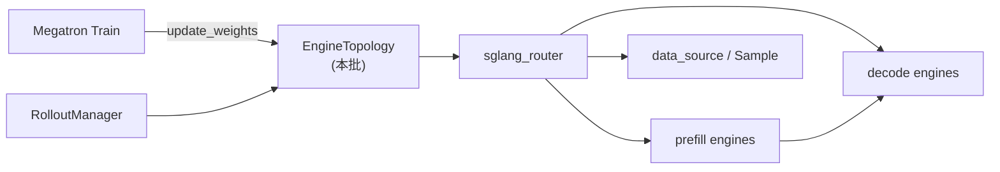

# EngineTopology · 核心概念

> 读者无需打开 `slime/`：本章术语均对应内嵌源码。

---

## 1. 架构位置

EngineTopology 位于 Slime **Rollout 三角**的「推理集群」层：训练侧 Megatron 产出权重 → `update_weights` 推到 **可更新** 的 SGLang 引擎；数据侧 `generate_rollout` 向 **Router** 发 HTTP。拓扑模块决定 **有多少引擎、各占几卡、是否 PD 分离**。



---

## 2. 核心术语

| 术语 | 含义 | 源码锚点 |
|------|------|----------|
| **SglangConfig** | 从 YAML 或 CLI 派生的顶层部署配置 | `sglang_config.py` |
| **ModelConfig** | 单个逻辑模型（如 actor、ref） | 含 `server_groups`、`update_weights` |
| **ServerGroupConfig** | 一组同质 worker 的 GPU 预算 | `worker_type` + `num_gpus` |
| **ServerGroup** | 运行时 Ray 引擎组 | `rollout.py` `ServerGroup` |
| **RolloutServer** | 一模型 + 一 Router + 多 ServerGroup | `rollout.py` `RolloutServer` |
| **worker_type** | `regular` / `prefill` / `decode` / `encoder` / `placeholder` | 决定 SGLang 启动模式 |
| **PD 分离** | Prefill 与 Decode 分池部署 | Router `pd_disaggregation=True` |
| **EPD** | Encoder-Prefill-Decode，多模态分离 | encoder 组先启动，URL 注入 prefill |

---

## 3. ServerGroupConfig：声明一组 GPU

**Explain：** YAML 里每个 `server_groups` 条目解析为 `ServerGroupConfig`。`worker_type` 约束 SGLang 进程角色；`num_gpus` 是该组总 GPU 数；`overrides` 透传到 SGLang `ServerArgs`（如 `chunked_prefill_size`）。

**Code：**

```python
# 来源：slime/backends/sglang_utils/sglang_config.py L11-L41
# 提交版本：22cdc6e1
@dataclasses.dataclass
class ServerGroupConfig:
    """Configuration for a single server group.

    Attributes:
        worker_type: One of "regular", "prefill", "decode", "placeholder",
                     or "encoder".
                     "placeholder" reserves GPU slots without creating engines.
                     "encoder" creates encoder-only engines for EPD
                     (Encoder-Prefill-Decode) disaggregation; encoder engines
                     are started first and their URLs are automatically
                     injected into prefill groups as ``encoder_urls``.
        num_gpus: Total number of GPUs for this group.
        num_gpus_per_engine: GPUs per engine for this group.  Overrides the
                             model-level or global ``--rollout-num-gpus-per-engine``.
        overrides: Optional dict of SGLang ``ServerArgs`` field overrides.
    """

    worker_type: str
    num_gpus: int
    num_gpus_per_engine: int | None = None
    overrides: dict = dataclasses.field(default_factory=dict)

    def __post_init__(self):
        valid_types = {"regular", "prefill", "decode", "placeholder", "encoder"}
        assert (
            self.worker_type in valid_types
        ), f"Invalid worker_type '{self.worker_type}', must be one of {valid_types}"
        assert self.num_gpus > 0, f"num_gpus must be > 0, got {self.num_gpus}"
```

**Comment：**

- `placeholder` 只占 PG 槽位、不建引擎——用于 **colocate/offload** 时与 Megatron 对齐 GPU 布局。
- `encoder` 触发 EPD 两阶段启动（见 [[09-EngineTopology-02-源码走读]] §5）。
- `num_gpus_per_engine` 可为 None，由 `ModelConfig.resolve()` 回填。

---

## 4. ModelConfig：模型级策略

**Explain：** 每个命名模型有独立 Router。`update_weights` 控制训练权重是否同步到该模型引擎；未显式设置时，若 `model_path != hf_checkpoint` 则自动为 `False`（冻结 ref/reward 模型）。

**Code：**

```python
# 来源：slime/backends/sglang_utils/sglang_config.py L102-L112
# 提交版本：22cdc6e1
    @property
    def has_pd_disaggregation(self) -> bool:
        return any(g.worker_type in ("prefill", "decode") for g in self.server_groups)

    @property
    def has_encoder_disaggregation(self) -> bool:
        return any(g.worker_type == "encoder" for g in self.server_groups)

    @property
    def total_num_gpus(self) -> int:
        return sum(g.num_gpus for g in self.server_groups)
```

**Comment：**

- 只要存在 `prefill` 或 `decode` 组，`has_pd_disaggregation` 为 True，Router 启用 PD 模式。
- `total_num_gpus` 必须与 CLI `--rollout-num-gpus` 一致，否则 `_resolve_sglang_config` assert 失败。
- 同一 model 内所有 group 的 `model_path` 必须相同（`resolve()` 内校验）。

---

## 5. 三种配置入口

**Explain：** slime 按优先级解析拓扑：**YAML > legacy prefill flag > 默认 regular 单组**。

**Code：**

```python
# 来源：slime/ray/rollout.py L1231-L1255
# 提交版本：22cdc6e1
def _resolve_sglang_config(args) -> SglangConfig:
    """Build a SglangConfig from args, choosing the right source."""
    if getattr(args, "sglang_config", None) is not None:
        config = SglangConfig.from_yaml(args.sglang_config)
        expected = args.rollout_num_gpus
        actual = config.total_num_gpus
        assert actual == expected, f"sglang_config total GPUs ({actual}) != rollout_num_gpus ({expected})"
        return config

    if args.rollout_num_gpus == 0:
        return SglangConfig(models=[ModelConfig(name="default", server_groups=[])])

    if args.prefill_num_servers is not None:
        return SglangConfig.from_prefill_num_servers(args)

    return SglangConfig(
        models=[
            ModelConfig(
                name="default",
                server_groups=[ServerGroupConfig(worker_type="regular", num_gpus=args.rollout_num_gpus)],
            )
        ]
    )
```

**Comment：**

| 路径 | 典型场景 |
|------|----------|
| `--sglang-config` | 生产级：多模型、异构 TP、per-group overrides |
| `--prefill-num-servers N` | 快捷 PD：单 actor，prefill N 台 × TP，其余 decode |
| 默认 | 短 prompt 单轮 RL，全部 `regular` |

---

## 6. legacy PD：`from_prefill_num_servers`

**Explain：** 等价于手写 YAML 的 prefill+decode 两组，GPU 按 `prefill_num_servers * rollout_num_gpus_per_engine` 切分。

**Code：**

```python
# 来源：slime/backends/sglang_utils/sglang_config.py L182-L199
# 提交版本：22cdc6e1
    @staticmethod
    def from_prefill_num_servers(args) -> "SglangConfig":
        """Build a config equivalent to the legacy --prefill-num-servers flag."""
        total_gpus = args.rollout_num_gpus
        prefill_gpus = args.prefill_num_servers * args.rollout_num_gpus_per_engine
        decode_gpus = total_gpus - prefill_gpus
        assert decode_gpus > 0, f"No decode GPUs: total {total_gpus}, prefill {prefill_gpus}"
        return SglangConfig(
            models=[
                ModelConfig(
                    name="default",
                    server_groups=[
                        ServerGroupConfig(worker_type="prefill", num_gpus=prefill_gpus),
                        ServerGroupConfig(worker_type="decode", num_gpus=decode_gpus),
                    ],
                )
            ]
        )
```

**Comment：**

- prefill 与 decode 共用默认 `num_gpus_per_engine`（来自 `--rollout-num-gpus-per-engine`）。
- 若 prefill 占满全部 GPU，assert 失败——必须留 decode 池。
- 文档建议复杂部署改用 `--sglang-config`（见 [[09-EngineTopology-04-关键问题]]）。

---

## 7. RolloutServer vs ServerGroup

**Explain：** **RolloutServer** 是「对外一个模型服务」的容器；**ServerGroup** 是内部同质引擎池。PD 场景下一个 RolloutServer 含 prefill + decode 两个 ServerGroup，共享同一 Router。

**Code：**

```python
# 来源：slime/ray/rollout.py L281-L294
# 提交版本：22cdc6e1
@dataclasses.dataclass
class RolloutServer:
    """A model served behind a shared router, with one or more server groups.

    Each RolloutServer represents one model deployed behind a single router.
    A server may contain multiple ServerGroups with different
    ``num_gpus_per_engine`` (e.g. prefill TP=2, decode TP=4).
    """

    server_groups: list[ServerGroup]
    router_ip: str | None = None
    router_port: int | None = None
    model_name: str = "default"
    update_weights: bool = True
```

**Comment：**

- `engines` 属性 flatten 所有 group 的 node-0 引擎，供 `update_weights` 遍历。
- `placeholder` group 不贡献引擎，但消耗 `gpu_offset` 槽位。
- 多模型时 `args.sglang_model_routers` 映射 `{name: (ip, port)}` 供 custom rollout 使用。

---

## 8. 设计动机（为何不在 RolloutManager 里硬编码）

1. **与生产 serving 对齐**：Agentic / 多轮 RL 的 prefill 与 decode 负载不对称，PD 可独立扩缩 TP 与内存参数。
2. **多模型共存**：actor 可更新、ref/reward 冻结，各走独立 Router，避免 HTTP 路由混淆。
3. **colocate/offload 友好**：按 group 计算 `needs_offload`，Megatron 与 Rollout 分时复用 GPU 时不破坏拓扑声明。
4. **训练循环零侵入**：`generate → train → update_weights` 不变，仅 `--sglang-config` 换拓扑。
