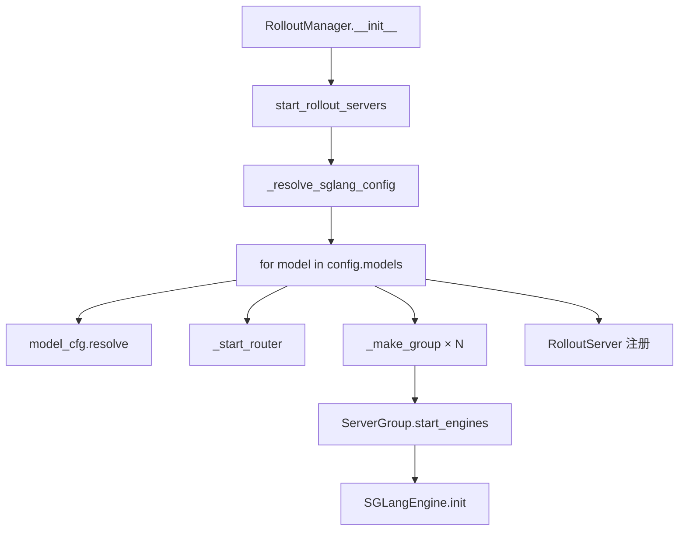

# EngineTopology · 源码走读

> **主文档**：按调用顺序精读配置解析 → Router 启动 → ServerGroup 建引擎 → RolloutServer 聚合。  
> 基线 commit：`22cdc6e1`

---

## 走读路线图



---

## §1 入口：RolloutManager 触发拓扑构建

**Explain：** 非 `debug_train_only` 时，`RolloutManager` 先 `init_http_client`，再调用 `start_rollout_servers`；返回的 `init_handles` 在构造末尾 `ray.get` 阻塞至引擎健康。

**Code：**

```python
# 来源：slime/ray/rollout.py L430-L454
# 提交版本：22cdc6e1
        rollout_init_handles: list[Any] = []
        if self.args.debug_train_only:
            self.servers: dict[str, Any] = {}
        else:
            init_http_client(args)
            self.servers, rollout_init_handles = start_rollout_servers(args, pg)

        data_source_cls = load_function(self.args.data_source_path)
        self.data_source = data_source_cls(args)
        # ... rollout fn 加载 ...

        if rollout_init_handles:
            ray.get(rollout_init_handles)
```

**Comment：**

- `self.servers` 类型为 `dict[str, RolloutServer]`，键为 YAML 中的 `name`（如 `actor`）。
- external rollout 走 `start_external_rollout_servers`，仍复用 `_start_router` 签名。
- 拓扑与 data_source / rollout fn 加载 **并行准备**，但 engine init 必须完成后才进入 generate。

---

## §2 SglangConfig.from_yaml：YAML → 内存对象

**Explain：** `--sglang-config` 指向的文件必须有顶层 `sglang:` 列表；兼容旧字段名 `engine_groups`。

**Code：**

```python
# 来源：slime/backends/sglang_utils/sglang_config.py L157-L180
# 提交版本：22cdc6e1
    @staticmethod
    def from_yaml(path: str) -> "SglangConfig":
        with open(path) as f:
            data = yaml.safe_load(f)

        assert "sglang" in data, (
            f"sglang config must have a 'sglang' key, got {list(data.keys())}. "
            f"Wrap your server_groups inside a model entry under 'sglang'."
        )
        models = []
        for m in data["sglang"]:
            raw_groups = m.get("server_groups") or m.get("engine_groups") or []
            groups = [ServerGroupConfig(**g) for g in raw_groups]
            models.append(
                ModelConfig(
                    name=m["name"],
                    model_path=m.get("model_path"),
                    num_gpus_per_engine=m.get("num_gpus_per_engine"),
                    server_groups=groups,
                    update_weights=m.get("update_weights"),
                )
            )
        return SglangConfig(models=models)
```

**Comment：**

- 文档示例 YAML 见 `SglangConfig` docstring（[[09-EngineTopology-01-核心概念]] §5）。
- `update_weights: false` 用于 ref/reward 等冻结模型。
- 解析后尚未填充 `num_gpus_per_engine` / `model_path`——需 `ModelConfig.resolve(args)`。

---

## §3 ModelConfig.resolve：默认值与 update_weights 推断

**Explain：** 每个 model 启动前调用 `resolve`，统一 per-group 的 TP 与 checkpoint 路径，并推断是否接收训练权重更新。

**Code：**

```python
# 来源：slime/backends/sglang_utils/sglang_config.py L68-L100
# 提交版本：22cdc6e1
    def resolve(self, args) -> None:
        """Resolve per-group defaults from model-level then args-level values."""
        default_gpus_per_engine = self.num_gpus_per_engine or args.rollout_num_gpus_per_engine
        default_model_path = self.model_path or args.hf_checkpoint
        for g in self.server_groups:
            if g.num_gpus_per_engine is None:
                g.num_gpus_per_engine = default_gpus_per_engine
            if "model_path" not in g.overrides:
                g.overrides["model_path"] = default_model_path

        if self.server_groups:
            model_paths = {g.overrides["model_path"] for g in self.server_groups}
            assert len(model_paths) == 1, (
                f"Model '{self.name}' has server groups with different model_path values: "
                f"{model_paths}. All server groups within a model must use the same model_path."
            )
            effective_model_path = model_paths.pop()
        else:
            effective_model_path = default_model_path

        if self.update_weights is None:
            if effective_model_path != args.hf_checkpoint:
                logger.warning(
                    f"Model '{self.name}' uses model_path='{effective_model_path}' which differs "
                    f"from hf_checkpoint='{args.hf_checkpoint}'. Defaulting update_weights to False."
                )
                self.update_weights = False
            else:
                self.update_weights = True
```

**Comment：**

- prefill TP=2、decode TP=4 可在 group 级 override `num_gpus_per_engine`。
- `_make_group` 把 `overrides["model_path"]` 写入 `ServerGroup.model_path`，供非 updatable 组 `update_weights_from_disk`。
- 多模型 actor+ref 场景：actor 通常 `update_weights=True`，ref 显式 `false`。

---

## §4 _start_router：PD 感知的 sglang_router

**Explain：** 每个 `ModelConfig` 启动一个 Router 进程。PD 拓扑设置 `pd_disaggregation=True` 并 **关闭 circuit breaker**（避免 RDMA 超时误杀 decode worker）。

**Code：**

```python
# 来源：slime/ray/rollout.py L1019-L1070
# 提交版本：22cdc6e1
def _start_router(args, *, has_pd_disaggregation: bool = False, force_new: bool = False) -> tuple[str, int]:
    """Start sglang_router and return (router_ip, router_port)."""
    if not force_new and args.sglang_router_ip is not None:
        return args.sglang_router_ip, args.sglang_router_port

    router_ip = _wrap_ipv6(get_host_info()[1])
    if force_new:
        router_port = find_available_port(random.randint(3000, 4000))
    else:
        router_port = args.sglang_router_port
        if router_port is None:
            router_port = find_available_port(random.randint(3000, 4000))

    from sglang_router.launch_router import RouterArgs
    from slime.utils.http_utils import run_router

    router_args = RouterArgs.from_cli_args(args, use_router_prefix=True)
    router_args.host = router_ip
    router_args.port = router_port
    router_args.prometheus_port = find_available_port(random.randint(4000, 5000))
    router_args.log_level = "warn"
    router_args.request_timeout_secs = args.sglang_router_request_timeout_secs

    if has_pd_disaggregation:
        router_args.pd_disaggregation = True
        router_args.disable_circuit_breaker = True

    router_args.disable_health_check = True

    process = multiprocessing.Process(target=run_router, args=(router_args,))
    process.daemon = True
    process.start()
    time.sleep(3)
    assert process.is_alive()
    return router_ip, router_port
```

**Comment：**

- `model_idx > 0` 时 `force_new=True`，保证第二模型不会复用第一模型 Router 端口。
- regular 拓扑 `has_pd_disaggregation=False`，Router 按标准负载均衡转发。
- Router 健康检查由 slime 侧自行管理（`disable_health_check=True`），与 `RolloutHealthMonitor` 配合。

---

## §5 _make_group：ServerGroup 实例化

**Explain：** 闭包 `_make_group` 根据 `ServerGroupConfig` 计算引擎个数、PG 内 GPU 偏移、是否需 offload，并构造 `ServerGroup` dataclass。

**Code：**

```python
# 来源：slime/ray/rollout.py L1133-L1169
# 提交版本：22cdc6e1
        def _make_group(group_cfg, router_ip, router_port, overrides_extra=None):
            nonlocal engine_offset, gpu_offset
            gpus_per_engine = group_cfg.num_gpus_per_engine
            num_gpu_per_engine_local = min(gpus_per_engine, args.num_gpus_per_node)
            num_engines = group_cfg.num_gpus // num_gpu_per_engine_local

            group_abs_start = rollout_pg_offset + gpu_offset
            needs_offload = args.offload_rollout and group_abs_start < megatron_num_gpus
            overrides = dict(group_cfg.overrides)
            if overrides_extra:
                for k, v in overrides_extra.items():
                    overrides.setdefault(k, v)
            if args.offload_rollout and not needs_offload:
                overrides.setdefault("enable_memory_saver", False)

            group = ServerGroup(
                args=args,
                pg=pg,
                all_engines=[None] * num_engines if group_cfg.worker_type != "placeholder" else [],
                num_gpus_per_engine=gpus_per_engine,
                num_new_engines=0,
                worker_type=group_cfg.worker_type,
                rank_offset=engine_offset,
                gpu_offset=gpu_offset,
                sglang_overrides=overrides,
                needs_offload=needs_offload,
                model_path=overrides.get("model_path", args.hf_checkpoint),
                router_ip=router_ip,
                router_port=router_port,
            )
            engine_offset += num_engines
            gpu_offset += group_cfg.num_gpus
            return group
```

**Comment：**

- `num_engines = num_gpus // min(gpus_per_engine, num_gpus_per_node)`：多节点 TP 时 `all_engines` 含 node-1… 副本。
- `gpu_offset` 跨 group 累加，保证 PG bundle 不重叠。
- `placeholder` 只推进 `gpu_offset`，`all_engines=[]`。

---

## §6 ServerGroup.start_engines：Ray Actor + 端口分配

**Explain：** 为每个空槽创建 `SGLangEngine` Ray Actor，分配 NCCL/port，异步调用 `engine.init(router_ip=..., router_port=...)`。

**Code：**

```python
# 来源：slime/ray/rollout.py L137-L246
# 提交版本：22cdc6e1
    def start_engines(self, port_cursors: dict[int, int] | None = None) -> tuple[list, dict[int, int]]:
        if port_cursors is None:
            port_cursors = {}
        if self.args.debug_train_only or self.worker_type == "placeholder":
            self.num_new_engines = 0
            return [], port_cursors

        num_gpu_per_engine = min(self.num_gpus_per_engine, self.args.num_gpus_per_node)
        pg, reordered_bundle_indices, reordered_gpu_ids = self.pg
        validate_server_group_gpu_indices(...)

        RolloutRayActor = ray.remote(SGLangEngine)

        rollout_engines = []
        for i in range(len(self.all_engines)):
            if self.all_engines[i] is not None:
                continue

            global_rank = self.rank_offset + i
            gpu_index = self.gpu_offset + i * num_gpu_per_engine
            base_gpu_id = int(reordered_gpu_ids[gpu_index])

            scheduling_strategy = PlacementGroupSchedulingStrategy(
                placement_group=pg,
                placement_group_capture_child_tasks=True,
                placement_group_bundle_index=reordered_bundle_indices[gpu_index],
            )

            rollout_engine = RolloutRayActor.options(
                num_cpus=0.2, num_gpus=0.2,
                scheduling_strategy=scheduling_strategy,
                runtime_env={"env_vars": add_default_ray_env_vars(env_vars)},
            ).remote(
                self.args,
                rank=global_rank,
                worker_type=self.worker_type,
                base_gpu_id=base_gpu_id,
                sglang_overrides=self.sglang_overrides,
                num_gpus_per_engine=self.num_gpus_per_engine,
            )
            rollout_engines.append((global_rank, rollout_engine))
            self.all_engines[i] = rollout_engine

        base_port = max(port_cursors.values()) if port_cursors else 15000
        addr_and_ports, port_cursors = _allocate_rollout_engine_addr_and_ports_normal(...)

        init_handles = [
            engine.init.remote(
                **(addr_and_ports[rank]),
                router_ip=self.router_ip,
                router_port=self.router_port,
            )
            for rank, engine in rollout_engines
        ]
        return init_handles, port_cursors
```

**Comment：**

- `worker_type` 传入 `SGLangEngine`，最终映射为 SGLang `--disaggregation-mode` 等 ServerArgs。
- `port_cursors` 在 **同一 model 的多个 group 之间传递**，避免同节点端口冲突。
- `validate_server_group_gpu_indices` 在 PD 多 group 时校验 PG 切片合法。

---

## §7 非 EPD 路径：一次遍历所有 group

**Explain：** 无 `encoder` 组时，prefill/decode/regular 组顺序启动，init 句柄汇总到 `pending_init_handles`。

**Code：**

```python
# 来源：slime/ray/rollout.py L1206-L1228
# 提交版本：22cdc6e1
        else:
            all_init_handles: list = []
            for group_cfg in model_cfg.server_groups:
                group = _make_group(group_cfg, router_ip, router_port)
                handles, port_cursors = group.start_engines(port_cursors)
                all_init_handles.extend(handles)
                server_groups.append(group)

            pending_init_handles.extend(all_init_handles)

        servers[model_cfg.name] = RolloutServer(
            server_groups=server_groups,
            router_ip=router_ip,
            router_port=router_port,
            model_name=model_cfg.name,
            update_weights=model_cfg.update_weights,
        )

    args.sglang_model_routers = {name: (srv.router_ip, srv.router_port) for name, srv in servers.items()}

    return servers, pending_init_handles
```

**Comment：**

- PD 典型顺序：YAML 中 prefill 组在前、decode 在后；Router 按 worker_type 注册。
- `args.sglang_model_routers` 供 multi-model custom generate 选择 Router。
- 函数 **故意不** `ray.get(init_handles)`，由 `RolloutManager` 统一等待。

---

## §8 EPD 两阶段：encoder 先就绪

**Explain：** 存在 `encoder` 组时，Phase 1 同步启动 encoder 并 `ray.get` URL；Phase 2 向 prefill/regular 注入 `encoder_urls` + `language_only=True`。

**Code：**

```python
# 来源：slime/ray/rollout.py L1171-L1205
# 提交版本：22cdc6e1
        if has_epd:
            encoder_urls: list[str] = []
            for group_cfg in model_cfg.server_groups:
                if group_cfg.worker_type != "encoder":
                    continue
                group = _make_group(group_cfg, router_ip, router_port)
                handles, port_cursors = group.start_engines(port_cursors)
                if handles:
                    ray.get(handles)
                urls = ray.get([e.get_url.remote() for e in group.engines])
                encoder_urls.extend(u for u in urls if u is not None)
                server_groups.append(group)

            non_encoder_handles: list = []
            for group_cfg in model_cfg.server_groups:
                if group_cfg.worker_type == "encoder":
                    continue
                overrides_extra = {}
                if encoder_urls and group_cfg.worker_type in ("prefill", "regular"):
                    overrides_extra["language_only"] = True
                    overrides_extra["encoder_urls"] = encoder_urls
                group = _make_group(group_cfg, router_ip, router_port, overrides_extra=overrides_extra)
                handles, port_cursors = group.start_engines(port_cursors)
                non_encoder_handles.extend(handles)
                server_groups.append(group)

            pending_init_handles.extend(non_encoder_handles)
```

**Comment：**

- encoder 必须 **同步 ready**，否则 LLM worker 缺少 `encoder_urls`。
- decode 组不注入 encoder URLs——视觉特征在 prefill 阶段完成传递。
- VLM Agentic RL 见 examples/geo3k_vlm* 与 SGLang EPD 文档。

---

## §9 RolloutServer.recover：多 group 并行恢复

**Explain：** 健康监控发现 dead engine 后，`recover()` 对所有 group 并发 `start_engines`，再按 updatable 与否恢复权重。

**Code：**

```python
# 来源：slime/ray/rollout.py L340-L381
# 提交版本：22cdc6e1
    def recover(self):
        dead_per_group = [[i for i, engine in enumerate(g.all_engines) if engine is None] for g in self.server_groups]

        all_handles = []
        port_cursors: dict[int, int] = {}
        for g in self.server_groups:
            handles, port_cursors = g.start_engines(port_cursors)
            all_handles.extend(handles)
        if all_handles:
            ray.get(all_handles)

        release_handles = []
        updatable_new_engines = []
        non_updatable_groups_engines: list[tuple[str, list]] = []
        for g, dead_indices in zip(self.server_groups, dead_per_group, strict=True):
            if g.needs_offload and dead_indices:
                new_engines = [g.all_engines[i] for i in dead_indices]
                release_handles.extend(engine.release_memory_occupation.remote() for engine in new_engines)
                if self.update_weights:
                    updatable_new_engines.extend(new_engines)
                elif g.model_path:
                    non_updatable_groups_engines.append((g.model_path, new_engines))
        # ... release + resume weights ...
```

**Comment：**

- PD 拓扑下 prefill/decode 组 **独立 recover**，共享 `port_cursors` 链。
- `update_weights=True` 的 actor 恢复后等待下一次 `update_weights` 覆盖；冻结模型走 `update_weights_from_disk`。
- 与拓扑相关的关键是 **per-group worker_type** 在 re-init 时保持不变。

---

## §10 文档摘录：pd-disaggregation.md 与代码对应

**Explain：** 官方文档说明何时启用 PD 及两条配置路径；与 `_resolve_sglang_config` / `from_prefill_num_servers` 一一对应。

**Code：**

```markdown
# 来源：slime/docs/en/advanced/pd-disaggregation.md（摘录）
## Configuration Paths

### Simple Path: `--prefill-num-servers`
--prefill-num-servers 1

### Advanced Path: `--sglang-config`
sglang:
  - name: actor
    update_weights: true
    server_groups:
      - worker_type: prefill
        num_gpus: 4
        num_gpus_per_engine: 2
      - worker_type: decode
        num_gpus: 12
        num_gpus_per_engine: 4
```

**Comment：**

- 文档强调 `--rollout-num-gpus` 必须等于 YAML GPU 总和——对应 `from_yaml` 后 assert。
- 「Do not mix regular with prefill/decode inside the same model entry」——Router PD 模式要求同质 worker 注册表。
- 多轮 Agent 建议 session affinity（Router 配置，见 sglang-config.md）。

---

## 走读小结

| 步骤 | 函数/类 | 产出 |
|------|---------|------|
| 1 | `_resolve_sglang_config` | `SglangConfig` |
| 2 | `ModelConfig.resolve` | 填充 TP/path/update_weights |
| 3 | `_start_router` | `(router_ip, router_port)` |
| 4 | `_make_group` | `ServerGroup` |
| 5 | `ServerGroup.start_engines` | Ray init handles |
| 6 | `RolloutServer(...)` | 注册到 `servers` dict |

下一批 [[12-SGLang-Rollout-02-源码走读]] 将追踪 HTTP 请求如何打到上述 Router。
