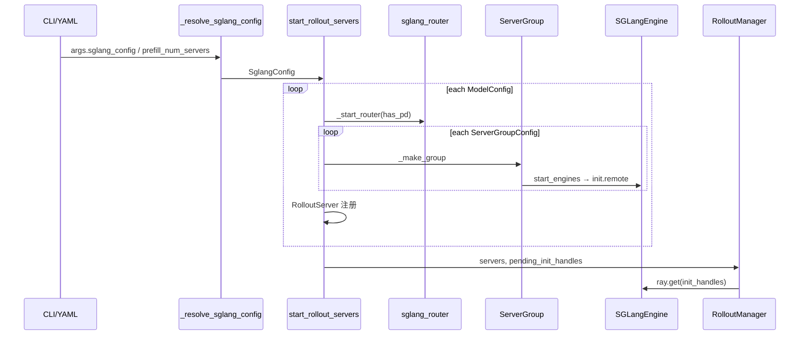

# EngineTopology · 数据流与交互

> 本章描述 **GPU 槽位、Router 路由、配置对象** 在 Rollout 子系统中的流动；不涉及 Sample tensor 化（见 [[08-RolloutManager-03-数据流与交互]]）。

---

## 1. 端到端拓扑数据流



---

## 2. GPU 槽位：Placement Group 内的 offset 链

**Explain：** Rollout GPU 在 PG 中从 `rollout_pg_offset` 起编址；每个 ServerGroup 占用连续 `[gpu_offset, gpu_offset + num_gpus)` 槽位。colocate 时 offset=0，与 Megatron 重叠并触发 `needs_offload`。

**Code：**

```python
# 来源：slime/ray/rollout.py L1073-L1086
# 提交版本：22cdc6e1
def _compute_rollout_offset(args) -> int:
    """Offset (in PG bundle slots) where rollout GPUs start."""
    if args.debug_train_only or args.debug_rollout_only or args.colocate:
        return 0
    offset = args.actor_num_nodes * args.actor_num_gpus_per_node
    return offset


def _compute_megatron_num_gpus(args) -> int:
    """Total number of megatron (actor + critic) GPU slots in the placement group."""
    if args.debug_rollout_only:
        return 0
    num = args.actor_num_nodes * args.actor_num_gpus_per_node
    return num
```

**Comment：**

- **非 colocate**：actor 占 PG 前段，rollout 占后段；`gpu_offset` 从 0 起计 **相对 rollout 段**。
- `_make_group` 中 `group_abs_start = rollout_pg_offset + gpu_offset` 判定是否与 Megatron 重叠。
- **placeholder** 组仍增加 `gpu_offset`，为后续 Megatron 扩位预留空间而不建引擎。

---

## 3. 多模型 Router 映射

**Explain：** 每个 `ModelConfig` 独立 Router；启动完成后写入 `args.sglang_model_routers`，供 custom rollout 按模型名选 endpoint。

**Code：**

```python
# 来源：slime/ray/rollout.py L1117-L1126, L1225-L1226
# 提交版本：22cdc6e1
    for model_idx, model_cfg in enumerate(config.models):
        model_cfg.resolve(args)
        has_pd = model_cfg.has_pd_disaggregation
        router_ip, router_port = _start_router(args, has_pd_disaggregation=has_pd, force_new=(model_idx > 0))
        if model_idx == 0:
            args.sglang_router_ip = router_ip
            args.sglang_router_port = router_port
    # ...
    args.sglang_model_routers = {name: (srv.router_ip, srv.router_port) for name, srv in servers.items()}
```

**Comment：**

| 字段 | 用途 |
|------|------|
| `args.sglang_router_ip/port` | 默认 actor Router（向后兼容） |
| `args.sglang_model_routers["ref"]` | OPD / 多模型场景访问 ref 模型 |
| `force_new=(model_idx > 0)` | 避免端口冲突 |

典型 YAML：

```yaml
# 概念示例（非完整 launch 命令）
sglang:
  - name: actor
    update_weights: true
    server_groups: [{worker_type: regular, num_gpus: 8}]
  - name: ref
    update_weights: false
    server_groups: [{worker_type: regular, num_gpus: 4}]
```

---

## 4. PD 请求路径（推理时）

**Explain：** 训练代码仍向 **单一 Router URL** 发 generate；Router 在 `pd_disaggregation=True` 时将 prefill 与 decode 阶段调度到不同 worker pool。slime 在 metrics 中采集 PD 分段时延。

**Code：**

```python
# 来源：slime/ray/rollout.py L54-L70
# 提交版本：22cdc6e1
_SGLANG_PREFILL_PERF_FIELDS = (
    ("prefill/bootstrap_queue_duration", "pd_prefill_bootstrap_queue_duration"),
    ("prefill/bootstrap_duration", "pd_prefill_bootstrap_duration"),
    ("prefill/alloc_wait_duration", "pd_prefill_alloc_wait_duration"),
    ("prefill/forward_duration", "pd_prefill_forward_duration"),
    ("prefill/transfer_queue_duration", "pd_prefill_transfer_queue_duration"),
    ("prefill/transfer_speed_gb_s", "pd_transfer_speed_gb_s"),
    ("prefill/transfer_total_mb", "pd_transfer_total_mb"),
    ("prefill/retry_count", "pd_prefill_retry_count"),
)
_SGLANG_DECODE_PERF_FIELDS = (
    ("decode/prealloc_duration", "pd_decode_prealloc_duration"),
    ("decode/bootstrap_duration", "pd_decode_bootstrap_duration"),
    ("decode/alloc_wait_duration", "pd_decode_alloc_wait_duration"),
    ("decode/transfer_duration", "pd_decode_transfer_duration"),
    ("decode/forward_duration", "pd_decode_forward_duration"),
)
```

**Comment：**

- RolloutManager 的 `compute_perf_metrics_from_samples` 解析 Sample 内嵌的 SGLang perf JSON。
- PD 拓扑 **不改变** HTTP API 形状——仅改变 Router 后端注册表。
- prefill→decode KV 传输由 SGLang + Router 完成（mooncake/RDMA 等），slime 只配置 worker 角色。

---

## 5. RolloutServer 与 update_weights 交互

**Explain：** `RolloutManager.get_updatable_engines_and_lock` 遍历 `servers`，只锁 **update_weights=True** 的 RolloutServer 下的引擎。

**Code：**

```python
# 来源：slime/ray/rollout.py L296-L318
# 提交版本：22cdc6e1
    @property
    def engines(self):
        """All node-0 engines across all groups (placeholder groups contribute nothing)."""
        return [e for g in self.server_groups for e in g.engines]

    @property
    def engine_gpu_counts(self) -> list[int]:
        """Per-engine GPU count for all node-0 engines, parallel to ``engines``."""
        return [g.num_gpus_per_engine for g in self.server_groups for _ in g.engines]

    @property
    def engine_gpu_offsets(self) -> list[int]:
        offsets = []
        for g in self.server_groups:
            for j in range(len(g.engines)):
                offsets.append(g.gpu_offset + j * g.num_gpus_per_engine)
        return offsets
```

**Comment：**

- PD 场景 actor 的 prefill/decode 引擎 **都** 在 `engines` 列表中，权重同步需覆盖全部 TP rank。
- `engine_gpu_offsets` 用于 tensor 并行权重分片对齐（见权重同步批次）。
- ref 模型 `update_weights=False`：训练循环跳过，但 `offload/onload` 仍可能参与 colocate。

---

## 6. offload 路径：按 group 粒度

**Explain：** `RolloutServer.offload/onload` 并发调用各 ServerGroup；仅 `needs_offload=True` 的组释放 GPU 显存给 Megatron。

**Code：**

```python
# 来源：slime/ray/rollout.py L248-L266, L383-L417
# 提交版本：22cdc6e1
    def offload(self):
        if not self.needs_offload:
            return []
        return [engine.release_memory_occupation.remote() for engine in self.engines if engine is not None]

    def onload_kv(self):
        handles = []
        for g in self.server_groups:
            handles.extend(g.onload(tags=[GPU_MEMORY_TYPE_KV_CACHE, GPU_MEMORY_TYPE_CUDA_GRAPH]))
        return ray.get(handles) if handles else []
```

**Comment：**

- 混合拓扑：actor decode 组在 rollout 专用 GPU（`needs_offload=False`），prefill 与 train colocate（`needs_offload=True`）——见 `test_sglang_config_mixed_offload.py`。
- PD 分离 **不强制** 全部 group offload；由 PG 布局 + `offload_rollout` 决定。
- generate 前 `onload_kv`，update_weights 前 `onload_weights`（RolloutManager 编排）。

---

## 7. 上下游模块边界

| 上游 | 交互 | 说明 |
|------|------|------|
| [[06-PlacementGroup-00-MOC]] | `pg` tuple | bundle 重排、`reordered_gpu_ids` |
| [[03-Arguments-00-MOC]] | CLI flags | `--sglang-config`, `--prefill-num-servers`, `--rollout-num-gpus` |
| [[08-SGLang-Engine-00-MOC]] | `SGLangEngine` | `worker_type` → ServerArgs |

| 下游 | 交互 | 说明 |
|------|------|------|
| [[08-RolloutManager-02-源码走读]] | `self.servers` | generate / update_weights / recover |
| [[12-SGLang-Rollout-03-数据流与交互]] | HTTP → Router | `/generate` 请求 |
| SGLang [[22-Disaggregation-03-数据流与交互]] | PD worker | prefill/decode 内核 |

---

## 8. external rollout 分支

**Explain：** `--rollout-external` 时不在本地建 ServerGroup，但仍可能调用 `_start_router` 连接外部引擎集群。

**Code：**

```python
# 来源：slime/ray/rollout.py L1103-L1104
# 提交版本：22cdc6e1
    if args.rollout_external:
        return start_external_rollout_servers(args, start_router=_start_router)
```

**Comment：**

- 外部 PD 集群（如独立 K8s serving）通过 `external.py` 注册 worker 地址到 Router。
- 拓扑声明从「Ray 本地 PG」转为「外部 endpoint 列表」，配置入口见 [[16-External-Engines-00-MOC]]。
- `tests/test_qwen3_4B_external_pd.py` 覆盖 external + PD 组合。
