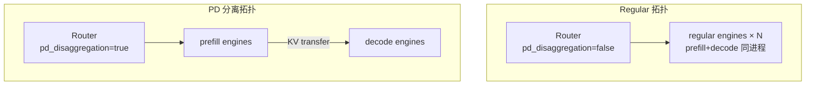

# EngineTopology · 关键问题

> 本章聚焦 **PD 分离 vs 普通 regular 拓扑** 选型，以及 YAML/CLI 易错点。SGLang 侧 PD 内核见 [[22-Disaggregation-04-关键问题]]。

---

## Q1：何时用 PD，何时用 regular？

**Explain：** PD 将 prefill（处理 prompt/KV 构建）与 decode（逐 token 生成）分到不同 GPU 池。适合 **长上下文、多轮、decode 占主导** 的 RL；短单轮任务 regular 更简单。

**Code（文档准则）：**

```markdown
## 来源：slime/docs/en/advanced/pd-disaggregation.md L5-L15
## When to Use

Use PD Disaggregation when:
- rollout contexts are long or grow across turns;
- decode dominates rollout time;
- prefix-cache locality matters for multi-turn sessions;
- prefill and decode need different TP, memory, or runtime settings;

For short single-turn tasks, the default regular SGLang engine layout is usually simpler.
```

**Comment：**

| 场景 | 推荐拓扑 | 配置入口 |
|------|----------|----------|
| GSM8K 短回答 | regular 单组 | 默认（无 flag） |
| 多轮 Agent + 长 tool history | prefill + decode | `--sglang-config` |
| 快速试 PD | prefill + decode | `--prefill-num-servers 1` |
| VLM EPD | encoder + prefill + decode | YAML `worker_type: encoder` |

---

## Q2：PD 分离 vs 普通拓扑——架构对比



**Explain：** regular 模式下每个 engine 独立完成 prefill+decode；PD 模式下 Router 先调度 prefill worker，再调度 decode worker，两者可 **不同 TP 与 ServerArgs overrides**。

**Code（Router 分支）：**

```python
## 来源：slime/ray/rollout.py L1048-L1053
# 提交版本：22cdc6e1
    if has_pd_disaggregation:
        router_args.pd_disaggregation = True
        # Disable circuit breaker to prevent RDMA transfer timeouts from
        # marking decode workers as dead.
        router_args.disable_circuit_breaker = True
```

**Comment：**

- **regular**：`ModelConfig.has_pd_disaggregation == False`，实现简单、无 KV 跨池传输开销。
- **PD**：可独立调 `chunked_prefill_size`（prefill）与 `mem_fraction_static`（decode），更贴近生产 serving。
- **不可混用**：同一 model 的 YAML 中不能既有 `regular` 又有 `prefill`/`decode`（文档 Operational Notes）。

---

## Q3：`--prefill-num-servers` 与 `--sglang-config` 怎么选？

**Explain：** 前者是 legacy 快捷路径，固定「prefill 台数 × 默认 TP + 剩余 decode」；后者支持异构 TP、多模型、per-group overrides。

**Code（两条路径汇合点）：**

```python
## 来源：slime/ray/rollout.py L1244-L1254
# 提交版本：22cdc6e1
    if args.prefill_num_servers is not None:
        return SglangConfig.from_prefill_num_servers(args)

    return SglangConfig(
        models=[
            ModelConfig(
                name="default",
                server_groups=[ServerGroupConfig(worker_type="regular", num_gpus=args.rollout_num_gpus)],
            )
        ]
    )
```

**Comment：**

| 维度 | `--prefill-num-servers` | `--sglang-config` |
|------|-------------------------|-------------------|
| 异构 TP | ❌ 共用 `rollout_num_gpus_per_engine` | ✅ 每组独立 |
| 多模型 | ❌ 仅 default | ✅ actor/ref/reward |
| overrides | ❌ | ✅ chunked_prefill、mem_fraction 等 |
| 上手成本 | 低 | 需写 YAML + GPU 算术 |

文档建议：**新复杂部署优先 `--sglang-config`**。

---

## Q4：为什么 `--rollout-num-gpus` 必须与 YAML 总和一致？

**Explain：** Placement Group 在训练启动时已按 `--rollout-num-gpus` 预留 bundle；YAML 声明的 GPU 数若不一致，会在 PG 切片或 assert 阶段失败。

**Code：**

```python
## 来源：slime/ray/rollout.py L1235-L1238
# 提交版本：22cdc6e1
        expected = args.rollout_num_gpus
        actual = config.total_num_gpus
        assert actual == expected, f"sglang_config total GPUs ({actual}) != rollout_num_gpus ({expected})"
```

**Comment：**

- **易错**：YAML 写 16 GPU，CLI 仍 `--rollout-num-gpus 12` → 启动即 assert。
- **正确**：`sum(group.num_gpus for all models) == rollout_num_gpus`。
- placeholder 组的 `num_gpus` **计入** 总和，但不建引擎。

---

## Q5：同一 model 内能否 prefill TP=2、decode TP=4？

**Explain：** 可以——这正是 `--sglang-config` 的价值。`_make_group` 按 group 独立计算 `num_engines`。

**Code（YAML 示例 + 代码对应）：**

```yaml
## 来源：slime/docs/en/advanced/pd-disaggregation.md L37-L52（摘录）
sglang:
  - name: actor
    update_weights: true
    server_groups:
      - worker_type: prefill
        num_gpus: 4
        num_gpus_per_engine: 2    # 2 engines × TP2
      - worker_type: decode
        num_gpus: 12
        num_gpus_per_engine: 4    # 3 engines × TP4
```

```python
## 来源：slime/ray/rollout.py L1135-L1137
# 提交版本：22cdc6e1
            gpus_per_engine = group_cfg.num_gpus_per_engine
            num_gpu_per_engine_local = min(gpus_per_engine, args.num_gpus_per_node)
            num_engines = group_cfg.num_gpus // num_gpu_per_engine_local
```

**Comment：**

- `--prefill-num-servers` **无法** 表达此异构布局。
- Router 注册时 prefill/decode engine 列表 TP 不同，SGLang PD 协议支持异构（见 SGLang PD 文档）。
- `RolloutServer.nodes_per_engine` 要求非 placeholder 组 **nodes_per_engine 一致**，否则 property 抛 `ValueError`——跨组 TP 不同 OK，但 **组内多节点 TP 结构需自洽**。

---

## Q6：多模型时 Router 如何隔离？

**Explain：** 每个 `ModelConfig` 启动独立 Router（`force_new=True`）；custom rollout 通过 `args.sglang_model_routers` 选路。

**Code：**

```python
## 来源：slime/ray/rollout.py L1120-L1121
# 提交版本：22cdc6e1
        has_pd = model_cfg.has_pd_disaggregation
        router_ip, router_port = _start_router(args, has_pd_disaggregation=has_pd, force_new=(model_idx > 0))
```

**Comment：**

- **易错**：手动设置 `args.sglang_router_ip` 后第二个模型仍复用同一 Router → 应留空让 slime 分配，或确保 `force_new` 行为。
- actor 可走 PD，ref 可走 regular——**按 model 独立** `has_pd_disaggregation`。
- OPD 场景 ref 模型 `update_weights: false` 避免无意义权重同步。

---

## Q7：placeholder 组是干什么的？

**Explain：** 只占 GPU 槽位、不创建 SGLangEngine；用于 PG 布局与 Megatron 对齐或预留空位。

**Code：**

```python
## 来源：slime/ray/rollout.py L146-L152
# 提交版本：22cdc6e1
        if self.args.debug_train_only or self.worker_type == "placeholder":
            self.num_new_engines = 0
            return [], port_cursors
```

**Comment：**

- mixed colocate 测试中常用 placeholder 模拟「训练占前 N 卡、rollout 占后 M 卡」。
- `gpu_offset` 仍递增，后续 group 从正确槽位开始。
- 不要对 placeholder 期望 HTTP 服务能力——Router 无对应 worker。

---

## Q8：external PD 与本地 PD 差异？

**Explain：** 本地 PD 由 `start_rollout_servers` 在 Ray PG 上建引擎；external PD 由外部进程启动 prefill/decode，slime 只注册到 Router。

**Code（测试注释）：**

```python
## 来源：slime/tests/test_qwen3_4B_external_pd.py L4-L5（摘录）
# - 1 prefill (--disaggregation-mode prefill, mooncake transfer backend)
# - 1 decode
```

**Comment：**

- 本地：`worker_type` → `SGLangEngine` → Ray Actor。
- External：`rollout_external=True`，拓扑声明在外部 launch 脚本。
- 两者对 RolloutManager 的 HTTP 视图一致——都是 Router endpoint。
- 选型：已有 K8s serving 集群用 external；单机 Ray 实验用本地 PD。

---

## Q9：易错 vs 正确写法对照

**Explain：** 三类最常见配置错误及修复。

**Code（错误示例 — 概念性）：**

```yaml
# ❌ 易错：同一 model 混 regular + prefill
sglang:
  - name: actor
    server_groups:
      - worker_type: regular
        num_gpus: 4
      - worker_type: decode
        num_gpus: 8
```

```yaml
# ✅ 正确：同一 model 仅 prefill + decode
sglang:
  - name: actor
    server_groups:
      - worker_type: prefill
        num_gpus: 4
        num_gpus_per_engine: 2
      - worker_type: decode
        num_gpus: 8
        num_gpus_per_engine: 4
```

**Comment：**

| 错误 | 后果 | 修复 |
|------|------|------|
| regular + prefill/decode 混用 | Router PD 注册混乱 | 全 regular 或全 PD 组 |
| GPU 总数不匹配 | assert 失败 | 对齐 `--rollout-num-gpus` |
| 仅 prefill 无 decode | `from_prefill_num_servers` assert | 减少 prefill 或增 GPU |

---

## Q10：RL 训练循环会因 PD 改变吗？

**Explain：** 不会。PD 只改变 Rollout 侧 serving 拓扑；`generate → train → update_weights` 不变。

**Code（文档摘录）：**

```markdown
## 来源：slime/docs/en/advanced/pd-disaggregation.md L63-L73
## Why This Matters for RL

PD lets slime keep the training loop unchanged while using a rollout topology
that matches the actual serving workload.
```

**Comment：**

- 权重仍推到 `update_weights=True` 的全部引擎（prefill + decode）。
- metrics 会多出 `pd_prefill_*` / `pd_decode_*` 字段，便于判断 PD 是否值得。
- 若 decode 仍瓶颈，应增 decode 池 GPU 或调 decode overrides，而非回退训练算法。
