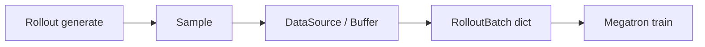

# Sample 契约与 Rollout 类型

> **阶段 III · Rollout 生成** | 状态：已完成 | 基线 commit：`22cdc6e1`  
> **源码范围：** `utils/types.py`（Sample / RolloutBatch）、`rollout/base_types.py`（RolloutFn 输出契约）、`utils/misc.py`（load_function / decode 辅助）

---

## 本模块在架构中的位置

`Sample` 是 Slime RL 闭环的 **核心数据载体**：Rollout 引擎填充 prompt/response/reward/log_probs → DataSource 缓冲 → Megatron 训练消费 `RolloutBatch`。本批定义 **字段语义与契约**，不涉及 SGLang 调用细节。



---

## 零基础一句话

**像「快递单 + 验货清单」**：Sample 记录一次生成的 prompt、token、reward、loss_mask、rollout_log_probs 等；训练前打包成 RolloutBatch；自定义 rollout/reward 通过 `load_function("module.fn")` 动态加载。

---

## 六件套阅读顺序

| 顺序 | 文件 | 一句话说明 |
|------|------|------------|
| 01 | [[10-Sample-Contracts-01-核心概念]] | Sample 字段、Status、top-p replay |
| 02 | [[10-Sample-Contracts-02-源码走读]] | append_response_tokens、call_rollout_fn |
| 03 | [[10-Sample-Contracts-03-数据流与交互]] | Sample → RolloutBatch → actor |
| 04 | [[10-Sample-Contracts-04-关键问题]] | rollout_id、loss_mask、load_function |
| ✓ | [[10-Sample-Contracts-05-checkpoint]] | 验收 |

---

## 核心源码锚点

**Explain：** `Sample` 是 dataclass，贯穿 generate→train；`rollout_id` 用于 compact/subagent 多 sample 同属一次 rollout 时的 loss 聚合。

**Code：**

```python
# 来源：slime/utils/types.py L93-L106
# 提交版本：22cdc6e1
@dataclass
class Sample:
    """The sample generated"""

    group_index: int | None = None
    index: int | None = None
    rollout_id: int | None = None
    prompt: str | list[dict[str, str]] = ""
    tokens: list[int] = field(default_factory=list)
```

**Comment：**

- 默认 rollout 路径 `rollout_id is None`，下游 fallback 到 `index`
- 详见 [[11-DataSource]]、[[20-Train-Data]]

---

## 衔接批次

| 方向 | 批次 | 关系 |
|------|------|------|
| 上游 | [[08-RolloutManager]] | generate 产出 Sample 列表 |
| 下游 | [[11-DataSource]] | 持久化与 prompt 索引 |
| 下游 | [[20-Train-Data]] | Sample → RolloutBatch 转换 |
| 下游 | [[21-Loss-Advantages]] | reward / advantage 字段消费 |

**图谱增量点：** 完成本批后运行 `/understand --language zh` + `/understand-domain`。
