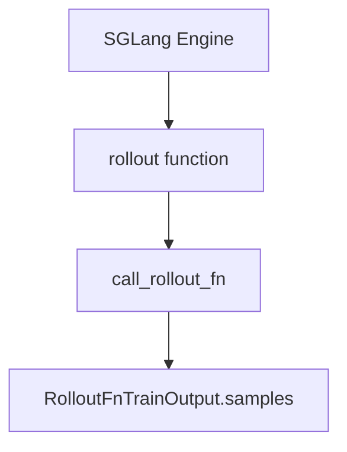
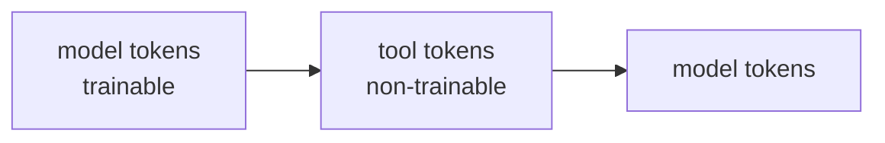

# Sample 契约 · 数据流与交互

---

## 1. Rollout 生成 → Sample 列表



**Explain：** default rollout 构建 Sample，填充 tokens/reward/log_probs；自定义函数必须返回契约类型或 legacy list。

**Code：**

```python
# 来源：slime/rollout/base_types.py L19-L26
# 提交版本：22cdc6e1
def call_rollout_fn(fn, *args, evaluation: bool, **kwargs):
    output = fn(*args, **kwargs, evaluation=evaluation)
    if not isinstance(output, (RolloutFnTrainOutput, RolloutFnEvalOutput)):
        output = RolloutFnEvalOutput(data=output) if evaluation else RolloutFnTrainOutput(samples=output)
    return output
```

---

## 2. Sample 在 RolloutManager 内聚合

**Explain：** generate 返回 `list[list[Sample]]`；外层维度对应 rollout micro-batch，内层对应 `n_samples_per_prompt`。

**Code：**

```python
# 来源：slime/rollout/base_types.py L7-L10
# 提交版本：22cdc6e1
@dataclass
class RolloutFnTrainOutput:
    samples: list[list[Sample]]
    metrics: dict[str, Any] = None
```

**Comment：**

- metrics 与 samples 并行上报 wandb
- 见 [[08-RolloutManager-03-数据流与交互]]

---

## 3. RM / Filter 阶段 mutate Sample

**Explain：** async RM 写入 `reward`；Filter Hub 可能设 `remove_sample=True` 或改 `status`。

**Code：**

```python
# 来源：slime/utils/types.py L118-L127
# 提交版本：22cdc6e1
reward: float | dict[str, Any] | None = None
loss_mask: list[int] | None = None
rollout_log_probs: list[float] | None = None
remove_sample: bool = False
```

**Comment：**

- `get_reward_value` 在 advantage 计算前调用
- 见 [[13-RM-FilterHub]]

---

## 4. Sample → RolloutBatch → ObjectRef

**Explain：** RolloutManager 将 Sample 列表转为 `RolloutBatch` dict，放入 Ray object store；train 侧通过 ref 拉取。

**Code：**

```python
# 来源：slime/utils/types.py L421-L424
# 提交版本：22cdc6e1
RolloutBatch = dict[str, list[torch.Tensor] | list[int] | list[float] | list[str]]
```

**Comment：**

- 键名与 Megatron `get_batch` 期望一致（tokens、log_probs、advantages 等）
- 转换在 actor 侧 `_get_rollout_data`（批次 20）

---

## 5. async_train 传递 rollout_data_ref

**Explain：** ObjectRef 指向 RolloutBatch（或等价结构）；各 TrainRayActor rank 读取后按 DP 切分。

**Code：**

```python
# 来源：slime/ray/actor_group.py L146-L148
# 提交版本：22cdc6e1
return [
    actor.train.remote(rollout_id, rollout_data_ref, external_data=external_data)
    for actor in self._actor_handlers
]
```

**Comment：**

- `rollout_id` 写入 Sample 用于 logging 与 periodic action
- nixl 路径可能 bypass object store

---

## 6. top-p replay 训练消费链

**Explain：** Sample 存 ragged top-p ids → RolloutBatch 携带 tensor → Megatron loss 用 `get_rollout_top_p_logprob_kwargs`。

**Code：**

```python
# 来源：slime/utils/types.py L122-L125
# 提交版本：22cdc6e1
# For response token i, kept ids are rollout_top_p_token_ids[offsets[i]:offsets[i + 1]].
rollout_top_p_token_ids: list[int] | torch.Tensor | None = None
rollout_top_p_token_offsets: list[int] | torch.Tensor | None = None
```

**Comment：**

- `_validate_response_metadata_lengths` 保证 offsets 长度 = response_length + 1
- 见 [[22-Loss-Policy]]

---

## 7. load_function 在闭环中的挂载点

**Explain：** 除 rollout function 外，RM、megatron hook、custom model provider 均通过同 util 加载。

**Code：**

```python
# 来源：slime/utils/misc.py L37-L45
# 提交版本：22cdc6e1
def load_function(path):
    module_path, _, attr = path.rpartition(".")
    module = importlib.import_module(module_path)
    return getattr(module, attr)
```

**Comment：**

| CLI 示例 | 加载点 |
|----------|--------|
| `--rollout-function-path` | RolloutManager |
| `--custom-rm-path` | rm_hub |
| `--custom-model-provider-path` | model_provider（批次 18） |

---

## 8. Agent 多轮 append 数据流

**Explain：** 单 Sample 在多轮 tool call 中多次 `append_response_tokens`；trainable 与 non-trainable 交错增长 tokens/mask/log_probs。



**Code：**

```python
# 来源：slime/utils/types.py L268-L270
# 提交版本：22cdc6e1
# Tool/environment tokens should pass trainable=False; they receive loss-mask zeros
# and empty top-p spans when top-p replay is active.
```

**Comment：**

- Agent 路径见 [[27-Agent-Trajectory]]
