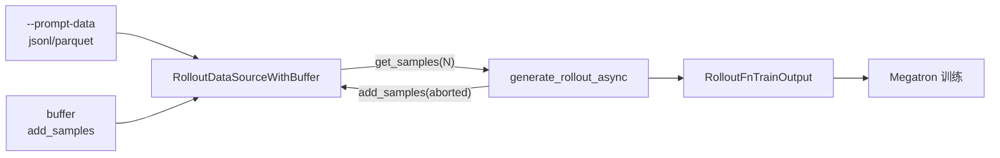

---
type: module-moc
module: 11-DataSource
batch: "11"
doc_type: moc
title: "DataSource · 专题概述"
tags:
  - slime/batch/11
  - slime/module/data-source
  - slime/doc/moc
updated: 2026-07-02
---

# DataSource · 专题概述

> **核心问题：** prompt 从哪来？buffer 如何优先喂给 `generate`？

## 本专题目标

读完本专题六件套，读者应能：

1. 说明 `RolloutManager` 如何通过 `--data-source-path` 实例化数据源
2. 追踪 `--prompt-data` → `Dataset` → `Sample.prompt` 的加载链路
3. 解释 `RolloutDataSourceWithBuffer` 中 buffer 优先、`pop_first` 默认策略
4. 描述 `generate_rollout` 中 `get_samples` / `add_samples` 的双向交接

## 源码范围

| 文件 | 关键符号 |
|------|----------|
| `slime/rollout/data_source.py` | `DataSource`, `RolloutDataSource`, `RolloutDataSourceWithBuffer`, `pop_first` |
| `slime/utils/data.py` | `Dataset`, `read_file`, `filter_long_prompt`, `process_rollout_data` |
| 衔接（只引用，详读见其他批） | `slime/ray/rollout.py` · `RolloutManager`；`slime/rollout/sglang_rollout.py` · `generate_rollout_async` |

## 在 RL 闭环中的位置



**Explain：** DataSource 是 Rollout 侧的 **prompt 供给器 + 样本回收站**。训练每步 `RolloutManager.generate()` 调用 `generate_rollout`，后者反复 `data_source.get_samples()` 取 prompt 组，生成完成后把 aborted/partial 样本 `add_samples` 回 buffer，供下一步优先消费。

## 专题入口代码

**Explain：** `RolloutManager.__init__` 通过 `load_function` 动态加载数据源类（默认 `RolloutDataSourceWithBuffer`），与 `generate_rollout` 函数一并挂载。`get_num_rollout_per_epoch` 用 `len(data_source) // rollout_batch_size` 计算 epoch 步数。

**Code：**

```python
## 来源：slime/ray/rollout.py L437-L438, L542-L544
# 基线 commit：22cdc6e1
        data_source_cls = load_function(self.args.data_source_path)
        self.data_source = data_source_cls(args)

    def get_num_rollout_per_epoch(self):
        assert self.args.rollout_global_dataset
        return len(self.data_source) // self.args.rollout_batch_size
```

**Comment：**

- `--data-source-path` 默认值见 `arguments.py`：`slime.rollout.data_source.RolloutDataSourceWithBuffer`
- 自定义数据源须实现 `DataSource` 抽象接口（`get_samples` / `add_samples` / `save` / `load` / `__len__`）
- checkpoint 时 `RolloutManager.save/load` 委托给 `data_source.save/load`，持久化 dataset 游标

## 文档导航

| 文档 | 内容 |
|------|------|
| [[11-DataSource-01-核心概念]] | prompt 来源、buffer 优先级、Sample 分组语义 |
| [[11-DataSource-02-源码走读]] | 按调用顺序精读 `data_source.py` + `Dataset` |
| [[11-DataSource-03-数据流与交互]] | 与 RolloutManager / sglang_rollout 的消息流 |
| [[11-DataSource-04-关键问题]] | FAQ、易错点、自定义扩展 |
| [[11-DataSource-05-checkpoint]] | 读者自测清单 |

## 上下游衔接

| 方向 | 模块 | 说明 |
|------|------|------|
| 上游 | [[10-Sample-Contracts-01-核心概念]] | `Sample` 字段语义；DataSource 产出的是「仅含 prompt 的 Sample」 |
| 下游 | [[12-SGLang-Rollout-00-MOC]] | `generate_rollout_async` 消费 `get_samples`，写回 response/reward |
| 配置 | [[04-Arguments-TrainRollout-00-MOC]] | `--prompt-data`, `--rollout-batch-size`, `--n-samples-per-prompt` |
| 编排 | [[08-RolloutManager-00-MOC]] | `RolloutManager.generate` 主循环 |

## 验收标准

- [ ] 不打开 `slime/`，能说明 prompt 三条来源路径（dataset / 空 Sample / buffer）
- [ ] 能画出 buffer → get_samples → generate → add_samples 闭环
- [ ] 能解释 `n_samples_per_prompt` 为何让 `get_samples` 返回 `list[list[Sample]]`
