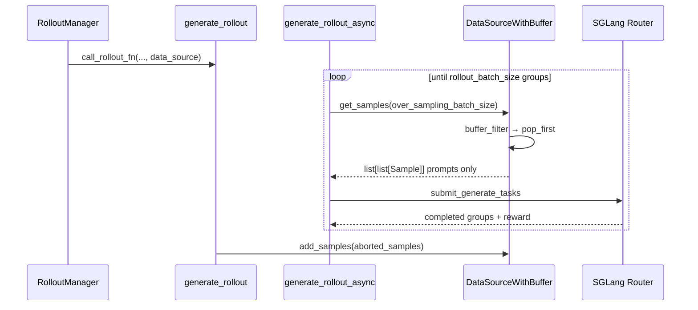

# DataSource · 核心概念

## 1. DataSource 是什么

**Explain：** `DataSource` 是 Rollout 阶段的 **prompt 供给抽象**。它不负责调用 SGLang、不算 reward，只回答两个问题：

1. **这次 generate 需要多少组 prompt？** → `get_samples(num_samples)`
2. **有没有要回收的半成品？** → `add_samples(samples)`

返回值形状固定为 `list[list[Sample]]`：外层 list 长度 = 请求的 prompt 组数；内层 list 长度 = `n_samples_per_prompt`（同一 prompt 的多条 rollout，供 GRPO / best-of-N 等算法）。

**Code：**

```python
# 来源：slime/rollout/data_source.py L17-L46
# 基线 commit：22cdc6e1
class DataSource(abc.ABC):
    @abc.abstractmethod
    def get_samples(self, num_samples: int) -> list[list[Sample]]:
        """
        Return num_samples samples
        """

    @abc.abstractmethod
    def add_samples(self, samples: list[list[Sample]]):
        """
        Add samples to the data source
        """

    @abc.abstractmethod
    def save(self, rollout_id):
        """
        Save the state of the data source
        """

    @abc.abstractmethod
    def load(self, rollout_id=None):
        """
        Load the state of the data source
        """

    @abc.abstractmethod
    def __len__(self) -> int:
        """
        Length of the data source. May change when samples are added/fetched.
        """
```

**Comment：**

- `num_samples` 在训练主路径上通常等于 `over_sampling_batch_size`（≥ `rollout_batch_size`），用于 dynamic sampling 过采样
- `save/load` 仅 `RolloutDataSource` 在 `rollout_global_dataset=True` 时持久化 epoch 游标
- 插件可通过 `--data-source-path` 替换整个实现（见 [[11-DataSource-04-关键问题]]）

---

## 2. Prompt 从哪来：三条路径

### 2.1 路径 A：全局 prompt 数据集（主流）

**Explain：** 当 `--rollout-global-dataset` 且 `--prompt-data` 均设置时，`RolloutDataSource.__init__` 构建 `Dataset`，从 jsonl/parquet 读入每行 JSON，经 tokenizer chat template 后写入 `Sample.prompt`。

**Code：**

```python
# 来源：slime/rollout/data_source.py L61-L88
        if args.rollout_global_dataset and args.prompt_data is not None:
            tokenizer = load_tokenizer(args.hf_checkpoint, trust_remote_code=True)
            processor = load_processor(args.hf_checkpoint, trust_remote_code=True)
            self.dataset = Dataset(
                args.prompt_data,
                tokenizer=tokenizer,
                processor=processor,
                max_length=args.rollout_max_prompt_len,
                prompt_key=args.input_key,
                multimodal_keys=args.multimodal_keys,
                label_key=args.label_key,
                metadata_key=args.metadata_key,
                tool_key=args.tool_key,
                apply_chat_template=args.apply_chat_template,
                apply_chat_template_kwargs=args.apply_chat_template_kwargs,
                seed=args.rollout_seed,
            )
            if self.args.rollout_shuffle:
                self.dataset.shuffle(self.epoch_id)
        else:
            self.dataset = None
```

**Comment：**

- `--input-key`（默认 `input`）指定 JSON 行中 prompt 字段；`--label-key` 可选，写入 `Sample.label`
- `--apply-chat-template` 为 true 时，prompt 经 `tokenizer.apply_chat_template(..., add_generation_prompt=True)` 变为模型可消费的字符串
- `--rollout-shuffle` + `epoch_id` 控制每个 epoch 的确定性 shuffle（seed + epoch_id）

### 2.2 路径 B：无数据集时的空 Sample

**Explain：** `dataset is None` 时（未配 `prompt_data` 或关闭 global dataset），`get_samples` 生成 `num_samples` 个空 `Sample()`。此时 prompt 须由自定义 `generate_rollout` 或后续 pipeline 填充——Slime 默认 `sglang_rollout.generate_rollout` 要求 `rollout_global_dataset=True`，此路径多用于 fully-async / 插件 rollout。

**Code：**

```python
# 来源：slime/rollout/data_source.py L104-L105
        else:
            prompt_samples = [Sample() for _ in range(num_samples)]
```

### 2.3 路径 C：Buffer 中的回收样本（优先）

**Explain：** `RolloutDataSourceWithBuffer` 在取数时 **先 drain buffer**，不足部分再向父类 `RolloutDataSource.get_samples` 要新 prompt。典型来源：`partial_rollout` 时 abort 收集的半成品、dynamic sampling 丢弃后未写回的组（注：默认 sglang_rollout 尚未把 filter 丢弃的组写回 buffer，见 04 FAQ）。

**Code：**

```python
# 来源：slime/rollout/data_source.py L177-L189
    def get_samples(self, num_samples: int) -> list[list[Sample]]:
        samples = self._get_samples_from_buffer(num_samples)
        num_samples -= len(samples)

        if num_samples == 0:
            return samples

        samples += super().get_samples(num_samples=num_samples)
        return samples
```

---

## 3. Buffer 如何喂给 generate

**Explain：** 训练一步的调用链是：`RolloutManager.generate` → `call_rollout_fn(generate_rollout, ..., data_source)` → `generate_rollout_async(..., data_source.get_samples)`。注意传入的是 **方法引用** `get_samples`，不是整对象；async 循环内按 `over_sampling_batch_size` 反复拉取。



**Code：**

```python
# 来源：slime/rollout/sglang_rollout.py L408-L412, L637-L639
    while len(data) < target_data_size:
        while state.remaining_batch_size < target_data_size:
            samples = data_source(args.over_sampling_batch_size)
            state.submit_generate_tasks(samples)

    output, aborted_samples = run(generate_rollout_async(args, rollout_id, data_source.get_samples))
    if aborted_samples:
        data_source.add_samples(aborted_samples)
```

**Comment：**

- `data_source(...)` 等价于 `data_source.get_samples(...)`，因为传入的是 bound method
- `target_data_size = rollout_batch_size`：最终只保留通过 dynamic filter 的 N 组
- `add_samples` 仅在 `partial_rollout` + abort 时非空，把带部分 `response` 的组推回 buffer

---

## 4. Sample 分组与 index 语义

**Explain：** 每个 prompt 对应一组 `n_samples_per_prompt` 个 `Sample`，共享同一 `prompt`/`label`，但 `index` 递增、`group_index` 相同。GRPO 等算法靠 `group_index` 做组内 advantage 归一化。

**Code：**

```python
# 来源：slime/rollout/data_source.py L107-L118
        samples = []
        for prompt_sample in prompt_samples:
            group = []
            for _ in range(self.args.n_samples_per_prompt):
                sample = copy.deepcopy(prompt_sample)
                sample.group_index = self.sample_group_index
                sample.index = self.sample_index
                self.sample_index += 1
                group.append(sample)
            self.sample_group_index += 1
            samples.append(group)
        return samples
```

**Comment：**

- `deepcopy` 保证同组各 Sample 的 `metadata`/`multimodal_inputs` 独立，生成后 `response`/`tokens` 不会互相污染
- `sample_index` 全局单调递增，用于 rollout 结果排序与日志对齐
- 此时 Sample 仅有 prompt 侧字段；`tokens`/`response`/`reward` 在 SGLang 生成后填充（批次 10、12）

---

## 5. Dataset 加载：从文件到 Sample

**Explain：** `Dataset` 在构造时一次性读入文件、可选过滤超长 prompt、按 epoch shuffle。支持 jsonl/parquet 及 `path@[start:end]` 切片语法。

**Code：**

```python
# 来源：slime/utils/data.py L219-L264
        origin_samples = []
        for data in read_file(path):
            as_conversation = apply_chat_template or (multimodal_keys is not None)
            prompt = _build_messages(data, prompt_key, as_conversation, multimodal_keys)
            metadata = data.get(metadata_key) or {}
            # ... tools 处理 ...
            if apply_chat_template:
                output_prompt = tokenizer.apply_chat_template(
                    prompt, tools=tools, tokenize=False,
                    add_generation_prompt=True,
                    **(apply_chat_template_kwargs or {}),
                )
            else:
                output_prompt = prompt
            origin_samples.append(
                Sample(
                    prompt=output_prompt,
                    label=data[label_key] if label_key is not None else None,
                    metadata=metadata,
                    multimodal_inputs=multimodal_inputs,
                )
            )
```

**Comment：**

- 多模态：`multimodal_keys` 把 JSON 中的 image/video 字段注入 message content 的 placeholder
- `filter_long_prompt` 在 `max_length` 设置时按 token 数剔除过长样本（见 02 走读）
- `Dataset.shuffle(new_epoch_id)` 用 `seed + epoch_id` 保证续训可复现

---

## 6. 关键 CLI 参数一览

| 参数 | 作用 |
|------|------|
| `--data-source-path` | 数据源类路径，默认 `RolloutDataSourceWithBuffer` |
| `--prompt-data` | jsonl/parquet 路径 |
| `--rollout-global-dataset` | 是否使用全局 prompt 数据集 |
| `--rollout-batch-size` | 每步需要的 **prompt 组数** |
| `--n-samples-per-prompt` | 每组复制几条 Sample（GRPO 常 >1） |
| `--over-sampling-batch-size` | 每次 `get_samples` 拉取的组数，≥ rollout_batch_size |
| `--buffer-filter-path` | buffer 出队策略，默认 `pop_first` |
| `--rollout-shuffle` / `--rollout-seed` | epoch 级 shuffle |
| `--rollout-max-prompt-len` | 加载时过滤超长 prompt |
