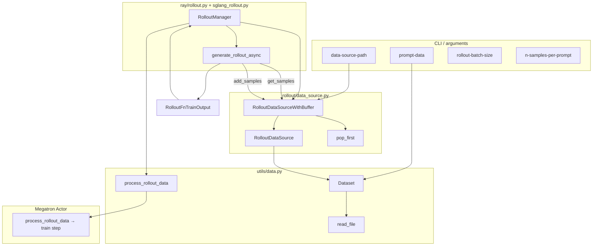
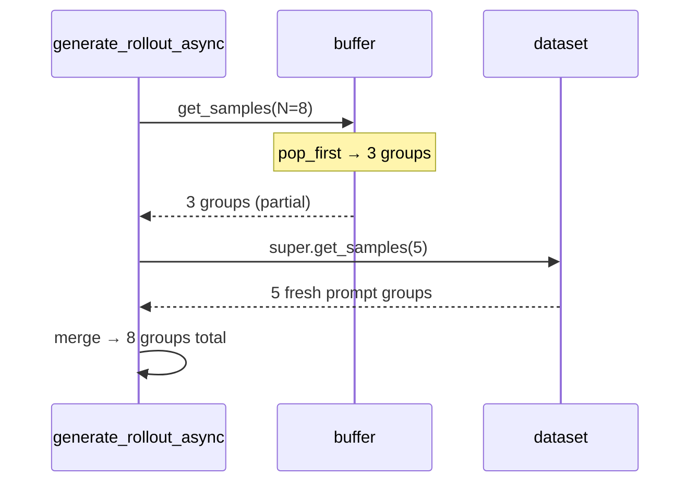

# DataSource · 数据流与交互

## 1. 模块边界



**Explain：** DataSource 处于 **RolloutManager 与 generate 函数之间**。`utils/data.py` 的 `Dataset` 只在构造期参与；训练期 `process_rollout_data` 处理的是 **已生成** 的 rollout tensor 包，与 prompt 加载正交。

---

## 2. RolloutManager 生命周期中的 DataSource

**Explain：** 构造时实例化；`generate` 每步传入 `call_rollout_fn`；`save/load` 与训练 checkpoint 同步；`get_num_rollout_per_epoch` 读 `len(data_source)`。

**Code：**

```python
# 来源：slime/ray/rollout.py L546-L576
    def generate(self, rollout_id):
        start_time = time.time()
        self.rollout_id = rollout_id
        self.health_monitoring_resume()
        data, metrics = self._get_rollout_data(rollout_id=rollout_id)
        self._save_debug_rollout_data(data, rollout_id=rollout_id, evaluation=False)
        _log_rollout_data(rollout_id, self.args, data, metrics, time.time() - start_time)
        if self.args.debug_rollout_only:
            return
        data = self._convert_samples_to_train_data(data)
        return self._split_train_data_by_dp(data)

    def save(self, rollout_id):
        self.data_source.save(rollout_id)

    def load(self, rollout_id=None):
        self.data_source.load(rollout_id)
```

**Comment：** `_get_rollout_data` 内部 `call_rollout_fn(self.generate_rollout, self.args, rollout_id, self.data_source, evaluation=False)`，把 **整个 data_source 对象** 传给 rollout 函数，由后者决定如何调用 `get_samples` / `add_samples`。

---

## 3. generate 循环：pull 模型

**Explain：** `generate_rollout_async` 采用 **pull** 语义：当 `GenerateState.remaining_batch_size` 不足时，向 data_source 再要 `over_sampling_batch_size` 组。每组经 SGLang 异步生成 + RM；dynamic filter 丢弃的组 **默认不** 写回 buffer（代码注释 TODO）。

**Code：**

```python
# 来源：slime/rollout/sglang_rollout.py L401-L439
    target_data_size = args.rollout_batch_size

    data = []
    all_data = []
    while len(data) < target_data_size:
        while state.remaining_batch_size < target_data_size:
            samples = data_source(args.over_sampling_batch_size)
            state.submit_generate_tasks(samples)

        done, state.pendings = await asyncio.wait(state.pendings, return_when=asyncio.FIRST_COMPLETED)
        for task in done:
            group: list[Sample] = task.result()
            assert len(group) == args.n_samples_per_prompt
            all_data.append(group)

            dynamic_filter_output = call_dynamic_filter(dynamic_filter, args, group)
            if not dynamic_filter_output.keep:
                state.remaining_batch_size -= 1
                continue

            if len(data) < target_data_size:
                data.append(group)
```

**Comment：**

- `remaining_batch_size` 跟踪「已提交但未计入最终 batch」的槽位
- filter 丢弃导致 **dataset 消耗快于有效训练样本**——过采样设计意图
- 最终 `data` 长度严格等于 `rollout_batch_size`

---

## 4. partial_rollout：buffer 回写路径

**Explain：** rollout 结束时 `abort()` 取消 pending 请求。若 `--partial-rollout`，已完成部分 response 的组收集为 `aborted_samples`，经 `generate_rollout` 写回 buffer，下一步 `get_samples` 优先弹出。

**Code：**

```python
# 来源：slime/rollout/sglang_rollout.py L336-L372
async def abort(args: Namespace, rollout_id: int) -> list[list[Sample]]:
    aborted_samples = []
    state = GenerateState(args)
    state.aborted = True
    # ... abort_servers_until_idle ...
    while state.pendings:
        done, state.pendings = await asyncio.wait(state.pendings, return_when=asyncio.FIRST_COMPLETED)
        if not args.partial_rollout:
            continue
        for task in done:
            group = task.result()
            for sample in group:
                if sample.response and "start_rollout_id" not in sample.metadata:
                    sample.metadata["start_rollout_id"] = rollout_id
            aborted_samples.append(group)
    return aborted_samples
```

**Code：**

```python
# 来源：slime/rollout/sglang_rollout.py L637-L639
    output, aborted_samples = run(generate_rollout_async(args, rollout_id, data_source.get_samples))
    if aborted_samples:
        data_source.add_samples(aborted_samples)
```

---

## 5. 数据结构：get_samples 返回值

| 层级 | 类型 | 含义 |
|------|------|------|
| 外层 | `list` | 长度为请求的 `num_samples`（prompt 组数） |
| 内层 | `list[Sample]` | 长度 = `n_samples_per_prompt` |
| Sample（取出时） | 仅有 prompt 侧 | `prompt`, `label`, `metadata`, `multimodal_inputs`, `group_index`, `index` |
| Sample（生成后） | 完整 rollout | + `tokens`, `response`, `reward`, `rollout_log_probs`, `status` |

**Explain：** buffer 中存储的是 **完整或部分生成后的组**（含 response），与 dataset 路径取出的「纯 prompt 组」形状相同但字段 richer。`pop_first` 不区分来源，FIFO 混排。

---

## 6. buffer 与 dataset 的合并语义

**Explain：** 单次 `get_samples(N)` 先 pop 最多 N 组 from buffer；若 buffer 只有 B 组（B < N），再向 dataset 要 N-B 组。不会出现「buffer 与 dataset 各要 N 组」的重复。



---

## 7. 训练侧：process_rollout_data

**Explain：** RolloutManager 将 Sample 转为 train tensor 后按 DP 切分；各 rank 的 `TrainRayActor` 调用 `process_rollout_data` 解包 Ray ref，恢复本 rank 的 `total_lengths` 顺序。

**Code：**

```python
# 来源：slime/utils/data.py L292-L303
def process_rollout_data(args, rollout_data_ref, dp_rank, dp_size):
    assert len(rollout_data_ref) == dp_size
    rollout_data = ray.get(rollout_data_ref[dp_rank].inner)

    partition = rollout_data.pop("partition")
    total_lengths = rollout_data["total_lengths"]

    Timer().seq_lens = total_lengths
    rollout_data["total_lengths"] = [total_lengths[i] for i in partition]

    return rollout_data
```

**Comment：** 此函数不接触 DataSource；列出此处是为完整描绘 **prompt 加载 → 生成 → 训练** 三段数据形态变化。

---

## 8. Fully-async 变体（扩展阅读）

**Explain：** `fully_async_rollout.py` 中 worker 循环 `data_buffer.get_samples(1)` 单组消费，生成后 `add_samples([result])`。与默认 batch 同步路径相比，buffer 是 **跨进程轨迹队列** 而非 partial 回收。详见批次 14 [[14-Alt-Rollout-00-MOC]]。

**Code：**

```python
# 来源：slime/rollout/fully_async_rollout.py L137, L185（节选）
                    groups = self.data_buffer.get_samples(1)
                    # ... generate one group ...
                    self.data_buffer.add_samples([result])
```

---

## 9. 交互矩阵

| 调用方 | 调用 | 时机 |
|--------|------|------|
| `RolloutManager.__init__` | `data_source_cls(args)` | 启动 |
| `RolloutManager.load` | `data_source.load(rollout_id)` | 续训 |
| `generate_rollout_async` | `data_source(N)` | 每轮 over-sample |
| `generate_rollout` | `data_source.add_samples(aborted)` | partial_rollout 收尾 |
| `RolloutManager.save` | `data_source.save(rollout_id)` | checkpoint |
| `RolloutManager.get_num_rollout_per_epoch` | `len(data_source)` | 计算 epoch 步数 |
| `rollout_all_samples_process_path` | `process_func(..., data_source)` | 可选后处理 |
