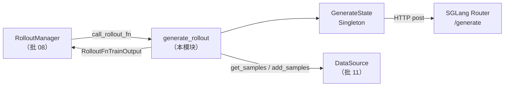

# SGLang Rollout · 批次概述

> **阶段 III · Rollout 生成** | 状态：已完成 | 基线 commit：`22cdc6e1`  
> **源码范围：** `slime/slime/rollout/sglang_rollout.py`（641 行）

---

## 本模块在架构中的位置

`sglang_rollout.py` 是 Slime **默认 rollout 函数**的实现：`RolloutManager` 通过 `--rollout-function-path` 加载 `generate_rollout`，后者 orchestrate 异步批量生成、reward 计算、dynamic filter 与 abort 回收。HTTP 请求发往 SGLang Router 的 `/generate` 端点；生成结果写入 `Sample`，供后续 tensor 化与训练。



---

## 零基础一句话

**像外卖平台的「派单调度中心」**：从 DataSource 取 prompt 组，并发向 SGLang 厨房（推理引擎）下单，等菜做好（token + logprob）后打分（RM），凑满一批有效样本再交给训练端。

---

## 五件套阅读顺序

| 顺序 | 文件 | 一句话说明 |
|------|------|------------|
| 01 | [[12-SGLang-Rollout-01-核心概念]] | GenerateState、group 并发、custom generate 挂载点 |
| 02 | [[12-SGLang-Rollout-02-源码走读]] | **主文档**：`generate_rollout` → `generate_and_rm_group` → HTTP |
| 03 | [[12-SGLang-Rollout-03-数据流与交互]] | Sample 字段、metrics、与 RolloutManager / Router 边界 |
| 04 | [[12-SGLang-Rollout-04-关键问题]] | top-p replay、custom generate 契约、abort 语义 |
| ✓ | [[12-SGLang-Rollout-05-checkpoint]] | 验收：能否走通 default generate 路径 |

---

## 核心源码锚点

**Explain：** `generate_rollout` 是 RolloutManager 调用的同步入口。训练路径走 `generate_rollout_async`；评估路径走 `eval_rollout`。partial rollout 时 abort 收集的半成品会通过 `data_source.add_samples` 回灌 buffer。

**Code：**

```python
# 来源：slime/slime/rollout/sglang_rollout.py L618-L640
def generate_rollout(
    args: Namespace, rollout_id: int, data_source: Any, evaluation: bool = False
) -> RolloutFnTrainOutput | RolloutFnEvalOutput:
    assert args.rollout_global_dataset
    if evaluation:
        output, _ = run(eval_rollout(args, rollout_id))
        return output

    output, aborted_samples = run(generate_rollout_async(args, rollout_id, data_source.get_samples))
    if aborted_samples:
        data_source.add_samples(aborted_samples)
    return output
```

**Comment：**

- 默认 `--rollout-function-path slime.rollout.sglang_rollout.generate_rollout`（见 [[04-Arguments-TrainRollout-01-核心概念]]）
- `run()` 将 asyncio 协程桥接到同步 Ray actor 线程
- 返回值包装为 `RolloutFnTrainOutput(samples=..., metrics=...)`，metrics 含 dynamic filter drop 统计

---

## 本批精读清单

| 符号 | 职责 |
|------|------|
| `generate_rollout` | 同步入口；train / eval 分派 |
| `GenerateState` | 全局单例：tokenizer、semaphore、pending tasks、abort 标志 |
| `generate_and_rm_group` | 一组 `n_samples_per_prompt` 并发 generate + group RM |
| `generate_and_rm` | 单 sample generate；挂载 `--custom-generate-function-path` |
| `generate` | 默认 HTTP `/generate` 路径 |
| `abort` | 取消 pending、收集 partial samples |

---

## 前置与衔接

| 方向 | 批次 | 说明 |
|------|------|------|
| 上游 | [[08-RolloutManager-00-MOC]] | `call_rollout_fn(self.generate_rollout, ...)` |
| 上游 | [[11-DataSource-00-MOC]] | `data_source.get_samples` / `add_samples` |
| 上游 | [[10-Sample-Contracts-00-MOC]] | `Sample.append_response_tokens`、status 枚举 |
| 下游 | [[13-RM-FilterHub-00-MOC]] | `async_rm` / `batched_async_rm`、dynamic filter |
| 对照 | [[03-HTTP-Server-00-MOC]] | SGLang `/generate` 请求/响应格式 |

---

## 验收标准

- [ ] 不打开 `slime/`，能说明 default generate 从 prompt 到 reward 的完整路径
- [ ] 能解释 `GenerateState` 为何用 Singleton + semaphore
- [ ] 能说明 `--custom-generate-function-path` 与 `--rollout-function-path` 的区别
- [ ] 验证建议：`tests/test_rollout_metrics.py`（Sample 侧 metrics 契约）
