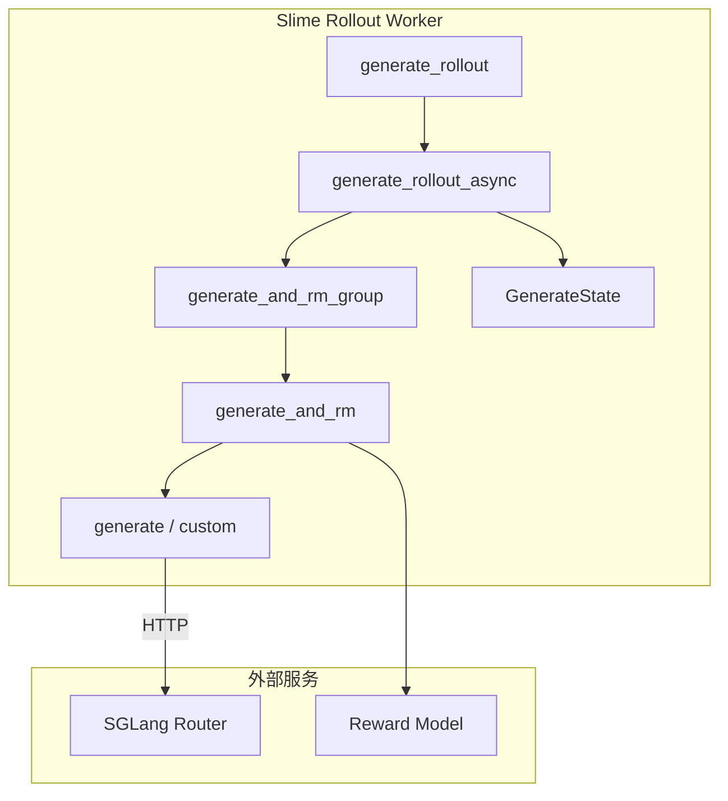

# SGLang Rollout · 核心概念

> 术语与设计动机。源码均内嵌，读者无需打开 `slime/`。

---

## 1. 两层 rollout 扩展点

Slime 提供**两个粒度**的 rollout 定制：

| CLI 参数 | 替换范围 | 典型场景 |
|----------|----------|----------|
| `--rollout-function-path` | 整个 `generate_rollout(args, rollout_id, data_source, evaluation)` | fully-async、SFT、forge_load |
| `--custom-generate-function-path` | 仅替换 `generate(args, sample, sampling_params)` | 多轮对话、tool calling、agent 轨迹 |

**Explain：** 大多数用户只需改 generate 逻辑，不必重写 oversampling 循环、dynamic filter、abort 回收。`generate_and_rm` 在 semaphore 内按优先级选择：sample 级 `generate_function_path` > args 级 `custom_generate_function_path` > 默认 `generate`。

**Code：**

```python
## 来源：slime/rollout/sglang_rollout.py L249-L261
        with state.dp_rank_context() as _:
            custom_func_path = getattr(sample, "generate_function_path", None) or args.custom_generate_function_path

            if custom_func_path is not None:
                custom_generate_func = load_function(custom_func_path)
                if "evaluation" in inspect.signature(custom_generate_func).parameters:
                    sample = await custom_generate_func(args, sample, sampling_params, evaluation=evaluation)
                else:
                    sample = await custom_generate_func(args, sample, sampling_params)
            else:
                sample = await generate(args, sample, sampling_params)
```

**Comment：**

- eval dataset 可通过 `EvalDatasetConfig.custom_generate_function_path` 逐数据集覆盖（批 13 详述）
- custom 函数签名须为 `async def fn(args, sample, sampling_params)` 或带 `evaluation: bool`
- 契约测试见 `tests/plugin_contracts/test_plugin_generate_contracts.py`

---

## 2. GenerateState：进程级 rollout 调度状态

**Explain：** `GenerateState` 使用 `SingletonMeta`，保证同一 Ray rollout worker 进程内共享 tokenizer、并发 semaphore、pending asyncio tasks 与 abort 标志。每次 rollout 结束调用 `reset()`，避免污染下一轮。

**Code：**

```python
## 来源：slime/rollout/sglang_rollout.py L84-L118
class GenerateState(metaclass=SingletonMeta):
    def __init__(self, args: Namespace) -> None:
        self.args = args
        self.tokenizer = load_tokenizer(args.hf_checkpoint, trust_remote_code=True)
        self.processor = load_processor(args.hf_checkpoint, trust_remote_code=True)

        self.semaphore = asyncio.Semaphore(args.sglang_server_concurrency * get_rollout_num_engines(args))
        self.sampling_params: dict[str, Any] = dict(
            temperature=args.rollout_temperature,
            top_p=args.rollout_top_p,
            top_k=args.rollout_top_k,
            max_new_tokens=args.rollout_max_response_len,
            stop=args.rollout_stop,
            stop_token_ids=args.rollout_stop_token_ids,
            skip_special_tokens=args.rollout_skip_special_tokens,
            no_stop_trim=True,
            spaces_between_special_tokens=False,
        )
        if args.rollout_top_p != 1.0:
            self.sampling_params["custom_params"] = {"return_top_p_token_ids": True}
        # ...
        self.reset()
```

**Comment：**

- **Semaphore 容量** = `sglang_server_concurrency × rollout_engine 数`，防止压垮 SGLang
- `rollout_top_p != 1.0` 时请求 SGLang 返回 top-p kept token ids，供 off-policy 校正（见 [[12-SGLang-Rollout-04-关键问题]]）
- `dp_rank_context()` 做 DP rank 负载均衡（随机选当前计数最小的 rank）

---

## 3. Group 语义：`n_samples_per_prompt`

**Explain：** GRPO / REINFORCE 类算法对每个 prompt 采样 N 条 response 为一组。`generate_and_rm_group` 为组内每条 sample 分配独立 `session_id`（consistent hashing 路由）和可选 deterministic seed，并发 `asyncio.gather` 后若 `group_rm=True` 再批量打分。

**Code：**

```python
## 来源：slime/rollout/sglang_rollout.py L309-L333
    for sample in group:
        if sample.session_id is None:
            sample.session_id = str(uuid.uuid4())

    tasks = []
    for idx, sample in enumerate(group):
        current_sampling_params = sampling_params.copy()
        if getattr(args, "sglang_enable_deterministic_inference", False):
            seed = state.group_sampling_seeds[idx]
            current_sampling_params["sampling_seed"] = seed
        tasks.append(
            asyncio.create_task(generate_and_rm(args, sample, current_sampling_params, evaluation=evaluation))
        )

    group = await asyncio.gather(*tasks)

    if not state.aborted and args.group_rm:
        with trace_span(group, "group_reward_model"):
            rewards = await batched_async_rm(args, group)
        for sample, reward in zip(group, rewards, strict=False):
            sample.reward = reward
```

**Comment：**

- custom generate 可返回 `list[Sample]`（fan-out），gather 后 group 形状变为 `list[list[Sample]]`
- `group_rm` 时单 sample 路径跳过 RM，在 group 级统一 `batched_async_rm`

---

## 4. Oversampling 与 dynamic filter

**Explain：** 训练 rollout 目标收集 `rollout_batch_size` 组**有效**样本。循环从 DataSource 以 `over_sampling_batch_size` 批量取 prompt、提交 async task；完成一组后过 dynamic filter，被 drop 的组不计入目标但减少 `remaining_batch_size`，继续 oversample 直到凑满。

**Code：**

```python
## 来源：slime/rollout/sglang_rollout.py L401-L439
    target_data_size = args.rollout_batch_size
    data = []
    while len(data) < target_data_size:
        while state.remaining_batch_size < target_data_size:
            samples = data_source(args.over_sampling_batch_size)
            state.submit_generate_tasks(samples)

        done, state.pendings = await asyncio.wait(state.pendings, return_when=asyncio.FIRST_COMPLETED)
        for task in done:
            group: list[Sample] = task.result()
            assert len(group) == args.n_samples_per_prompt
            dynamic_filter_output = call_dynamic_filter(dynamic_filter, args, group)
            if not dynamic_filter_output.keep:
                metric_gatherer.on_dynamic_filter_drop(reason=dynamic_filter_output.reason)
                state.remaining_batch_size -= 1
                continue
            if len(data) < target_data_size:
                data.append(group)
```

**Comment：**

- 未回灌被 filter 掉的 oversample 到 buffer（源码 NOTE 已标注）
- `MetricGatherer` 汇总 drop reason，写入 `RolloutFnTrainOutput.metrics`

---

## 5. HTTP generate：与 SGLang Router 的契约

**Explain：** 默认 `generate` 向 router POST JSON：`sampling_params` + `input_ids`（或 multimodal 时 `text` + `image_data`）。要求 `return_logprob=True`；响应 `meta_info.output_token_logprobs` 经 `append_response_tokens` 写入 Sample。

**Code：**

```python
## 来源：slime/rollout/sglang_rollout.py L174-L218
    payload = {
        "sampling_params": sampling_params,
        "return_logprob": True,
    }
    if args.use_rollout_routing_replay:
        payload["return_routed_experts"] = True
    # ...
    if images:
        payload["image_data"] = [encode_image_for_rollout_engine(image) for image in images]
        payload["text"] = sample.prompt
    else:
        payload["input_ids"] = prompt_ids

    output = await post(url, payload, headers=headers)

    if "output_token_logprobs" in output["meta_info"]:
        new_response_tokens = [item[1] for item in output["meta_info"]["output_token_logprobs"]]
        new_response_log_probs = [item[0] for item in output["meta_info"]["output_token_logprobs"]]

    sample.append_response_tokens(
        args,
        tokens=new_response_tokens,
        log_probs=new_response_log_probs,
        trainable=True,
        meta_info=output["meta_info"],
        text=output["text"],
    )
```

**Comment：**

- `get_model_url(args, model_name)` 支持 `--sglang-config` 多模型路由
- `session_id` + `router_policy=consistent_hashing` 时附加 `X-SMG-Routing-Key` header

---

## 6. 架构位置小结


